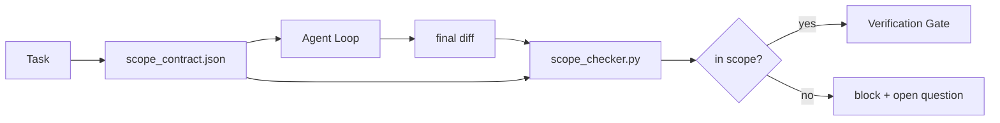

<!-- i18n:manual -->
# Контракты объёма и границы задачи

> Модель не знает, где работа заканчивается. Контракт объёма — это файл на каждую задачу, в котором сказано, где работа начинается, где заканчивается и как откатиться, если она разлилась. Контракт превращает «не выходи за рамки» из пожелания в проверку.

**Type:** Build
**Languages:** Python (stdlib)
**Prerequisites:** Phase 14 · 32 (Minimal Workbench), Phase 14 · 33 (Rules as Constraints)
**Time:** ~50 minutes

## Learning Objectives

- Написать контракт объёма, который агент читает в начале задачи, а верификатор — в конце.
- Задать разрешённые файлы, запрещённые файлы, критерии приёмки, план отката и границы, требующие одобрения.
- Реализовать проверщик объёма, который сравнивает diff с контрактом и помечает нарушения.
- Сделать расползание объёма видимым, автоматическим и пригодным для ревью.

## The Problem

Агенты расползаются. Задача — «починить баг в логине». Diff трогает роут логина, хелпер для писем, драйвер базы, README и релизный скрипт. У каждого касания в тот момент была правдоподобная причина. Вместе они — уже другое изменение, не то, которое ревьюили.

Расползание объёма — самый недосматриваемый режим отказа в работе агентов, потому что агент добросовестно рассказывает про каждый свой шаг. Лечение — не более строгий промпт. Лечение — контракт на диске, где написано, что было обещано, и проверка, которая сравнивает результат с обещанием.

> 🎒 **На пальцах.** Посчитайте: одна задача — пять затронутых мест, из которых обещано было одно. README и релизный скрипт по отдельности выглядят безобидно, а вместе с драйвером базы это уже изменение, которого никто не заказывал. Как «зашёл за молоком» и вернулся с полной корзиной: каждая позиция объяснима, чек — нет.

## The Concept



> 🎒 **На пальцах.** Обратите внимание, что `scope_contract.json` входит в проверщик дважды: один раз до работы агента, один раз после. Одно и то же обещание сначала инструктирует, потом судит — поэтому подсудимый не может переписать правила по ходу. Как смета на ремонт: сначала по ней работают, потом по ней же принимают.

### What goes in a scope contract

| Field | Purpose |
|-------|---------|
| `task_id` | Ссылка на задачу на доске |
| `goal` | Одно предложение, которое ревьюер может проверить |
| `allowed_files` | Глобы, в которые агенту можно писать |
| `forbidden_files` | Глобы, которые агенту нельзя трогать даже случайно |
| `acceptance_criteria` | Команды тестов или строки-утверждения, доказывающие готовность |
| `rollback_plan` | Один абзац, который оператор может выполнить, если нужна остановка |
| `approvals_required` | Действия вне объёма, которым нужна явная подпись человека |

Контракт без `forbidden_files` неполон. Негативное пространство — это половина контракта.

> 🎒 **На пальцах.** Строку `forbidden_files` пропускают чаще всего, а именно она ловит случайное. Разрешить `app/**/*.py` и не запретить `migrations/**` — значит однажды получить миграцию, «которая была нужна для теста». Как в договоре аренды: раздел «что нельзя» всегда длиннее раздела «что можно».

### Globs, not raw paths

Настоящие репозитории переезжают. Прибивайте контракты к глобам (`app/**/*.py`, `tests/test_signup*.py`), чтобы рефакторинг между сессиями не обнулил контракт.

> 🎒 **На пальцах.** Глоб `tests/test_signup*.py` переживёт переименование файла в `test_signup_flow.py`, а прибитый путь — нет: контракт мгновенно станет врать. Как «полка со специями» вместо «третья банка слева».

### Rollback is part of scope

Перечисляя, как откатиться, автор контракта вынужден подумать, что может пойти не так. Контракт, из которого нельзя откатиться, — это контракт, который не следует утверждать.

> 🎒 **На пальцах.** Проверка на честность: попробуйте написать план отката для «поменяли схему базы» — и вы сразу увидите, что задача крупнее, чем казалась. Пустое поле `rollback_plan` — это не экономия времени, а незамеченный риск. Как страховка перед поездкой в горы: саму поездку она не меняет, а вот решение ехать — иногда да.

### Scope check is a diff check

Агент выдаёт diff. Проверщик читает diff, разрешённые глобы, запрещённые глобы и список команд приёмки, которые прогонялись. Каждое нарушение — помеченная находка, из-за которой гейт верификации может отказать.

> 🎒 **На пальцах.** Заметьте, что проверщику не нужны ни модель, ни понимание кода: он сравнивает списки путей с глобами. Пять тронутых файлов против двух глобов — обычное сопоставление строк, детерминированное и стоящее миллисекунды. Как контроль по списку гостей на входе: смысл вашего визита охранник не оценивает.

### Two altitudes of scope: the feature list and the task contract

Контракт объёма ограничивает одну задачу. Он не ограничивает проект. Агент может идеально просидеть внутри контракта на починку логина и на следующем ходу решить, что проекту нужны ещё страница настроек, переключатель тёмной темы и переписанный роутер. Контракт никогда не спрашивали, какая работа входит в объём проекта, — только какие файлы входят в объём задачи.

Этой второй высоте нужен свой примитив: `feature_list.json`, который агент читает в начале сессии. Это бэклог проекта в виде машиночитаемого упорядоченного файла. Агент берёт ровно одну фичу со `status` равным `todo`, пишет её `id` в активный контракт объёма и не имеет права начинать вторую фичу в той же сессии. «По одной фиче за раз» перестаёт быть строкой в промпте, которую агент может себе объяснить, и становится значением, которое он читает с диска, и проверкой, которую применяет гейт.

> 🎒 **На пальцах.** Разница высот видна на примере: «не трогай `payments/**`» — это про задачу, а «сначала импорт PDF, потом поиск» — про проект. Первое ловит лишний файл, второе ловит лишнюю фичу, и одно другим не заменяется. Как правила поведения в цехе против плана выпуска на месяц.

```json
{
  "project": "knowledge-base",
  "active": "import-pdf",
  "features": [
    { "id": "import-pdf",   "status": "in_progress", "goal": "import a PDF into the library",        "done_when": "pytest tests/test_import.py && a sample PDF appears in the library view" },
    { "id": "full-text-search", "status": "todo",     "goal": "search document text and rank hits",   "done_when": "query returns ranked results with snippets" },
    { "id": "cite-answers", "status": "todo",         "goal": "answers carry source citations",        "done_when": "every answer renders at least one clickable citation" }
  ]
}
```

> 🎒 **На пальцах.** Прочитайте этот JSON глазами гейта: `active` равен `import-pdf`, и ровно у одной фичи стоит `in_progress` — у той же самой. Две фичи в `in_progress` или `active`, не совпадающий с ними, — это уже отказ старта. Как один открытый заказ у официанта: не потому, что он не унесёт два, а потому, что перепутает.

| Field | Purpose |
|-------|---------|
| `active` | Единственная фича, которую можно трогать в этой сессии; пусто — выберите одну и запишите |
| `features[].id` | Стабильный слаг, на который смотрит `task_id` контракта объёма |
| `features[].status` | `todo`, `in_progress`, `done`, `blocked`; `in_progress` только у одной за раз |
| `features[].goal` | Одно предложение, которое ревьюер может проверить |
| `features[].done_when` | Строка приёмки, которая переводит `in_progress` в `done` |

> 🎒 **На пальцах.** Поле `done_when` — самое недооценённое: пока не написано, чем именно фича заканчивается, «готово» решает агент, а не вы. Сравните «сделать поиск» и «запрос возвращает отранжированные результаты со сниппетами» — второе можно проверить, первое нет. Как приёмка ремонта по списку, а не «ну вроде норм».

Список становится несущим, а не декоративным, благодаря двум правилам. Первое: инвариант «не больше одной `in_progress`» сам является стартовой проверкой (Phase 14 · 33) — если в списке две, сессия отказывается стартовать, пока человек это не разрулит. Второе: список фич — это файл, а не сообщение в чате, потому что чат уезжает из контекста, а файл живёт между сессиями и между агентами. Передача (Phase 14 · 40) записывает статус законченной фичи обратно в `done`, чтобы следующая сессия открылась на честной доске, а не выводила заново, что осталось.

> 🎒 **На пальцах.** Второе правило проверяется одним вопросом: что останется, если закрыть чат прямо сейчас? Сообщение «работаем только над импортом PDF» исчезнет вместе с окном, а строка в `feature_list.json` — нет. Как договорённость на словах против записи в общем календаре.

Контракт и список складываются по принципу наименьших привилегий — тем же слиянием, что описано ниже: `allowed_files` контракта задачи должны лежать внутри того, что трогает активная фича, и никогда снаружи.

```figure
wb-scope-bounce
```

> 🎒 **На пальцах.** «Внутри, а не снаружи» — это про пересечение, а не про объединение: если фича живёт в `importer/**`, контракт задачи может разрешить `importer/pdf/**`, но не `importer/**` вместе с `api/**`. Расширить объём вверх нельзя, только сузить вниз. Как доверенность: по ней можно сделать меньше написанного, но не больше.

## Build It

`code/main.py` реализует:

- Схему `scope_contract.json` (подмножество JSON Schema, массивы глобов).
- Парсер diff, который превращает список тронутых файлов плюс список выполненных команд в `RunSummary`.
- `scope_check`, который возвращает `(violations, in_scope, off_scope)` относительно контракта.
- Два демо-прогона: один остаётся в границах, второй расползается. Проверщик указывает на расползание с точным файлом и причиной.

Запустите его:

```
python3 code/main.py
```

На выходе: контракт, два прогона, вердикты по каждому и сохранённый `scope_report.json`.

> 🎒 **На пальцах.** Два прогона рядом — это весь урок в миниатюре: код проверщика один и тот же, результат разный. Хороший прогон даёт пустой список `violations`, плохой — список с точным файлом и причиной, который можно приложить к PR. Как две квитанции: по одной видно, что оплачено, по другой — что именно не сошлось.

## Production patterns in the wild

Практик, гоняющий «specsmaxxing» (контракты объёма в YAML до запуска агента), сообщает: доля уходов в кроличью нору упала с 52% до 21% за три недели без единой правки в самом агенте. Работу сделал контракт, а не модель. Закрепить выигрыш помогают три паттерна.

**Violation budgets, not binary failures.** `agent-guardrails` (OSS-гейт для merge, которым через MCP пользуются Claude Code, Cursor, Windsurf и Codex) отдаёт `violationBudget` на задачу: мелкие выходы за границы внутри бюджета показываются как предупреждения, и только при превышении бюджета merge-гейт отказывает. В паре с этим идёт `violationSeverity: "error" | "warning"`. Бюджет — это ровно разница между гейтом, который доезжает до продакшена, и гейтом, который отключит возненавидевшая его команда.

> 🎒 **На пальцах.** Бинарный гейт кажется строже, а живёт неделю: два ложных отказа — и его выключат. Бюджет позволяет тронуть один лишний файл с предупреждением, но не пять. С 52% до 21% дошли именно так — не запретами, а порогом, который команда согласилась терпеть. Как лимит опозданий: одно в месяц терпят, каждое утро — нет.

**Severity asymmetry by path family.** Записи вне объёма в `docs/**` обычно `warn`; записи вне объёма в `scripts/**`, `migrations/**`, `config/prod/**` — всегда `block`. Эта асимметрия должна жить в контракте, а не в рантайме, потому что она специфична для проекта и меняется от задачи к задаче.

**Time and network budgets next to file budgets.** Поле `time_budget_minutes` ограничивает время по стенным часам; рантайм отказывается идти дальше этого порога без повторного одобрения. Allowlist `network_egress` по именам хостов не даёт агенту тихо постучаться во внешний API, которого в задаче не было. Это тоже измерения объёма; глобов по файлам необходимо, но недостаточно.

**Multi-contract merge semantics (least privilege).** Когда применимы два контракта объёма (например, общий проектный плюс задачный), слияние такое: `allowed_files` **пересекаются** (путь должен разрешать каждый из контрактов), `forbidden_files` **объединяются** (запретить может любой), `time_budget_minutes` берётся самый строгий (минимум), `approvals_required` накапливаются. `network_egress` равен `None`, когда ограничений нет, `[]` — запретить всё, `[...]` — allowlist; при слиянии `None` уступает другой стороне, два списка пересекаются, а «запретить всё» остаётся «запретить всё». Пропишите это в схеме контракта, чтобы слияние было механическим и пригодным для ревью.

> 🎒 **На пальцах.** Проверьте правило на примере: проект разрешает `app/**` и `docs/**`, задача — `app/**` и `scripts/**`. Пересечение даёт ровно `app/**`: ни `docs/**`, ни `scripts/**` не проходят, потому что каждый разрешён только одной стороной. Права всегда сужаются, запреты всегда складываются. Как два ключа от сейфа: открывается только то, что согласны открыть оба.

## Use It

Продакшен-паттерны:

- **Claude Code slash commands.** Команда `/scope` пишет контракт и прибивает его как контекст сессии. Субагенты читают контракт до того, как что-то сделать.
- **GitHub PRs.** Положите контракт JSON-файлом в тело PR или закоммитьте как артефакт. CI прогоняет проверщик объёма против merge-diff.
- **LangGraph interrupts.** Нарушение объёма поднимает interrupt; обработчик спрашивает человека, контракт должен вырасти или агент должен отступить.

Контракт путешествует вместе с задачей. Когда задача закрывается, контракт уезжает в архив под `outputs/scope/closed/`.

> 🎒 **На пальцах.** Третий пункт самый честный: у нарушения объёма всегда два законных исхода, и выбирает человек. Иногда прав агент и контракт правда был слишком узким; иногда прав контракт. Автоматика тут только останавливает и спрашивает. Как стоп-кран: тянет человек, но возможность потянуть встроена заранее.

## Ship It

`outputs/skill-scope-contract.md` генерирует контракт объёма по описанию задачи и понимающий глобы проверщик, который запускается в CI на каждом diff агента.

## Exercises

1. Добавьте поле `network_egress` со списком разрешённых внешних хостов. Отказывайте прогонам, которые стучатся в другие хосты.
2. Расширьте проверщик: пусть он падает мягко на `docs/**` и жёстко на `scripts/**`. Обоснуйте асимметрию.
3. Сделайте так, чтобы контракт выводил `allowed_files` из поля `goal` по статическому набору правил (без LLM). Что ломается на первом же краевом случае?
4. Добавьте `time_budget_minutes` и откажитесь продолжать, как только время по часам его превысило.
5. Прогоните два контракта против одного diff. Какая семантика слияния правильная, когда применимы оба?

> 🎒 **На пальцах.** Начните с пятого задания — это тот же паттерн слияния из раздела выше, только руками. Возьмите два контракта, где один разрешает `app/**`, а другой `app/api/**`, и убедитесь, что пересечение даёт `app/api/**`, а не оба сразу. Ошибётесь в сторону объединения — и гейт станет разрешать больше, чем каждый контракт по отдельности.

## Key Terms

| Term | What people say | What it actually means |
|------|----------------|------------------------|
| Scope contract | «Брифинг по задаче» | JSON на каждую задачу: разрешённые и запрещённые файлы, приёмка, откат |
| Scope creep | «Он ещё и это тронул...» | В той же задаче изменились файлы вне контракта |
| Rollback plan | «Мы можем откатиться» | Ранбук для оператора на один абзац — как остановиться |
| Approval boundary | «Нужна подпись» | Действие, помеченное в контракте как требующее явного одобрения человека |
| Diff check | «Аудит путей» | Сравнение тронутых файлов с глобами контракта |

## Further Reading

- [LangGraph human-in-the-loop interrupts](https://langchain-ai.github.io/langgraph/concepts/human_in_the_loop/)
- [OpenAI Agents SDK tool approval policies](https://platform.openai.com/docs/guides/agents-sdk)
- [logi-cmd/agent-guardrails — merge gates and scope validation](https://github.com/logi-cmd/agent-guardrails) — бюджеты нарушений и уровни серьёзности
- [Dev|Journal, Preventing AI Agent Configuration Drift with Agent Contract Testing](https://earezki.com/ai-news/2026-05-05-i-built-a-tiny-ci-tool-to-keep-ai-agent-configs-from-drifting-in-my-repo/) — режим `--strict` без внешних зависимостей
- [Agentic Coding Is Not a Trap (production logs)](https://dev.to/jtorchia/agentic-coding-is-not-a-trap-i-answered-the-viral-hn-post-with-my-own-production-logs-33d9) — квитанции specsmaxxing: 52% → 21%
- [OpenCode permission globs](https://opencode.ai/docs/agents/) — тонкая настройка объёма на каждое разрешение
- [Knostic, AI Coding Agent Security: Threat Models and Protection Strategies](https://www.knostic.ai/blog/ai-coding-agent-security) — объём как часть наименьших привилегий
- [Augment Code, AI Spec Template](https://www.augmentcode.com/guides/ai-spec-template) — трёхуровневая система границ (must/ask/never)
- Phase 14 · 27 — защиты от prompt injection, которые работают в паре с замками объёма
- Phase 14 · 33 — набор правил, который этот контракт специализирует под задачу
- Phase 14 · 38 — гейт верификации, в который отчитывается проверщик
