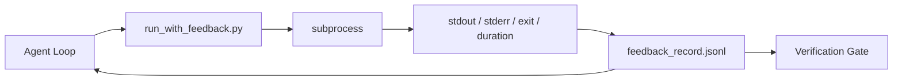

<!-- i18n:manual -->
# Циклы обратной связи в рантайме

> Агент, который не видит настоящий вывод команд, гадает. Раннер обратной связи складывает stdout, stderr, код выхода и время в структурированную запись, которую следующий шаг может прочитать. И тогда агент реагирует на факты, а не на собственное предсказание фактов.

**Type:** Build
**Languages:** Python (stdlib)
**Prerequisites:** Phase 14 · 32 (Minimal Workbench), Phase 14 · 35 (Init Script)
**Time:** ~50 minutes

## Learning Objectives

- Отличать обратную связь рантайма от телеметрии наблюдаемости.
- Собрать раннер обратной связи, который оборачивает shell-команды и сохраняет структурированные записи.
- Детерминированно обрезать большие выводы, чтобы цикл держался в бюджете токенов.
- Отказываться двигать цикл дальше, когда обратной связи нет.

## The Problem

Агент говорит: «запускаю тесты». Следующим сообщением: «все тесты прошли». В реальности не запустился ни один тест. Агент придумал вывод, или запустил команду и не прочитал результат, или прочитал результат и молча обрезал строку с ошибкой.

Раннер обратной связи убирает этот зазор. Каждая команда идёт через раннер. Каждая запись несёт команду, захваченные stdout и stderr, код выхода, реальную длительность по часам и одну строку заметки агента. Агент читает запись на следующем шаге. Гейт проверки читает записи в конце задачи.

> 🎒 **На пальцах.** Это как школьник, который написал в дневнике «контрольная сдана», не сдав её. Пока никто не смотрит на настоящий листок, версия школьника и есть правда. Раннер — это тот самый листок с оценкой: он существует отдельно от рассказа агента, поэтому соврать не получится.

## The Concept



### What goes in a feedback record

| Field | Why it matters |
|-------|----------------|
| `command` | Точный argv, никаких сюрпризов от подстановок shell |
| `stdout_tail` | Последние N строк, детерминированная обрезка |
| `stderr_tail` | Последние N строк, отдельно от stdout |
| `exit_code` | Однозначный сигнал успеха |
| `duration_ms` | Показывает медленные проверки и убежавшие процессы |
| `started_at` | Метка времени для воспроизведения |
| `agent_note` | Одна строка: что агент ожидал получить |

> 🎒 **На пальцах.** По схеме выше видно главное: у записи два читателя — сам агент на следующем шаге и гейт проверки в конце. Один файл, две роли. Как журнал в классе: по нему ориентируется и ученик, и завуч в конце четверти.

> 🎒 **На пальцах.** Семь полей — это семь ответов на вопрос «что реально произошло». Убери `exit_code`, и останется только текст, который агент истолкует в свою пользу; убери `duration_ms`, и вы не отличите упавший тест от теста, который висел 90 секунд. Как чек в магазине: без суммы это просто список покупок.

### Truncation is deterministic

Лог на 50 МБ убивает цикл. Раннер обрезает начало и конец, вставляя маркер `...truncated N lines...`, детерминированно — один и тот же вывод всегда даёт одну и ту же запись. Никакого сэмплирования: то, что агенту нужно увидеть (последняя ошибка, финальная сводка), лежит в хвосте.

> 🎒 **На пальцах.** Хвост важнее середины, потому что тесты пишут вердикт в конце: «12 failed, 340 passed» — это последние строки. Держать 50 МБ в контексте нельзя, а 40 строк хвоста стоят пару сотен токенов и содержат почти весь смысл. Как читать письмо с конца, если вас интересует только подпись «отказано».

### Feedback versus telemetry

Телеметрия (Phase 14 · 23, соглашения OTel GenAI) нужна людям-операторам, которые разбирают прогоны за какой-то период. Обратная связь нужна следующему шагу этого прогона. Поля у них пересекаются, но живут они в разных файлах и хранятся по-разному.

> 🎒 **На пальцах.** Разница как между шпаргалкой на текущей контрольной и школьным архивом за год. Шпаргалка нужна сейчас и через час не нужна вовсе, архив нужен через год, но прямо сейчас в него никто не смотрит. Смешаете их в одном файле — и агент будет тащить в контекст записи прошлой недели.

### Refuse to advance without feedback

Если раннер упал до того, как захватил код выхода, запись несёт `exit_code: null` и `error: <reason>`. Цикл агента обязан отказаться объявлять успех при `null`. Нет кода выхода — нет прогресса.

> 🎒 **На пальцах.** `null` — это не «наверное, ноль», это «мы не знаем». Разница как между «врач сказал, что ты здоров» и «к врачу не попал». Второе нельзя записывать в справку, и именно поэтому цикл здесь встаёт, а не идёт дальше с оптимистичным предположением.

```figure
wb-feedback-loop
```

> 🎒 **На пальцах.** Схема показывает петлю, а не прямую линию: вывод команды возвращается в тот же агент, который её запустил. Именно замкнутость делает цикл самокорректирующимся — без обратной стрелки это был бы просто список выполненных команд.

## Build It

`code/main.py` реализует:

- `run_with_feedback(command, agent_note)` — оборачивает `subprocess.run`, захватывает stdout/stderr/код выхода/длительность, детерминированно обрезает, дописывает в `feedback_record.jsonl`.
- Небольшой загрузчик, который стримит JSONL в список Python.
- Демо, которое запускает три команды (успех, падение, медленная) и печатает последнюю запись по каждой.

Запустите:

```
python3 code/main.py
```

Вывод: три записи обратной связи, дописанные в `feedback_record.jsonl`, и последняя из каждой пары напечатана тут же. Смотрите хвост файла между прогонами — увидите, как цикл накапливает историю.

> 🎒 **На пальцах.** Обратите внимание на слово «дописывает»: файл не перезаписывается, поэтому после трёх прогонов демо в нём будет девять записей, а не три. Это дёшево и очень полезно — история попыток и есть материал для гейта проверки. Как черновая тетрадь: важно не только последнее решение, но и то, сколько раз вы его переделывали.

## Production patterns in the wild

Три приёма делают раннер достаточно крепким, чтобы его выпускать.

**Redact at write, not at read.** Любая запись, которая трогает stdout или stderr, может утащить секреты. Раннер делает проход вычистки до дописывания в JSONL: убирает строки, попадающие под `^Bearer `, `password=`, `api[_-]?key=`, `AKIA[0-9A-Z]{16}` (AWS), `xox[baprs]-` (Slack). Вычистка на чтении — грабли: атакующий добирается именно до файла на диске. Пересматривайте паттерны вычистки раз в квартал, сверяясь с тем, в каком виде секреты реально встречаются в вашем продакшене.

> 🎒 **На пальцах.** Пять паттернов покрывают почти все типовые утечки, и заметьте: два из них привязаны к конкретным вендорам — `AKIA` для AWS-ключей и `xox` для токенов Slack. Стирать надо при записи, потому что файл переживёт ваш процесс. Как замазать паспортные данные до того, как отдать копию в архив, а не надеяться, что архивариус их не прочтёт.

**Rotation policy, not a single file.** Ограничьте `feedback_record.jsonl` одним мегабайтом на файл; при переполнении переезжайте в `.1`, `.2`, а `.5` выбрасывайте. Цикл агента читает только текущий файл, поэтому стоимость рантайма ограничена. В хранилище артефактов CI уходит весь ротированный набор. Без ротации файл становится узким местом на каждом вызове загрузчика.

> 🎒 **На пальцах.** Схема «пять файлов по 1 МБ» держит на диске максимум 5 МБ истории, а в контекст агента попадает только текущий мегабайт. Как пять полок в шкафу: новая рубашка сверху, самая старая едет в мусор, шкаф не растёт.

**Parent-command id for retry chains.** Каждая запись получает `command_id`; повторы несут `parent_command_id`, указывающий на предыдущую попытку. И список «провалившихся попыток» у ревьюера (Phase 14 · 40), и аудит гейта проверки идут по этой цепочке. Без этой связи повторы выглядят как независимые успехи, и аудит скрывает историю падений.

> 🎒 **На пальцах.** Представьте три записи: тест упал, упал ещё раз, прошёл. Без `parent_command_id` последняя выглядит как обычный зелёный прогон, и вы никогда не узнаете, что до неё было два падения. Как контрольная с третьей попытки: оценка та же, а знания — нет.

## Use It

Продакшен-паттерны:

- **Claude Code Bash tool.** Инструмент уже захватывает stdout, stderr, код выхода и длительность. Раннер из этого урока — то же самое, но независимое от фреймворка и годное для любого агентного продукта.
- **LangGraph nodes.** Оберните любую shell-ноду раннером, чтобы запись сохранялась вне состояния графа.
- **CI logs.** Заливайте JSONL в хранилище артефактов CI; ревьюер сможет воспроизвести любую команду, не перезапуская сессию.

Раннер — тонкая обёртка, которая переживает любой переезд между фреймворками, потому что владеет формой записи.

> 🎒 **На пальцах.** Ключевая мысль: раннер владеет не запуском, а форматом. Поменяйте LangGraph на Claude Agent SDK — семь полей записи останутся те же, и старые записи по-прежнему читаются. Как стандартный формат чека: касса меняется, чек узнаваем.

## Ship It

`outputs/skill-feedback-runner.md` генерирует `run_with_feedback.py` под конкретный проект: с подходящим бюджетом обрезки, с писателем JSONL, подключённым к воркбенчу, и с загрузчиком, который агент читает на каждом шаге.

> 🎒 **На пальцах.** «Под конкретный проект» здесь значит одну настройку — бюджет обрезки. Для проекта, где тесты печатают 20 строк, хватит хвоста в 20 строк; для сборки, которая сыплет тысячи строк варнингов, нужен хвост побольше и жёсткая вычистка. Остальное одинаково.

## Exercises

1. Добавьте в запись поле `cwd`, чтобы одну и ту же команду, запущенную из разных директорий, можно было различить.
2. Добавьте шаг `redaction`, который убирает строки, попадающие под `^Bearer ` или `password=`. Проверьте на фикстуре-записи.
3. Ограничьте суммарный размер `feedback_record.jsonl` одним мегабайтом с ротацией в файлы `.1`, `.2`. Обоснуйте политику ротации.
4. Добавьте `parent_command_id`, чтобы цепочки повторов были видны: какая команда произвела вход, который потребила следующая.
5. Залейте JSONL в крошечный TUI, который подсвечивает последний ненулевой код выхода. Восемь ключевых вещей, которые TUI обязан показывать, чтобы быть полезным на ревью.

> 🎒 **На пальцах.** Начните со второго задания — оно самое дешёвое и самое ценное. Достаточно двух регулярок и одной фикстуры, а результат в том, что ваш JSONL перестаёт быть файлом с паролями. Задание 4 стоит делать сразу после: без `parent_command_id` третья попытка выглядит как первая.

## Key Terms

| Term | What people say | What it actually means |
|------|----------------|------------------------|
| Feedback record | «Лог прогона» | Структурированная запись JSONL с командой, выводом, кодом выхода и длительностью |
| Tail truncation | «Подрезать лог» | Детерминированный захват начала и хвоста, чтобы записи влезали в бюджет токенов |
| Refuse-on-null | «Блокировать при нехватке данных» | Цикл не имеет права идти дальше, когда `exit_code` равен null |
| Agent note | «Метка ожидания» | Одна строка предсказания, которую агент пишет до того, как прочитал результат |
| Telemetry split | «Два файла логов» | Обратная связь для следующего шага, телеметрия для оператора |

> 🎒 **На пальцах.** Обратите внимание на Agent note: заметка пишется ДО чтения результата, иначе она бесполезна. Записав «жду, что 12 тестов упадут», а получив 40 падений, вы сразу знаете, что сломалось что-то ещё. Как поставить себе прогноз перед матчем: задним числом угадывают все.

## Further Reading

- [OpenTelemetry GenAI semantic conventions](https://opentelemetry.io/docs/specs/semconv/gen-ai/)
- [Anthropic, Effective harnesses for long-running agents](https://www.anthropic.com/engineering/effective-harnesses-for-long-running-agents)
- [Guardrails AI x MLflow — deterministic safety, PII, quality validators](https://guardrailsai.com/blog/guardrails-mlflow) — паттерны вычистки как регрессионные тесты
- [Aport.io, Best AI Agent Guardrails 2026: Pre-Action Authorization Compared](https://aport.io/blog/best-ai-agent-guardrails-2026-pre-action-authorization-compared/) — захват до и после вызова инструмента
- [Andrii Furmanets, AI Agents in 2026: Practical Architecture for Tools, Memory, Evals, Guardrails](https://andriifurmanets.com/blogs/ai-agents-2026-practical-architecture-tools-memory-evals-guardrails) — поверхности наблюдаемости
- Phase 14 · 23 — соглашения OTel GenAI для стороны телеметрии
- Phase 14 · 24 — платформы наблюдаемости для агентов (Langfuse, Phoenix, Opik)
- Phase 14 · 33 — правило, которое требует обратной связи до объявления готовности
- Phase 14 · 38 — гейт проверки, который читает этот JSONL
