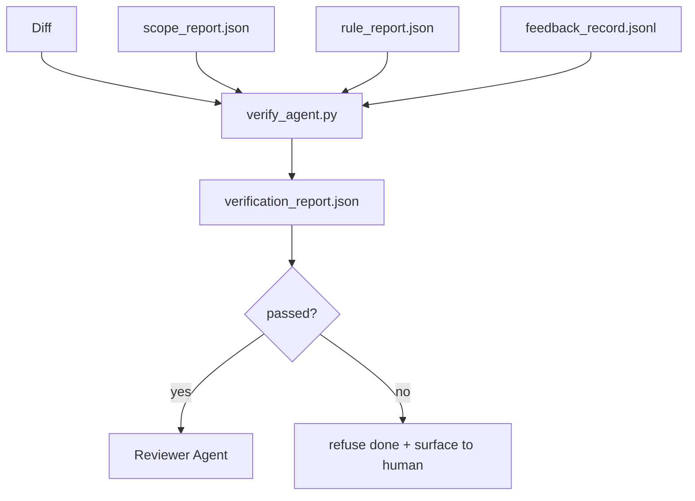

<!-- i18n:manual -->
# Гейты проверки

> Агент не имеет права сам ставить своей работе отметку «сделано». Гейт проверки читает контракт скоупа, лог обратной связи, отчёт по правилам и диф, и отвечает на один вопрос: задача действительно завершена? Если гейт говорит «нет» — задача не сделана, что бы ни было написано в чате.

**Type:** Build
**Languages:** Python (stdlib)
**Prerequisites:** Phase 14 · 33 (Rules), Phase 14 · 36 (Scope), Phase 14 · 37 (Feedback)
**Time:** ~55 minutes

## Learning Objectives

- Определить гейт проверки как детерминированную функцию над артефактами воркбенча.
- Свести отчёт по правилам, отчёт по скоупу, записи обратной связи и диф в один вердикт.
- Выдавать `verification_report.json`, который читают и агент-ревьюер, и CI.
- Отказываться двигать задачу дальше при любом падении с severity `block`, без исключений.

## The Problem

Агенты объявляют успех слишком легко. Преобладают три формы провала:

- «Выглядит хорошо». Модель прочитала собственный диф и решила, что он верный.
- «Тесты прошли». Сказано уверенно. Никакой записи о том, что тест реально запускался.
- «Критерии приёмки выполнены». Критерии истолкованы настолько вольно, что означают «что-то похожее на готовое».

Лечение в воркбенче — один гейт проверки, который читает артефакты, уже произведённые агентом, и выносит решение. Гейт детерминированный. Гейт лежит в системе контроля версий. Гейт вшит в CI. Агент не может его подкупить.

> 🎒 **На пальцах.** Все три отговорки — это ученик, который сам себе выставляет оценку в дневник. «Выглядит хорошо» — это про диф, «тесты прошли» — про несуществующий прогон, «критерии выполнены» — про вольное чтение задания. Гейт лежит в git, поэтому переубедить его словами нельзя: он смотрит только на файлы.

## The Concept



> 🎒 **На пальцах.** Посчитайте входы: четыре артефакта заходят в гейт, выходит один вердикт, и дальше дорога расходится на две — к ревьюеру или к человеку. Никакой третьей дороги нет, «условно готово» не предусмотрено. Как турникет: либо пропустил, либо нет.

### What the gate checks

| Check | Source artifact | Severity |
|-------|-----------------|----------|
| All acceptance commands ran | `feedback_record.jsonl` | block |
| All acceptance commands exited zero | `feedback_record.jsonl` | block |
| Scope check has no forbidden writes | `scope_report.json` | block |
| Scope check has no off-scope writes | `scope_report.json` | block or warn |
| All block-severity rules pass | `rule_report.json` | block |
| No `null` exit codes in feedback | `feedback_record.jsonl` | block |
| Touched files match `scope.allowed_files` | both | warn |

Находка со severity `warn` добавляет пометку к вердикту; находка со severity `block` не даёт выставить `passed: true`.

> 🎒 **На пальцах.** Семь проверок, и шесть из них блокирующие — гейт сознательно суровый. Обратите внимание на разделение труда: три проверки смотрят в `feedback_record.jsonl`, две в `scope_report.json`, одна в `rule_report.json`. То есть гейт ничего не измеряет сам, он только сводит уже готовые отчёты, как классный руководитель сводит оценки от разных учителей.

### Deterministic, not probabilistic

Гейт обязан выдавать один и тот же вердикт для одного и того же набора артефактов, всегда. Никаких LLM-судей. LLM-судьям место на стороне ревьюера (Phase 14 · 39), где цель — качественная оценка, а не статус.

> 🎒 **На пальцах.** Представьте турникет, который в 5% случаев пускает без билета. Формально он работает, но полагаться на него нельзя, и все начинают ходить мимо. Статус «готово / не готово» — это ровно та величина, где вам нужен ноль случайности, поэтому LLM здесь запрещён по конструкции.

### One report, one path

Гейт выдаёт один `verification_report.json` на закрытие задачи, записанный в `outputs/verification/<task_id>.json`. CI читает тот же путь. Несколько гейтов с разными путями расщепляют источник истины.

### Refuse without exception

Находки со severity `block` агент отменить не может. Их может отменить только человек, с записанным `override_reason` и идентификатором пользователя в `overridden_by`. Отмена — это подписанное изменение, а не решение агента.

> 🎒 **На пальцах.** Два поля превращают отмену из лазейки в документ: причина и подпись. Разница как между «учитель разрешил» на словах и справкой с печатью — вторая живёт в архиве, и через месяц по ней можно найти, кто именно разрешил и почему. Агент подписать не может, у него нет удостоверения.

```figure
wb-gate-sequence
```

> 🎒 **На пальцах.** На диаграмме видно, что гейт стоит после агента, но до ревьюера, а не наоборот. Смысл в порядке: сначала дешёвая детерминированная проверка отсеивает явный брак, и только выжившее попадает на дорогое качественное ревью. Как рамка металлодетектора перед личным досмотром.

## Build It

`code/main.py` реализует:

- Загрузчик для каждого входного артефакта — все заглушены локально, чтобы урок был самодостаточным.
- Чистую функцию `verify(task_id, artifacts) -> VerdictReport`.
- Принтер, который показывает результат по каждой проверке и итоговый вердикт pass/fail.
- Демо с тремя сценариями задачи: чистое прохождение, расползание скоупа, отсутствие приёмки.

Запустите:

```
python3 code/main.py
```

Вывод: три отчёта-вердикта, каждый сохранён рядом со скриптом.

> 🎒 **На пальцах.** Три сценария подобраны так, чтобы показать все исходы: первый даёт `passed: true`, второй ловится проверкой скоупа, третий — проверкой «команды приёмки запускались». Полезно поменять один входной артефакт и посмотреть, как переворачивается вердикт: это и есть определение слова «детерминированный».

## Production patterns in the wild

Четыре приёма поднимают гейт из категории «ещё один линтер» в категорию «решающая грань».

**Defense-in-depth, not single gate.** Хук pre-commit → статус-чек в CI → хук авторизации перед вызовом инструмента → гейт перед мержем. Каждый слой детерминированный, поэтому промах одного слоя ловит следующий. В плейбуке microservices.io от марта 2026 это сказано прямо: хук pre-commit нельзя обойти, потому что, в отличие от навыка на стороне модели, он не зависит от того, следует ли агент инструкциям. Гейт проверки стоит на слое CI / перед мержем.

> 🎒 **На пальцах.** Четыре слоя — это четыре независимых шанса поймать проблему, и вероятности умножаются: если каждый слой пропускает брак в одном случае из десяти, все четыре разом пропустят его один раз из десяти тысяч. Как двери в подъезде, лифте и квартире: ни одна не идеальна, все вместе работают.

**Defense by deterministic check, model-judge only for nuance.** Связка Hybrid Norm от Anthropic образца 2026 года: проверяемые награды (юнит-тесты, проверки схем, коды выхода) отвечают на вопрос «код решил задачу?» — рубрики LLM отвечают на вопрос «код читаемый, безопасный, в стиле проекта?». Гейт прогоняет первый класс, ревьюер (Phase 14 · 39) — второй. Смешаете их — сигнал схлопнется.

> 🎒 **На пальцах.** Два вопроса требуют двух разных инструментов. «Программа выдала 42?» проверяет `assert`, «код понятен человеку?» проверить `assert`-ом невозможно. Смешивание выглядит так: LLM ставит 8/10 упавшему тесту, потому что код «красивый», и вы выкатываете сломанное.

**Signed override log, not Slack threads.** Каждая отмена пишет строку в `outputs/verification/overrides.jsonl`: метка времени, код находки, причина, подписавший пользователь, текущий коммит HEAD. Рантайм отвергает любую отмену без подписи; аудиторский след лежит в git. Вот эта черта и отделяет политику отмен от театра отмен.

> 🎒 **На пальцах.** Пять полей в строке — это ответы на «когда, что, почему, кто и на какой версии кода». В переписке Slack первые четыре ещё найдутся, а пятое — коммит HEAD — теряется всегда, и через месяц никто не восстановит, к какому состоянию репозитория относилось разрешение.

**Coverage floor as a first-class check.** `coverage_report.json` питает проверку `coverage_floor` (по умолчанию 80%). Гейт падает, если измеренное покрытие ушло ниже порога или ниже порога предыдущего мержа больше чем на 1 процентный пункт. Без этой проверки агенты тихо удаляют падающие тесты, а отчёты проверки остаются зелёными.

> 🎒 **На пальцах.** Второе условие тоньше первого: покрытие 84% выше порога 80%, но если в прошлый раз было 86%, падение на 2 пункта уже блокирует мерж. Так ловится самый дешёвый способ «починить» тест — удалить его. Как оценки: тройка не двойка, но скатиться с пятёрки до тройки — уже повод разбираться.

**`--strict` mode promotes warns to blocks.** Для релизных веток, PR-ов, блокирующих выпуск, или разбора после инцидента флаг `--strict` превращает каждое предупреждение в жёсткое падение. Флаг включается по ветке, а не глобально по умолчанию: строгость на всём разъедает повседневный рабочий поток.

> 🎒 **На пальцах.** В обычной ветке та проверка `warn` про несовпадение файлов со `scope.allowed_files` просто оставит пометку, а под `--strict` она же остановит мерж. Один и тот же гейт, разная цена ошибки. Как черновик и чистовик: помарка в черновике — ничего, в чистовике — переписывать.

## Use It

Продакшен-паттерны:

- **CI step.** Джоба `verify_agent` прогоняет гейт по финальным артефактам агента. Защита ветки не пускает мерж без `passed: true`.
- **Pre-handoff hook.** Рантайм агента вызывает гейт до того, как сгенерировать документ передачи. Нет зелёного вердикта — нет передачи.
- **Manual triage.** Операторы читают отчёт, когда агент заявляет успех, а человек в этом сомневается.

Гейт — решающая грань в потоке воркбенча. Все остальные поверхности стоят выше по течению.

> 🎒 **На пальцах.** Три места применения — это одна и та же функция, вызванная из трёх точек: из CI, из рантайма агента и руками. Ровно поэтому гейт должен быть чистой функцией над файлами, а не частью какого-то одного пайплайна. Как один и тот же градусник: дома, в школе, в поликлинике.

## Ship It

`outputs/skill-verification-gate.md` вшивает гейт в конкретный проект: какие команды приёмки его питают, какие правила имеют severity `block`, какие записи вне скоупа терпимы, как хранится аудиторский лог отмен.

## Exercises

1. Добавьте проверку `coverage_floor`: команда тестов обязана выдавать отчёт о покрытии не ниже 80%. Решите, какой артефакт несёт этот порог.
2. Поддержите режим `--strict`, который повышает каждый `warn` до `block`. Опишите случаи, где строгий режим — правильное значение по умолчанию.
3. Заставьте гейт выдавать сводку в Markdown вдобавок к JSON. Обоснуйте, какие поля в сводке нужны.
4. Добавьте проверку `time_since_last_human_touch`: любой файл, отредактированный в течение 60 секунд после нажатия клавиши человеком, освобождается от флагов «вне скоупа».
5. Прогоните гейт по настоящему дифу агента из вашего продукта. Сколько находок настоящие, а сколько — шум? Где гейту надо подрасти?

> 🎒 **На пальцах.** Задание 5 — самое отрезвляющее, и делать его лучше последним. На реальном дифе вы почти наверняка получите гору находок `warn` и одну-две настоящие блокирующие; соотношение шума к сигналу и подскажет, какие проверки понизить до `warn`, а какие вообще выкинуть.

## Key Terms

| Term | What people say | What it actually means |
|------|----------------|------------------------|
| Verification gate | «Проверка, которая всё останавливает» | Детерминированная функция над артефактами воркбенча, выдающая вердикт pass/fail |
| Block severity | «Жёсткое падение» | Находка, которая не даёт выставить `passed: true` и требует подписанной отмены |
| Override log | «Почему мы это пропустили» | Подписанные записи с причиной и идентификатором пользователя, разбираемые на ревью |
| Acceptance command | «Доказательство» | Shell-команда, чей нулевой код выхода и есть определение слова «сделано» |
| One report path | «Источник истины» | `outputs/verification/<task_id>.json`, который читают и CI, и люди |

> 🎒 **На пальцах.** Acceptance command — самый важный термин в таблице, потому что он превращает расплывчатое «сделано» в конкретное «`pytest tests/` вернул 0». Дальше спорить не о чем: либо ноль, либо не ноль. А One report path добивает вторую половину проблемы — чтобы этот ноль все смотрели в одном и том же файле.

## Further Reading

- [Anthropic, Harness design for long-running application development](https://www.anthropic.com/engineering/harness-design-long-running-apps)
- [OpenAI Agents SDK guardrails](https://openai.github.io/openai-agents-python/guardrails/)
- [microservices.io, GenAI dev platform: guardrails](https://microservices.io/post/architecture/2026/03/09/genai-development-platform-part-1-development-guardrails.html) — глубокая защита между pre-commit и CI
- [ICMD, The 2026 Playbook for Agentic AI Ops](https://icmd.app/article/the-2026-playbook-for-agentic-ai-ops-guardrails-costs-and-reliability-at-scale-1776661990431) — лестница гейтов одобрения (черновик → одобрение → автоматика в пределах порогов)
- [Type-Checked Compliance: Deterministic Guardrails (arXiv 2604.01483)](https://arxiv.org/pdf/2604.01483) — Lean 4 как верхняя граница детерминированного гейтирования
- [logi-cmd/agent-guardrails — merge gate spec](https://github.com/logi-cmd/agent-guardrails) — гейты по скоупу и мутационному тестированию
- [Guardrails AI x MLflow](https://guardrailsai.com/blog/guardrails-mlflow) — детерминированные валидаторы как оценщики в CI
- [Akira, Real-Time Guardrails for Agentic Systems](https://www.akira.ai/blog/real-time-guardrails-agentic-systems) — гейты до и после вызова инструмента
- Phase 14 · 27 — защита от prompt injection (враждебная пара к гейту)
- Phase 14 · 36 — контракт скоупа, который этот гейт принуждает соблюдать
- Phase 14 · 37 — лог обратной связи, который этот гейт оценивает
- Phase 14 · 39 — агент-ревьюер, которому гейт передаёт работу
