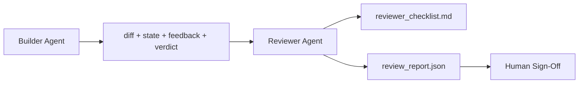

<!-- i18n:manual -->
# Агент-ревьюер: развести исполнителя и проверяющего

> Агент, который написал код, не может его оценить. Ревьюер — это второй цикл с другим системным промптом, другой целью и доступом только для чтения ко всему, что произвёл исполнитель. Зазор между исполнителем и ревьюером — там и живёт большая часть надёжности.

**Type:** Build
**Languages:** Python (stdlib)
**Prerequisites:** Phase 14 · 38 (Verification Gate)
**Time:** ~55 minutes

## Learning Objectives

- Сформулировать, почему один и тот же агент не может надёжно проверять свою работу.
- Собрать цикл агента-ревьюера, который читает артефакты исполнителя и выдаёт структурированный отчёт ревью.
- Написать рубрику ревьюера, которая оценивает конкретные измерения, а не общее впечатление.
- Вшить ревьюера в воркбенч так, чтобы человеческий этап ревью начинался с настоящего артефакта.

## The Problem

Вы просите агента починить баг. Он правит четыре файла, запускает тесты и сообщает, что готово. Гейт проверки (Phase 14 · 38) подтверждает: приёмка запускалась, скоуп удержан. Гейт говорит `passed: true`. Вы мержите. Через два дня выясняется, что починена не та половина бага.

Приёмка необходима, но недостаточна. Ревьюер задаёт вопросы, которые приёмка задать не может: та ли это была проблема? Не разросся ли скоуп без предупреждения? Не задокументированы ли допущения, которые следовало оспорить? Оставлен ли воркбенч в состоянии, с которого следующая сессия сможет продолжить?

> 🎒 **На пальцах.** Гейт проверил, что задача решена правильно, но не то, что решена правильная задача. Как ученик, который аккуратно, без ошибок и в срок решил задачу номер 5, а задавали номер 6: все формальные признаки готовности на месте, толку ноль. Ревьюер — тот, кто сверяется с условием, а не с решением.

## The Concept



> 🎒 **На пальцах.** Проследите стрелки: у ревьюера четыре входа и ни одной стрелки обратно в диф. Читать может всё, менять — ничего. Именно эта односторонность и создаёт зазор; как экзаменатор, которому дали работу и красную ручку, но не дали ластик.

### Reviewer rubric

Пять измерений, каждое оценивается от 0 до 2.

| Dimension | Question |
|-----------|----------|
| Problem fit | Решило ли изменение задачу так, как она сформулирована, а не соседнюю задачу? |
| Scope discipline | Правки остались внутри контракта, или контракт был осознанно расширен? |
| Assumptions | Все ли скрытые допущения записаны там, где их можно перечитать? |
| Verification quality | Команда приёмки действительно доказывает цель или доказала ослабленную версию? |
| Handoff readiness | Сможет ли следующая сессия чисто продолжить с текущего состояния? |

Итог из 10. Прогон ниже 7 — soft fail; прогон ниже 5 — hard fail.

> 🎒 **На пальцах.** Пять измерений по 2 балла дают максимум 10, и пороги стоят близко: 7 и 5. То есть достаточно двух измерений по единице вместо двойки, чтобы съехать в soft fail — планка высокая нарочно. Как норматив по физкультуре: не «примерно пробежал», а конкретное время.

### The reviewer is a separate role, not a separate model

Ревьюера можно запускать на той же модели, что и исполнителя. Дисциплина — в разделении ролей: другой системный промпт, другие входы, никакого доступа на запись в диф. Меняется установка — меняется сигнал.

> 🎒 **На пальцах.** Тот же самый человек в роли автора и в роли корректора ведёт себя по-разному: автор перечитывает, чтобы убедиться, что всё хорошо, корректор — чтобы найти ошибку. Модель здесь одна, но промпт и входы разные, и этого достаточно. Дорогая вторая модель — приятный бонус, а не условие.

### The reviewer cannot edit the diff

Ревьюер читает диф, состояние, обратную связь, вердикт. Он пишет отчёт. Он не патчит диф. Если в отчёте написано «исправить вот это», исправляет следующий шаг исполнителя; ревьюер возвращается к ревью. Смешение ролей убивает зазор.

> 🎒 **На пальцах.** Как только проверяющий начинает править сам, он проверяет уже собственную правку — и зазор закрылся. Ровно поэтому в школе учитель не дописывает ответ за ученика: иначе он проверяет свой почерк. В воркбенче это выглядит как одна строчка в правах доступа: ревьюеру диф доступен только для чтения.

### Reviewer rubric versus verification gate

Гейт (Phase 14 · 38) проверяет детерминированные факты: приёмка запускалась, правила прошли, скоуп удержан. Ревьюер выносит качественные суждения: та ли это была работа, задокументирована ли она, годна ли передача. Нужны оба.

> 🎒 **На пальцах.** Разделите по вопросам: гейт отвечает «правда ли, что тесты вернули 0?», ревьюер — «а те ли это тесты?». Первый вопрос закрывается кодом выхода, второй — только чтением задачи. Пропустите второй — и получите ровно тот баг из начала урока: зелёные тесты на неправильной половине.

```figure
wb-builder-marker
```

> 🎒 **На пальцах.** Схема разводит две роли по двум колонкам, и обратите внимание, что человек стоит справа от ревьюера, а не вместо него. Смысл в том, что человек читает уже написанный отчёт с пятью оценками, а не смотрит на чистый диф с нуля. Это разница между «проверьте работу» и «проверьте вот эту проверку».

## Build It

`code/main.py` реализует:

- Датакласс `ReviewerInputs`, который собирает в пачку артефакты, читаемые ревьюером.
- Оценщик по рубрике с одной функцией на измерение. Каждая функция детерминированная и уровня заглушки для урока; в реальной реализации там был бы вызов LLM.
- Писателя `review_report.json` с пятью оценками, итогом и вердиктом (`pass`, `soft_fail`, `hard_fail`).
- Два демо-случая: чистое изменение и изменение «правильные тесты, неправильная проблема».

Запустите:

```
python3 code/main.py
```

Вывод: два отчёта ревью, записанные на диск, и таблица оценок по измерениям в консоли.

> 🎒 **На пальцах.** Второй демо-случай — самый показательный: тесты зелёные, приёмка прошла, гейт доволен, а Problem fit получает 0. Один нуль по любому измерению — это сразу hard fail, независимо от суммы. Так урок в одной строке показывает, зачем ревьюер нужен вдобавок к гейту.

## Production patterns in the wild

Цифры на стол: система AI Code Review в Cloudflare в апреле 2026 года отработала 131 246 прогонов ревью по 48 095 merge request в 5 169 репозиториях за 30 дней. Медианное ревью укладывалось в 3 минуты 39 секунд. До семи ревьюеров-специалистов (безопасность, производительность, качество кода, документация, управление релизами, комплаенс, Engineering Codex) работали параллельно под Review Coordinator, который дедуплицировал находки и судил о severity. Модель топового уровня отдана исключительно координатору; специалисты работали на более дешёвых уровнях.

> 🎒 **На пальцах.** Поделите: 131 246 прогонов на 48 095 merge request — это примерно 2,7 прогона ревью на один MR, то есть ревью идёт повторно после правок, а не один раз. И заметьте экономику: дорогая модель одна на семь дешёвых специалистов, иначе такой объём не окупился бы.

Четыре приёма заставляют это работать на масштабе.

**Specialist pool, not one big reviewer.** Один ревьюер с рубрикой из пяти измерений годится для одиночных репозиториев. Как только в кодовой базе появляются поверхности, критичные по безопасности, критичные по производительности и поверхность документации, разделяйте на специалистов с промптами поменьше. Координатор занимается дедупликацией; специалисты никогда не прогоняют полную рубрику. Разделение по уровням моделей выпадает само: дешёвые специалисты, дорогой координатор.

> 🎒 **На пальцах.** Семь маленьких промптов вместо одного большого — это как семь узких специалистов в поликлинике вместо одного терапевта, который знает всё. Каждый видит меньше, но глубже, а координатор играет роль регистратуры: сводит семь заключений и убирает повторы, чтобы вам не выдали одну и ту же находку семь раз.

**Bias mitigation as design requirement, not optimization.** У LLM-судей стабильно проявляются четыре смещения (Adnan Masood, апрель 2026): позиционное смещение (GPT-4 расходится сам с собой примерно в 40% случаев при порядке (A,B) против (B,A)), смещение к многословности (около 15% инфляции оценок в пользу более длинных выходов), самопредпочтение (судья предпочитает выходы моделей своего же семейства) и авторитет (судья завышает оценку тексту со ссылками на известных авторов). Что делать: оценивать оба порядка и считать только согласованные победы; использовать шкалы 1-4, которые прямо награждают краткость; ротировать судей по разным семействам моделей; вырезать имена авторов до оценивания.

> 🎒 **На пальцах.** Позиционное смещение проверяется на пальцах: покажите судье ту же пару ответов, поменяв их местами, и в 40% случаев он выберет другого победителя. Это значит, что почти половина его вердиктов — про порядок, а не про качество. Лекарство простое: спросить дважды и учесть только те случаи, где ответ совпал.

**Calibration set, not vibes.** Исторический набор из 10-20 задач с известными правильными вердиктами. Прогоняйте по нему ревьюера при каждом изменении промпта. Если согласие с исторической записью падает ниже 80%, рубрику надо переписать до того, как ревьюер пойдёт в дело. Это то, что каждая команда рано или поздно открывает заново; лучше начать с этого сразу.

> 🎒 **На пальцах.** Набор из 15 задач и порог 80% значат, что расхождение больше чем по трём задачам — стоп. Как проверить новый градусник на кипятке и льду: вы уже знаете правильные ответы, и если прибор врёт на известном, доверять ему на неизвестном нельзя.

**Hybrid norm with the gate.** Гейт проверки (Phase 14 · 38) берёт на себя детерминированные проверки (приёмка запускалась, тесты прошли, скоуп удержан). Ревьюер берёт смысловые проверки (та ли это была работа, задокументированы ли допущения, годна ли передача). Рекомендации Anthropic 2026 года про это разделение говорят прямо: не просите ревьюера переделывать то, что гейт уже доказал.

## Use It

Продакшен-паттерны:

- **Claude Code subagents.** Субагент-ревьюер запускается после того, как исполнитель закрыл задачу. Он оставляет в PR комментарий с оценками по рубрике.
- **OpenAI Agents SDK handoffs.** Исполнитель передаёт работу ревьюеру по завершении задачи. Ревьюер может передать её назад со списком находок или наверх, человеку.
- **Two-model pairing.** Исполнитель работает на быстрой и дешёвой модели. Ревьюер — на более сильной, с меньшим контекстом, сосредоточенной на суждении.

Ревьюер — та самая вторая пара глаз, которую воркбенч отращивает, когда люди не могут проверять всё сами.

> 🎒 **На пальцах.** Обратите внимание на распределение денег в третьем пункте: дешёвая модель делает много токенов (пишет код), дорогая — мало (читает и судит). Контекст у ревьюера меньше, потому что ему не нужна вся история сессии, только артефакты. Как редактор, которому дают рукопись, а не дневник писателя.

## Ship It

`outputs/skill-reviewer-agent.md` генерирует рубрику ревьюера под конкретный проект, заглушку агента-ревьюера, подключённую к артефактам исполнителя, и интеграцию с гейтом проверки, чтобы человеческое ревью начиналось с написанного отчёта, а не с пустой страницы.

## Exercises

1. Добавьте шестое измерение, специфичное для вашей предметной области. Обоснуйте, почему оно не поглощается существующими пятью.
2. Прогоните ревьюера с двумя разными системными промптами (сжатым и подробным). Какой даёт отчёт, который человек скорее прочитает?
3. Добавьте поле `confidence` на каждое измерение. Отказывайтесь выдавать отчёт, когда уверенность в самом низком измерении ниже 0.6.
4. Соберите калибровочный набор: 10 исторических закрытий задач с известными правильными вердиктами. Прогоните по ним ревьюера. Где он расходится с исторической записью?
5. Добавьте возможность «запросить больше доказательств»: ревьюер может попросить исполнителя прогнать конкретный тест до оценивания. Какая нужна отсрочка, чтобы это не превратилось в бесконечный цикл?

> 🎒 **На пальцах.** Задание 5 — ловушка, и в нём вся суть: без ограничения ревьюер и исполнитель могут гонять мяч друг другу вечно. Простейшее лечение — счётчик: не больше двух запросов доказательств на задачу, дальше отчёт выдаётся как есть с пометкой о нехватке данных. Как две попытки на переписывание контрольной, а не бесконечные.

## Key Terms

| Term | What people say | What it actually means |
|------|----------------|------------------------|
| Reviewer rubric | «Чеклист» | Оценивание по пяти измерениям от 0 до 2 с написанным вопросом на каждое измерение |
| Soft fail | «Нужны правки» | Итог ниже 7; исполнитель получает находки, которые надо закрыть |
| Hard fail | «Отклонено» | Итог ниже 5 или любое измерение на 0; остановиться и вынести человеку |
| Role separation | «Другой промпт» | Обе роли может играть одна модель; дисциплина — во входах и установке |
| Confidence floor | «Не выдавать отчёты с низким сигналом» | Отказ выносить вердикт, когда рубрика даёт неуверенный результат |

> 🎒 **На пальцах.** Hard fail хитрее, чем кажется: он срабатывает не только по сумме ниже 5, но и по единственному нулю — можно набрать 8 из 10 и всё равно получить отказ. Логика простая: восемь баллов при нуле по Problem fit означают отлично сделанную не ту работу. Как идеально написанное сочинение не по той теме.

## Further Reading

- [OpenAI Agents SDK handoffs](https://openai.github.io/openai-agents-python/handoffs/)
- [Anthropic Claude Code subagents](https://code.claude.com/docs/en/sub-agents)
- [Cloudflare, Orchestrating AI Code Review at Scale](https://blog.cloudflare.com/ai-code-review/) — архитектура из 7 специалистов и координатора, 131 тыс. прогонов за 30 дней
- [Agent-as-a-Judge: Evaluating Agents with Agents (OpenReview / ICLR)](https://openreview.net/forum?id=DeVm3YUnpj) — бенчмарк DevAI, 366 иерархических требований к решению
- [Adnan Masood, Rubric-Based Evaluations and LLM-as-a-Judge: Methodologies, Biases, Empirical Validation](https://medium.com/@adnanmasood/rubric-based-evals-llm-as-a-judge-methodologies-and-empirical-validation-in-domain-context-71936b989e80) — четыре смещения и способы их лечения
- [MLflow, LLM-as-a-Judge Evaluation](https://mlflow.org/llm-as-a-judge) — продакшен-инструменты для разделённой пары исполнитель/оценщик
- [LangChain, How to Calibrate LLM-as-a-Judge with Human Corrections](https://www.langchain.com/articles/llm-as-a-judge) — процесс работы с калибровочным набором
- [Evidently AI, LLM-as-a-judge: a complete guide](https://www.evidentlyai.com/llm-guide/llm-as-a-judge)
- [Arize, LLM as a Judge — Primer and Pre-Built Evaluators](https://arize.com/llm-as-a-judge/)
- Phase 14 · 05 — Self-Refine и CRITIC (базовый уровень самопроверки одним агентом)
- Phase 14 · 30 — разработка агентов на основе evals (генератор калибровочного набора)
- Phase 14 · 38 — гейт проверки, который читает ревьюер
- Phase 14 · 40 — пакет передачи, который питает отчёт ревьюера
