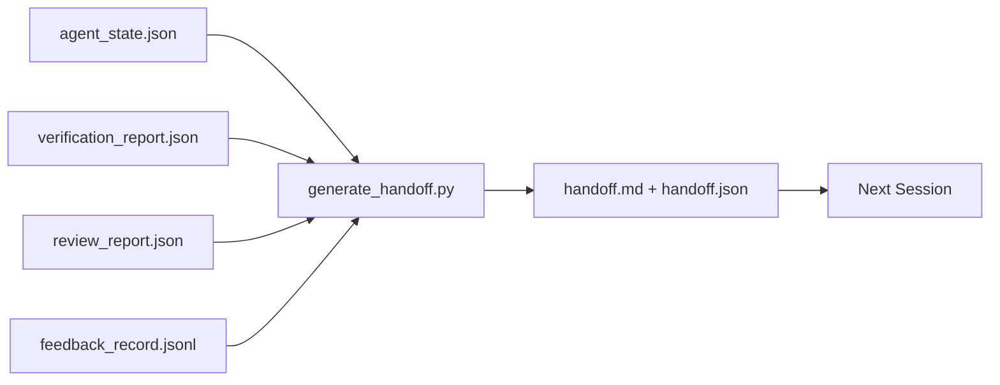

<!-- i18n:manual -->
# Передача контекста между сессиями

> Сессия закончится. Работа — нет. Пакет передачи контекста — это артефакт, который превращает «агент час поработал» в «следующая сессия полезна с первой минуты». Его делают специально, а не по остаточному принципу.

**Type:** Build
**Languages:** Python (stdlib)
**Prerequisites:** Phase 14 · 34 (Repo Memory), Phase 14 · 38 (Verification), Phase 14 · 39 (Reviewer)
**Time:** ~50 minutes

## Learning Objectives

- Назвать семь полей, которые нужны любому пакету передачи контекста.
- Собирать передачу из артефактов верстака, не сочиняя прозу руками.
- Сжимать большие логи обратной связи до размера пакета.
- Сделать первое действие следующей сессии детерминированным.

## The Problem

Сессия заканчивается. Агент говорит: «отлично, мы продвинулись». Открывается следующая сессия. Следующий агент спрашивает: «а где мы остановились?» Ответ первого агента исчез. Следующий агент выясняет всё заново, заново гоняет те же команды, заново задаёт человеку те же вопросы и сжигает тридцать минут на восстановление последних тридцати секунд предыдущей сессии.

Цена плохой передачи платится каждую сессию до конца жизни задачи. Лечится пакетом, который собирается автоматически в конце сессии: что изменилось, зачем, что пробовали, что не сработало, что осталось, с чего начать в следующий раз.

> 🎒 **На пальцах.** Посчитайте обмен: тридцать секунд на запись итогов против тридцати минут на их восстановление — разница в шестьдесят раз. И платить эти тридцать минут придётся не один раз, а на каждой новой сессии по этой задаче. Как выйти из библиотеки, не заложив закладку: книга та же, а страницу ищешь заново.

## The Concept



> 🎒 **На пальцах.** Четыре стрелки входят, одна выходит: генератор ничего не выдумывает, он только сводит четыре готовых файла в один пакет. Значит, качество передачи целиком зависит от того, в каком состоянии вы оставили эти четыре файла. Как сборка отчёта из чеков: если чеки на месте, отчёт получается сам.

### Seven fields every handoff carries

| Field | Question it answers |
|-------|---------------------|
| `summary` | Один абзац о том, что было сделано |
| `changed_files` | Дифф одним взглядом |
| `commands_run` | Что на самом деле выполнялось |
| `failed_attempts` | Что пробовали и почему не сработало |
| `open_risks` | Что может ударить в следующей сессии, с уровнем серьёзности |
| `next_action` | Первый конкретный шаг следующей сессии |
| `verdict_pointer` | Путь до отчётов верификации и ревью |

Несущее поле здесь — `next_action`. Передача, в которой есть всё, кроме `next_action`, — это отчёт о статусе, а не передача.

> 🎒 **На пальцах.** Проверьте семь строк на своём последнем рабочем дне: шесть из них вы, скорее всего, восстановите по git log и истории терминала, а седьмую — `next_action` — не восстановит никто, потому что она жила только в вашей голове. Поэтому она и несущая. Как записка «начал красить вторую стену, валик в ведре» — без неё утром непонятно, где остановились.

### Handoffs are generated, not written

Написанная руками передача — это передача, которую пропустят в тяжёлый день. Генератор читает артефакты верстака и выдаёт пакет. Задача агента — оставить верстак в состоянии, которое генератор сумеет пересказать, а не написать пересказ самому.

> 🎒 **На пальцах.** Ключевое слово — «в тяжёлый день». В спокойный день вы напишете отличную передачу и без генератора; пропустите вы её ровно тогда, когда она нужнее всего, — после трёх часов отладки в полночь. Как автоматический бэкап против ручного: ручной делают, пока не устанут.

### Two forms: human-readable and machine-readable

`handoff.md` читает человек. `handoff.json` загружает следующий агент. Оба собираются из одних и тех же исходных артефактов. Если они расходятся, побеждает JSON.

> 🎒 **На пальцах.** Два файла из одного источника — это не дублирование, а два разных читателя. Человеку нужны абзацы и заголовки, агенту — поля, которые можно распарсить без ошибок. Правило «побеждает JSON» существует, чтобы в спорный момент не гадать: как в договоре, где сказано, какая версия текста считается основной.

### Feedback log trimming

Полный `feedback_record.jsonl` может содержать сотни записей. В передачу попадают только последние K плюс каждая запись с ненулевым кодом выхода. Следующая сессия при необходимости подгрузит весь лог, но сам пакет остаётся маленьким.

> 🎒 **На пальцах.** Возьмите 300 записей и K = 10: в пакет уйдут последние десять плюс, скажем, четыре падения — четырнадцать строк вместо трёхсот. Успешные прогоны в середине лога не несут информации, а вот каждое падение несёт. Как выписка по карте: важны не все покупки, а последние и все отклонённые.

### Leave a clean state

Передача описывает работу. Чистое состояние делает работу продолжаемой. Это не одно и то же. Идеальный `handoff.md` ничего не стоит, если следующая сессия открывается в наполовину применённый дифф, забытый временный файл, лишнюю ветку и тесты, которые падают с ошибкой ещё до запуска. Следующий агент тратит первые десять минут на уборку за предыдущим, а не на работу, и цена накапливается с каждой сессией до конца жизни задачи.

Поэтому сессия заканчивается не тогда, когда фича заработала. Она заканчивается тогда, когда верстак в состоянии, которое генератор сумеет пересказать, а следующая сессия — принять на веру. Уборка — это отдельная фаза, она идёт перед передачей, и это проверка, а не привычка, потому что привычку в тяжёлый день пропускают.

> 🎒 **На пальцах.** Разделите два артефакта по смыслу: передача отвечает на «что делать», чистое состояние — на «во что я попаду, когда открою репозиторий». Первое без второго — как подробный рецепт, оставленный на кухне с грязной посудой во всех кастрюлях. Готовить всё равно нельзя, пока не помоешь.

| Check | Clean means | Dirty blocks because |
|-------|-------------|----------------------|
| Рабочее дерево | Каждое изменение закоммичено или явно отложено в stash с пометкой | Наполовину применённый дифф выглядит для следующего агента как осознанная работа |
| Временные артефакты | Не осталось `*.tmp`, черновых папок, отладочной печати и закомментированных блоков | Лишние файлы засоряют дифф и картину мира следующего агента |
| Тесты | Зелёные — или красные, но падение названо в `open_risks` | Молча красный тест — это капкан, в который наступит следующая сессия |
| Доска фич | Статусы в `feature_list.json` соответствуют реальности (Phase 14 · 36) | Устаревшая доска пошлёт следующую сессию делать уже сделанное |
| Ветка | Та ветка, которая ожидается: ни detached HEAD, ни осиротевших ветвей | Не та ветка — и первый коммит следующей сессии уедет не туда |

Фаза уборки выдаёт `clean_state.json` со списком блокирующих проблем; пустой список — это предусловие, которое генератор передачи проверяет прежде, чем что-то записать. Передача, собранная на грязном дереве, — не передача, а переадресованный бардак. Артефакты работают парой: уборка доказывает, что верстак безопасно оставить, передача доказывает, что следующая сессия знает, с чего начать.

> 🎒 **На пальцах.** Пять строк таблицы — пять способов испортить утро следующему агенту, и ни один из них не про код. Возьмите строку про тесты: красный тест сам по себе не беда, беда — красный тест, о котором не сказано в `open_risks`, потому что следующая сессия решит, что это она его сломала. Заявленное падение — это информация, незаявленное — ловушка.

```figure
wb-handoff-packet
```

## Build It

`code/main.py` реализует:

- Загрузчик, который собирает состояние, вердикт, ревью и обратную связь в единый `WorkbenchSnapshot`.
- Функцию `generate_handoff(snapshot) -> (markdown, payload)`.
- Фильтр, который берёт последние K записей обратной связи плюс все ненулевые выходы.
- Демо-прогон, который пишет `handoff.md` и `handoff.json` рядом со скриптом.

Запустите:

```
python3 code/main.py
```

Вывод: напечатанное тело передачи плюс оба файла на диске.

> 🎒 **На пальцах.** Обратите внимание, что генератор не спрашивает у вас ни одного слова — на входе только `WorkbenchSnapshot`, собранный из файлов. Именно поэтому его можно повесить на закрытие сессии и забыть о нём. Как принтер чеков на кассе: он ничего не сочиняет, он печатает то, что уже пробито.

## Production patterns in the wild

У Codex CLI, Claude Code и OpenCode три разные истории про сжатие контекста; структурированный пакет передачи ложится поверх всех трёх.

**Compaction strategies vary; the packet schema does not.** У Codex CLI `POST /v1/responses/compact` — это непрозрачный AES-блоб на стороне сервера (быстрый путь для моделей OpenAI); запасной вариант — локальная «handoff summary», добавленная сообщением с ролью user и меткой `_summary`. Claude Code гоняет пятиступенчатое прогрессивное сжатие на 95% контекста. OpenCode прячет сообщения по временным меткам и добавляет LLM-выжимку из пяти заголовков. Три разных механизма и одна и та же потребность: сериализовать то, что переживает сжатие, в переносимый артефакт. Пакет и есть этот артефакт.

> 🎒 **На пальцах.** Три вендора, три механизма — и ни один из них не совместим с двумя другими. Пакет решает именно это: он не зависит от того, как ваш инструмент жмёт контекст, потому что живёт файлом на диске. Как формат PDF: чем именно вы его сделали, читателю всё равно.

**Fresh-session handoff is not compaction.** Сжатие продлевает сессию; передача аккуратно закрывает одну и открывает следующую. Формулировка из Hermes Issue #20372 (апрель 2026) точна: когда сжатие на месте начинает портить качество, агент должен написать компактную передачу, закончить сессию и продолжить в свежем контексте. Пакет делает этот переход дешёвым. Ошибка — жать до обрушения качества; лечение — заранее заложить бюджет на раннюю чистую передачу.

> 🎒 **На пальцах.** Разница как между «уплотнить чемодан» и «взять второй чемодан». Уплотнять можно долго, но в какой-то момент вы начинаете выбрасывать нужное и даже не замечаете этого. Передача — это второй чемодан: вы решаете сами, что переезжает, вместо того чтобы отдать выбор алгоритму сжатия.

**One active handoff per branch and topic.** Многоагентная координация ломается на устаревших передачах чаще, чем на плохом выводе модели. Всегда указывайте `branch`, `last_known_good_commit` и `status` из набора `active | superseded | archived`. Устаревшие передачи уходят в архив; следующей сессией управляет только активная. Именно это отличает передачу-заметки от передачи-состояния.

**Wrap up before 50-75% context, not at the wall.** Плейбук с ручным паттерном (CLAUDE.md + HANDOVER.md) сообщает о лучших результатах, когда сессия заканчивается на 50-75% бюджета контекста, а не на 95%. Генератор пакета отрабатывает чисто, пока артефакты сжатия не испортили исходное состояние. Писать дёшево, пока контекст цел, и дорого, когда модель уже теряет нить.

> 🎒 **На пальцах.** Возьмите окно на 200 000 токенов: 50-75% — это остановка на 100-150 тысячах, то есть вы добровольно отказываетесь от четверти сессии. Взамен получаете передачу, написанную моделью, которая ещё помнит начало разговора. На 95% она уже пересказывает свой же пересказ. Как писать протокол совещания, пока все в комнате, а не через неделю по памяти.

## Use It

Продакшен-паттерны:

- **Session-end hook.** Рантайм запускает генератор, когда пользователь закрывает чат. Пакет уходит в `outputs/handoff/<session_id>/`.
- **PR template.** Markdown из генератора одновременно годится как тело pull request. Ревьюеры читают его, не открывая пять других файлов.
- **Cross-agent handoff.** Начали в одном продукте (Claude Code), продолжили в другом (Codex). Пакет — общий язык.

Пакет маленький, регулярный и дешёвый в производстве. Экономия накапливается с каждой сессией.

> 🎒 **На пальцах.** Второй пункт — бесплатная выгода, которую легко не заметить: тело PR вы всё равно пишете руками, а генератор уже сложил тот же текст. Один артефакт закрывает две обязанности сразу. Как список покупок, который потом служит чеком расходов.

## Ship It

`outputs/skill-handoff-generator.md` производит генератор, настроенный на пути артефактов конкретного проекта, хук конца сессии, который его запускает, и схему `handoff.json`, которую следующий агент читает на старте.

## Exercises

1. Добавьте поле `assumptions_to_validate`, куда попадает каждое допущение, которое зафиксировал сборщик, но ревьюер не оценил выше 1.
2. Обрезайте выжимку обратной связи по-разному для падающих и проходящих прогонов. Обоснуйте асимметрию.
3. Добавьте список «вопросы человеку». Каков порог, после которого вопрос попадает в пакет, а не в сообщение чата?
4. Сделайте генератор идемпотентным: два запуска дают один и тот же пакет. Что должно быть стабильным, чтобы это выполнялось?
5. Добавьте раздел «предусловия следующей сессии» с точным перечнем артефактов, которые она обязана загрузить до первого действия.

> 🎒 **На пальцах.** Задание 4 сложнее, чем кажется: если в пакет попадают метки времени или пути с ID сессии, два запуска подряд дадут разные файлы, и вы не сможете отличить «ничего не изменилось» от «изменилось всё». Начните с того, чтобы выкинуть из пакета всё, что зависит от момента запуска. Как проверка кассы: два подсчёта одной и той же выручки обязаны совпасть.

## Key Terms

| Term | What people say | What it actually means |
|------|----------------|------------------------|
| Handoff packet | «Итоги сессии» | Сгенерированный артефакт с семью полями, в двух видах: markdown и JSON |
| Next action | «С чего начать» | Один конкретный шаг, с которого стартует следующая сессия |
| Feedback trim | «Выжимка лога» | Последние K записей плюс каждый ненулевой код выхода |
| Status report | «Что мы сделали» | Документ без `next_action`; полезный, но не передача |
| Verdict pointer | «Квитанция» | Путь до отчётов верификации и ревью — для прослеживаемости |

## Further Reading

- [Anthropic, Effective harnesses for long-running agents](https://www.anthropic.com/engineering/effective-harnesses-for-long-running-agents)
- [OpenAI Agents SDK handoffs](https://openai.github.io/openai-agents-python/handoffs/)
- [Codex Blog, Codex CLI Context Compaction: Architecture, Configuration, Managing Long Sessions](https://codex.danielvaughan.com/2026/03/31/codex-cli-context-compaction-architecture/) — `POST /v1/responses/compact` и локальный запасной путь
- [Justin3go, Shedding Heavy Memories: Context Compaction in Codex, Claude Code, OpenCode](https://justin3go.com/en/posts/2026/04/09-context-compaction-in-codex-claude-code-and-opencode) — сравнение сжатия у трёх вендоров
- [JD Hodges, Claude Handoff Prompt: How to Keep Context Across Sessions (2026)](https://www.jdhodges.com/blog/ai-session-handoffs-keep-context-across-conversations/) — CLAUDE.md + HANDOVER.md, бюджет контекста 50-75%
- [Mervin Praison, Managing Handoffs in Multi-Agent Coding Sessions: Fresh Context Without Losing Continuity](https://mer.vin/2026/04/managing-handoffs-in-multi-agent-coding-sessions-fresh-context-without-losing-continuity/) — взгляд со стороны распределённых систем
- [Hermes Issue #20372 — automatic fresh-session handoff when compression becomes risky](https://github.com/NousResearch/hermes-agent/issues/20372)
- [Hermes Issue #499 — Context Compaction Quality Overhaul](https://github.com/NousResearch/hermes-agent/issues/499) — промпты, ориентированные на передачу, в Codex CLI
- [Microsoft Agent Framework, Compaction](https://learn.microsoft.com/en-us/agent-framework/agents/conversations/compaction)
- [OpenCode, Context Management and Compaction](https://deepwiki.com/sst/opencode/2.4-context-management-and-compaction)
- [LangChain, Context Engineering for Agents](https://www.langchain.com/blog/context-engineering-for-agents)
- Phase 14 · 34 — файл состояния, который читает генератор
- Phase 14 · 38 — вердикт верификации, на который ссылается пакет
- Phase 14 · 39 — отчёт ревьюера, вложенный в пакет
