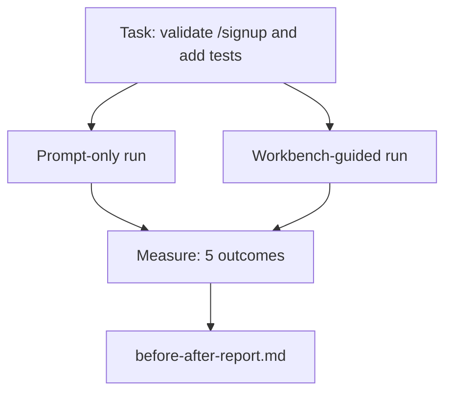

<!-- i18n:manual -->
# Верстак на настоящем репозитории

> Одиннадцать уроков про поверхности не стоят ничего, если они не выживают при контакте с настоящей кодовой базой. В этом уроке одна и та же задача прогоняется дважды на маленьком приложении-примере: только промптом против прогона с верстаком. Спорят числа.

**Type:** Build
**Languages:** Python (stdlib)
**Prerequisites:** Phases 14 · 32 to 14 · 40
**Time:** ~60 minutes

## Learning Objectives

- Собрать семь поверхностей верстака вместе на небольшом приложении.
- Прогнать одну и ту же задачу дважды (только промптом и с верстаком) и замерить пять исходов.
- Прочитать отчёт «до и после» и решить, какие поверхности дали больше всего рычага.
- Защитить верстак от возражения «да у меня модель и так хорошая».

## The Problem

Демка на игрушечной задаче не убеждает никого. Верстак доказывает свою пользу тогда, когда похожая на настоящую задача в похожем на настоящий репозитории доезжает до продакшена с меньшим числом падений, меньшим числом откатов и с пакетом, которым сможет воспользоваться следующая сессия.

Этот урок поставляет такой похожий на настоящий репозиторий и прогоняет через оба пайплайна одну и ту же задачу. На выходе — отчёт «до и после», который можно отдать скептику.

> 🎒 **На пальцах.** Обратите внимание на условие честности: задача одна, репозиторий один, меняется только пайплайн. Если бы вы взяли для верстака задачу попроще, сравнение развалилось бы. Как тест-драйв двух машин: один и тот же круг, один и тот же водитель, иначе результат ни о чём не говорит.

## The Concept



> 🎒 **На пальцах.** Схема — это классический A/B: одна задача расходится на две ветки и снова сходится в точке измерения. Сходятся они именно в измерении, а не в отчёте, — то есть до отчёта обе ветки обязаны пройти ровно одни и те же пять проверок. Как две команды на одном экзамене с одним экзаменатором.

### The sample app

Минимальный обработчик в стиле FastAPI, лежит в `sample_app/`:

- `app.py` с ручкой `/signup` (валидации пока нет).
- `test_app.py` с одним тестом на счастливый путь.
- `README.md` и `scripts/release.sh` — как приманка запретной зоны.

> 🎒 **На пальцах.** Четвёртый пункт — самый интересный: `scripts/release.sh` лежит в репозитории специально, чтобы посмотреть, полезет ли агент его трогать. Правку в скрипт релиза никто не заказывал, и любое изменение там — чистый выход за границы задачи. Как оставить на столе чужой кошелёк, когда проверяешь уборщика.

### The task

> Добавить валидацию входа в `/signup`: отклонять пароли короче 8 символов, возвращать 422 с типизированным конвертом ошибки. Добавить тест, доказывающий новое поведение.

> 🎒 **На пальцах.** В формулировке два требования, и второе легко забыть: не «сделать валидацию», а «сделать валидацию и доказать её тестом». Именно поэтому среди пяти исходов есть `acceptance_met` — иначе агент отчитается о готовности, показав только первую половину. Как ремонт крана: течь остановлена или вы просто закрыли воду в подвале?

### The two pipelines

Только промпт:

1. Прочитать README.
2. Прочитать `app.py`.
3. Отредактировать файлы.
4. Объявить, что готово.

С верстаком:

1. Запустить init-скрипт (урок 35).
2. Прочитать контракт области (урок 36).
3. Прочитать состояние (урок 34).
4. Править только разрешённые файлы.
5. Выполнить команду приёмки через раннер обратной связи (урок 37).
6. Пройти шлюз верификации (урок 38).
7. Прогнать ревьюера (урок 39).
8. Сгенерировать передачу контекста (урок 40).

> 🎒 **На пальцах.** Сравните последние шаги: в первом пайплайне четвёртый шаг — «объявить, что готово», во втором таких слов нет вообще, вместо них четыре проверки. Четыре шага против восьми — и вся разница в том, что во втором случае готовность не заявляется, а доказывается. Как сдать смену на словах против сдать смену по чек-листу.

### The five outcomes measured

| Outcome | Why it matters |
|---------|----------------|
| `tests_actually_run` | Большинство заявлений «тесты прошли» невозможно проверить |
| `acceptance_met` | Тест, доказывающий цель, должен быть тем самым тестом, который выполнялся |
| `files_outside_scope` | Выход за границы области — главный тихий отказ |
| `handoff_quality` | Следующая сессия за это либо платит, либо получает выгоду |
| `reviewer_total` | Качественная оценка поверх шлюза |

> 🎒 **На пальцах.** Первые два исхода — это две разные вещи, и их постоянно путают. `tests_actually_run` отвечает «тесты вообще запускались?», `acceptance_met` — «запускался ли именно тот тест, который проверяет требование?». Можно прогнать двадцать зелёных тестов и не выполнить приёмку ни на процент. Как измерить температуру у соседа и сказать, что вы здоровы.

```figure
wb-ab-runs
```

> 🎒 **На пальцах.** Схема показывает то, что в списках теряется: столбики двух прогонов отличаются не по одному исходу, а по всем пяти сразу. Поверхности работают не по отдельности, а связкой — контракт области ловит лишние файлы, а шлюз ловит незапущенные тесты. Выньте одну — просядет и соседняя.

## Build It

`code/main.py` управляет двумя пайплайнами на одном и том же фикстурном приложении-примере. Оба пайплайна заскриптованы (LLM в цикле нет), поэтому измерение воспроизводимо. Скрипт записывает сравнение в `before-after-report.md` и `comparison.json`.

Запустите:

```
python3 code/main.py
```

Вывод: консольная таблица исходов по каждому пайплайну, markdown-отчёт рядом со скриптом и JSON — для тех, кто захочет построить график.

> 🎒 **На пальцах.** Фраза «LLM в цикле нет» — главное решение этого урока. Живая модель дала бы разные результаты на каждом прогоне, и скептик списал бы разницу на случайность. Здесь оба пайплайна детерминированы: запустите десять раз, получите десять одинаковых таблиц. Как сравнивать шины на стенде, а не на трассе с ветром.

## Production patterns in the wild

Вопрос скептика звучит так: «а насколько верстак реально помогает?» Числа 2026 года говорят гораздо больше, чем объяснения.

**Terminal Bench Top-30 to Top-5 on the same model.** *Anatomy of an Agent Harness* от LangChain (апрель 2026): кодовый агент прыгнул из-за пределов топ-30 на пятое место в Terminal Bench 2.0 — поменялась только обвязка. Та же модель. Другие поверхности. Разница в двадцать пять позиций.

**Vercel 80% to 100% by deleting tools.** Vercel сообщила, что удаление 80% инструментов у своего агента подняло долю успеха с 80% до 100%. Меньше инструментов, острее область, меньше способов ошибиться. Побеждает пустое место.

> 🎒 **На пальцах.** Второй пример контринтуитивен: инструменты убрали, а стало лучше. Причина простая — каждый лишний инструмент — это лишняя развилка, где модель может выбрать не то. Из десяти инструментов агент выбирает верный чаще, чем из пятидесяти. Как меню в столовой: чем короче, тем быстрее и точнее заказ.

**Harvey 2x accuracy via harness alone.** Юридические агенты больше чем удвоили точность за счёт оптимизации обвязки, без смены модели.

**88% of enterprise AI agent projects fail to reach production.** Статья *Harness Engineering for Language Agents* с preprints.org (март 2026) сводит провалы к рантайму, а не к рассуждениям: устаревшее состояние, хрупкие ретраи, разросшийся контекст, плохое восстановление после промежуточных ошибок.

> 🎒 **На пальцах.** Держите в голове число 88%: из ста корпоративных проектов с агентами до продакшена доезжают двенадцать. И причины в списке — состояние, ретраи, контекст, восстановление — это ровно те поверхности, которыми занимался весь мини-трек. Не «модель недостаточно умная», а «прораб не следил за площадкой».

**Long-context collapse.** Базовые 40-50% успеха у WebAgent падают ниже 10% в условиях длинного контекста — в основном из-за бесконечных циклов и потери цели. Ralph Loop и пакет передачи существуют, чтобы это поглощать.

**False negatives still exist.** Одношаговые фактические задачи, однострочные линты, прогон форматтера, всё, что модель помнит дословно, — это быстрее делается одним промптом. Бенчмарк должен честно их перечислять, чтобы верстак не выглядел стрельбой из пушки по воробьям.

Вывод не в том, что «обвязка побеждает навсегда». Модели со временем впитывают трюки обвязки. Вывод в том, что сегодня инженерная нагрузка лежит в семи поверхностях, и числа это доказывают.

> 🎒 **На пальцах.** Пункт про false negatives — самый честный в уроке. Падение с 45% до 10% на длинном контексте показывает, где верстак незаменим, но переименовать одну переменную он не ускорит: восемь шагов ради однострочной правки — это чистый оверхед. Как надевать альпинистскую страховку, чтобы поменять лампочку на кухне.

## Use It

Этот урок — то самое дело, на которое вы ссылаетесь, когда:

- Кто-то спрашивает, зачем к каждому PR приложен `agent-rules.md` и контракт области.
- Команда хочет выкинуть шлюз верификации «только на этот спринт».
- Выходит новый агентный продукт и вам нужен переносимый бенчмарк, чтобы понять, экономит ли он время на самом деле.

Числа уезжают дальше, чем объяснения.

> 🎒 **На пальцах.** Второй пункт — реальная сцена из жизни: шлюз выключают на один спринт, а обратно не включают никогда, потому что «и так же работало». Отчёт «до и после» отвечает на это не мнением, а строкой `tests_actually_run`. Как показать штрафы за превышение вместо спора о том, опасно ли ездить быстро.

## Ship It

`outputs/skill-workbench-benchmark.md` — переносимая оценочная обвязка, которая прогоняет любой агентный продукт через оба пайплайна на приложении-примере вашего проекта и выдаёт пять исходов.

## Exercises

1. Добавьте шестой исход: время до первой осмысленной правки. Как измерить его честно?
2. Прогоните сравнение на настоящей задаче «второго дня» в своей кодовой базе. Где числа верстака проседают?
3. Добавьте прогон на false negatives: задачи, где только промптом было бы быстрее, а накладные расходы верстака — реальная цена. Обоснуйте, почему верстак всё равно стоит держать.
4. Замените заскриптованного «агента» настоящим вызовом LLM. Какие исходы станут шумнее?
5. Напишите страничную выжимку для человека без инженерного бэкграунда. Что уцелеет после сокращения?

> 🎒 **На пальцах.** Начните с задания 1, оно хитрее остальных: «первая осмысленная правка» у прогона с верстаком наступает позже, потому что сначала идут init, контракт и состояние. Если мерить только этот показатель, верстак проиграет — и это честный результат, который надо показывать вместе с четырьмя остальными. Как время на пристёгивание ремня: до старта минус пять секунд, на финише плюс жизнь.

## Key Terms

| Term | What people say | What it actually means |
|------|----------------|------------------------|
| Sample app | «Игрушечный репозиторий» | Маленький, но достаточно реалистичный, чтобы задействовать все семь поверхностей |
| Pipeline | «Рабочий процесс» | Упорядоченная последовательность чтений и записей поверхностей, которой следует агент |
| Before/after report | «Квитанции» | Артефакт, который вы отдаёте скептику |
| False negative | «Верстак — это перебор» | Задачи, где только промптом быстрее; полезно честно их перечислить |
| Workbench benchmark | «Оценка надёжности» | Переносимая обвязка, которая прогоняет сравнение на вашей кодовой базе |

## Further Reading

- [LangChain, The Anatomy of an Agent Harness](https://blog.langchain.com/the-anatomy-of-an-agent-harness/) — квитанция про Terminal Bench: из топ-30 в топ-5
- [MongoDB, The Agent Harness: Why the LLM Is the Smallest Part of Your Agent System](https://www.mongodb.com/company/blog/technical/agent-harness-why-llm-is-smallest-part-of-your-agent-system) — числа Vercel и Harvey
- [preprints.org, Harness Engineering for Language Agents](https://www.preprints.org/manuscript/202603.1756) — 88% провалов в корпорациях, корневые причины в рантайме
- [HN: Improving 15 LLMs at Coding in One Afternoon. Only the Harness Changed](https://news.ycombinator.com/item?id=46988596) — воспроизведено на 15 моделях
- [Cloudflare, Orchestrating AI Code Review at Scale](https://blog.cloudflare.com/ai-code-review/) — 131 тысяча прогонов ревью за 30 дней в продакшене
- [Anthropic, Building Effective Agents](https://www.anthropic.com/research/building-effective-agents)
- Phases 14 · 32 to 14 · 40 — поверхности, которые этот урок прогоняет насквозь
- Phase 14 · 19 — SWE-bench, GAIA и AgentBench как макробенчмарки, которые этот урок дополняет
- Phase 14 · 30 — разработка агентов через оценки, к которой подключается та же обвязка
