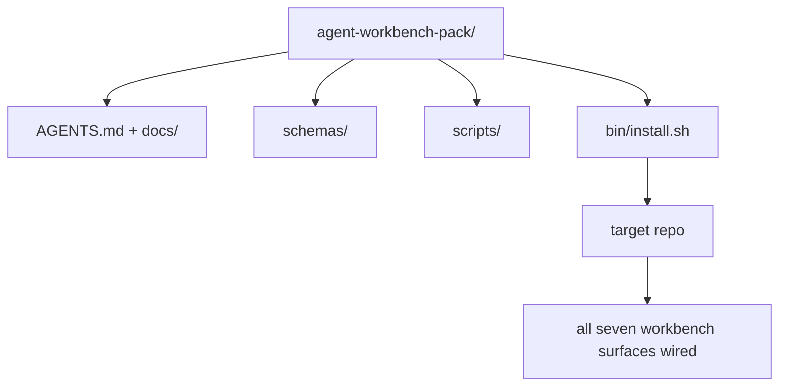

<!-- i18n:manual -->
# Капстоун — выпускаем переиспользуемый пак верстака агента

> Мини-трек заканчивается паком, который вы кладёте в любой репозиторий. Одиннадцать уроков про поверхности, сжатые в директорию: сделали `cp -r` — и на следующее утро агент работает надёжно. Капстоун и есть тот артефакт, на который этот курс ставит.

**Type:** Build
**Languages:** Python (stdlib)
**Prerequisites:** Phases 14 · 31 to 14 · 41
**Time:** ~75 minutes

## Learning Objectives

- Упаковать семь поверхностей верстака в одну директорию, готовую к вставке.
- Прибить схемы, скрипты и шаблоны, чтобы новый репозиторий получал заведомо рабочую базу.
- Добавить один скрипт установки, который раскладывает пак идемпотентно.
- Решить, что остаётся в паке, а что нет, и обосновать каждое отсечение.

## The Problem

Верстак, который живёт в Google Doc, истории чата и трёх наполовину забытых скриптах, — это верстак, который переделывают каждый квартал. Лечится версионированным паком: репозиторием или директорией, где лежат поверхности, схемы, скрипты и установщик в одну команду.

К концу урока у вас на диске будет `outputs/agent-workbench-pack/` и `bin/install.sh`, который положит его в любой целевой репозиторий.

> 🎒 **На пальцах.** Три места хранения из первой фразы — это три способа потерять знание: документ не найдётся, чат прокрутится, скрипты разъедутся. Пак сводит их в одну версионируемую директорию, которую видно в git. Как собрать инструменты из трёх ящиков в один ящик с описью.

## The Concept



> 🎒 **На пальцах.** Обратите внимание на узел `Bin`: только он ведёт в целевой репозиторий. То есть у пака одна точка входа — установщик, а не «скопируйте вот эти четыре папки руками». Одна точка входа означает одну процедуру, которую можно проверить. Как один кран на весь стояк вместо вентиля на каждой трубе.

### The pack layout

```
outputs/agent-workbench-pack/
├── AGENTS.md
├── docs/
│   ├── agent-rules.md
│   ├── reliability-policy.md
│   ├── handoff-protocol.md
│   └── reviewer-rubric.md
├── schemas/
│   ├── agent_state.schema.json
│   ├── task_board.schema.json
│   └── scope_contract.schema.json
├── scripts/
│   ├── init_agent.py
│   ├── run_with_feedback.py
│   ├── verify_agent.py
│   └── generate_handoff.py
├── bin/
│   └── install.sh
└── README.md
```

> 🎒 **На пальцах.** Посчитайте: четыре документа, три схемы, четыре скрипта, один установщик и два файла верхнего уровня — четырнадцать файлов на весь верстак. Это меньше, чем в среднем React-проекте с настройками линтера. Порядок в работе агента стоит дешевле, чем кажется, если он собран в пак.

### What stays in, what stays out

Внутри:

- Схемы поверхностей. Это контракт.
- Четыре скрипта выше. Это рантайм.
- Четыре документа. Это правила и рубрика.

Снаружи:

- Задачи конкретного проекта. Задачи живут на доске целевого репозитория, а не в паке.
- Вызовы вендорских SDK. Пак не привязан к фреймворкам.
- Онбординговая проза. Пак лежит рядом с существующим онбордингом команды, а не внутри него.

> 🎒 **На пальцах.** Правило отсечения простое: внутри — то, что одинаково в любом репозитории, снаружи — то, что меняется от проекта к проекту. Задачи меняются каждую неделю, а схема `agent_state.json` — раз в полгода. Как разделить чемодан и содержимое холодильника: чемодан переезжает, продукты нет.

### The installer

Короткий `bin/install.sh` (или `bin/install.py`):

1. Отказывается ставиться поверх уже существующего пака без `--force`.
2. Копирует пак в целевой репозиторий.
3. Подключает CI, если есть `.github/workflows/`.
4. Печатает следующие шаги: заполнить доску, задать команды приёмки, запустить init-скрипт.

> 🎒 **На пальцах.** Пункт 1 и пункт 4 делают установщик пригодным для людей. Первый защищает от того, чтобы вы случайно затёрли настроенный пак; последний отвечает на вопрос «а что теперь?», который иначе уходит в чат к коллеге. Как инструкция на первой странице, а не в конце.

### Versioning

В паке лежит файл `VERSION`. Изменения схем и скриптов, требующие миграций, поднимают мажорную версию. Изменения только в документах поднимают патч. В `agent_state.json` целевого репозитория записывается, против какой версии пака он был инициализирован.

> 🎒 **На пальцах.** Запись версии в состояние целевого репозитория — это то, что позже спасает вам вечер. Через полгода агент падает, вы смотрите в `agent_state.json`, видите там версию 2 при паке версии 4 — и сразу знаете, что дело в пропущенной миграции, а не в модели. Как год выпуска на запчасти.

```figure
wb-pack-install
```

> 🎒 **На пальцах.** Схема показывает установку как один переход, но у неё две стороны: пак остаётся источником истины, а в репозитории появляется его слепок с версией. Пока эти две версии совпадают, всё предсказуемо; как только разъезжаются, начинается дрейф. Именно за этой парой чисел и следит `lint_pack.py` из упражнений.

## Build It

`code/main.py` собирает пак в `outputs/agent-workbench-pack/` рядом с уроком, засеивая его схемами и скриптами из предыдущих уроков этого мини-трека и документами, которые вы уже написали.

Запустите:

```
python3 code/main.py
```

Скрипт копирует и прибивает поверхности, пишет README, печатает дерево пака и выходит с нулевым кодом. Повторный запуск идемпотентен.

> 🎒 **На пальцах.** Слово «идемпотентен» здесь означает: запустили один раз или пять раз — результат один и тот же. Это не роскошь, а условие для CI, который может дёрнуть скрипт при каждом пуше. Как выключатель, а не как кнопка: нажали дважды — свет всё равно горит так, как ожидалось.

## Production patterns in the wild

Пак ценен, только если он выживает при форках, обновлениях и недружелюбном апстриме. Работать это заставляют четыре паттерна.

**`VERSION` is the contract, not the marketing.** Мажорные повышения требуют миграции состояния. Минорные требуют перезапуска чекера. Патчи — только документация. Установщик при каждой установке пишет `.workbench-version` в целевой репозиторий; `lint_pack.py` отказывается выпускать, если лок в целевом репозитории не согласуется с `VERSION` пака. Именно так `npm`, `Cargo` и `pyproject.toml` переживают десять лет перемен; агенты в этих правилах ничего не меняют.

> 🎒 **На пальцах.** Три уровня повышения — это три разных обязательства для того, кто обновляется: миграция, перезапуск проверки или ничего. Если вы поднимаете мажор из-за правки опечатки в документе, вы заставляете сто репозиториев делать миграцию впустую, и в следующий раз вам просто перестанут верить. Номер версии — это обещание, а не украшение.

**Single source for cross-tool distribution.** Nx поставляет одну команду `nx ai-setup`, которая раскладывает `AGENTS.md`, `CLAUDE.md`, `.cursor/rules/`, `.github/copilot-instructions.md` и MCP-сервер из одного конфига. Пак должен делать то же самое; установщик создаёт симлинки (`ln -s AGENTS.md CLAUDE.md`), чтобы единственный источник истины разошёлся по всем кодовым агентам. Форкать пак ради поддержки одного инструмента вместо другого — это отказ.

> 🎒 **На пальцах.** Симлинк вместо копии решает конкретную беду: пять файлов правил для пяти инструментов расходятся уже на второй неделе, и агенты начинают вести себя по-разному в одном репозитории. Один настоящий файл и четыре ссылки на него расходиться не умеют. Как один экземпляр расписания на двери вместо пяти распечаток по кабинетам.

**`uninstall.sh` that refuses on non-trivial state.** Удаление пака не должно затирать пользовательские `agent_state.json`, `task_board.json` или `outputs/`. Деинсталлятор убирает схемы, скрипты, документы и `AGENTS.md` (с опцией отказа `--keep-agents-md`) и отказывается работать, если в файлах состояния есть незакоммиченные изменения. Состояние принадлежит пользователю; пак им не владеет.

**Skill-as-publishable. SkillKit-style distribution.** Пак поставляется как навык SkillKit: `skillkit install agent-workbench-pack` раскладывает его по 32 ИИ-агентам из одного источника. Репозиторий пака — источник истины, SkillKit — канал доставки. Привязка к вендору исчезает, семь поверхностей остаются те же.

> 🎒 **На пальцах.** Различайте владение и доставку. Пак владеет схемами и скриптами — их можно смело удалить и поставить заново. Состоянием он не владеет: `task_board.json` писали вы, и деинсталлятор к нему не прикасается. SkillKit при этом вообще ничем не владеет, он только разносит копии по 32 агентам. Как арендованный инструмент против ваших собственных заготовок.

## Use It

Три места, куда поставляется пак:

- **As a directory you drop into a repo.** Просто копируете: `cp -r outputs/agent-workbench-pack /path/to/repo`.
- **As a public template repo.** Форкнули и настроили под себя, а дрейф контролирует `VERSION`.
- **As a SkillKit skill.** Вшито в ваш агентный продукт, так что одна команда раскладывает всё.

Пак — это рецепт. Каждая установка — порция.

> 🎒 **На пальцах.** Метафора рецепта и порции объясняет, почему состояние не входит в пак: рецепт один, а порций может быть сорок, и каждая живёт своей жизнью. Обновление рецепта не должно лезть в чужие тарелки. Отсюда и правило деинсталлятора не трогать `agent_state.json`.

## Ship It

`outputs/skill-workbench-pack.md` генерирует пак, настроенный под проект: правила заточены под историю команды, глобы области подогнаны под репозиторий, измерения рубрики дополнены одним пунктом из предметной области.

## Exercises

1. Решите, какой необязательный пятый документ достоин продвижения в канонический пак. Обоснуйте отсечение.
2. Перепишите установщик на Python с флагом `--dry-run`. Сравните удобство с bash-версией.
3. Добавьте `bin/uninstall.sh`, который безопасно удаляет пак и отказывается работать, если у файлов состояния непустая история. Что считать непустым?
4. Добавьте `lint_pack.py`, который падает, когда пак разошёлся с `VERSION`. Подключите его в CI собственного репозитория пака.
5. Напишите ранбук миграции с самодельного верстака на этот пак. Какой порядок операций сводит простой к минимуму?

> 🎒 **На пальцах.** Задание 2 стоит сделать в первую очередь: `--dry-run` печатает, что установщик собирается сделать, ничего не меняя, — и именно эту кнопку вы будете нажимать перед установкой в чужой рабочий репозиторий. Проверить четырнадцать путей на бумаге дешевле, чем потом откатывать. Как обвести мебель мелом на полу, прежде чем сверлить.

## Key Terms

| Term | What people say | What it actually means |
|------|----------------|------------------------|
| Workbench pack | «Стартовый набор» | Версионируемая директория, несущая все семь поверхностей |
| Installer | «Скрипт установки» | `bin/install.sh`, который раскладывает пак идемпотентно |
| Pack version | «VERSION» | Мажор — на изменения схем и скриптов, патч — только на документы |
| Drop-in pack | «cp -r и работай» | Пак работает без настройки под репозиторий с первого дня |
| Forkable template | «Шаблон на GitHub» | Публичный репозиторий, с которого умеет клонировать кнопка «Use this template» |

## Further Reading

- Phases 14 · 31 to 14 · 41 — каждая поверхность, которую собирает этот пак
- [SkillKit](https://github.com/rohitg00/skillkit) — установка этого навыка сразу на 32 ИИ-агента
- [Nx Blog, Teach Your AI Agent How to Work in a Monorepo](https://nx.dev/blog/nx-ai-agent-skills) — генератор из единого источника на шесть инструментов
- [agents.md — the open spec](https://agents.md/) — то, что обязан реализовать роутер вашего пака
- [HKUDS/OpenHarness](https://github.com/HKUDS/OpenHarness) — эталонная реализация аналога пака
- [andrewgarst/agentic_harness](https://github.com/andrewgarst/agentic_harness) — эталон на Redis с набором оценок
- [Augment Code, A good AGENTS.md is a model upgrade](https://www.augmentcode.com/blog/how-to-write-good-agents-dot-md-files) — планка качества для документов пака
- [Anthropic, Effective harnesses for long-running agents](https://www.anthropic.com/engineering/effective-harnesses-for-long-running-agents)
- [Anthropic, Harness design for long-running application development](https://www.anthropic.com/engineering/harness-design-long-running-apps)
- Phase 14 · 30 — разработка агентов через оценки, которая потребляет шлюз верификации из пака
- Phase 14 · 41 — бенчмарк «до и после», который этот пак улучшает
