<!-- i18n:manual -->
# Протоколы общения между агентами

> Агенты, которые не говорят на одном языке, — это не команда. Это незнакомцы, орущие в пустоту.

**Type:** Build
**Languages:** TypeScript
**Prerequisites:** Phase 14 (Agent Engineering), Lesson 16.01 (Why Multi-Agent)
**Time:** ~120 minutes

## Learning Objectives

- Реализовать обнаружение и вызов инструментов по MCP, чтобы агент мог пользоваться инструментами внешних серверов
- Собрать A2A Agent Card и эндпоинт задач, чтобы один агент мог делегировать работу другому по HTTP
- Сравнить MCP (доступ к инструментам), A2A (агент — агент), ACP (корпоративный аудит) и ANP (децентрализованное доверие) и объяснить, какой протокол какую задачу решает
- Соединить несколько протоколов в одной системе: агенты находят инструменты через MCP и делегируют задачи через A2A

## The Problem

Вы разбили систему на несколько агентов. Исследователь, кодер, ревьюер. По отдельности каждый хорош. Но теперь им надо реально разговаривать друг с другом.

Первая попытка очевидна: передавать строки. Исследователь возвращает кусок текста, кодер парсит его как умеет. Работает — пока кодер не поймёт саммари исследования наоборот, или два агента не встанут в клинч в ожидании друг друга, или вам не понадобится, чтобы вместе работали агенты от разных команд. И вот «просто передавать строки» разваливается.

Это и есть проблема протокола общения. Без общего контракта на обмен информацией многоагентные системы хрупкие, непроверяемые и не масштабируются дальше горстки агентов, которых вы написали лично.

Экосистема ответила четырьмя протоколами, каждый закрывает свой срез проблемы:

- **MCP** — для доступа к инструментам
- **A2A** — для совместной работы агентов друг с другом
- **ACP** — для корпоративной проверяемости
- **ANP** — для децентрализованной идентичности и доверия

Урок идёт глубоко. Вы прочитаете настоящие форматы сообщений из каждой спецификации, соберёте рабочие реализации и свяжете все четыре протокола в одну систему.

> 🎒 **На пальцах.** Строки вместо протокола — как передавать заказ на кухню голосом через три двери. Пока агентов двое, связка одна. Пятеро агентов, и каждый говорит с каждым — это уже 5×4 = 20 самописных парсеров, и любой из них ломается от лишней запятой в тексте.

## The Concept

### The Protocol Landscape

Думайте про эти четыре протокола как про слои, каждый отвечает на свой вопрос:

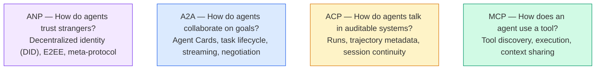

Они не конкуренты. Они решают разные задачи на разных уровнях.

> 🎒 **На пальцах.** Схема выше читается снизу вверх, как этажи здания: MCP — «как взять инструмент», ACP — «как записать всё в журнал», A2A — «как договориться о задаче», ANP — «как поверить незнакомцу». Четыре этажа, ноль конкуренции: у каждого свой вопрос, и в реальной системе вы обычно живёте сразу на нескольких.

### MCP (Recap)

MCP подробно разобран в Phase 13. Коротко: MCP стандартизирует, как LLM подключается к внешним инструментам и источникам данных. Это протокол **клиент — сервер**, где агент (клиент) находит и вызывает инструменты, выставленные сервером.

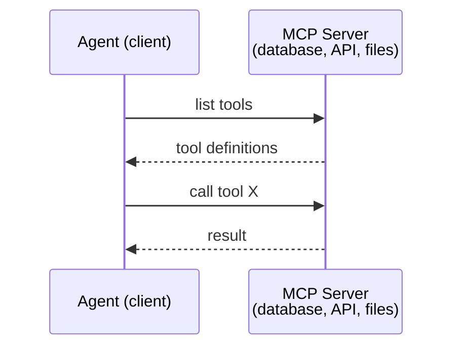

MCP — это связка **агент — инструмент**. Разговаривать друг с другом агентам он не помогает.

> 🎒 **На пальцах.** MCP — это отвёртка в руке агента, а не разговор двух мастеров. В схеме выше ровно два участника и четыре сообщения: «дай список инструментов», список, «вызови X», результат. Второго агента здесь нет вообще — поэтому для командной работы MCP не хватает.

### A2A (Agent2Agent Protocol)

**Created by:** Google (сейчас под Linux Foundation как `lf.a2a.v1`)
**Spec version:** 1.0.0
**Problem:** Как автономные агенты работают вместе, договариваются и делегируют задачи друг другу?

A2A — это протокол **равноправного сотрудничества агентов**. Если MCP соединяет агента с инструментами, то A2A соединяет агента с другими агентами. Каждый агент публикует **Agent Card** по известному URL, а другие агенты находят его, договариваются и делегируют ему задачи.

#### How A2A Works

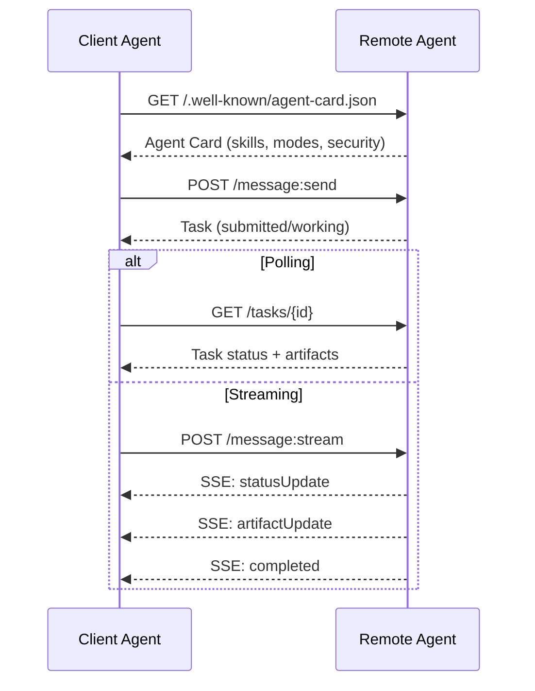

#### The Real Agent Card

Вот как A2A Agent Card выглядит на практике. Отдаётся по `GET /.well-known/agent-card.json`:

```json
{
  "name": "Research Agent",
  "description": "Searches documentation and summarizes findings",
  "version": "1.0.0",
  "supportedInterfaces": [
    {
      "url": "https://research-agent.example.com/a2a/v1",
      "protocolBinding": "JSONRPC",
      "protocolVersion": "1.0"
    },
    {
      "url": "https://research-agent.example.com/a2a/rest",
      "protocolBinding": "HTTP+JSON",
      "protocolVersion": "1.0"
    }
  ],
  "provider": {
    "organization": "Your Company",
    "url": "https://example.com"
  },
  "capabilities": {
    "streaming": true,
    "pushNotifications": false
  },
  "defaultInputModes": ["text/plain", "application/json"],
  "defaultOutputModes": ["text/plain", "application/json"],
  "skills": [
    {
      "id": "web-research",
      "name": "Web Research",
      "description": "Searches the web and synthesizes findings",
      "tags": ["research", "search", "summarization"],
      "examples": ["Research the latest changes in React 19"]
    },
    {
      "id": "doc-analysis",
      "name": "Documentation Analysis",
      "description": "Reads and analyzes technical documentation",
      "tags": ["docs", "analysis"],
      "inputModes": ["text/plain", "application/pdf"],
      "outputModes": ["application/json"]
    }
  ],
  "securitySchemes": {
    "bearer": {
      "httpAuthSecurityScheme": {
        "scheme": "Bearer",
        "bearerFormat": "JWT"
      }
    }
  },
  "security": [{ "bearer": [] }]
}
```

На что обратить внимание:
- **Skills** — это то, что агент умеет. У каждого есть ID, теги и поддерживаемые входные/выходные MIME-типы. Именно по ним клиентский агент решает, справится ли этот удалённый агент с его запросом.
- **supportedInterfaces** перечисляет несколько протокольных привязок. Один агент может одновременно говорить на JSON-RPC, REST и gRPC.
- **Security** встроена в карточку. Клиент знает, какая нужна авторизация, ещё до первого запроса.

> 🎒 **На пальцах.** Agent Card — визитка на двери: имя, что умею, куда стучать, какой пропуск нужен. В карточке выше два skill'а (`web-research` и `doc-analysis`) и два интерфейса (JSON-RPC и HTTP+JSON), причём `doc-analysis` принимает ещё и `application/pdf`. Клиент узнаёт всё это до первого запроса — и не шлёт PDF тому, кто его не берёт.

#### Task Lifecycle

Task — основная единица работы в A2A. Задачи ходят по заданным состояниям:

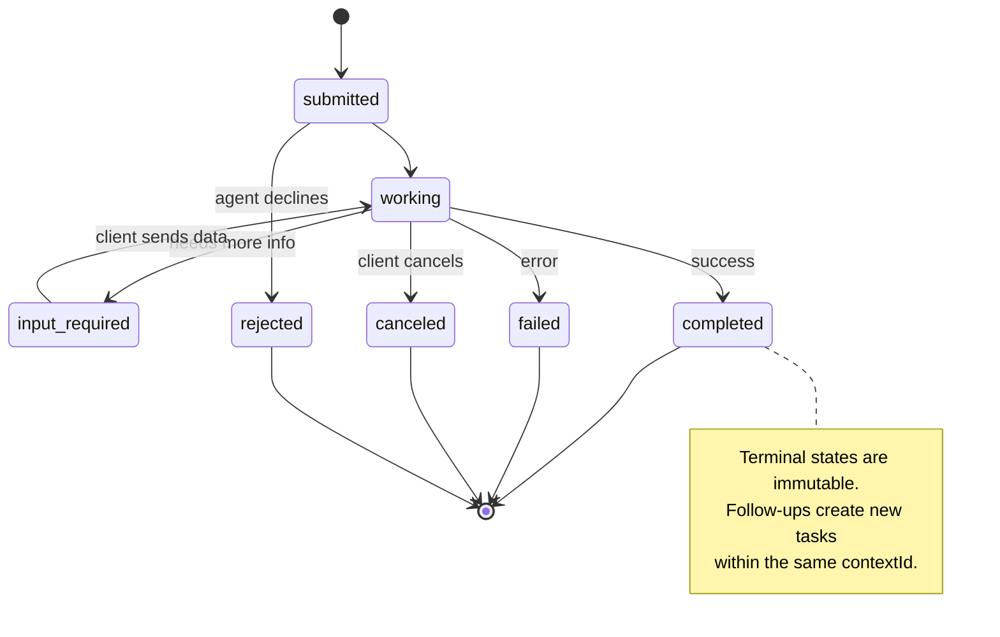

Все 8 состояний (спецификация определяет ещё `UNSPECIFIED` как заглушку, здесь он опущен):

| State | Terminal? | Meaning |
|---|---|---|
| `TASK_STATE_SUBMITTED` | Нет | Принята, обработка ещё не началась |
| `TASK_STATE_WORKING` | Нет | Активно обрабатывается |
| `TASK_STATE_INPUT_REQUIRED` | Нет | Агенту нужны данные от клиента |
| `TASK_STATE_AUTH_REQUIRED` | Нет | Нужна аутентификация |
| `TASK_STATE_COMPLETED` | Да | Завершена успешно |
| `TASK_STATE_FAILED` | Да | Завершена с ошибкой |
| `TASK_STATE_CANCELED` | Да | Отменена до завершения |
| `TASK_STATE_REJECTED` | Да | Агент отказался от задачи |

Как только задача попала в терминальное состояние, она неизменна. Больше никаких сообщений. Продолжение — это новая задача внутри того же `contextId`.

> 🎒 **На пальцах.** Восемь состояний, из них четыре финальных: completed, failed, canceled, rejected. Как посылка на почте: пока «в пути» — статус меняется, но как только «выдана», дописать в неё нельзя ничего. Нужно продолжение — заводите новую задачу с тем же `contextId`, то есть в той же папке переписки.

#### Wire Format

A2A использует JSON-RPC 2.0. Вот как выглядит настоящий обмен сообщениями:

**Client sends a task:**

```json
{
  "jsonrpc": "2.0",
  "id": 1,
  "method": "SendMessage",
  "params": {
    "message": {
      "messageId": "msg-001",
      "role": "ROLE_USER",
      "parts": [{ "text": "Research React 19 compiler features" }]
    },
    "configuration": {
      "acceptedOutputModes": ["text/plain", "application/json"],
      "historyLength": 10
    }
  }
}
```

**Agent responds with a task:**

```json
{
  "jsonrpc": "2.0",
  "id": 1,
  "result": {
    "task": {
      "id": "task-abc-123",
      "contextId": "ctx-xyz-789",
      "status": {
        "state": "TASK_STATE_COMPLETED",
        "timestamp": "2026-03-27T10:30:00Z"
      },
      "artifacts": [
        {
          "artifactId": "art-001",
          "name": "research-results",
          "parts": [{
            "data": {
              "findings": [
                "React 19 compiler auto-memoizes components",
                "No more manual useMemo/useCallback needed",
                "Compiler runs at build time, not runtime"
              ]
            },
            "mediaType": "application/json"
          }]
        }
      ]
    }
  }
}
```

**Streaming via SSE:**

```text
POST /message:stream HTTP/1.1
Content-Type: application/json
A2A-Version: 1.0

data: {"task":{"id":"task-123","status":{"state":"TASK_STATE_WORKING"}}}

data: {"statusUpdate":{"taskId":"task-123","status":{"state":"TASK_STATE_WORKING","message":{"role":"ROLE_AGENT","parts":[{"text":"Searching documentation..."}]}}}}

data: {"artifactUpdate":{"taskId":"task-123","artifact":{"artifactId":"art-1","parts":[{"text":"partial findings..."}]},"append":true,"lastChunk":false}}

data: {"statusUpdate":{"taskId":"task-123","status":{"state":"TASK_STATE_COMPLETED"}}}
```

> 🎒 **На пальцах.** Стриминг — как чат с курьером: сначала «принял», потом «еду», потом «на месте». В примере выше четыре строки `data:`: рабочий статус, текстовое обновление, кусок артефакта с `append: true` и финальное `TASK_STATE_COMPLETED`. Клиент склеивает куски сам — поэтому `lastChunk: false` важнее, чем кажется.

### ACP (Agent Communication Protocol)

**Created by:** IBM / BeeAI
**Spec version:** 0.2.0 (OpenAPI 3.1.1)
**Status:** Сливается с A2A под крылом Linux Foundation
**Problem:** Как агентам общаться так, чтобы всё было проверяемо, сессии продолжались, а траектория работы фиксировалась?

ACP — это **корпоративный протокол**. В отличие от того, что пишут во многих обзорах, ACP **не** использует JSON-LD. Это прямолинейный REST/JSON API, описанный через OpenAPI. Особенность в другом — в **TrajectoryMetadata**: каждый ответ агента может нести подробный лог шагов рассуждения и вызовов инструментов, которые к этому ответу привели.

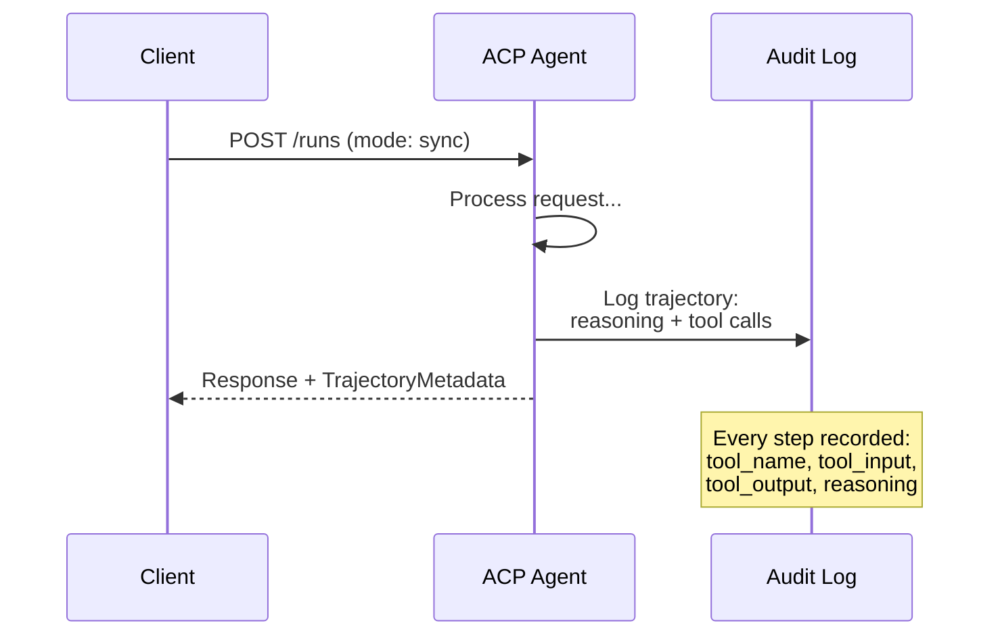

#### Agent Discovery in ACP

ACP описывает четыре способа обнаружения:

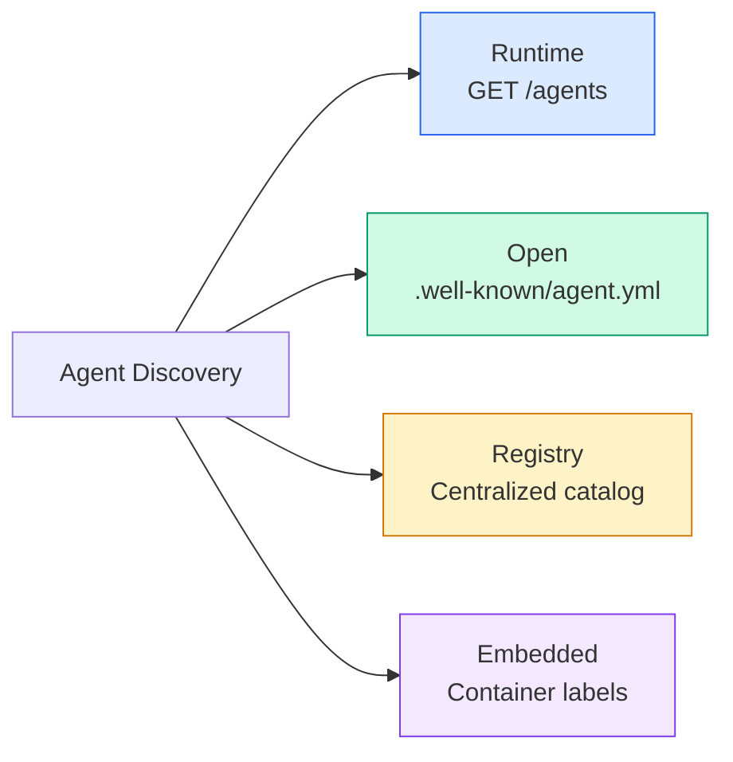

**AgentManifest** проще, чем Agent Card в A2A:

```json
{
  "name": "summarizer",
  "description": "Summarizes documents with source citations",
  "input_content_types": ["text/plain", "application/pdf"],
  "output_content_types": ["text/plain", "application/json"],
  "metadata": {
    "tags": ["summarization", "RAG"],
    "framework": "BeeAI",
    "capabilities": [
      {
        "name": "Document Summarization",
        "description": "Condenses long documents into key points"
      }
    ],
    "recommended_models": ["llama3.3:70b-instruct-fp16"],
    "license": "Apache-2.0",
    "programming_language": "Python"
  }
}
```

#### Run Lifecycle

Вместо «Tasks» в ACP используются «Runs». Run — это один запуск агента, и у него три режима:

| Mode | Behavior |
|---|---|
| `sync` | Блокирующий. Ответ содержит готовый результат целиком. |
| `async` | Сразу возвращает 202. Статус опрашиваете через `GET /runs/{id}`. |
| `stream` | Поток SSE. События летят по ходу работы агента. |

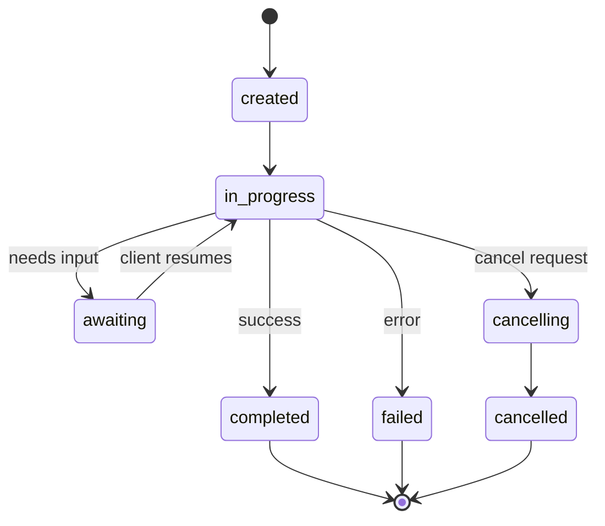

> 🎒 **На пальцах.** Три режима — три способа забрать заказ: sync — стоите у окошка и ждёте, async — берёте номерок и подходите снова (202 плюс опрос `GET /runs/{id}`), stream — вам рассказывают по ходу. Run один и тот же, разница только в том, кто ждёт: вы или сервер.

#### TrajectoryMetadata (The Audit Trail)

Вот это и есть главное отличие ACP. Каждая часть сообщения может нести метаданные о том, что именно агент сделал:

```json
{
  "role": "agent/researcher",
  "parts": [
    {
      "content_type": "text/plain",
      "content": "The weather in San Francisco is 72F and sunny.",
      "metadata": {
        "kind": "trajectory",
        "message": "I need to check the weather for this location",
        "tool_name": "weather_api",
        "tool_input": { "location": "San Francisco, CA" },
        "tool_output": { "temperature": 72, "condition": "sunny" }
      }
    }
  ]
}
```

Для регулируемых отраслей это золото. Каждый ответ приходит с доказуемой цепочкой рассуждений: какие инструменты вызывались, с какими входами, что вернули. Никакого чёрного ящика.

ACP поддерживает ещё и **CitationMetadata** для ссылок на источники:

```json
{
  "kind": "citation",
  "start_index": 0,
  "end_index": 47,
  "url": "https://weather.gov/sf",
  "title": "NWS San Francisco Forecast"
}
```

> 🎒 **На пальцах.** Trajectory — это чек из магазина, приложенный к каждому ответу. В примере выше видно всё: агент подумал «нужно проверить погоду», позвал `weather_api` с `{"location": "San Francisco, CA"}` и получил `{"temperature": 72, "condition": "sunny"}`. Без такого чека фраза «в Сан-Франциско 72F и солнечно» — просто слова, которые нельзя проверить.

### ANP (Agent Network Protocol)

**Created by:** сообщество открытой разработки (основатель — GaoWei Chang)
**Repo:** [github.com/agent-network-protocol/AgentNetworkProtocol](https://github.com/agent-network-protocol/AgentNetworkProtocol) — репозиторий сообщества
**Problem:** Как агенты из разных организаций доверяют друг другу без центрального органа?

ANP — это **протокол децентрализованной идентичности**. Он строит доверие на децентрализованных идентификаторах W3C (DID) и сквозном шифровании. В A2A вы находите агентов по заранее известным эндпоинтам, а ANP позволяет агенту доказать свою личность криптографически.

В ANP три слоя:

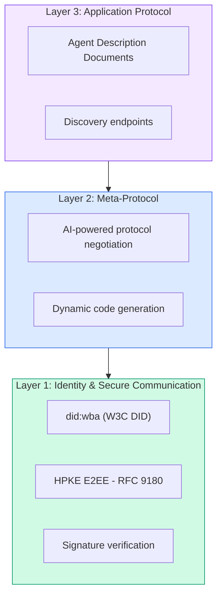

#### DID Documents (Real Structure)

ANP использует собственный метод DID под названием `did:wba` (Web-Based Agent). Идентификатор `did:wba:example.com:user:alice` разворачивается в `https://example.com/user/alice/did.json`:

```json
{
  "@context": [
    "https://www.w3.org/ns/did/v1",
    "https://w3id.org/security/suites/jws-2020/v1",
    "https://w3id.org/security/suites/secp256k1-2019/v1"
  ],
  "id": "did:wba:example.com:user:alice",
  "verificationMethod": [
    {
      "id": "did:wba:example.com:user:alice#key-1",
      "type": "EcdsaSecp256k1VerificationKey2019",
      "controller": "did:wba:example.com:user:alice",
      "publicKeyJwk": {
        "crv": "secp256k1",
        "x": "NtngWpJUr-rlNNbs0u-Aa8e16OwSJu6UiFf0Rdo1oJ4",
        "y": "qN1jKupJlFsPFc1UkWinqljv4YE0mq_Ickwnjgasvmo",
        "kty": "EC"
      }
    },
    {
      "id": "did:wba:example.com:user:alice#key-x25519-1",
      "type": "X25519KeyAgreementKey2019",
      "controller": "did:wba:example.com:user:alice",
      "publicKeyMultibase": "z9hFgmPVfmBZwRvFEyniQDBkz9LmV7gDEqytWyGZLmDXE"
    }
  ],
  "authentication": [
    "did:wba:example.com:user:alice#key-1"
  ],
  "keyAgreement": [
    "did:wba:example.com:user:alice#key-x25519-1"
  ],
  "humanAuthorization": [
    "did:wba:example.com:user:alice#key-1"
  ],
  "service": [
    {
      "id": "did:wba:example.com:user:alice#agent-description",
      "type": "AgentDescription",
      "serviceEndpoint": "https://example.com/agents/alice/ad.json"
    }
  ]
}
```

На что обратить внимание:
- **Разделение ключей** обязательно. Ключи подписи (secp256k1) отделены от ключей шифрования (X25519).
- **`humanAuthorization`** есть только в ANP. Такие ключи требуют явного подтверждения человеком (биометрия, пароль, HSM) перед использованием. Через этот путь проходят рискованные операции вроде переводов денег.
- Ключи **`keyAgreement`** используются для сквозного шифрования HPKE (RFC 9180).
- Секция **service** ссылается на документ Agent Description.

> 🎒 **На пальцах.** DID-документ — это паспорт агента, который лежит на его же сайте: `did:wba:example.com:user:alice` разворачивается в `https://example.com/user/alice/did.json`. Ключей в примере два, и это принципиально: secp256k1 — только подписывать, X25519 — только шифровать. Как отдельные ключи от почтового ящика и от квартиры: утёк один — второй ещё держит.

#### How Trust Works in ANP

ANP **не** использует сеть доверия и графы поручительств. Доверие двустороннее и проверяется на каждом взаимодействии:

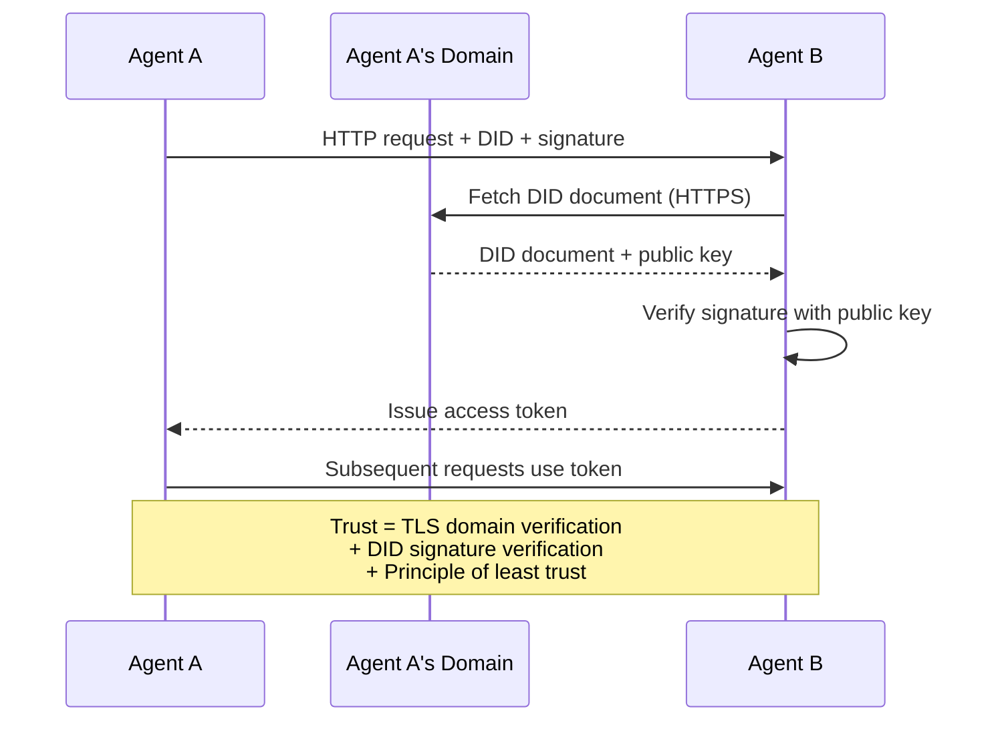

Доверие складывается из трёх источников:
1. **TLS на уровне домена** подтверждает, что DID-документ лежит именно на этом хосте
2. **Криптографические подписи DID** подтверждают личность агента
3. **Принцип минимального доверия** выдаёт только минимально нужные права

Никакого распространения доверия сплетнями и никакого PageRank по репутации. Каждого агента вы проверяете напрямую по его DID.

> 🎒 **На пальцах.** Доверие в ANP — как проверка курьера звонком в компанию, а не по бумажке в его руках. Шагов ровно три: TLS подтверждает, что домен настоящий, подпись подтверждает, что DID его, и дальше выдаётся токен с минимумом прав. Никакого «за него поручился Вася» — репутационной сети здесь просто нет.

#### Meta-Protocol Negotiation

Это самая необычная штука в ANP. Когда встречаются два агента из разных экосистем, им не нужно заранее согласованных форматов данных. Они договариваются на естественном языке:

```json
{
  "action": "protocolNegotiation",
  "sequenceId": 0,
  "candidateProtocols": "I can communicate using:\n1. JSON-RPC with hotel booking schema\n2. REST with OpenAPI 3.1 spec\n3. Natural language over HTTP",
  "modificationSummary": "Initial proposal",
  "status": "negotiating"
}
```

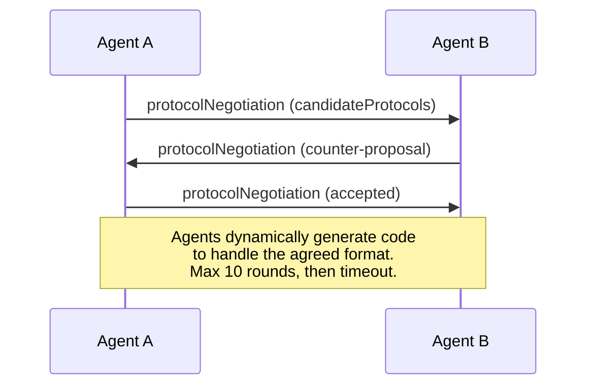

Агенты перекидываются предложениями (максимум 10 раундов), пока не сойдутся на формате, а затем на ходу генерируют код для работы с ним. Значения статуса: `negotiating`, `rejected`, `accepted`, `timeout`.

Значит, два агента, которые никогда друг друга не видели, могут сами разобраться, как общаться, — без того, чтобы кто-то заранее прописал им общую схему.

> 🎒 **На пальцах.** Два агента договариваются о формате словами — как двое в поезде перебирают языки: «английский? немецкий? может, на пальцах?». В примере выше кандидатов три, а лимит — 10 раундов; не сошлись — `timeout`. И дальше самое странное: под согласованный формат они генерируют код прямо на ходу.

### Comparison (Corrected)

| | MCP | A2A | ACP | ANP |
|---|---|---|---|---|
| **Created by** | Anthropic | Google / Linux Foundation | IBM / BeeAI | Сообщество |
| **Spec format** | JSON-RPC | JSON-RPC / REST / gRPC | OpenAPI 3.1 (REST) | JSON-RPC |
| **Primary use** | Агент — инструмент | Агент — агент | Агент — агент | Агент — агент |
| **Discovery** | Список инструментов | `/.well-known/agent-card.json` | `GET /agents`, `/.well-known/agent.yml` | `/.well-known/agent-descriptions`, service-эндпоинты DID |
| **Identity** | Неявная (локальная) | Схемы безопасности (OAuth, mTLS) | На уровне сервера | W3C DID (`did:wba`) со сквозным шифрованием |
| **Audit trail** | Нет | Базовый (история задачи) | TrajectoryMetadata (вызовы инструментов, рассуждения) | Формально не описан |
| **State machine** | Нет | 9 состояний задачи | 7 состояний run | Нет |
| **Streaming** | Нет | SSE | SSE | Не зависит от транспорта |
| **Unique feature** | Схемы инструментов | Agent Cards + Skills | Трасса аудита | Согласование мета-протокола |
| **Best for** | Инструменты и данные | Динамическое сотрудничество | Регулируемые отрасли | Доверие между организациями |
| **Status** | Стабилен | Стабилен (v1.0) | Сливается с A2A | Активно разрабатывается |

> 🎒 **На пальцах.** Таблица выше — шпаргалка на один взгляд. Посмотрите на строку Audit trail: у MCP её нет вообще, у A2A только история задачи, у ACP — полная трасса вызовов инструментов. Если завтра придёт аудитор, выбор сужается до одной колонки — как со страховкой: нужна не всегда, но когда нужна, вариантов нет.

### How They Work Together

Протоколы не исключают друг друга. Реалистичная корпоративная система использует сразу несколько:

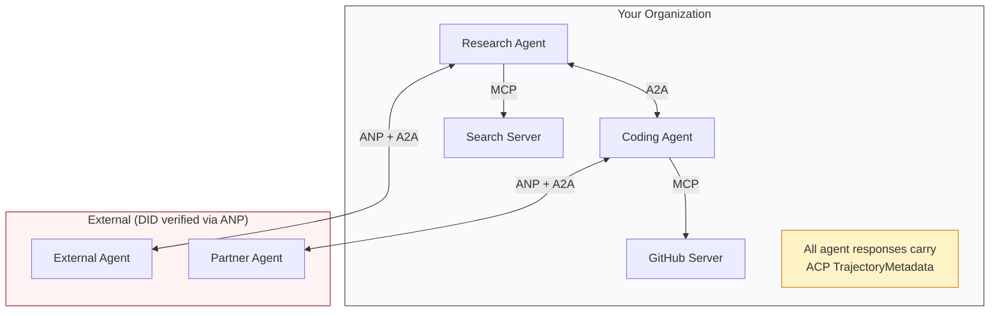

- **MCP** соединяет каждого агента с его инструментами
- **A2A** отвечает за сотрудничество между агентами (внутренними и внешними)
- **ACP** оборачивает ответы в метаданные траектории для проверяемости
- **ANP** даёт проверку личности для агентов, которыми вы не управляете

```figure
swarm-message-bus
```

## Build It

### Step 1: Core Message Types

Любая многоагентная система начинается с формата сообщения. Определим типы, которые повторяют то, чем пользуются настоящие протоколы:

```typescript
import crypto from "node:crypto";

type MessageRole = "user" | "agent";

type MessagePart =
  | { kind: "text"; text: string }
  | { kind: "data"; data: unknown; mediaType: string }
  | { kind: "file"; name: string; url: string; mediaType: string };

type TrajectoryEntry = {
  reasoning: string;
  toolName?: string;
  toolInput?: unknown;
  toolOutput?: unknown;
  timestamp: number;
};

type AgentMessage = {
  id: string;
  role: MessageRole;
  parts: MessagePart[];
  trajectory?: TrajectoryEntry[];
  replyTo?: string;
  timestamp: number;
};

function createMessage(
  role: MessageRole,
  parts: MessagePart[],
  replyTo?: string
): AgentMessage {
  return {
    id: crypto.randomUUID(),
    role,
    parts,
    replyTo,
    timestamp: Date.now(),
  };
}

function textMessage(role: MessageRole, text: string): AgentMessage {
  return createMessage(role, [{ kind: "text", text }]);
}
```

Заметьте: `MessagePart` мультимодальна (текст, структурированные данные, файлы) — ровно как в настоящих спецификациях A2A и ACP. `TrajectoryEntry` фиксирует цепочку рассуждений, повторяя TrajectoryMetadata из ACP.

### Step 2: A2A Agent Card and Registry

Собираем обнаружение агентов так, как это описано в реальной спецификации A2A:

```typescript
type Skill = {
  id: string;
  name: string;
  description: string;
  tags: string[];
  inputModes: string[];
  outputModes: string[];
};

type AgentCard = {
  name: string;
  description: string;
  version: string;
  url: string;
  capabilities: {
    streaming: boolean;
    pushNotifications: boolean;
  };
  defaultInputModes: string[];
  defaultOutputModes: string[];
  skills: Skill[];
};

class AgentRegistry {
  private cards: Map<string, AgentCard> = new Map();

  register(card: AgentCard) {
    this.cards.set(card.name, card);
  }

  discoverBySkillTag(tag: string): AgentCard[] {
    return [...this.cards.values()].filter((card) =>
      card.skills.some((skill) => skill.tags.includes(tag))
    );
  }

  discoverByInputMode(mimeType: string): AgentCard[] {
    return [...this.cards.values()].filter(
      (card) =>
        card.defaultInputModes.includes(mimeType) ||
        card.skills.some((skill) => skill.inputModes.includes(mimeType))
    );
  }

  resolve(name: string): AgentCard | undefined {
    return this.cards.get(name);
  }

  listAll(): AgentCard[] {
    return [...this.cards.values()];
  }
}
```

Это заметно богаче простого словаря «имя → возможности». Агентов можно искать по тегам skill'ов, по входным MIME-типам или по имени — именно так, как позволяет настоящая спецификация A2A.

> 🎒 **На пальцах.** Реестр — это не словарь «имя → агент», а поиск по трём разным ключам: по тегу skill'а, по входному MIME-типу и по имени. В `discoverByInputMode` проверка идёт в двух местах — `defaultInputModes` карточки и `inputModes` каждого skill'а, — потому что отдельный skill может принимать `application/pdf`, которого в дефолтах нет.

### Step 3: A2A Task Lifecycle

Реализуем полный конечный автомат задачи:

```typescript
type TaskState =
  | "submitted"
  | "working"
  | "input-required"
  | "auth-required"
  | "completed"
  | "failed"
  | "canceled"
  | "rejected";

const TERMINAL_STATES: TaskState[] = [
  "completed",
  "failed",
  "canceled",
  "rejected",
];

type TaskStatus = {
  state: TaskState;
  message?: AgentMessage;
  timestamp: number;
};

type Artifact = {
  id: string;
  name: string;
  parts: MessagePart[];
};

type Task = {
  id: string;
  contextId: string;
  status: TaskStatus;
  artifacts: Artifact[];
  history: AgentMessage[];
};

type TaskEvent =
  | { kind: "statusUpdate"; taskId: string; status: TaskStatus }
  | {
      kind: "artifactUpdate";
      taskId: string;
      artifact: Artifact;
      append: boolean;
      lastChunk: boolean;
    };

type TaskHandler = (
  task: Task,
  message: AgentMessage
) => AsyncGenerator<TaskEvent>;

class TaskManager {
  private tasks: Map<string, Task> = new Map();
  private handlers: Map<string, TaskHandler> = new Map();
  private listeners: Map<string, ((event: TaskEvent) => void)[]> = new Map();

  registerHandler(agentName: string, handler: TaskHandler) {
    this.handlers.set(agentName, handler);
  }

  subscribe(taskId: string, listener: (event: TaskEvent) => void) {
    const existing = this.listeners.get(taskId) ?? [];
    existing.push(listener);
    this.listeners.set(taskId, existing);
  }

  async sendMessage(
    agentName: string,
    message: AgentMessage,
    contextId?: string
  ): Promise<Task> {
    const handler = this.handlers.get(agentName);
    if (!handler) {
      const task = this.createTask(contextId);
      task.status = {
        state: "rejected",
        timestamp: Date.now(),
        message: textMessage("agent", `No handler for ${agentName}`),
      };
      return task;
    }

    const task = this.createTask(contextId);
    task.history.push(message);
    task.status = { state: "submitted", timestamp: Date.now() };

    this.processTask(task, handler, message).catch((err) => {
      task.status = {
        state: "failed",
        timestamp: Date.now(),
        message: textMessage("agent", String(err)),
      };
    });
    return task;
  }

  getTask(taskId: string): Task | undefined {
    return this.tasks.get(taskId);
  }

  cancelTask(taskId: string): boolean {
    const task = this.tasks.get(taskId);
    if (!task || TERMINAL_STATES.includes(task.status.state)) return false;
    task.status = { state: "canceled", timestamp: Date.now() };
    this.emit(taskId, {
      kind: "statusUpdate",
      taskId,
      status: task.status,
    });
    return true;
  }

  private createTask(contextId?: string): Task {
    const task: Task = {
      id: crypto.randomUUID(),
      contextId: contextId ?? crypto.randomUUID(),
      status: { state: "submitted", timestamp: Date.now() },
      artifacts: [],
      history: [],
    };
    this.tasks.set(task.id, task);
    return task;
  }

  private async processTask(
    task: Task,
    handler: TaskHandler,
    message: AgentMessage
  ) {
    task.status = { state: "working", timestamp: Date.now() };
    this.emit(task.id, {
      kind: "statusUpdate",
      taskId: task.id,
      status: task.status,
    });

    try {
      for await (const event of handler(task, message)) {
        if (TERMINAL_STATES.includes(task.status.state)) break;

        if (event.kind === "statusUpdate") {
          task.status = event.status;
        }
        if (event.kind === "artifactUpdate") {
          const existing = task.artifacts.find(
            (a) => a.id === event.artifact.id
          );
          if (existing && event.append) {
            existing.parts.push(...event.artifact.parts);
          } else {
            task.artifacts.push(event.artifact);
          }
        }
        this.emit(task.id, event);
      }
    } catch (err) {
      task.status = {
        state: "failed",
        timestamp: Date.now(),
        message: textMessage("agent", String(err)),
      };
      this.emit(task.id, {
        kind: "statusUpdate",
        taskId: task.id,
        status: task.status,
      });
    }
  }

  private emit(taskId: string, event: TaskEvent) {
    for (const listener of this.listeners.get(taskId) ?? []) {
      listener(event);
    }
  }
}
```

Это и есть настоящий жизненный цикл задачи в A2A: submitted, working, input-required, терминальные состояния. Обработчики — это асинхронные генераторы, которые выдают события (обновления статуса и куски артефактов), повторяя модель стриминга через SSE.

> 🎒 **На пальцах.** Ключевая строчка здесь — `break` при терминальном состоянии: как только задача «выдана», генератор может сыпать что угодно, его уже не слушают. Обработчик не возвращает результат целиком, а выдаёт события по очереди: сначала `statusUpdate` со `working`, потом куски артефактов, потом `completed`. Ровно то же, что летит по SSE в настоящем A2A.

### Step 4: ACP-Style Audit Trail

Оборачиваем общение в отслеживание траектории:

```typescript
type AuditEntry = {
  runId: string;
  agentName: string;
  input: AgentMessage[];
  output: AgentMessage[];
  trajectory: TrajectoryEntry[];
  status: "created" | "in-progress" | "completed" | "failed" | "awaiting";
  startedAt: number;
  completedAt?: number;
  sessionId?: string;
};

class AuditableRunner {
  private log: AuditEntry[] = [];
  private handlers: Map<
    string,
    (input: AgentMessage[]) => Promise<{
      output: AgentMessage[];
      trajectory: TrajectoryEntry[];
    }>
  > = new Map();

  registerAgent(
    name: string,
    handler: (input: AgentMessage[]) => Promise<{
      output: AgentMessage[];
      trajectory: TrajectoryEntry[];
    }>
  ) {
    this.handlers.set(name, handler);
  }

  async run(
    agentName: string,
    input: AgentMessage[],
    sessionId?: string
  ): Promise<AuditEntry> {
    const entry: AuditEntry = {
      runId: crypto.randomUUID(),
      agentName,
      input: structuredClone(input),
      output: [],
      trajectory: [],
      status: "created",
      startedAt: Date.now(),
      sessionId,
    };
    this.log.push(entry);

    const handler = this.handlers.get(agentName);
    if (!handler) {
      entry.status = "failed";
      return entry;
    }

    entry.status = "in-progress";
    try {
      const result = await handler(input);
      entry.output = structuredClone(result.output);
      entry.trajectory = structuredClone(result.trajectory);
      entry.status = "completed";
      entry.completedAt = Date.now();
    } catch (err) {
      entry.status = "failed";
      entry.trajectory.push({
        reasoning: `Error: ${String(err)}`,
        timestamp: Date.now(),
      });
      entry.completedAt = Date.now();
    }
    return entry;
  }

  getFullAuditLog(): AuditEntry[] {
    return structuredClone(this.log);
  }

  getAuditLogForAgent(agentName: string): AuditEntry[] {
    return structuredClone(
      this.log.filter((e) => e.agentName === agentName)
    );
  }

  getAuditLogForSession(sessionId: string): AuditEntry[] {
    return structuredClone(
      this.log.filter((e) => e.sessionId === sessionId)
    );
  }

  getTrajectoryForRun(runId: string): TrajectoryEntry[] {
    const entry = this.log.find((e) => e.runId === runId);
    return entry ? structuredClone(entry.trajectory) : [];
  }
}
```

Каждый запуск агента даёт полную запись аудита: что пришло на вход, что вышло на выходе и вся траектория вызовов инструментов и шагов рассуждения между ними. Запрашивать можно по агенту, по сессии или по отдельному запуску.

### Step 5: ANP-Style Identity Verification

Собираем идентичность и проверку на основе DID:

```typescript
type VerificationMethod = {
  id: string;
  type: string;
  controller: string;
  publicKeyDer: string;
};

type DIDDocument = {
  id: string;
  verificationMethod: VerificationMethod[];
  authentication: string[];
  keyAgreement: string[];
  humanAuthorization: string[];
  service: { id: string; type: string; serviceEndpoint: string }[];
};

type AgentIdentity = {
  did: string;
  document: DIDDocument;
  privateKey: crypto.KeyObject;
  publicKey: crypto.KeyObject;
};

class IdentityRegistry {
  private documents: Map<string, DIDDocument> = new Map();

  publish(doc: DIDDocument) {
    this.documents.set(doc.id, doc);
  }

  resolve(did: string): DIDDocument | undefined {
    return this.documents.get(did);
  }

  verify(did: string, signature: string, payload: string): boolean {
    const doc = this.documents.get(did);
    if (!doc) return false;

    const authKeyIds = doc.authentication;
    const authKeys = doc.verificationMethod.filter((vm) =>
      authKeyIds.includes(vm.id)
    );

    for (const key of authKeys) {
      const publicKey = crypto.createPublicKey({
        key: Buffer.from(key.publicKeyDer, "base64"),
        format: "der",
        type: "spki",
      });
      const isValid = crypto.verify(
        null,
        Buffer.from(payload),
        publicKey,
        Buffer.from(signature, "hex")
      );
      if (isValid) return true;
    }
    return false;
  }

  requiresHumanAuth(did: string, operationKeyId: string): boolean {
    const doc = this.documents.get(did);
    if (!doc) return false;
    return doc.humanAuthorization.includes(operationKeyId);
  }
}

function createIdentity(domain: string, agentName: string): AgentIdentity {
  const did = `did:wba:${domain}:agent:${agentName}`;
  const { publicKey, privateKey } = crypto.generateKeyPairSync("ed25519");

  const publicKeyDer = publicKey
    .export({ format: "der", type: "spki" })
    .toString("base64");

  const keyId = `${did}#key-1`;
  const encKeyId = `${did}#key-x25519-1`;

  const document: DIDDocument = {
    id: did,
    verificationMethod: [
      {
        id: keyId,
        type: "Ed25519VerificationKey2020",
        controller: did,
        publicKeyDer,
      },
      {
        id: encKeyId,
        type: "X25519KeyAgreementKey2019",
        controller: did,
        publicKeyDer,
      },
    ],
    authentication: [keyId],
    keyAgreement: [encKeyId],
    humanAuthorization: [],
    service: [
      {
        id: `${did}#agent-description`,
        type: "AgentDescription",
        serviceEndpoint: `https://${domain}/agents/${agentName}/ad.json`,
      },
    ],
  };

  return { did, document, privateKey, publicKey };
}

function signPayload(identity: AgentIdentity, payload: string): string {
  return crypto
    .sign(null, Buffer.from(payload), identity.privateKey)
    .toString("hex");
}
```

Это повторяет настоящую модель идентичности ANP: у агентов есть DID-документы с раздельными ключами для аутентификации, согласования ключей и подтверждения человеком. `IdentityRegistry` имитирует разрешение DID (в продакшене это были бы HTTP-запросы к домену агента).

### Step 6: Protocol Gateway

Соединяем все четыре протокола в одну систему:

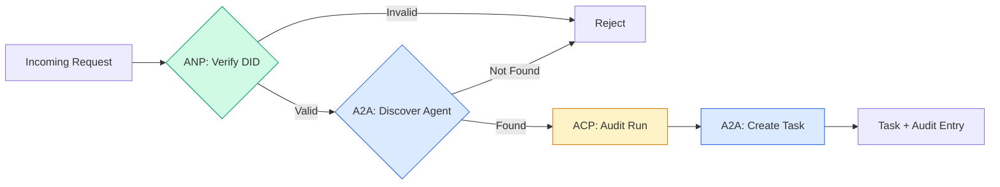

```typescript
class ProtocolGateway {
  private registry: AgentRegistry;
  private taskManager: TaskManager;
  private auditRunner: AuditableRunner;
  private identityRegistry: IdentityRegistry;

  constructor(
    registry: AgentRegistry,
    taskManager: TaskManager,
    auditRunner: AuditableRunner,
    identityRegistry: IdentityRegistry
  ) {
    this.registry = registry;
    this.taskManager = taskManager;
    this.auditRunner = auditRunner;
    this.identityRegistry = identityRegistry;
  }

  async delegateTask(
    fromDid: string,
    signature: string,
    targetAgent: string,
    message: AgentMessage,
    sessionId?: string
  ): Promise<{ task: Task; audit: AuditEntry } | { error: string }> {
    if (!this.identityRegistry.verify(fromDid, signature, message.id)) {
      return { error: "Identity verification failed" };
    }

    const card = this.registry.resolve(targetAgent);
    if (!card) {
      return { error: `Agent ${targetAgent} not found in registry` };
    }

    const audit = await this.auditRunner.run(
      targetAgent,
      [message],
      sessionId
    );
    const task = await this.taskManager.sendMessage(targetAgent, message);

    return { task, audit };
  }

  discoverAndDelegate(
    fromDid: string,
    signature: string,
    skillTag: string,
    message: AgentMessage
  ): Promise<{ task: Task; audit: AuditEntry } | { error: string }> {
    const candidates = this.registry.discoverBySkillTag(skillTag);
    if (candidates.length === 0) {
      return Promise.resolve({
        error: `No agents found with skill tag: ${skillTag}`,
      });
    }
    return this.delegateTask(
      fromDid,
      signature,
      candidates[0].name,
      message
    );
  }
}
```

Шлюз делает четыре вещи за один вызов:
1. **ANP**: проверяет личность вызывающего по подписи DID
2. **A2A**: находит целевого агента и сверяет его возможности
3. **ACP**: оборачивает выполнение в запись аудита с траекторией
4. **A2A**: создаёт задачу с полным отслеживанием жизненного цикла

### Step 7: Wire It All Together

```typescript
async function protocolDemo() {
  const registry = new AgentRegistry();
  registry.register({
    name: "researcher",
    description: "Searches and summarizes findings",
    version: "1.0.0",
    url: "https://researcher.local/a2a/v1",
    capabilities: { streaming: true, pushNotifications: false },
    defaultInputModes: ["text/plain"],
    defaultOutputModes: ["text/plain", "application/json"],
    skills: [
      {
        id: "web-research",
        name: "Web Research",
        description: "Searches the web",
        tags: ["research", "search", "summarization"],
        inputModes: ["text/plain"],
        outputModes: ["application/json"],
      },
    ],
  });
  registry.register({
    name: "coder",
    description: "Writes code from specs",
    version: "1.0.0",
    url: "https://coder.local/a2a/v1",
    capabilities: { streaming: false, pushNotifications: false },
    defaultInputModes: ["text/plain", "application/json"],
    defaultOutputModes: ["text/plain"],
    skills: [
      {
        id: "code-gen",
        name: "Code Generation",
        description: "Generates code",
        tags: ["coding", "generation"],
        inputModes: ["text/plain", "application/json"],
        outputModes: ["text/plain"],
      },
    ],
  });

  const taskManager = new TaskManager();
  const auditRunner = new AuditableRunner();

  const researchTrajectory: TrajectoryEntry[] = [];

  taskManager.registerHandler(
    "researcher",
    async function* (task, message) {
      yield {
        kind: "statusUpdate" as const,
        taskId: task.id,
        status: { state: "working" as const, timestamp: Date.now() },
      };

      researchTrajectory.push({
        reasoning: "Searching for React 19 documentation",
        toolName: "web_search",
        toolInput: { query: "React 19 compiler features" },
        toolOutput: {
          results: ["react.dev/blog/react-19", "github.com/react/react"],
        },
        timestamp: Date.now(),
      });

      researchTrajectory.push({
        reasoning: "Extracting key findings from search results",
        toolName: "doc_analysis",
        toolInput: { url: "react.dev/blog/react-19" },
        toolOutput: {
          summary:
            "React 19 compiler auto-memoizes, no manual useMemo needed",
        },
        timestamp: Date.now(),
      });

      yield {
        kind: "artifactUpdate" as const,
        taskId: task.id,
        artifact: {
          id: crypto.randomUUID(),
          name: "research-results",
          parts: [
            {
              kind: "data" as const,
              data: {
                findings: [
                  "React 19 compiler auto-memoizes components",
                  "No more manual useMemo/useCallback needed",
                  "Compiler runs at build time, not runtime",
                ],
                sources: ["react.dev/blog/react-19"],
              },
              mediaType: "application/json",
            },
          ],
        },
        append: false,
        lastChunk: true,
      };

      yield {
        kind: "statusUpdate" as const,
        taskId: task.id,
        status: { state: "completed" as const, timestamp: Date.now() },
      };
    }
  );

  auditRunner.registerAgent("researcher", async () => ({
    output: [
      textMessage("agent", "React 19 compiler auto-memoizes components"),
    ],
    trajectory: researchTrajectory,
  }));

  const identityRegistry = new IdentityRegistry();

  const coderIdentity = createIdentity("coder.local", "coder");
  const researcherIdentity = createIdentity("researcher.local", "researcher");

  identityRegistry.publish(coderIdentity.document);
  identityRegistry.publish(researcherIdentity.document);

  const gateway = new ProtocolGateway(
    registry,
    taskManager,
    auditRunner,
    identityRegistry
  );

  console.log("=== Protocol Demo ===\n");

  console.log("1. Agent Discovery (A2A)");
  const researchAgents = registry.discoverBySkillTag("research");
  console.log(
    `   Found ${researchAgents.length} agent(s):`,
    researchAgents.map((a) => a.name)
  );

  console.log("\n2. Identity Verification (ANP)");
  const message = textMessage("user", "Research React 19 compiler features");
  const signature = signPayload(coderIdentity, message.id);
  const verified = identityRegistry.verify(
    coderIdentity.did,
    signature,
    message.id
  );
  console.log(`   Coder DID: ${coderIdentity.did}`);
  console.log(`   Signature verified: ${verified}`);

  console.log("\n3. Task Delegation (A2A + ACP + ANP)");
  const result = await gateway.delegateTask(
    coderIdentity.did,
    signature,
    "researcher",
    message,
    "session-001"
  );

  if ("error" in result) {
    console.log(`   Error: ${result.error}`);
    return;
  }

  console.log(`   Task ID: ${result.task.id}`);
  console.log(`   Task state: ${result.task.status.state}`);
  console.log(`   Artifacts: ${result.task.artifacts.length}`);

  console.log("\n4. Audit Trail (ACP)");
  console.log(`   Run ID: ${result.audit.runId}`);
  console.log(`   Status: ${result.audit.status}`);
  console.log(`   Trajectory steps: ${result.audit.trajectory.length}`);
  for (const step of result.audit.trajectory) {
    console.log(`     - ${step.reasoning}`);
    if (step.toolName) {
      console.log(`       Tool: ${step.toolName}`);
    }
  }

  console.log("\n5. Full Audit Log");
  const fullLog = auditRunner.getFullAuditLog();
  console.log(`   Total runs: ${fullLog.length}`);
  for (const entry of fullLog) {
    const duration = entry.completedAt
      ? `${entry.completedAt - entry.startedAt}ms`
      : "in-progress";
    console.log(`   ${entry.agentName}: ${entry.status} (${duration})`);
  }
}

protocolDemo().catch((err) => {
  console.error("Protocol demo failed:", err);
  process.exitCode = 1;
});
```

## What Goes Wrong

Протоколы описывают счастливый путь. А вот что ломается в продакшене:

**Schema drift.** Агент A публикует Agent Card и обещает выход в `application/json`. Но JSON-схема меняется от версии к версии. Агент B парсит старый формат и получает мусор. Лечение: версионируйте skill'ы и выходные схемы. Именно для этого в спецификации A2A у Agent Card есть `version`.

**State machine violations.** Обработчик агента выдал событие `completed`, а потом пытается выдать ещё артефакты. Задача неизменна. Ваш код либо молча теряет обновления, либо падает. Лечение: проверяйте терминальное состояние перед выдачей события. `TaskManager` выше делает это через `break` после терминальных состояний.

**Trust resolution failures.** Агент A хочет проверить DID агента B, но домен агента B лежит. DID-документ не забрать. Что делать: пропускать (принять непроверенного агента) или запирать (отклонить всё)? ANP советует запирать — по принципу минимального доверия.

**Trajectory bloat.** Логирование траектории в ACP — мощно, но дорого. Сложный агент, который делает 200 вызовов инструментов за один запуск, порождает огромные записи аудита. Лечение: настраиваемые уровни подробности. Пишите имена инструментов и их вход-выход для комплаенса, а шаги рассуждения пропускайте там, где регуляторных требований нет.

**Discovery thundering herd.** 50 агентов на старте одновременно дёргают `GET /agents`. Лечение: кэшируйте Agent Card с TTL, разносите интервалы обнаружения по времени или переходите с опроса на регистрацию по инициативе агента.

> 🎒 **На пальцах.** Trajectory bloat считается легко: 200 вызовов инструментов на один запуск, у каждого вход и выход в JSON — и одна запись аудита раздувается до мегабайтов. Как видеорегистратор: писать всё круглосуточно можно, но диск кончится. Отсюда и уровни подробности: имена инструментов и их IO — для регулятора, рассуждения — только когда они правда нужны.

## Use It

### Real Implementations

**A2A** — самый зрелый. [Официальная спецификация](https://github.com/google/A2A) от Google открыта и живёт под Linux Foundation. Есть SDK для Python и TypeScript. Если вашим агентам нужны динамическое обнаружение и сотрудничество, начинайте отсюда.

**ACP** сливается с A2A. IBM в [проекте BeeAI](https://github.com/i-am-bee/acp) сделала ACP как REST-first альтернативу, но идея метаданных траектории уходит в экосистему A2A. Используйте приёмы ACP (логирование траектории, жизненный цикл run), даже если транспортом у вас будет A2A.

**ANP** — самый экспериментальный. В [репозитории сообщества](https://github.com/agent-network-protocol/AgentNetworkProtocol) есть Python SDK (AgentConnect). Идея согласования мета-протокола по-настоящему нова. Стоит следить, если планируете разворачивать агентов между организациями.

**MCP** уже разобран в Phase 13. Если нужно, чтобы агенты пользовались инструментами, MCP — стандарт.

### Picking the Right Protocol

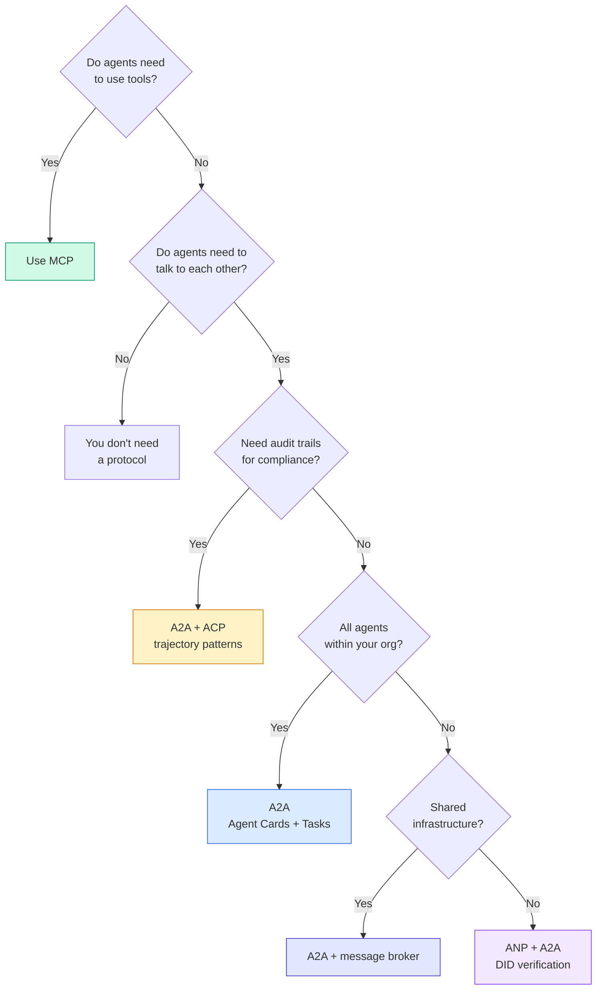

## Ship It

Этот урок даёт на выходе:
- `code/main.ts` -- полная реализация всех четырёх протокольных паттернов
- `outputs/prompt-protocol-selector.md` -- промпт, который помогает выбрать протоколы для вашей системы

## Exercises

1. **Multi-hop task delegation.** Расширьте `TaskManager` так, чтобы обработчик агента мог делегировать подзадачи другим агентам. Исследователь получает задачу, отдаёт подзадачи «поиск» и «саммари» двум специализированным агентам, ждёт завершения обеих и сливает результаты в свои артефакты.

2. **Streaming audit trail.** Доработайте `AuditableRunner` до режима стриминга. Вместо ожидания полного результата он должен выдавать обновления `AuditEntry` в реальном времени по мере появления записей траектории. Используйте асинхронный генератор, выдающий срезы аудита.

3. **DID rotation.** Добавьте ротацию ключей в `IdentityRegistry`. Агент должен уметь публиковать новый DID-документ с обновлёнными ключами, сохраняя ссылку `previousDid`. Проверяющие в течение переходного периода принимают подписи и текущим, и предыдущим ключом.

4. **Protocol negotiation.** Реализуйте идею мета-протокола из ANP. Два агента обмениваются сообщениями `protocolNegotiation` с вариантами форматов (например, «умею JSON-RPC» против «предпочитаю REST»). После максимум 3 раундов они либо договариваются о формате, либо получают timeout. Согласованный формат определяет, какой `TaskManager` или `AuditableRunner` они используют.

5. **Rate-limited discovery.** Добавьте обёртку `RateLimitedRegistry`, которая кэширует запросы Agent Card с настраиваемым TTL и ограничивает число запросов обнаружения на агента в секунду. Смоделируйте набег 100 агентов, которые ищут друг друга на старте, и измерьте разницу.

## Key Terms

| Term | What people say | What it actually means |
|------|----------------|----------------------|
| MCP | «Протокол для инструментов ИИ» | Протокол «клиент — сервер», через который агент находит и вызывает инструменты. Связка «агент — инструмент», а не «агент — агент». |
| A2A | «Агентный протокол от Google» | Протокол равноправного сотрудничества агентов под Linux Foundation. Обнаружение через Agent Card, жизненный цикл задачи из 9 состояний, стриминг по SSE. Поддерживает привязки JSON-RPC, REST и gRPC. |
| ACP | «Корпоративный обмен сообщениями между агентами» | REST API от IBM/BeeAI для запусков агентов с TrajectoryMetadata: каждый ответ несёт полную цепочку рассуждений и вызовов инструментов. Сливается с A2A. |
| ANP | «Децентрализованная идентичность агентов» | Протокол сообщества: `did:wba` (DID) для криптографической личности, HPKE для сквозного шифрования и согласование мета-протокола силами ИИ для агентов, которые друг друга никогда не видели. |
| Agent Card | «Визитка агента» | JSON-документ по адресу `/.well-known/agent-card.json`, описывающий skill'ы, поддерживаемые MIME-типы, схемы безопасности и протокольные привязки. |
| DID | «Децентрализованный ID» | Стандарт W3C для криптографически проверяемых личностей, которые хостятся на собственном домене агента. ANP использует метод `did:wba`. |
| TrajectoryMetadata | «Чек с аудитом» | Механизм ACP, который прикрепляет к каждому ответу агента шаги рассуждения, вызовы инструментов и их входы-выходы. |
| Meta-protocol | «Агенты договариваются, как им говорить» | Подход ANP: агенты на естественном языке динамически согласуют форматы данных, а затем генерируют код для работы с ними. |
| Task | «Единица работы» | Объект с состоянием в A2A, отслеживающий работу от отправки до завершения. После терминального состояния неизменен. |

## Further Reading

- [Google A2A specification](https://github.com/google/A2A) -- официальная спецификация и SDK (v1.0.0, Linux Foundation)
- [IBM/BeeAI ACP specification](https://github.com/i-am-bee/acp) -- спецификация OpenAPI 3.1 для запусков агентов и метаданных траектории
- [Agent Network Protocol](https://github.com/agent-network-protocol/AgentNetworkProtocol) -- идентичность на DID, сквозное шифрование, согласование мета-протокола
- [Model Context Protocol docs](https://modelcontextprotocol.io/) -- спецификация MCP от Anthropic (разобрана в Phase 13)
- [W3C Decentralized Identifiers](https://www.w3.org/TR/did-core/) -- стандарт идентичности, на котором стоит ANP
- [RFC 9180 (HPKE)](https://www.rfc-editor.org/rfc/rfc9180) -- схема шифрования, которую ANP использует для сквозного шифрования
- [FIPA Agent Communication Language](http://www.fipa.org/specs/fipa00061/SC00061G.html) -- академический предшественник современных агентных протоколов
