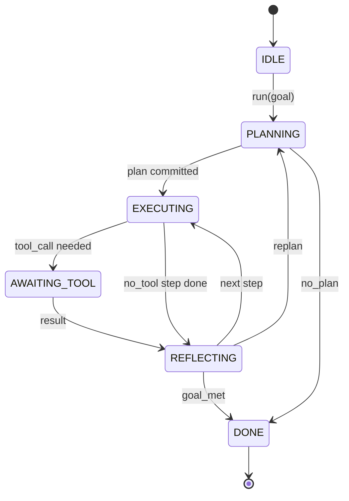

<!-- i18n:manual -->
# Контракт цикла обвязки агента

> Обвязка и есть агент. Модель — сопроцессор. Этот урок фиксирует контракт цикла, в который вы сможете воткнуть любую модель.

**Type:** Build
**Languages:** Python
**Prerequisites:** Phase 13 lessons 01-07, Phase 14 lesson 01
**Time:** ~90 minutes

## Learning Objectives
- Описать цикл обвязки агента как детерминированный конечный автомат с явными переходами.
- Реализовать десять тем жизненного цикла, в которые оператор вешает политику, телеметрию и ограждения.
- Определить две точки вытягивания, где цикл возвращает управление вызывающему и продолжается со свежего входа.
- Удерживать бюджеты сессии (ходы, вызовы инструментов, время по часам) так, чтобы при превышении не утекало частичное состояние.
- Отдавать типизированный поток из одиннадцати видов событий, чтобы UI и трассировщики подписывались на него, не заглядывая внутрь цикла.

> 🎒 **На пальцах.** Пересчитайте числа из целей: 6 состояний, 10 хуков, 2 точки вытягивания, 11 видов событий, 3 лимита бюджета. Весь урок про то, чтобы эти пять чисел были зафиксированы на бумаге, — потому что как только они плавают, каждая замена модели превращается в переписывание половины обвязки.

```figure
cf-loop-contract
```

## The frame

Кодовый агент, который сорок ходов работает без присмотра, — это не чат-цикл. Это конечный автомат, узлы которого оператор может перехватывать, а переходы — проверять. Как только контракт записан, замена модели, инструмента или политики перестаёт быть рефакторингом. Она становится вызовом регистрации.

> 🎒 **На пальцах.** Разница между «рефакторингом» и «вызовом регистрации» — это разница между «переклеить обои во всей квартире» и «повесить другую картину на готовый гвоздь». Сорок ходов без присмотра — это ровно тот масштаб, на котором вы уже физически не можете смотреть каждый шаг глазами.

Этот урок и строит такой контракт. Мы даём имена шести состояниям, десяти темам хуков, двум точкам вытягивания, одиннадцати видам событий и оболочке бюджета. Всё остальное в обвязке (реестр инструментов, транспорт JSON-RPC, диспетчер, планировщик) втыкается в эту форму.

> 🎒 **На пальцах.** Заметьте порядок работы: сначала имена, потом код. Четыре следующих урока — реестр, транспорт, диспетчер, планировщик — не добавят в этот список ни одного нового состояния, они только заполнят уже названные места.

## The states

Цикл имеет шесть состояний. Пять активных. Одно терминальное.



`IDLE` — единственная законная точка входа. `DONE` — единственный законный выход. `AWAITING_TOOL` — единственное состояние, которое даёт точку вытягивания. Все остальные переходы внутренние.

> 🎒 **На пальцах.** Посчитайте по диаграмме: из `REFLECTING` выходит три стрелки — дальше, перепланировать, готово. Это и есть весь «интеллект» цикла: после каждого шага автомат отвечает на один вопрос из трёх, и никакого четвёртого варианта у него нет.

Конечный автомат детерминирован. При одном и том же журнале событий обвязка приходит в то же самое состояние. Именно это свойство позволяет переигрывать сессии для отладки, не вызывая модель заново.

> 🎒 **На пальцах.** Детерминизм здесь стоит денег в буквальном смысле: отладка сорокаходовой сессии без повторных вызовов модели бесплатна, а с ними — это сорок вызовов на каждый прогон. Как разбор шахматной партии по записи ходов, а не переигрывание её вживую с соперником.

## The hook topics

Хуки — это шов оператора внутрь цикла. Обвязка выстреливает десять тем. Каждая тема принимает сколько угодно подписчиков. Подписчики срабатывают в порядке регистрации. Подписчик может изменить полезную нагрузку, бросить исключение и оборвать ход или вернуть маркер, чтобы пропустить следующий шаг.

```text
before_plan         after_plan
before_tool_call    after_tool_call
before_step         after_step
on_error
on_pause
on_budget_exceeded
on_complete
```

> 🎒 **На пальцах.** Обратите внимание на симметрию списка: шесть тем идут парами `before_`/`after_`, а четыре одиночные срабатывают на нештатных поворотах — ошибка, пауза, бюджет, завершение. Если вам нужен новый хук, скорее всего вы просто не заметили подходящую пару.

Форма повторяет то, к чему к середине 2025 года пришли Claude Code, Cursor и OpenCode. Имена функциональные, а не брендовые. Хук, который блокирует `rm -rf`, живёт в `before_tool_call`. Хук, который отправляет спан OpenTelemetry, живёт в `after_step`. Хук, который возобновляет приостановленную сессию, живёт в `on_pause`.

> 🎒 **На пальцах.** Три примера сразу показывают, зачем именно нужны хуки: запрет опасного, телеметрия и возобновление. Заметьте, что запрет стоит в `before_tool_call`, а не в `after_` — после выполнения `rm -rf` блокировать уже нечего.

## The pull points

Цикл возвращает управление дважды. Первый раз — на `AWAITING_TOOL`, когда без результата инструмента он не может двигаться дальше. Второй раз — на `on_pause`, когда бюджет исчерпан или хук явно запросил ревью человеком.

Точка вытягивания — это не исключение. Это возврат. Вызывающий смотрит на состояние обвязки, добывает то, что она попросила, и зовёт `resume(payload)`. Обвязка продолжает с того места, где остановилась. Форма ровно та же, что у генератора в Python. Транспорт над точкой вытягивания вы выбираете сами. В TUI это нажатие клавиши. Поверх MCP — это `tools/call`. Поверх очереди — это опрос задания.

> 🎒 **На пальцах.** Различие «возврат, а не исключение» — не буквоедство: исключение раскручивает стек и теряет место, где вы стояли, а возврат его сохраняет. Одна и та же обвязка поэтому работает и в терминале, где ответ приходит через полсекунды, и в очереди, где он приходит через час.

## The event stream

Цикл дописывает события в типизированный поток в определённых контрактом местах. Поток только дополняется, и подписчики могут переигрывать его с любого смещения. Одиннадцать реализованных видов событий такие:

- `session.start` — выдаётся один раз при вызове `run(goal)`
- `plan.draft` — выдаётся, когда планировщик вернул черновик плана
- `plan.commit` — выдаётся после того, как черновик зафиксирован как активный план
- `step.start` — выдаётся в начале каждого исполняемого шага
- `step.end` — выдаётся в конце каждого исполняемого шага
- `tool.call` — выдаётся, когда шаг, требующий инструмента, возвращает управление вызывающему
- `tool.result` — выдаётся при возобновлении с результатом инструмента
- `tool.error` — выдаётся при возобновлении с ошибкой или когда хук оборвал вызов
- `budget.warn` — выдаётся при достижении лимита бюджета
- `session.pause` — выдаётся, когда цикл встаёт на паузу (бюджет или хук)
- `session.complete` — выдаётся один раз, когда цикл дошёл до `DONE`

> 🎒 **На пальцах.** Пересчитайте по группам: два события про сессию, два про план, два про шаг, три про инструменты, одно про бюджет, одно про паузу. Такой поток — это лента новостей вашего агента, и по ней можно построить весь интерфейс, ни разу не заглянув внутрь цикла.

События не дублируют полезные нагрузки хуков. Хуки императивны (изменить, оборвать). События наблюдательны (записать, отправить). Считайте их ортогональными.

> 🎒 **На пальцах.** Простой признак, куда класть новый код: если он что-то меняет или запрещает — это хук; если только пишет, шлёт или рисует — это подписка на событие. Смешаете их — и получите наблюдателя, который тихо правит план, а такую ошибку в трассе не видно.

## The budget envelope

Сессия несёт три лимита. Число ходов, число вызовов инструментов, секунды по часам. Каждый ход увеличивает счётчик ходов на единицу. Каждый вызов инструмента увеличивает счётчик вызовов на единицу. Время по часам проверяется на каждом переходе состояния. Когда достигнут любой из лимитов, цикл выстреливает `on_budget_exceeded`, отдаёт `budget.warn` и на следующей точке вытягивания переходит в `IDLE` с причиной «бюджет исчерпан».

> 🎒 **На пальцах.** Три счётчика ловят три разные болезни: ходы — зацикливание рассуждения, вызовы инструментов — бесконечный перебор файлов, часы — зависший внешний вызов. Заметьте, что время сверяется на каждом переходе, а не раз в конце, иначе агент, застрявший внутри одного шага, никогда бы не сработал по таймеру.

Бюджет — это не рубильник. Это уступка управления. Вызывающий решает, расширить бюджет и продолжить или закрыть сессию.

> 🎒 **На пальцах.** Разница видна на примере: рубильник убил бы сессию вместе со всей проделанной работой, а уступка оставляет состояние живым, и вы можете добавить десять ходов и продолжить. Это как закончившиеся деньги на счёте телефона: связь приостановлена, номер не удалён.

## What this lesson does not do

Этот урок не вызывает модель. Он не регистрирует настоящие инструменты. Он не реализует транспорт. Это следующие четыре урока. Этот урок прибивает контракт, чтобы следующие четыре втыкались в него без переписывания.

Детерминированный планировщик в `main.py` — заглушка. Он возвращает захардкоженный план из трёх шагов, два из которых требуют результата инструмента. Смысл в цикле, а не в плане.

> 🎒 **На пальцах.** Три шага, два с инструментом — это ровно минимум, на котором виден весь контракт: есть шаг без инструмента, есть точка вытягивания и есть возобновление. Заглушка-планировщик тут полезнее настоящего: он всегда возвращает одно и то же, поэтому любое расхождение в тестах — это точно баг цикла.

## How to read the code

`HarnessLoop` — главный класс. Он держит состояние, выстреливает хуки, отдаёт события. `Budget` следит за лимитами. `Event` — типизированный конверт в потоке. `HookRegistry` — таблица диспетчеризации. `_transition` — единственная функция, которая меняет состояние, поэтому инварианты автомата живут в одном месте.

Читайте `main.py` сверху вниз. Потом читайте `code/tests/test_loop.py`. Тесты прибивают каждый переход и каждый порядок срабатывания хуков.

> 🎒 **На пальцах.** Правило «состояние меняет ровно одна функция» стоит запомнить как приём: чтобы проверить любой инвариант автомата, вам нужно прочитать один `_transition`, а не искать присваивания по всему файлу. Начните чтение с тестов, если запутались, — они описывают контракт короче, чем проза.

## Going further

Самое трудное в продакшен-обвязке — не конечный автомат. Трудно сделать контракт принудительным. Контракт обязан пережить горячую перезагрузку планировщика. Он обязан пережить инструмент, который вернул кривой JSON. Он обязан пережить хук, который упал в `before_tool_call` на двух третях сорокаходовой сессии. Тесты в этом уроке прогоняют такие режимы отказа. Запустите их. Сломайте их. Добавьте свои случаи.

> 🎒 **На пальцах.** Пример с падением хука на двух третях сессии — самый показательный: примерно двадцать семь ходов работы уже сделано, и вопрос не «упадём ли мы», а «останется ли состояние пригодным для возобновления». Три перечисленных отказа стоит выписать как три теста ещё до того, как вы напишете первую строчку своей обвязки.

Следующий урок добавляет реестр инструментов. После него — транспорт JSON-RPC. После него — диспетчер. К двадцать четвёртому уроку цикл из этого файла будет крутить настоящий план на настоящих инструментах с настоящими бюджетами.
