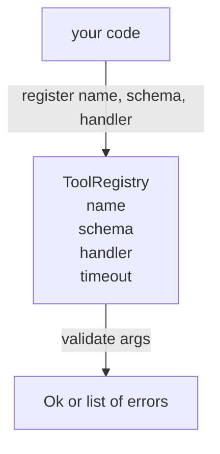

<!-- i18n:manual -->
# Реестр инструментов с валидацией схем

> Инструмент, который агент не может провалидировать, — это инструмент, который агент не может вызвать. Сначала стройте реестр и проверку схем, и только потом сами инструменты.

**Type:** Build
**Languages:** Python
**Prerequisites:** Phase 13 lessons 01-07, Phase 14 lesson 01
**Time:** ~90 minutes

## Learning Objectives
- Держать типизированный реестр «имя инструмента → схема → обработчик», у которого диспетчер спрашивает один раз и дальше доверяет ответу.
- Реализовать подмножество JSON Schema 2020-12, покрывающее те ключевые слова, которыми пользуются девяносто процентов вызовов инструментов.
- Возвращать точные пути ошибок в форме json-pointer, чтобы модель исправилась за один заход.
- Отклонять повторную регистрацию без явного override, потому что тихая перезапись — это ровно тот механизм, которым продакшен-каталоги инструментов расползаются.
- Держать валидатор чистым (никакого I/O, времени и глобальных переменных), чтобы его можно было прогнать заново на записанном логе.

```figure
cf-registry-validate
```

> 🎒 **На пальцах.** Реестр — это картотека в мастерской: у каждого инструмента карточка с именем, формой ручки и адресом, куда за ним идти. Пять целей урока — это пять граф в этой карточке плюс правило, что карточку нельзя молча подменить. Всё остальное в харнессе потом просто спрашивает картотеку.

## Why the registry comes before the tool

Кодовый агент в 2026 году держит зарегистрированных инструментов больше, чем модель способна уместить в одно окно контекста. Нетривиальный харнесс регистрирует двести инструментов и показывает от десяти до сорока на конкретном шаге. Реестр — источник правды по трём вопросам: «какие инструменты вообще существуют», «какой формы у них аргументы» и «какой обработчик звать». Как только эти три ответа зафиксированы, весь остальной харнесс перестаёт гадать.

> 🎒 **На пальцах.** Посчитайте: двести зарегистрированных инструментов, а модели за раз показывают от десяти до сорока — значит в контекст не попадает от 80 до 95 процентов каталога. Кто-то должен помнить про остальные и уметь их достать по имени. Этот кто-то и есть реестр, и он живёт вне модели.

Ошибка, которую мы обходим, — выкатить обработчики без схем или схемы без валидации. И то и другое встречается сплошь и рядом. И то и другое превращает следующий слой (диспетчер из урока двадцать три) в угадайку, где единственный признак поломки — стектрейс из обработчика.

> 🎒 **На пальцах.** Это как принимать заказы на кухне без бланка: повар узнаёт, что чего-то не хватает, уже когда сковородка на огне. Схема без валидации — тот же бланк, который никто не читает. Стектрейс из обработчика приходит слишком поздно и на языке, которого модель не понимает.

## What a tool record looks like

```text
ToolRecord
  name        : str          (unique, lowercase alphanumeric and underscore segments separated by dots, e.g., snake_case.segment.case)
  description : str          (one line, shown to the model)
  schema      : dict         (JSON Schema 2020-12 subset)
  handler     : Callable     (async or sync, returns Any)
  idempotent  : bool         (dispatcher uses this for retry decisions)
  timeout_ms  : int          (override per-tool dispatcher default)
```

Схема — единственное поле, которого касается валидатор. Обработчик для него непрозрачен. Мы разделяем их намеренно. Схема — это данные. Обработчик — это код. Смешаете одно с другим — появится соблазн засунуть логику валидации внутрь обработчика, а это ровно тот баг, который мы здесь останавливаем.

> 🎒 **На пальцах.** В карточке шесть граф, и только одну из них — `schema` — читает валидатор. Остальные пять для него как адрес на конверте для почтальона: он их везёт, но не открывает. Флаги `idempotent` и `timeout_ms` пригодятся диспетчеру через два урока, поэтому храним их здесь, а не в коде обработчика.

## The JSON Schema 2020-12 subset

Полная спецификация 2020-12 — это отдельная статья. Нам хватит восьми ключевых слов.

```text
type           string / number / integer / boolean / object / array / null
properties     map of property name -> schema
required       list of property names
enum           list of allowed primitive values
minLength      integer, applies to strings
maxLength      integer, applies to strings
pattern        ECMA-262-compatible regex, applies to strings
items          schema applied to every array element
```

Этого достаточно, чтобы покрыть реальные потребности API инструмента. Ключевые слова, которые мы не добавляем (oneOf, anyOf, allOf, $ref, условные конструкции), в продакшен-схемах вполне законны, но превращают валидатор в обходчик графа с циклами. Мы строим реестр, а не движок JSON Schema.

> 🎒 **На пальцах.** Восемь слов против сотни в полной спецификации — это как выучить в чужом языке двести слов и уже объясняться в магазине. Из восьми ровно три (`minLength`, `maxLength`, `pattern`) работают только со строками, одно (`items`) — только с массивами, а `type`, `properties`, `required` и `enum` тянут на себе всё остальное. Отказ от `$ref` экономит вам самый неприятный класс багов: схему, которая ссылается сама на себя.

## Json pointer error paths

Когда валидация падает, валидатор возвращает список ошибок. Каждая ошибка несёт json-pointer — путь внутрь входных данных. Указатель — это последовательность имён свойств и индексов массива, перед каждым из которых стоит слеш.

```text
{"a": {"b": [1, 2, "x"]}}
                    ^
                    /a/b/2
```

Модель читает пути ошибок лучше, чем предложения. Если схема требует `args.user.email`, а модель передала целое число, ошибка должна выглядеть как `/user/email` с `expected_type: string`. Такое модель чинит следующим же вызовом, без круга объяснений на естественном языке.

> 🎒 **На пальцах.** Указатель — это адрес дома, а не описание «где-то у реки». В примере выше строка `"x"` лежит третьим элементом массива `b`, поэтому путь читается по кускам: `/a` → `/a/b` → `/a/b/2`, и индекс два, потому что счёт с нуля. Одна такая строка заменяет абзац вида «в поле b что-то не то».

## Registration and override

`register(name, schema, handler, **opts)` по умолчанию отклоняет повторную регистрацию. Чтобы заменить запись, вызывающая сторона обязана передать `override=True`. Это операционная гигиена. Две части кодовой базы, тихо регистрирующие одно и то же имя инструмента, — это баг, который в продакшене ищут неделю.

> 🎒 **На пальцах.** Представьте два ключа от одной квартиры, которые раздали разным людям, никого не предупредив. Именно так выглядит вторая регистрация имени `db.write`: код работает, тесты зелёные, а вызывается не тот обработчик. Флаг `override=True` не запрещает подмену — он требует написать её явно, чтобы она была видна в diff.

Реестр отдаёт три метода на чтение. `get(name)` возвращает запись или бросает исключение. `validate(name, args)` возвращает `Ok` либо список ошибок. `names()` возвращает имена инструментов в порядке регистрации.

> 🎒 **На пальцах.** Три метода — это ровно три вопроса, которые задают реестру: «дай инструмент», «эти аргументы годятся?» и «что у тебя вообще есть?». Порядок регистрации в `names()` не косметика: он делает список инструментов детерминированным, а значит промпт с их перечнем не будет меняться от запуска к запуску и кэш промпта не сломается.

## What the validator is and is not

Это один рекурсивный проход по дереву схемы. Он чистый. Он не вызывает обработчики. Он не приводит типы (строка `"42"` не проходит схему числа). Он ничего не обрезает молча.

> 🎒 **На пальцах.** «Чистый» здесь значит: с теми же входами он всегда даёт тот же ответ. Отсюда и обещание из целей урока — прогнать его заново на вчерашнем логе и получить ровно те же ошибки. А отказ приводить типы стоит запомнить отдельно: `"42"` — это строка, и если её тихо превратить в число, то однажды тихо превратится и `"0"` в ноль там, где это меняло смысл.

Он не является границей безопасности. Вредоносный обработчик и после успешной валидации может натворить дел. Диспетчер из урока двадцать три добавляет слои таймаутов и песочницы. Реестр добавляет форму.

> 🎒 **На пальцах.** Валидатор — это фейсконтроль по дресс-коду, а не металлоискатель. Он проверил, что аргументы нужной формы, и пропустил; что обработчик сделает дальше — вопрос уже не к нему. Не путайте эти два слоя, иначе получится система, где «схема прошла» ошибочно читается как «вызов безопасен».

## Shape



> 🎒 **На пальцах.** На картинке всего две стрелки, и это главный итог урока: ваш код кладёт в реестр тройку «имя, схема, обработчик», а обратно спрашивает только одно — годятся аргументы или нет. Ответ всего двух видов: `Ok` или список ошибок. Никаких «наверное» и «почти подходит».

## How to read the code

`code/main.py` определяет `ToolRegistry`, `ToolRecord`, `ValidationError` и восемь функций валидатора. Валидатор диспетчеризует по `schema["type"]` (а схему с `enum` трактует как бестиповую проверку по списку значений). Каждый валидатор типа возвращает либо пустой список, либо список `ValidationError`. Верхнеуровневый обходчик склеивает ошибки и по мере спуска приписывает спереди сегменты пути.

`code/tests/test_registry.py` покрывает регистрацию, override, успешную валидацию, падение валидации с путями и каждое ключевое слово из подмножества.

> 🎒 **На пальцах.** Обратите внимание на приём с путями: обходчик не знает полного адреса ошибки, он знает только свой сегмент и дописывает его спереди при возврате наверх. Так `2` превращается в `/b/2`, а потом в `/a/b/2` — тот самый указатель из раздела выше собирается сам, без глобального состояния. Именно поэтому валидатор остаётся чистым.

## Going further

Два расширения, которых захочется сразу после этого урока, — разрешение `$ref` по локальному блоку определений и `additionalProperties: false` для строгой формы. Оба маленькие. Оба обычно добавляют, когда каталог инструментов переваливает за полсотни. Мы вынесли их за рамки урока, чтобы файл читался за один присест.

Следующий урок (двадцать второй) строит транспорт JSON-RPC поверх stdio, который показывает этот реестр клиенту модели. Урок после него (двадцать третий) заворачивает оба слоя за диспетчер с таймаутами и повторами.

> 🎒 **На пальцах.** Порядок трёх уроков не случаен: реестр говорит, какой формы аргументы, транспорт — как их доставить, диспетчер — что делать, когда доставка подвисла. Расширение `additionalProperties: false` стоит добавить первым: без него модель может дослать лишнее поле, и вы узнаете об этом только из поведения инструмента.
