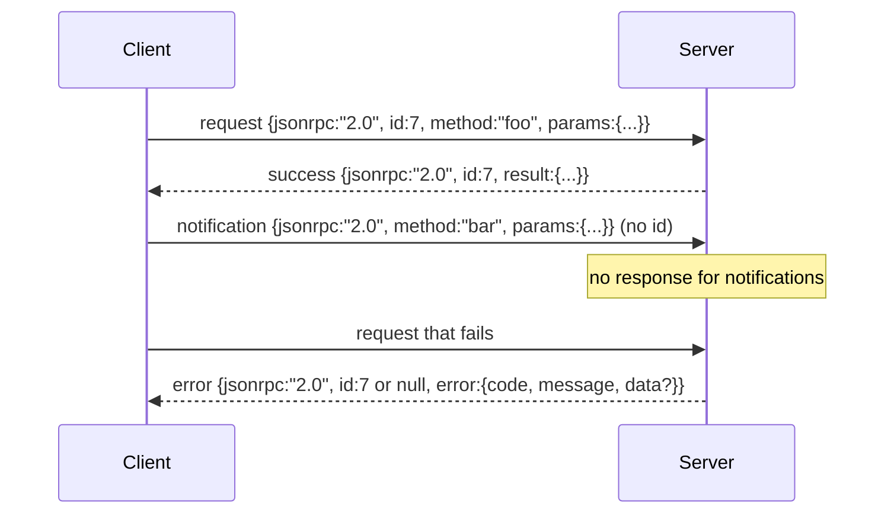

<!-- i18n:manual -->
# JSON-RPC 2.0 поверх stdio с разделением по строкам

> Транспорт между клиентом модели и сервером инструментов — это JSON-RPC поверх stdio. Написав его руками один раз, вы поймёте, за что платит любой слой фрейминга.

**Type:** Build
**Languages:** Python
**Prerequisites:** Phase 13 lessons 01-07, Phase 14 lesson 01
**Time:** ~90 minutes

## Learning Objectives
- Говорить на JSON-RPC 2.0, упакованном как JSON с разделением по строкам, через stdin и stdout.
- Разложить пять стандартных кодов ошибок (-32700, -32600, -32601, -32602, -32603) и отдавать их с правильной семантикой.
- Различать запросы, ответы, уведомления и пакеты, не выдумывая новых ключей конверта.
- Обрабатывать одну ошибку разбора на строку, не отравляя остаток потока.
- Собрать самозавершающееся демо на io.BytesIO, чтобы урок запускался без порождения дочернего процесса.

```figure
cf-jsonrpc-frames
```

> 🎒 **На пальцах.** Транспорт — это почтовый ящик, а не почта: он умеет только принять конверт и вернуть конверт. Пять целей урока — это конверт, пять видов «адрес неверен», четыре формы письма, правило «одно порванное письмо не останавливает почтальона» и стенд, на котором всё это гоняется без реальной доставки.

## Why JSON-RPC stays the lingua franca

Кодовый агент в 2026 году за одну сессию говорит примерно с дюжиной серверов инструментов. Каждый сервер — это отдельный процесс или удалённая точка входа. Формат на проводе не меняется с 2013 года. Спецификация JSON-RPC 2.0 занимает две страницы. Она выживает потому, что все альтернативы (gRPC, HTTP на каждый вызов, свой бинарный формат) требуют компромисса, которого не требует JSON-RPC: они выбирают либо стриминг, либо пакетирование, либо привязку к конкретному транспорту. JSON-RPC одинаков поверх stdio, сокетов, вебсокетов и HTTP, и клиент способен управлять сервером, которого никогда не видел, если оба соблюдают спецификацию.

> 🎒 **На пальцах.** Две страницы спецификации против сотен у gRPC — вот и весь секрет долголетия. Двенадцать серверов за сессию означают двенадцать разных команд разработчиков, и договориться они смогли только о том, что помещается в две страницы. Формат не менялся тринадцать лет — значит код, который вы напишете сегодня, переживёт три поколения моделей.

Этот урок строит вариант поверх stdio. JSON с разделением по строкам. Каждый запрос — одна строка. Каждый ответ — одна строка. Граница транспорта — символ `\n`.

> 🎒 **На пальцах.** Разделитель — это буквально перевод строки, тот же самый, что при нажатии Enter. Никаких заголовков с длиной, никакой магии: прочитал до `\n` — вот тебе целое сообщение. Отсюда железное правило прошлых уроков: в stdout нельзя печатать ничего лишнего, потому что любая посторонняя строка выглядит как сообщение.

## The wire shape

Существуют четыре формы конверта. Две произносит клиент. Две произносит сервер.



> 🎒 **На пальцах.** Четыре формы легко запомнить по одному признаку — есть ли `id` и есть ли `result`. Запрос: `id` есть, ответа ждём. Уведомление: `id` нет, ответа не будет. Успех: `id` тот же самый, внутри `result`. Ошибка: `id` тот же самый, внутри `error`. Всё, других конвертов в протоколе нет.

У уведомления нет `id`. Сервер не должен на него отвечать. Если сервер вернёт ответ на уведомление, клиенту некуда его привязать — нет места вызова. Это одно правило и держит арифметику фрейминга простой.

> 🎒 **На пальцах.** `id` — это номер, по которому клиент сопоставляет ответ с вопросом, как номерок в химчистке. У уведомления номерка нет специально: вы не собираетесь ничего забирать. Пришёл ответ без номерка — клиенту остаётся только выбросить его, потому что положить его некуда.

Пакет — это JSON-массив из запросов или уведомлений. Сервер отвечает массивом ответов, в любом порядке, по одному на каждый непустой элемент, кроме уведомлений. Если все элементы пакета — уведомления, сервер не отправляет в ответ ничего.

> 🎒 **На пальцах.** Считаем на примере: в пакете пять элементов, из них два уведомления — значит в ответном массиве будет три ответа, а не пять. Порядок при этом не гарантирован, и связать ответ с запросом можно только по `id`. Отправили пакет из трёх уведомлений — в ответ приходит ровно ноль байт, и это не ошибка.

## The five error codes

```text
-32700  Parse error      JSON could not be parsed
-32600  Invalid Request  Envelope shape is wrong
-32601  Method not found
-32602  Invalid params
-32603  Internal error
```

Коды от -32000 до -32099 зарезервированы под ошибки, которые определяет сервер. Всё остальное определяет приложение. Урок держится этих пяти. Если ваш обработчик бросит исключение, транспорт завернёт его в -32603 с именем класса исключения в поле `data.exception`.

> 🎒 **На пальцах.** Пять кодов отвечают на пять разных вопросов, и порядок у них по возрастанию глубины: сообщение вообще не разобралось (-32700), разобралось, но это не тот конверт (-32600), конверт верный, но метода нет (-32601), метод есть, но аргументы не те (-32602), всё нашлось и всё равно упало (-32603). Диапазон -32000…-32099 оставлен вам под свои ошибки — это ровно сто номеров, обычно хватает.

У ошибки разбора есть особое правило. Поле `id` в ответе равно `null`, потому что запрос не разобрался настолько, чтобы из него достали id.

> 🎒 **На пальцах.** Это как порванный конверт без обратного адреса: ответить-то надо, а кому — непонятно. Отсюда `id: null`. Клиент увидит такой ответ и поймёт, что одно из его сообщений было испорчено, но какое именно — придётся вычислять по своим же логам.

## Newline framing and the BytesIO demo

Транспорт читает по одной строке за раз. Строка — это байты до символа `\n` включительно. Если строку не удалось разобрать, транспорт пишет ответ с кодом -32700 и `id: null` и продолжает работу. Поток не отравлен. Следующая строка разбирается с чистого листа.

> 🎒 **На пальцах.** Разница между «поток отравлен» и «поток жив» — вопрос одной строчки кода. Отравленный вариант: транспорт пытается досчитать испорченный JSON и съедает следующие строки как его продолжение, после чего сессия мертва. Живой вариант: одна строка — одна попытка, не вышло — выкинули и читаем дальше.

Для урока мы оборачиваем пару `io.BytesIO` в роли stdin и stdout. Сервер читает запросы до EOF, пишет ответ на каждый и возвращается. Клиент вычитывает ответы обратно. Никакого порождения процессов. Никаких таймаутов. Поведение транспорта не отличается от настоящей трубы к подпроцессу, потому что интерфейс `io` в Python предъявляет тот же контракт `.readline()` и `.write()`.

> 🎒 **На пальцах.** `BytesIO` — это труба, нарисованная в памяти: тот же `.readline()`, те же байты, только без второго процесса. Практическая выгода огромна — тесты идут миллисекунды и не зависят от планировщика ОС. Когда вы потом подставите настоящий stdin подпроцесса, менять в коде транспорта будет нечего.

## Method dispatch

Транспорт не знает, какие методы существуют. Он передаёт работу вызываемому объекту `handler(method, params)`, который поставляет харнесс. Обработчик возвращает результат или бросает исключение. Три класса исключений отображаются в конкретные коды.

```text
MethodNotFound -> -32601
InvalidParams  -> -32602
Anything else  -> -32603 with exception name in data
```

Транспорт никогда не видит реестра инструментов. Реестр стоит за обработчиком. Это ровно та слоёность, которая нам нужна. Транспорт говорит на JSON-RPC. Реестр говорит про формы инструментов. Диспетчер (урок двадцать три) сшивает их вместе.

> 🎒 **На пальцах.** Проверьте слоёность одним вопросом: сколько строк в файле транспорта упоминают слово «инструмент»? Правильный ответ — ноль. Транспорт знает только про `method` и `params`, а что за этими словами стоит реестр из двухсот записей, ему знать не положено. Именно поэтому тот же транспорт потом переиспользуется без единой правки.

## Stream behavior on errors

```text
client writes              server reads             server writes
---------------            -----------              -------------
{...valid request...}      parses ok                {...response, id matches...}
{...broken json...         parse fails              {id:null, error: -32700}
{...valid request...}      parses ok                {...response, id matches...}
{...missing method...}     invalid envelope         {id:X, error: -32600}
```

Сломанная строка JSON не останавливает цикл. Отсутствие поля `method` не останавливает цикл. Исключение из обработчика не останавливает цикл. Транспорт продолжает читать до EOF.

> 🎒 **На пальцах.** В табличке выше четыре строки, и три из них — разные способы ошибиться, но выход из цикла не случился ни разу. Единственное, что останавливает сервер, — конец входного потока. Запомните это как правило проектирования: у долгоживущего цикла должна быть ровно одна причина завершиться, иначе вы будете ловить загадочные «сервер молча умер».

## Notifications and asymmetric flows

Уведомление работает по принципу «отправил и забыл». Харнесс использует уведомления для событий прогресса, сигналов отмены и строк лога. Через уведомления долго работающий инструмент может слать статусы, не гоняя ответ туда-обратно на каждый из них.

> 🎒 **На пальцах.** Сравните с прорабом на стройке: он не звонит вам после каждого кирпича и не ждёт «принято», а просто скидывает сообщения. Инструмент, который качает файл десять минут, может прислать сто уведомлений о прогрессе и ни разу не заблокироваться в ожидании ответа. Цена этого удобства — доставку никто не подтверждает.

Урок реализует один хелпер исходящих уведомлений, `write_notification`. Сервер использует его, чтобы отдавать прогресс, пока запрос ещё в работе. Демо показывает этот паттерн: приходит запрос, обработчик отдаёт два уведомления о прогрессе, а затем пишет финальный ответ.

> 🎒 **На пальцах.** Здесь важен порядок строк в stdout: сначала два уведомления без `id`, потом один ответ с `id`. Клиент читает их подряд и по наличию `id` понимает, какая строка закрывает вызов, а какие были промежуточными. Это и называется асимметричным потоком: на один запрос ушло три строки ответа.

## How to read the code

`code/main.py` определяет `StdioTransport`, хелпер разбора (`parse_request`), три хелпера записи (`write_response`, `write_error`, `write_notification`) и цикл диспетчеризации `serve`. Константы кодов ошибок лежат на уровне модуля.

`code/tests/test_transport.py` покрывает пять кодов ошибок, уведомления (ответ не пишется), пакеты (массив на входе, массив на выходе, уведомления пропущены), сломанный JSON (ошибка разбора, затем продолжение) и асимметричный поток, где обработчик пишет уведомление посреди вызова.

> 🎒 **На пальцах.** Обратите внимание, что тесты проверяют не только то, что написано, но и то, что не написано: на уведомление в stdout должно уйти ровно ноль строк. Такие проверки «на отсутствие» ловят самый частый баг новичка в JSON-RPC — вежливое «ок» в ответ на то, чего никто не ждал.

## Going further

Этого транспорта хватает для следующих уроков. Продакшен-транспорты добавляют три вещи. Поле корреляционного id, которое выживает при пересылке (ваш `id` уже такой, но в сетке из многих сервисов нужен ещё внешний trace id). Канал отмены (уведомление вроде `$/cancelRequest` с id вызова, который сейчас в работе). И рукопожатие с согласованием content-type, чтобы один сокет умел и JSON-RPC, и Streamable HTTP. Ни одна из этих вещей не меняет формат на проводе. Они добавляют метаданные.

> 🎒 **На пальцах.** Ключевая фраза — «не меняет формат на проводе». Все три добавки живут в полях конверта, а не в способе упаковки, поэтому старый сервер спокойно проигнорирует незнакомое поле. Начните с канала отмены: без него зависший вызов на десять минут вы можете прекратить только убийством процесса.
