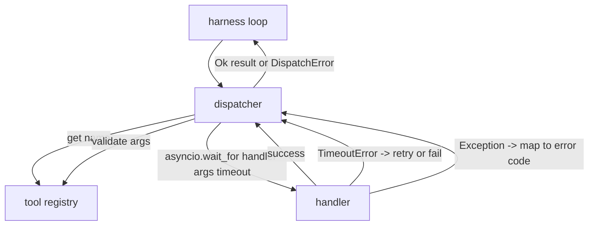
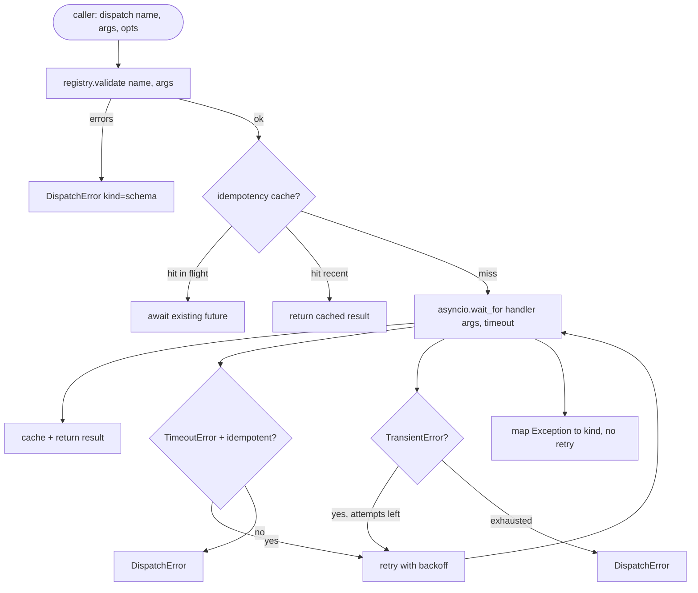

<!-- i18n:manual -->
# Диспетчер вызовов функций

> Диспетчер — то место, где харнесс расплачивается за каждое обещание, выданное схемой. Таймауты, повторы, дедупликация, отображение ошибок. Всё на одном шве.

**Type:** Build
**Languages:** Python
**Prerequisites:** Phase 13 lessons 01-07, Phase 14 lesson 01
**Time:** ~90 minutes

## Learning Objectives
- Обернуть обработчик инструмента в таймаут на вызов, который возвращает типизированную ошибку вместо того, чтобы подвесить цикл.
- Применить повторы с экспоненциальной задержкой, джиттером и предельным числом попыток.
- Дедуплицировать повторы по ключу идемпотентности, чтобы повтор, догнавший медленный оригинал, не отработал дважды.
- Отобразить исключения обработчиков и сбои транспорта в единый конверт ошибки, который цикл харнесса уже умеет читать.
- Ограничить параллельную диспетчеризацию лимитом конкурентности, чтобы веер из сорока вызовов не выел цикл событий.

```figure
cf-dispatch-retry
```

> 🎒 **На пальцах.** Диспетчер — это диспетчер такси: он не водит машину и не знает города, он раздаёт заказы, следит за временем и решает, кого послать повторно. Пять целей урока — пять его обязанностей: часы, вторая попытка, защита от двойной подачи, единый бланк жалобы и предел «сколько машин в рейсе одновременно».

## Where the dispatcher sits

Между циклом харнесса (урок двадцать) и реестром инструментов (урок двадцать один). Транспорт (урок двадцать два) кормит цикл. Цикл отдаёт вызов инструмента диспетчеру. Диспетчер идёт в реестр, запускает обработчик и возвращает либо результат, либо конверт ошибки в форме JSON-RPC.



Диспетчер — единственный слой, который знает про таймеры, повторы и идемпотентность. Цикл не знает. Реестр не знает. Обработчик не знает. Вся суть в этой изоляции.

> 🎒 **На пальцах.** Проверьте изоляцию поиском по коду: слово `sleep` должно встречаться только в файле диспетчера. Как только таймаут заводится внутри обработчика, у вас появляется два места, где задают время, и они рано или поздно разъедутся. Один слой отвечает за время — значит и чинить придётся один файл.

## Timeouts

У каждого инструмента есть таймаут по умолчанию. Запись в реестре несёт `timeout_ms`. Диспетчер перекрывает его значением на конкретный вызов, если харнесс такое передал. Мы используем `asyncio.wait_for`. По таймауту задача обработчика отменяется, а диспетчер возвращает `DispatchError(kind="timeout")`.

> 🎒 **На пальцах.** Здесь три уровня приоритета: значение на вызов важнее значения из записи реестра, а оно важнее общего умолчания. Так у медленного `web.search` может стоять тридцать секунд, у `fs.read` — двести миллисекунд, и оба живут в одном диспетчере. Ключевое слово — «отменяется»: задача не просто перестаёт нас интересовать, её действительно снимают, иначе цикл событий копит зомби.

Таймаут по умолчанию не считается ошибкой, которую можно повторить, если инструмент неидемпотентен. Вызов `db.write`, упавший по таймауту, мог как записать данные, так и не записать. Повтор дублирует запись. Диспетчер уважает флаг `idempotent` из записи реестра. Идемпотентные инструменты повторяются. Неидемпотентные — нет.

> 🎒 **На пальцах.** Таймаут — это не «не сработало», это «мы не знаем, сработало или нет». Разница решающая: чтение можно повторить сто раз без вреда, а перевод денег после повтора уйдёт дважды. Флаг `idempotent` из прошлого урока наконец пригодился — он и есть тот единственный бит, который отличает эти два случая.

## Retries with exponential backoff

Политика повторов — максимум три попытки. Задержка растёт экспоненциально, с джиттером.

```text
attempt 1  -> delay 0
attempt 2  -> delay 0.1s * (1 + random[0..0.5])
attempt 3  -> delay 0.4s * (1 + random[0..0.5])
```

> 🎒 **На пальцах.** Посчитайте по табличке: первая попытка идёт сразу, вторая ждёт от 0,1 до 0,15 секунды, третья — от 0,4 до 0,6. Суммарно вы теряете максимум около 0,75 секунды, а не минуты. Джиттер (случайная добавка до пятидесяти процентов) нужен, чтобы сорок клиентов, упавших одновременно, не постучались обратно тоже одновременно и не уронили сервис повторно.

Повторяются только ошибки `timeout` и `transient`. Ошибка `schema`, `not_found` или `internal` не повторяется. Ошибки схемы детерминированы. Повтор не меняет исход и жжёт бюджет.

> 🎒 **На пальцах.** Если аргументы не прошли схему, они не пройдут её и на третий раз — буквы в них те же самые. Три попытки вместо одной здесь означают тройную задержку и тройной расход бюджета ради того же самого ответа. Правило простое: повторяйте только то, что зависит от внешнего мира, и никогда — то, что зависит только от ваших входных данных.

Цикл повторов уважает бюджет, выданный харнессом. Если у вызывающей стороны в бюджете не осталось вызовов инструментов, диспетчер падает сразу на первой попытке и возвращает `kind="budget_exceeded"`.

> 🎒 **На пальцах.** Это стоп-кран от бесконечных агентов: без него цикл «попробовал — не вышло — попробовал ещё» способен крутиться, пока не кончатся деньги на счёте. Обратите внимание, что проверка стоит до первой попытки, а не после третьей. Дешевле отказать сразу, чем сделать вызов и потом обнаружить, что платить за него было нечем.

## Idempotency key dedupe

Повтор, который стартовал, пока оригинал ещё в полёте, — это настоящий продакшен-баг. Первый вызов висит на четырёх и девяти десятых секунды (чуть меньше таймаута). Повтор уходит на пятой секунде. Теперь два запроса гонятся к одному и тому же бэкенду. Если инструмент — `payments.charge`, вы списали деньги дважды.

> 🎒 **На пальцах.** Вся катастрофа умещается в одну десятую секунды: оригинал ответил бы на 5,1, но таймаут стоял на 5,0. Формально мы «не дождались», фактически платёж уже ушёл — и уйдёт второй. Именно поэтому таймаут никогда не следует ставить впритык к типичному времени ответа: разница между ними и есть ширина этой дыры.

Диспетчер принимает необязательный `idempotency_key`. Если вызов приходит с ключом, который уже в полёте, диспетчер ждёт существующий future и возвращает его результат. Кэш держит ключи ещё шестьдесят секунд после завершения, чтобы поглотить опоздавшие повторы.

> 🎒 **На пальцах.** Это как один номерок на два одинаковых заказа: второй посетитель не встаёт в очередь, а ждёт у того же окна и забирает ту же выдачу. Шестьдесят секунд хранения после завершения — запас на повторы, которые вышли в путь до того, как пришёл ответ. Обработчик при этом вызывается ровно один раз, и именно это проверяет тест.

Ключ — ответственность вызывающей стороны. Харнесс выводит его из планировщика: `f"{step_id}:{tool_name}:{hash(args)}"`. Диспетчер не выдумывает ключи сам, потому что ключ, выведенный из одних только аргументов, делает два семантически разных вызова неотличимыми.

> 🎒 **На пальцах.** Разберите ключ по кускам: `step_id` говорит, на каком шаге плана мы находимся, `tool_name` — чем работаем, `hash(args)` — с какими данными. Уберите `step_id`, и два законных списания по сто рублей на разных шагах плана схлопнутся в одно — пользователь недоплатит, а вы будете искать пропавший платёж. Поэтому ключ знает тот, кто знает план, а не диспетчер.

## Error envelope

Неудачная диспетчеризация возвращает одну-единственную форму.

```text
DispatchError
  kind        : "timeout" | "transient" | "schema" | "not_found" | "internal" | "budget_exceeded"
  message     : str
  attempts    : int
  jsonrpc_code: int   (one of -32601, -32602, -32603)
```

Цикл харнесса отображает `kind` в следующее состояние. `schema` и `not_found` уходят в `on_error` и запускают перепланирование. `timeout` и `transient` уходят в `on_error` и могут запустить перепланирование, а могут и не запустить — в зависимости от числа попыток. `budget_exceeded` запускает `on_budget_exceeded`.

> 🎒 **На пальцах.** Шесть значений `kind` — это шесть кнопок, и цикл харнесса нажимает их не думая. Вся хитрость спрятана в диспетчере: это он решил, что таймаут после трёх попыток — уже окончательный отказ. Поле `attempts` внутри конверта не для красоты — по нему цикл понимает, стоит ли вообще перепланировать или инструмент безнадёжен.

## Concurrency limit on fan-out

`gather(*calls)` запускает все корутины одновременно. При сорока вызовах инструментов это сорок открытых сокетов или сорок труб к подпроцессам. Большинству бэкендов сорок параллельных соединений от одного клиента не нравятся.

Диспетчер оборачивает `gather` в семафор. Лимит конкурентности по умолчанию — восемь. Каждый вызов берёт семафор перед диспетчеризацией и отпускает по завершении. Вызывающая сторона видит выход в форме `gather`, но реальное расписание ограничено.

> 🎒 **На пальцах.** Считаем: сорок вызовов при лимите восемь — это пять волн по восемь, а не сорок одновременных соединений. Общее время вырастет, зато бэкенд не начнёт отдавать 429 и рвать соединения, после чего вам всё равно пришлось бы всё повторять. Интерфейс при этом не меняется: снаружи по-прежнему один список результатов в том же порядке.

## Flow for one call



> 🎒 **На пальцах.** Прочитайте схему как маршрут одного вызова: сначала проверка схемы (не прошла — выходим сразу, без единой попытки), потом кэш идемпотентности (попали — ждём чужой результат), и только потом реальный запуск с таймаутом. Обратите внимание на единственную стрелку, ведущую назад: `retry` возвращает нас в `attempt`, и это единственный цикл на всей картинке. Всё остальное — прямая дорога к результату или к `DispatchError`.

## How to read the code

`code/main.py` определяет `Dispatcher`, `DispatchError` и `TransientError`. Диспетчер получает реестр при создании. Асинхронный `dispatch(name, args, ...)` — единственная точка входа. Таймауты на попытку применяются прямо внутри `_run_with_retries` через `asyncio.wait_for`. Функция `gather_bounded(calls)` прогоняет много диспетчеризаций с лимитом конкурентности.

`code/tests/test_dispatcher.py` покрывает срабатывание таймаута, повтор на transient, отсутствие повтора на ошибке схемы, дедупликацию по идемпотентности (два одновременных вызова с одним ключом схлопываются в один заход в обработчик) и ограничение конкурентности (семафор в деле).

Тесты используют `asyncio.sleep(0)` и детерминированные обработчики на счётчике `Counter`, поэтому они отрабатывают за миллисекунды и не зависят от настенных часов.

> 🎒 **На пальцах.** «Единственная точка входа» — это тоже проектное решение, а не мелочь: пока весь трафик идёт через `dispatch`, любое новое правило достаточно вписать в одном месте. И обратите внимание на трюк с тестами: счётчик вместо реальных пауз даёт проверку «обработчик вызван ровно один раз» без ожидания реальной секунды. Тесты, которые спят по-настоящему, начинают мигать на загруженной машине.

## Going further

Два расширения, которые продакшен-диспетчеры добавляют себе. Первое — структурированное логирование на каждом переходе (поток событий цикла кое-что уже даёт, но диспетчер должен ещё и сам отдавать события `dispatch.attempt` и `dispatch.retry`). Второе — предохранители: после N сбоев за окно времени инструмент уходит на остывание, и диспетчеризации сразу возвращают `kind="circuit_open"` вместо похода в обработчик. Оба ложатся поверх этого диспетчера, не меняя контракт.

Урок двадцать четвёртый склеивает диспетчер с агентом plan-and-execute, чтобы вы увидели все четыре части в движении.

> 🎒 **На пальцах.** Предохранитель — это про арифметику: если инструмент лежит, три попытки на каждый из сорока вызовов дают сто двадцать бессмысленных походов. Предохранитель после N сбоев отвечает мгновенно и экономит и время, и бюджет. Фраза «не меняя контракт» здесь главная: снаружи по-прежнему `dispatch`, снаружи по-прежнему `DispatchError`, просто добавилось ещё одно значение `kind`.
