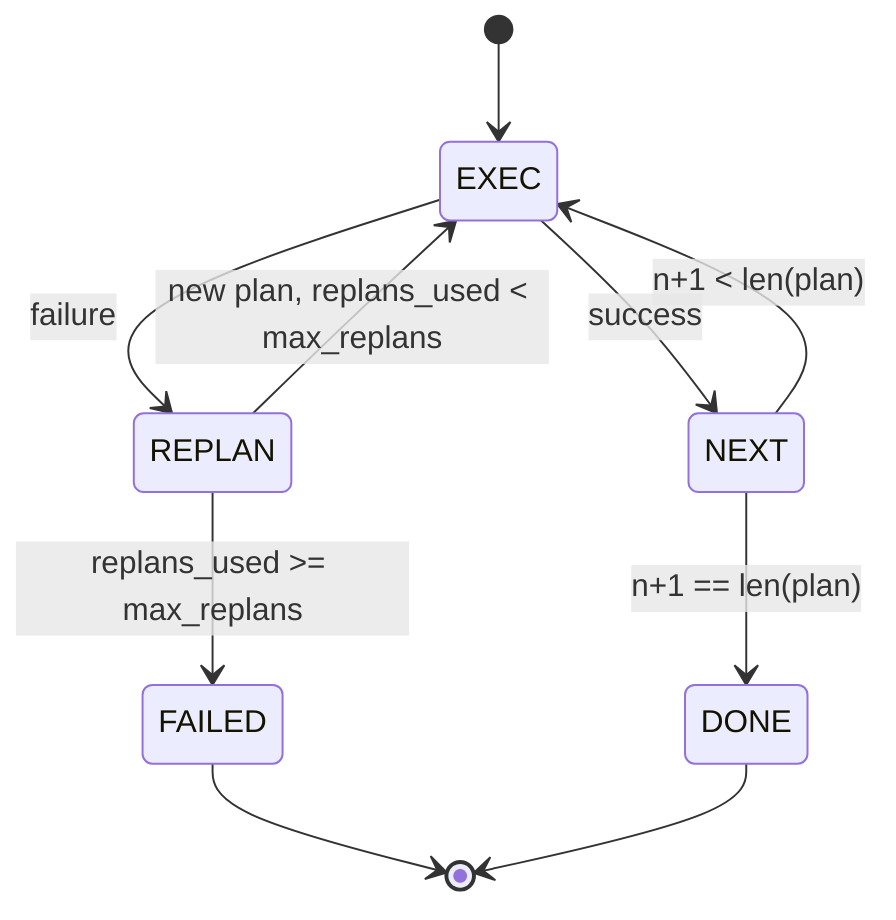

<!-- i18n:manual -->
# Plan-Execute: поток управления от плана к исполнению

> План, который не переживает сбой, — это скрипт. Скрипт, который умеет перепланировать, — это агент. Сначала стройте replanner.

**Type:** Build
**Languages:** Python
**Prerequisites:** Phase 13 lessons 01-07, Phase 14 lesson 01
**Time:** ~90 minutes

## Learning Objectives
- Представлять план как упорядоченный список типизированных шагов, чтобы исполнитель мог судить о прогрессе и об итоге.
- Исполнять шаги последовательно, с управляемой передачей сбоя обратно планировщику.
- Перепланировать от текущего курсора, держа прошлую ошибку в контексте, чтобы следующий план был осмысленным.
- Отдавать диф плана при каждом пересмотре, чтобы трассировщик или UI ниже по течению показали, почему план изменился.
- Принуждать к двум бюджетам: жёсткому потолку шагов и жёсткому потолку перепланирований.

```figure
cg-plan-replan
```

> 🎒 **На пальцах.** Схема читается так: одна стрелка идёт вперёд по плану, а вторая — назад к планировщику, и включается она только при сбое. Из-за этой второй стрелки агент из урока не обязан доводить до конца заведомо сломанный план. Вспомните урок про ReWOO: там план был статичным, здесь у него появился обратный ход.

## Plan and execute, not chain-of-thought

Агент в стиле chain-of-thought просто сыплет токенами, а цикл сам угадывает, где закончился вызов инструмента. Агент plan-and-execute сначала выдаёт структурированный план, а потом детерминированно исполняет каждый шаг. План — это данные, которые harness может рассмотреть. Исполнение — это harness, прогоняющий эти данные через диспетчер.

> 🎒 **На пальцах.** Разница как между «я тут подумаю вслух и по ходу разберусь» и «вот список из четырёх пунктов, идём по нему». Второе можно распечатать, показать другому человеку и проверить до запуска — именно это и значит «план — это данные».

Две детали. Планировщик, который выдаёт план. Исполнитель, который этот план прогоняет. Самое интересное начинается, когда исполнитель натыкается на сбой. Есть три варианта:

```text
1. Abort         (return failed, surface the error)
2. Skip          (mark step failed, continue with the rest)
3. Replan        (hand the error to the planner, get a new plan from the cursor)
```

Именно перепланирование превращает скрипт в агента.

> 🎒 **На пальцах.** Три варианта — это три реакции на закрытую дорогу: развернуться домой (abort), проехать мимо нужного адреса (skip) или построить новый маршрут (replan). Первые два умеет любой bash-скрипт с `set -e` и `|| true`. Третий требует, чтобы кто-то умел заново думать, — отсюда и слово «агент».

## The Step shape

```text
Step
  id              : int           (monotonic within a plan revision)
  tool_name       : str
  args            : dict
  expected_outcome: str           (planner's stated success condition)
  result          : Any | None
  error           : str | None
```

`expected_outcome` — это короткая фраза, которую планировщик выдаёт вместе с шагом. Исполнитель её не проверяет. Она нужна для двух вещей: replanner читает её, когда правит план; поток событий отдаёт её наружу, чтобы трассировщик мог показать «этот шаг должен был сделать X».

> 🎒 **На пальцах.** В шаге шесть полей, и три из них заполняются уже после исполнения: `result`, `error` и, косвенно, судьба самого шага. То есть `Step` — это не только команда, но и место, куда записывается отчёт о ней. Как бланк поручения, где сверху задание, а снизу графа «выполнено / причина отказа».

> 🎒 **На пальцах.** `expected_outcome` — единственное поле, которое ничего не делает во время исполнения, и выбросить его хочется первым. Не выбрасывайте: когда шаг падает, replanner видит не только «read_file вернул ошибку», но и «этот шаг должен был достать список тестов», — и может подобрать другой путь к той же цели.

## The planner shape

```python
def planner(goal: str, history: list[Step], last_error: str | None) -> list[Step]:
    ...
```

Чистая функция. `goal` — цель пользователя. `history` — уже исполненные шаги, с заполненными результатами и ошибками. `last_error` равен None при первом вызове и содержит последнее сообщение об ошибке при каждом следующем. Планировщик возвращает следующий план, начиная от курсора.

Планировщик ничего не знает об исполнителе. Не знает про повторы. Не знает про таймауты. Он выдаёт план. И всё.

> 🎒 **На пальцах.** «Чистая функция» здесь означает: на тех же трёх аргументах она обязана вернуть тот же план — значит, её можно тестировать без всякого harness. Проверьте себя по сигнатуре: единственный канал, по которому в планировщик заходит информация о прошлом, — это `history` и `last_error`. Никаких глобальных переменных, никакого доступа к сети.

## The executor

Исполнитель — маленький конечный автомат. Каждый шаг проходит через диспетчер. Исход бывает трёх видов: успех, перепланируемый сбой, фатальный сбой. Перепланируемые сбои возвращают управление планировщику. Фатальные (превышен бюджет, упёрлись в потолок перепланирований) дают результат сессии `FAILED`.



> 🎒 **На пальцах.** Посчитайте выходы из состояния REPLAN: их ровно два, и выбор между ними — это одно сравнение `replans_used >= max_replans`. Никакой магии, никакой модели, обычный счётчик. Именно поэтому автомат нельзя загнать в бесконечный цикл: каждый заход в REPLAN увеличивает число, а число упирается в потолок.

## Plan diffs on revision

Когда планировщик после сбоя возвращает новый план, исполнитель отдаёт событие `plan.diff` с тремя полями.

```text
removed: list of step ids that were in the old plan and are not in the new
added  : list of step ids in the new plan that were not in the old
revised: list of step ids whose tool_name or args changed
```

Трассировщик или UI отрисуют это как зачёркивание удалённых шагов и подсветку добавленных. Дело не в формате дифа. Дело в том, что пересмотр плана — видимое событие, а не тихая правка задним числом.

> 🎒 **На пальцах.** Три списка отвечают на три вопроса: что выкинули, что дописали, что переделали. Если план из шагов 1-2-3-4 стал 1-2-9, то removed = [3, 4], added = [9], revised = пусто. Без такого события пользователь видит только, что агент «что-то там делает», и не понимает, почему шаг 3 вдруг исчез.

## Two budgets, both hard

`max_steps` ограничивает общее число исполненных шагов за всю сессию, включая перепланирования. По умолчанию двенадцать. Линейный план из пяти шагов, который перепланировался дважды и каждый раз добавлял по три шага, доходит до шестнадцати исполнений и вылезает за бюджет. Исполнитель откажет в перепланировании и вернёт FAILED.

> 🎒 **На пальцах.** Проверьте арифметику из примера: 5 шагов первого плана плюс 3 и ещё 3 после двух перепланирований дают 11, а до шестнадцати доводят повторно исполненные хвосты плана. Главное — что потолок двенадцать ловит это раньше, чем счёт за API успеет вырасти. Это как лимит на карте: не защищает от глупых покупок, но ограничивает ущерб.

`max_replans` ограничивает, сколько раз планировщик вызывается после первого плана. По умолчанию пять. Это более важный предел. Планировщик, который пять раз подряд возвращает один и тот же сломанный план, иначе крутился бы, пока его не поймает бюджет шагов. Потолок перепланирований делает отказ быстрее, а причину — понятнее.

> 🎒 **На пальцах.** Два бюджета ловят разные болезни: `max_steps` — «агент работает слишком долго», `max_replans` — «агент тупит на одном месте». Вторая диагностируется быстрее и точнее: пять одинаковых планов подряд — это сразу видно в логе, а двенадцать разных шагов ещё нужно читать глазами.

## The deterministic planner in this lesson

Модель в этом уроке мы не зовём. Урок поставляется с детерминированным планировщиком, который выбирает план по значению `last_error`.

```text
last_error is None    -> emit a four-step plan
last_error matches X  -> emit a three-step plan that routes around X
last_error matches Y  -> emit a two-step plan that gives up gracefully
otherwise             -> return [] (signals nothing to replan)
```

Этого хватает, чтобы проверить поведение исполнителя на всех переходах: успех, одно перепланирование, два перепланирования, исчерпание перепланирований и исчерпание бюджета шагов.

> 🎒 **На пальцах.** Четыре строчки правил заменяют целую LLM — и это осознанный ход: тесты должны падать из-за исполнителя, а не из-за настроения модели. Обратите внимание на последнюю строку: пустой список означает «перепланировать нечем», и сессия честно завершается с причиной `no_plan`.

## Result shape

```text
SessionResult
  status      : "completed" | "failed"
  reason      : str     ("goal_met" | "step_budget" | "replan_budget" | "no_plan")
  history     : list[Step]
  revisions   : list[PlanDiff]
  events      : list[Event]
```

Цикл harness из урока двадцать читает это напрямую. Диспетчер из урока двадцать три исполняет каждый шаг. Реестр из урока двадцать один валидирует аргументы каждого шага. Транспорт из урока двадцать два вывел бы весь этот поток наружу по JSON-RPC клиенту модели.

> 🎒 **На пальцах.** Поле `reason` важнее поля `status`: «упал» знать бесполезно, а «упал из-за `replan_budget`» уже подсказывает, что чинить планировщик, а не инструменты. Четыре возможных значения покрывают все выходы автомата, так что разбор ошибок сводится к обычному `match` по строке.

## How to read the code

`code/main.py` определяет `PlanExecuteAgent`, `Step`, `PlanDiff`, `SessionResult` и детерминированный планировщик. Исполнитель — это единственный метод `run(goal)`, возвращающий `SessionResult`. Диф плана считается сравнением id шагов и кортежей `(tool_name, args)`.

`code/tests/test_agent.py` покрывает линейный успех, сбой в середине плана с одним перепланированием, исчерпание перепланирований с ответом `failed:replan_budget`, исчерпание бюджета шагов и формат события plan-diff.

> 🎒 **На пальцах.** Диф считается по паре «id шага» и «(инструмент, аргументы)» — это значит, что шаг с тем же номером, но новыми аргументами попадёт в `revised`, а не в `added`. Начните чтение с тестов: пять сценариев в них — это ровно пять путей по схеме конечного автомата выше.

## Going further

Два расширения, которые вам понадобятся, как только вы подключите сюда настоящую модель. Первое — кэширование частичного плана: если план успешно прошёл первые три шага из шести и упал, повторять первые три не хочется. Исполнитель уже хранит историю; планировщику остаётся только её прочитать. Второе — параллельные ветки: сейчас исполнитель строго последовательный. Планировщик, который выдаёт независимую ветку (`gather_step` вместо `next_step`), может гонять два вызова инструмента одновременно через диспетчер.

И то и другое добавляет настоящей сложности. И то и другое проще добавить, когда линейный исполнитель уже прибит гвоздями. Именно этим урок и занимается.

> 🎒 **На пальцах.** Кэширование частичного плана экономит ровно столько, сколько стоили удавшиеся шаги: на плане из шести шагов с падением на четвёртом вы не переплачиваете за три успешных вызова инструментов. Порядок работ тут важнее самих фич — сначала прибиваете линейный случай тестами, потом усложняете, иначе ловить регрессии будет нечем.
