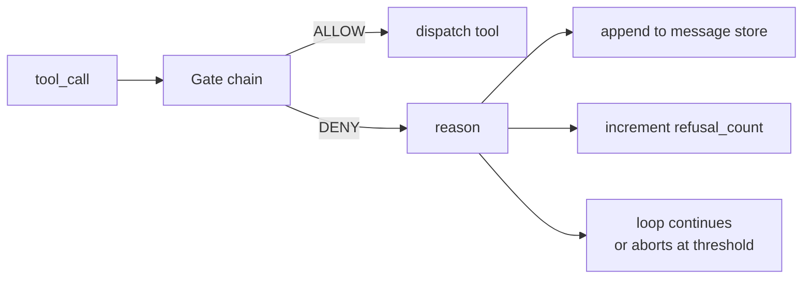
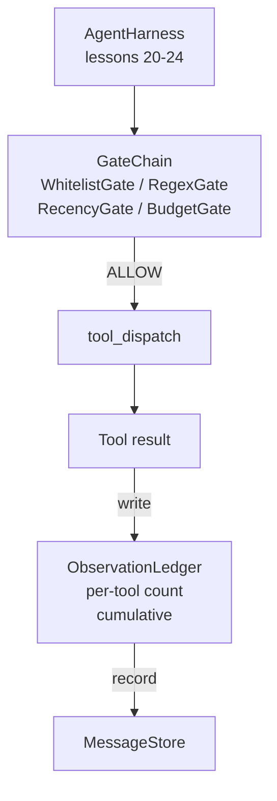

<!-- i18n:manual -->
# Урок 25 капстоуна: гейты проверки и бюджет наблюдений

> Harness агента без слоя проверки — это желание в пальто с чужого плеча. В этом уроке мы строим детерминированную цепочку гейтов, которая решает, дать ли вызову инструмента сработать, сколько его вывода агенту позволено увидеть и когда цикл обязан остановиться, потому что агент прочитал слишком много. Цепочка — это функция из маленьких именованных гейтов плюс журнал наблюдений, который считает каждый токен, показанный модели.

**Type:** Build
**Languages:** Python (stdlib)
**Prerequisites:** Phase 19 · 20-24 (Track A1: agent loop, tool registry, message store, prompt builder, model router), Phase 14 · 33 (instructions as constraints), Phase 14 · 36 (scope contracts), Phase 14 · 38 (verification gates)
**Time:** ~90 minutes

## Learning Objectives

- Построить протокол `VerificationGate` с детерминированным методом `evaluate(call)`.
- Собрать гейты бюджета, свежести, белого списка и регулярки в цепочку с коротким замыканием.
- Отслеживать каждое наблюдение через `ObservationLedger` с ключами по инструменту и по ходу.
- Отказывать вызову инструмента, когда суммарный бюджет наблюдений был бы превышен.
- Выдавать структурированную запись `GateDecision`, которую сможет принять наблюдаемость ниже по течению.

## The Problem

Когда harness агента разрешает модели свободно звать инструменты, за первый же час настоящей работы всплывают три класса багов.

Первый — неограниченные наблюдения. Grep по репозиторию на 200 тысяч строк вываливает полмиллиона токенов вывода в следующий ход. Модель видит одно совпадение на килобайт текста, а остальной контекст потрачен впустую. Счёт за токены большой, и агент теперь не лучше решает задачу, а хуже.

> 🎒 **На пальцах.** Полмиллиона токенов — это примерно два миллиона символов, то есть целая книга ради нескольких строк с совпадениями. Модель в такой ситуации ведёт себя как человек, которому вместо адреса вручили телефонный справочник города. Больше данных здесь означает не больше знаний, а меньше внимания.

Второй — протухшая свежесть. Долгая задача накапливает пятьдесят вызовов инструментов. Модель перечитывает первый read_file с третьего хода так, будто это актуальное состояние. Правки, сделанные на сорок седьмом ходу, вообще не всплывают, потому что сборщик промпта сериализовал самые ранние наблюдения первыми.

> 🎒 **На пальцах.** Это классическая ошибка «читаю вчерашнюю распечатку файла, который уже переписали». Между третьим и сорок седьмым ходом прошло сорок четыре вызова, и содержимое файла давно другое, но в промпте лежит старая копия. Модель не виновата: ей физически не показали новую версию.

Третий — расползание привилегий. Исследовательская задача начинает с вызова `web_search`, а потом каким-то образом запускает `shell`, потому что модель выдумала имя инструмента, а harness по умолчанию оказался разрешительным. К моменту, когда трассу кто-нибудь прочитает, в /tmp лежит мусорный файл, а curl уже сходил в приватный API.

> 🎒 **На пальцах.** Ключевое слово здесь — «по умолчанию разрешительный»: harness не знал инструмента и на всякий случай его выполнил. Правильное поведение обратное — не знаю имени, значит отказ. Как охрана в здании: незнакомого человека не пропускают, а не пропускают на всякий случай.

Гейт проверки — это компонент harness, который говорит «нет». Он не модель. Он не судья. Это детерминированная функция от `(call, history, ledger)`, возвращающая либо ALLOW, либо DENY с причиной. Причина пишется в лог. Модели говорят о ней. Цикл продолжается или прерывается.

> 🎒 **На пальцах.** Слово «детерминированная» здесь несёт ту же нагрузку, что и в уроке про гейты проверки в фазе 14: один и тот же вызов при одном и том же состоянии обязан получить один и тот же вердикт. Если бы решал LLM-судья, один и тот же `rm -rf` иногда проходил бы. Три входа — вызов, история, журнал — это всё, что гейту разрешено смотреть.

## The Concept



Гейт — это что угодно с методом `evaluate(call, ctx) -> GateDecision`. Цепочка — упорядоченный список. Оценка коротко замыкается на первом отказе. Порядок важен: дешёвые структурные гейты идут раньше дорогих гейтов со счётом токенов.

> 🎒 **На пальцах.** «Короткое замыкание» — это как `and` в Python: если первое условие ложно, остальные даже не вычисляются. Отказ по белому списку стоит один поиск по хеш-таблице, а подсчёт бюджета — проход по всему журналу; порядок экономит именно эту разницу.

В уроке приезжают четыре гейта:

- `WhitelistGate`. Разрешённые имена инструментов — это явное множество. Всё, что вне него, отклоняется. Самый дешёвый гейт, поэтому он идёт первым.
- `RegexGate`. Аргументы инструмента сопоставляются с регуляркой. Полезно, чтобы отказывать shell-вызовам с `rm -rf` внутри или HTTP-запросам на внутренние IP. Работает чисто по содержимому вызова.
- `RecencyGate`. Модель видит наблюдения только за последние N ходов. Более старые наблюдения маскируются. Гейт отказывает вызову инструмента, чей результат растянул бы окно наблюдений, которое уже устарело.
- `BudgetGate`. У суммарного числа токенов, прочитанных моделью за сессию, есть потолок. Когда журнал говорит, что потолок достигнут, любой следующий вызов инструмента отклоняется.

> 🎒 **На пальцах.** Четыре гейта отвечают на четыре разных вопроса: «этот инструмент вообще разрешён?», «эти аргументы разрешены?», «эти данные ещё свежие?», «мы ещё в пределах сметы?». Первые два смотрят только на сам вызов, вторые два — на состояние сессии. Именно поэтому первые два можно тестировать одной строкой, без всякой истории.

Журнал наблюдений — это бухгалтерия. Каждый успешный вызов инструмента пишет одну строку: имя инструмента, ход, сколько токенов выдано, сколько накопилось всего. Журнал отвечает на два вопроса: сколько модель увидела в сумме и сколько она увидела от инструмента X. Гейт бюджета читает первое. Гейт побочного бюджета на инструмент, который вы напишете в качестве упражнения, читает второе.

> 🎒 **На пальцах.** Строка журнала — это как строка в выписке по карте: дата, магазин, сумма, остаток. Пока каждая покупка записана, ответить «сколько я потратил всего» и «сколько я потратил на такси» одинаково просто. Без журнала гейт бюджета пришлось бы каждый раз пересчитывать по всей истории сообщений.

```figure
cg-gate-chain
```

> 🎒 **На пальцах.** На схеме цепочка нарисована в один ряд, и это буквально так и есть в коде: список гейтов, по которому идёт цикл до первого DENY. Никакого дерева решений и никаких весов — если картинка кажется слишком простой, значит вы поняли правильно.

## Architecture



Harness спрашивает цепочку. Цепочка кивает или отказывает. Если кивнула, инструмент выполняется, журнал тикает, а результат дописывается в хранилище сообщений. Если отказала, модели отдают отказ системным сообщением, и цикл решает, повторить попытку или прерваться.

> 🎒 **На пальцах.** Обратите внимание, что отказ тоже попадает модели в контекст — его не прячут. Так модель узнаёт «инструмент shell не разрешён» и перестаёт его звать, вместо того чтобы долбиться в закрытую дверь. Молчаливый отказ был бы хуже: агент повторял бы вызов до конца бюджета.

## What you will build

Реализация — один `main.py` плюс тесты.

1. Датаклассы `Observation` и `ToolCall` задают формы данных на проводе.
2. `ObservationLedger` записывает строки `(turn, tool, tokens)` и отвечает на `cumulative()` и `per_tool(name)`.
3. `GateDecision` несёт в себе `(allow, reason, gate_name)`.
4. `VerificationGate` — это протокол. Каждый гейт реализует `evaluate(call, ctx)`.
5. `GateChain` оборачивает упорядоченный список. Он вызывает каждый гейт, возвращает первый отказ или возвращает разрешение, если все гейты пропустили.
6. Демо прогоняет крошечный синтетический цикл агента. Три хода. На третьем ходу срабатывает гейт бюджета, и цикл рапортует о чистом отказе с ненулевым счётчиком отказов.

Счётчик токенов намеренно сделан тупой эвристикой `len(text) // 4`. Смысл урока в обвязке из гейтов, а не в токенайзере. В проде подставьте настоящий токенайзер.

> 🎒 **На пальцах.** Эвристика `len(text) // 4` означает «в среднем один токен на четыре символа»: вывод в 4000 символов засчитается как 1000 токенов. Настоящий токенайзер даст, скажем, 1100 — разница есть, но на решение «упёрлись в потолок или нет» она почти не влияет. Ровно поэтому её тут и терпят.

> 🎒 **На пальцах.** В `GateDecision` три поля, и третье — `gate_name` — легко счесть лишним. Оно и делает трассу читаемой: в логе вы видите не «отказано», а «отказано гейтом BudgetGate», и сразу знаете, какой параметр крутить.

## Why the chain order matters

Отказ дешевле разрешения. `WhitelistGate` работает за O(1) поиском по хешу. `RegexGate` работает за O(pattern * argv). `RecencyGate` читает небольшой срез хранилища сообщений. `BudgetGate` читает журнал целиком. Вы выстраиваете их по возрастанию стоимости, чтобы отклонённый вызов замкнулся накоротко до дорогой работы.

Вы также выстраиваете их по радиусу поражения. Белый список — самое сильное заявление: этого инструмента нет в контракте. Дальше идёт гейт регулярки: этого аргумента нет в контракте. Следом свежесть: harness всё ещё против, но структурно вызов законный. Бюджет идёт последним, потому что по определению он срабатывает, только когда всё остальное прошло.

> 🎒 **На пальцах.** Два критерия — стоимость и радиус поражения — здесь удачно совпадают: самый дешёвый гейт заодно и самый принципиальный. Сравните крайности: хеш-поиск по множеству из десяти имён против прохода по журналу из пятидесяти строк. Если бы критерии конфликтовали, победил бы радиус поражения — тратить микросекунды на защиту не жалко.

## How this composes with the rest of Track A

Прошлые уроки дали вам цикл, реестр инструментов, хранилище сообщений, сборщик промпта и роутер моделей. Этот урок добавляет слой между моделью и инструментами. Урок 26 приносит песочницу, которой диспетчер отдаёт вызов инструмента, когда цепочка гейтов сказала ALLOW. Урок 27 приносит eval-harness, который записывает счётчики отказов как сигнал качества. Урок 28 подключает решения гейтов к спанам OpenTelemetry. Урок 29 сшивает всё это в работающего кодового агента.

> 🎒 **На пальцах.** Запомните разделение труда между 25 и 26 уроками: гейт решает «можно ли», песочница решает «как именно и с какими ограничениями». Вызов `rm -rf /` в идеале отсекается ещё регуляркой на 25-м уроке, но если он всё же дошёл, денлист песочницы ловит его вторым слоем. Это та же глубокая защита, что и в фазе 14: два независимых шанса поймать проблему.

## Running it

```bash
cd phases/19-capstone-projects/25-verification-gates-observation-budget
python3 code/main.py
python3 -m pytest code/tests/ -v
```

Демо печатает ход за ходом трассу со всеми решениями гейтов и выходит с нулевым кодом. Тесты покрывают журнал, каждый гейт по отдельности, короткое замыкание цепочки и синтетический цикл целиком.

> 🎒 **На пальцах.** Нулевой код выхода здесь — это и есть определение слова «работает», ровно как в уроке про гейты проверки: демо не «выглядит нормально», а честно возвращает 0. Обратите внимание на структуру тестов: сначала каждый гейт в изоляции, потом цепочка, потом цикл — снизу вверх, от самого дешёвого к самому дорогому.
