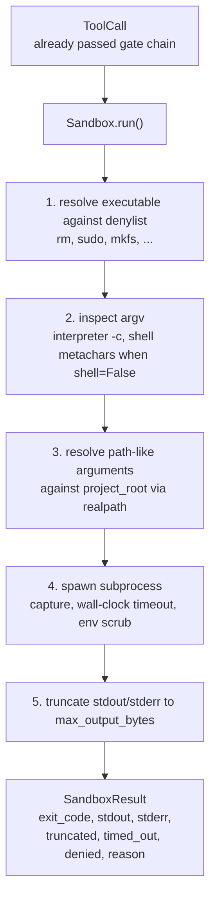
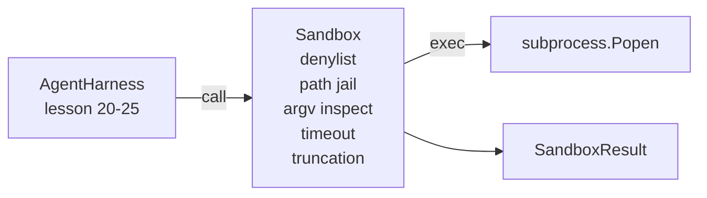

<!-- i18n:manual -->
# Урок 26 капстоуна: раннер-песочница с денлистом и тюрьмой путей

> Гейт проверки решает, должен ли вызов инструмента запуститься. Песочница решает, что происходит, когда он запускается. В этом уроке мы делаем раннер на подпроцессах, который отказывает опасным исполняемым файлам, отказывает опасным формам argv, запирает каждый файловый путь внутри корня проекта, обрезает раздутый вывод и убивает зарвавшиеся процессы по таймауту настенных часов. Это второй из двух слоёв между моделью и операционной системой.

**Type:** Build
**Languages:** Python (stdlib)
**Prerequisites:** Phase 19 · 25 (verification gates and observation budget), Phase 14 · 33 (instructions as constraints), Phase 14 · 38 (verification gates)
**Time:** ~90 minutes

## Learning Objectives

- Построить класс `Sandbox`, оборачивающий `subprocess.run` таймаутом, захватом вывода и обрезкой.
- Отказывать команде по имени через денлист и по структуре через инспектор argv.
- Отказывать любому аргументу-пути, который разрешается за пределы объявленного корня проекта.
- Отказывать метасимволам shell, когда режим shell выключен.
- Возвращать структурированный `SandboxResult`, который смогут принять наблюдаемость и eval-harness ниже по течению.

## The Problem

Кодовый агент, умеющий уходить в shell, способен поставить бэкдор, слить ключи, окирпичить ноутбук разработчика и намотать счёт за облако за один ход. Самая дешёвая защита — не давать ему shell вообще. Вторая по дешевизне — песочница, которая говорит «нет» точному списку паттернов.

> 🎒 **На пальцах.** Обратите внимание на порядок: сначала «не давать shell», и только потом «дать, но с фильтром». Большинству агентов shell не нужен — им хватает read_file, write_file и запуска тестов. Убрать инструмент дешевле, чем всю жизнь его сторожить.

В трассах агентов повторяются три класса провалов.

Первый — опасные исполняемые файлы. Модель, которую прижали задачей починить путь, попробует `sudo`, `chmod -R 777`, `rm -rf`, `mkfs`, `dd`. Ничему из этого не место в прогоне агента. Денлист ловит их по имени и по алиасу.

> 🎒 **На пальцах.** Все пять команд из списка объединяет одно: они меняют состояние машины необратимо и мгновенно. Отменить `rm -rf` нельзя, отменить `git commit` можно — вот граница, по которой и составляется денлист. Слово «алиас» здесь означает, что `/bin/rm` и `rm` для песочницы одно и то же.

Второй — трюки с argv. Модель, которой сказали «никакого shell», протащит атаку через интерпретатор: `python3 -c "import os; os.system('rm -rf /')"`, `bash -c '...'`, `node -e '...'`, `perl -e '...'`. Песочнице нужно понимать, что любой интерпретатор, запущенный с флагом вида `-c`, — это тот же shell, только окольным путём.

> 🎒 **На пальцах.** Смотрите на первый пример внимательно: имя команды `python3` в денлисте отсутствует и выглядит совершенно невинно, а внутри строки — тот самый `rm -rf`. Именно поэтому проверки по имени мало: нужен ещё разбор argv. Как с посылкой, где опасен не конверт, а содержимое.

Третий — побег по путям. Модели сказали прочитать `./src/main.py`, а она читает `../../etc/passwd`. Песочница запирает каждый аргумент-путь: прогоняет его через `os.path.realpath` и проверяет префикс.

> 🎒 **На пальцах.** Две точки в `../..` — это два шага вверх по дереву каталогов, и больше ничего волшебного. Из `/home/me/project/src` два шага вверх дают `/home/me`, а дальше можно гулять куда угодно. `realpath` схлопывает все эти точки в один настоящий путь, и после этого сравнение с корнем проекта становится обычным сравнением строк.

Песочница — не граница безопасности в смысле операционной системы. Настойчивый атакующий с возможностью исполнять код всё равно из неё выберется. Песочница — это ограждение времени разработки: она делает частые режимы отказа громкими и не даёт агенту нанести ущерб по чистой бестолковости.

> 🎒 **На пальцах.** Держите ожидания честными: это не сейф, а перила на лестнице. От злоумышленника перила не спасут, а от того, кто оступился, спасут — и в агентских трассах девять из десяти опасных команд это именно «оступился». Настоящую изоляцию дают контейнеры и микровиртуалки, о них дальше в разделе про «не настоящую песочницу».

## The Concept



У песочницы четыре оси отказа: имя, argv, путь, структура. Каждая ось — чистая функция от вызова, подпроцесса ещё нет. Подпроцесс порождается только после того, как все оси пройдены.

Коды выхода в `SandboxResult` — обычные соглашения: 0 успех, ненулевой отказ, плюс три сигнальных кода для denied (-100), timed_out (-101) и truncated (код выхода настоящий, а взводится флаг). Уроки ниже по течению читают этот структурированный результат, а не парсят stderr.

> 🎒 **На пальцах.** Пять шагов на схеме идут строго по возрастанию цены: три проверки — это чистая арифметика над строками, четвёртый шаг порождает процесс, пятый режет вывод. Та же логика, что и с порядком гейтов в уроке 25: сначала дёшево отказать, потом дорого исполнять. Сигнальный код -100 выбран за пределами обычного диапазона 0-255, чтобы его нельзя было спутать с настоящим кодом выхода программы.

```figure
cg-path-jail
```

> 🎒 **На пальцах.** На картинке видно главное: корень проекта — это круг, а всё, что за его пределами, недосягаемо, каким бы путём туда ни целились. Проверьте себя на примере: `./src/../src/main.py` внутри круга, `./src/../../etc/passwd` снаружи, хотя обе строки начинаются одинаково.

## Architecture



Денлист — это frozenset базовых имён исполняемых файлов. Алиасы (`/bin/rm`, `/usr/bin/rm`) все сводятся к одному базовому имени. Инспектор argv знает форму интерпретатора: любой argv, где argv[0] — интерпретатор, а какой-нибудь следующий аргумент начинается с `-c` или `-e`, отклоняется. Метасимволы shell (`;`, `|`, `&`, `>`, `<`, обратные кавычки, `$()`) вызывают отказ, если вызов явно не просил shell.

> 🎒 **На пальцах.** `frozenset` выбран не для красоты: проверка «есть ли имя в денлисте» стоит одно обращение по хешу независимо от того, десять там команд или тысяча. А сведение к базовому имени закрывает дешёвый обход — иначе достаточно было бы написать `/usr/bin/rm` вместо `rm`, и денлист по строке `rm` бы промолчал.

Тюрьма путей — самая тонкая часть. Песочница принимает `project_root` при конструировании. Любой аргумент, похожий на путь (содержит `/` или совпадает с существующим файлом), нормализуется через `os.path.realpath`, а потом сверяется с realpath корня проекта. Если разрешённая цель не под корнем — отказ. Попытки побега через симлинк (симлинк внутри корня проекта, указывающий наружу) блокируются как раз тем, что проверяется realpath, а не буквальный путь.

> 🎒 **На пальцах.** Симлинк — это ярлык: файл `project/notes.txt`, который на самом деле указывает на `/etc/passwd`. Буквальный путь начинается с `project/` и проверку бы прошёл, а `realpath` честно скажет `/etc/passwd` — и отказ сработает. Один вызов функции закрывает целый класс обходов, поэтому важно вызывать именно `realpath`, а не `abspath`.

## What you will build

Реализация — это `main.py` плюс каталог с тестами.

1. Датакласс `SandboxResult`: exit_code, stdout, stderr, truncated, timed_out, denied, reason, duration_ms.
2. Датакласс `SandboxConfig`: project_root, max_output_bytes, timeout_seconds, denylist, interpreter_block.
3. Класс `Sandbox`: метод `run(argv, *, shell=False, cwd=None)` возвращает `SandboxResult`.
4. Внутренние помощники отказа: `_check_executable_denylist`, `_check_argv_interpreter`, `_check_shell_metachars`, `_check_path_jail`.
5. Обрезка вывода с внятным флагом `truncated` и строкой-маркером в захваченном потоке.
6. Демо в конце файла: череда законных и враждебных вызовов. Каждый показан вместе со своим результатом.

Песочница использует `subprocess.run` с `shell=False` по умолчанию и `capture_output=True`. Таймаут по настенным часам берётся из аргумента `timeout`; на `TimeoutExpired` песочница убивает группу процессов и синтезирует SandboxResult.

> 🎒 **На пальцах.** Обратите внимание, что убивают именно группу процессов, а не один процесс: команда вроде `bash -c 'sleep 100 &'` оставила бы после себя сироту, который живёт дальше. Флаг `truncated` вместе со строкой-маркером решает вторую типичную беду — модель должна видеть, что вывод обрезан, иначе она сделает вывод по половине списка и не заметит этого.

> 🎒 **На пальцах.** Восемь полей `SandboxResult` покрывают все исходы одной формой: обычный запуск, отказ, таймаут и обрезка не порождают исключений, а заполняют разные поля. Из-за этого код вызывающей стороны — обычные `if`, а не `try/except` на каждый чих.

## Why this is not a real sandbox

Песочница из урока не использует namespaces, cgroups, seccomp, gVisor, Firecracker и вообще никакой изоляции на уровне ядра. Всё, что может подпроцесс, может и песочница. Защита здесь структурная: агенту отказано в самых частых опасных вызовах, а громкий отказ уходит в наблюдаемость вместо тихого исполнения.

Для продовых агентов вы наслаиваете сверху: запуск внутри непривилегированного контейнера Docker, запуск внутри микровиртуалки, сброс capabilities, монтирование корня проекта только на чтение и отдельного каталога-черновика на запись, ulimit на память и CPU, зачистка окружения до заведомо безопасного белого списка. Урок 29 кое-что из этого делает. Изоляция на уровне операционной системы за пределами этого урока.

> 🎒 **На пальцах.** Считайте это списком слоёв по стоимости внедрения: денлист — это час работы, контейнер — день, микровиртуалка — неделя. Начинают всегда с дешёвого слоя, потому что он один уже убирает большинство инцидентов. Тот же принцип глубокой защиты, что и в уроке про гейты проверки: слои независимы, и промах одного ловит следующий.

## Running it

```bash
cd phases/19-capstone-projects/26-sandbox-runner-denylist
python3 code/main.py
python3 -m pytest code/tests/ -v
```

Демо создаёт временный каталог, кладёт в него чистый файл, потом гоняет батарею вызовов. Законные вызовы проходят. Отклонённые возвращают SandboxResult с `denied=True` и причиной. Таймауты возвращают `timed_out=True`. Обрезка выставляет `truncated=True`. Демо печатает JSON-таблицу исходов и выходит с нулевым кодом.

> 🎒 **На пальцах.** Четыре типа исходов в демо — это четыре разных поля результата, и удобнее всего читать их таблицей: одна строка на вызов, колонки denied / timed_out / truncated / exit_code. Полезное упражнение — дописать пятую строку с собственным враждебным вызовом и проверить, ловит ли его хоть одна из четырёх осей отказа.

## How this composes with the rest of Track A

Урок 25 дал цепочку гейтов. Урок 26 — это исполнитель, который работает уже после ALLOW от гейта. Eval-harness из урока 27 сравнивает результаты песочницы с ожидаемым кодом выхода для каждой задачи. Урок 28 отдаёт спан `gen_ai.tool.execution` вокруг каждого вызова `Sandbox.run`. Сквозное демо из урока 29 проводит настоящего кодового агента через оба слоя.

> 🎒 **На пальцах.** Два слоя удобно запомнить как «решение» и «исполнение»: гейт из урока 25 говорит да или нет, песочница из урока 26 держит рамки уже во время работы. Урок 27 умеет сравнивать коды выхода именно потому, что песочница возвращает структуру, а не текст, — вот где окупается `SandboxResult` вместо разбора stderr глазами.
