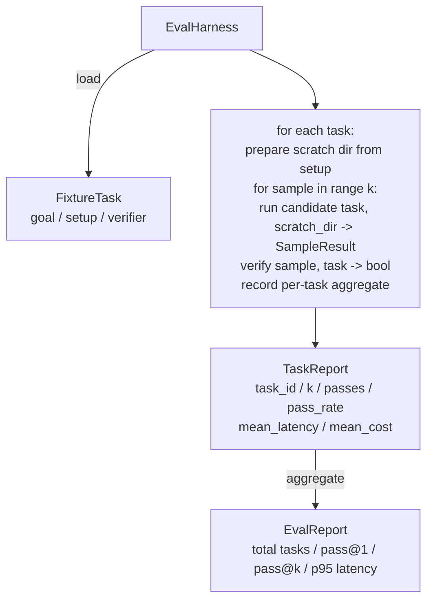

<!-- i18n:manual -->
# Capstone-урок 27: eval-харнесс на фикстурных задачах

> Кодовый агент ровно настолько хорош, насколько хорош набор задач, на котором вы его меряете. В этом уроке мы строим оценочный харнесс: он берёт папку с фикстурными задачами, прогоняет каждую через агента-кандидата, ставит «прошло / не прошло» детерминированным верификатором и сводит результаты в pass@1, pass@k, среднюю задержку и среднюю стоимость. Харнесс — источник истины, по которому регрессия отличается от рефакторинга.

**Type:** Build
**Languages:** Python (stdlib)
**Prerequisites:** Phase 19 · 25 (verification gates), Phase 19 · 26 (sandbox runner), Phase 14 · 30 (eval-driven agent development), Phase 14 · 19 (SWE-bench and GAIA benchmarks)
**Time:** ~90 minutes

## Learning Objectives

- Определить фикстурную задачу как тройку: цель, подготовка, верификатор.
- Оценивать по несколько прогонов-сэмплов на задачу и считать pass@1 и pass@k.
- Сводить задержку и стоимость в среднее и 95-й перцентиль.
- Подключать детерминированные верификаторы (сравнение файлов, код возврата, совпадение с регуляркой) как переиспользуемые функции.
- Отдавать структурированный JSON-отчёт, который умеет читать скрипт отслеживания регрессий.

> 🎒 **На пальцах.** Фикстурная задача устроена как задание из сборника: условие (цель), выданные материалы (подготовка) и ключ с ответом (верификатор). Пять фикстур из этого урока при k=5 дают 25 прогонов за один запуск — и все 25 оценивает программа, а не человек глазами.

## The Problem

Три вида отказов преследуют бенчмарки агентов, собранные без eval-харнесса.

Первый — непроверенное «прошло». Агент говорит, что починил баг, человек мельком смотрит на диф, набор помечается зелёным, а через три недели регрессионный тест вытаскивает тот же самый баг. Агент правдоподобно рассуждал, но ничего не починил.

> 🎒 **На пальцах.** Это как принять домашку по фразе «я решил» вместо того, чтобы сверить ответ. Разница в цене: проверка занимает секунды машинного времени, а найденный через три недели баг — это уже жалоба от пользователя и разбор полётов.

Второй — незамеченная регрессия. Правка шаблона промпта делает агента на 4% лучше на громкой задаче и на 14% хуже на тихой. Без золотого набора и оценки по каждой задаче регрессия въезжает в main и всплывает только тогда, когда пожалуется клиент.

> 🎒 **На пальцах.** Смотрите на цифры: +4% там, куда вы смотрите, и −14% там, куда не смотрите, — в сумме это заметное ухудшение, которое выглядит как улучшение. Спасает только оценка по каждой задаче отдельно: пятьдесят строк отчёта вместо одного среднего числа.

Третий — дрейф состава задач. Eval гоняли в понедельник на 100 задачах, а в пятницу на 95 из них, потому что кто-то переименовал пять фикстур. Доля прохождения выглядит как улучшение на 5%. Это не улучшение.

> 🎒 **На пальцах.** Посчитаем: в понедельник прошли 60 задач из 100 — это 60%. В пятницу прошли те же 60, но из 95 — уже 63,2%. Плюс три пункта из воздуха, ничего не улучшилось. Поэтому харнесс гоняет фиксированный список и падает, если задача пропала.

Харнесс — это программа, которая превращает такие отказы в факты. Он прогоняет каждую фикстуру, каждый раз, в воспроизводимом порядке, через верификатор, который возвращает истину или ложь по детерминированной проверке.

> 🎒 **На пальцах.** Ключевые слова — «каждую» и «в воспроизводимом порядке». Ручная проверка всегда выборочная: сегодня глянули три задачи, завтра другие три. Харнесс не устаёт и не выбирает, поэтому его число можно сравнивать со вчерашним.

## The Concept

```mermaid
flowchart LR
  F1[fixtures/task_001/<br/>task.json + expected/] --> Harness
  F2[fixtures/task_002/<br/>...] --> Harness
  Harness[Harness<br/>for each task:<br/>setup / run agent k samples /<br/>verify each sample /<br/>record latency, cost]
  Harness --> Report[EvalReport<br/>pass@1 / pass@k<br/>mean ms / p95 ms<br/>mean cost]
```

`FixtureTask` — это маленький JSON-файл плюс необязательная директория `expected/`. В JSON объявлены `id`, `goal` (промпт, который скармливают агенту), блок `setup` (файлы, которые надо положить в рабочую директорию) и блок `verifier`. Блок верификатора называет функцию из реестра верификаторов харнесса и передаёт ей аргументы.

> 🎒 **На пальцах.** Задача целиком описана данными, а не кодом: один JSON плюс папка с эталоном. Поэтому добавить новую задачу может любой человек в команде, не трогая харнесс, — как добавить ещё один файл в папку с тестами.

Три формы верификатора покрывают большинство полезных задач.

Первая — `file_equals`. После работы агента сравниваем названный файл с ожидаемым содержимым. Это ловит задачи вида «почини этот баг именно так».

Вторая — `regex_match`. Содержимое названного файла матчится регуляркой. Это ловит задачи вида «функция должна существовать и возвращать X», где допустимых решений много.

Третья — `shell_exit_zero`. Харнесс запускает shell-команду (через песочницу из урока 26) и засчитывает задачу, только если команда завершилась нулём. Это ловит задачи вида «тесты должны проходить».

> 🎒 **На пальцах.** Три верификатора отличаются жёсткостью. `file_equals` пропускает ровно один вариант ответа, `regex_match` — любой, где есть нужная подстрока, `shell_exit_zero` — любой, который проходит тесты. Для бага с одной строкой берите первый, для «напиши функцию» — третий, иначе будете помечать красным правильные решения.

Харнесс прогоняет каждую задачу `k` раз. Pass@k считается как `1 - (1 - p)^k`, где p — эмпирическая доля прохождения; харнесс также отдаёт сырые счётчики, чтобы вы видели разброс. Задержка — время по часам на каждый сэмпл. Стоимость — то, что агент сообщает о себе сам (число токенов, доллары или и то и другое); харнесс суммирует её по сэмплам и показывает числа по задаче и по всему прогону.

> 🎒 **На пальцах.** Подставьте в формулу: при p=0,6 и k=5 получается 1 − 0,4⁵ = 1 − 0,01024 ≈ 0,99. То есть агент, который с первой попытки прав в 60% случаев, за пять попыток решает почти всё. Сырые счётчики нужны рядом с формулой затем, чтобы отличить «3 из 5 стабильно» от «5 из 5 и 1 из 5 через раз».

```figure
pass-at-k
```

## Architecture



Кандидат — это вызываемый объект: `Callable[[FixtureTask, str], SampleResult]`. Харнесс создаёт рабочую директорию через `tempfile.mkdtemp()` и передаёт её путь обычной строкой. Харнессу всё равно, как кандидат устроен внутри. Кандидатом может быть детерминированный накатыватель патчей (удобно для самопроверки харнесса), настоящий LLM-агент, фаззер. Контракт — это SampleResult.

> 🎒 **На пальцах.** Одна сигнатура из двух аргументов — и харнесс отвязан от того, что стоит за ней. Сегодня туда подставлен скрипт с готовыми правками, завтра модель за 3 доллара на миллион токенов, и ни одна строка харнесса не меняется. Такой шов стоит искать в любой своей системе.

## What you will build

`main.py` даёт:

1. Датакласс `FixtureTask`.
2. Датакласс `SampleResult`: success_self_reported, latency_ms, cost_units, edits.
3. Датаклассы `TaskReport`, `EvalReport` с `to_dict()`.
4. `VerifierRegistry` — отображение имени верификатора в функцию. Встроенные верификаторы: file_equals, regex_match, shell_exit_zero.
5. Класс `EvalHarness`. Прогоняет директорию с задачами через кандидата. Возвращает EvalReport.
6. Пять фикстурных задач, вложенных в `tasks/`:
   - ошибка на единицу в `fizzbuzz`
   - пропущенный return в `factorial`
   - опечатка в сообщении об ошибке
   - пустое тело функции
   - ошибка на единицу в обходе связного списка
7. Детерминированный эталонный кандидат (`apply_known_fixes`), на котором харнесс показывает чистый pass@1, равный 1.0.
8. Демо печатает JSON отчёта EvalReport и завершается нулём.

> 🎒 **На пальцах.** Обратите внимание на поле `success_self_reported`: это мнение агента о себе, и оно хранится отдельно от вердикта верификатора. Именно расхождение между этими двумя полями — «агент сказал да, верификатор сказал нет» — и есть первый вид отказа из начала урока, теперь измеримый числом.

Фикстурные задачи лежат как JSON-файлы в `tasks/` плюс парные исходники в `tasks/<id>/buggy/` и `tasks/<id>/expected/`. Харнесс копирует buggy во временную директорию, отдаёт её кандидату и проверяет результат по expected.

> 🎒 **На пальцах.** Копирование во временную директорию — не формальность. Без него первый же прогон испортит эталонные файлы, и второй прогон покажет «всё прошло» на уже починенном коде. Пять задач, k=5 — это 25 свежих временных папок за запуск.

## Why pass@k and not just pass@1

Настоящие LLM-агенты стохастичны. Pass@1, равный 0.6, выглядит как провал. Pass@5, равный 0.95, говорит, что агент чаще всего находит правильный ответ, но на ранних сэмплах выбирает неудачно. Лечится это сэмплированием и ранжированием, а не обязательно дообучением. Pass@k делает это видимым.

> 🎒 **На пальцах.** Разница между 0.6 и 0.95 на одном и том же агенте — это разница между «модель не умеет» и «модель умеет, но плохо выбирает». Первое чинят обучением за недели, второе — тем, что вы генерируете 5 вариантов и берёте тот, который прошёл тесты. Второе дешевле в сотню раз.

Pass@k показывают рядом с pass@1, потому что pass@k заметает под ковёр реальный отказ: если модель находит правильный ответ один раз из двадцати, полезного агента у вас нет. Харнесс показывает оба числа.

> 🎒 **На пальцах.** Посчитайте этот крайний случай: p=0,05, k=20 даёт 1 − 0,95²⁰ ≈ 0,64. Красивые 64% в отчёте — и при этом девятнадцать бесполезных прогонов из двадцати и двадцатикратный счёт за токены. Одно pass@k без pass@1 умеет врать именно так.

## How this composes with the rest of Track A

Урок 25 дал цепочку гейтов. Урок 26 дал песочницу. Харнесс использует песочницу для любого верификатора `shell_exit_zero`. Урок 28 оборачивает каждый прогон харнесса в трассировку OTel. Урок 29 гоняет сквозное демо на одной из вложенных фикстур и проверяет, что pass@1 эталонного кандидата равен 1.0.

> 🎒 **На пальцах.** Четыре урока складываются в один конвейер: гейт решает, можно ли выполнять действие, песочница выполняет, харнесс оценивает, трассировка объясняет, куда ушло время. Каждый кусок бесполезен в одиночку — песочница без харнесса просто безопасно исполняет непонятно что.

## Running it

```bash
cd phases/19-capstone-projects/27-eval-harness-fixture-tasks
python3 code/main.py
python3 -m pytest code/tests/ -v
```

Демо печатает EvalReport в JSON, включая pass@1, pass@5, среднюю задержку и разбивку по задачам. Код возврата — ноль. Тесты покрывают функции-верификаторы, математику pass@k, загрузку фикстур и харнесс целиком на вложенном эталонном кандидате.

> 🎒 **На пальцах.** Эталонный кандидат детерминирован, поэтому его pass@1 обязан быть ровно 1.0 — не 0.98 и не «обычно проходит». Любое другое число означает баг не в агенте, а в самом харнессе: сломался верификатор, потерялась фикстура или временная директория подготовилась не так.
