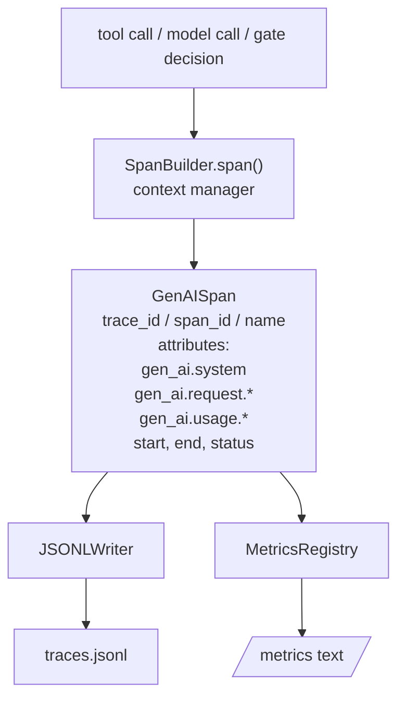
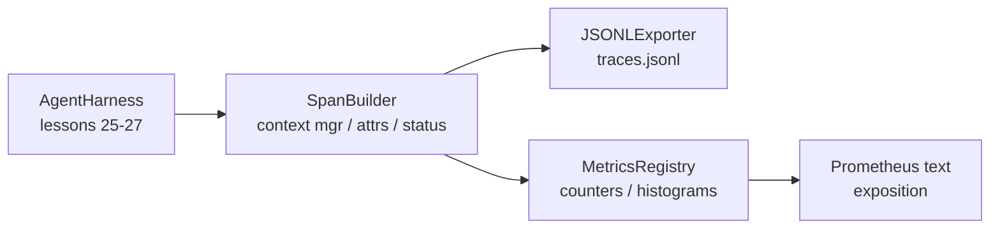

<!-- i18n:manual -->
# Capstone-урок 28: наблюдаемость на спанах OTel GenAI и метриках Prometheus

> Агентный харнесс без наблюдаемости — это чёрный ящик, который тратит деньги. В этом уроке мы руками пишем построитель спанов, который отдаёт записи, соответствующие семантическим соглашениям OpenTelemetry GenAI, пишет их в файл JSON-Lines по одному спану на строку и выставляет счётчики и гистограммы в текстовом формате Prometheus. Всё это — Python на стандартной библиотеке, и работает офлайн.

**Type:** Build
**Languages:** Python (stdlib)
**Prerequisites:** Phase 19 · 25 (verification gates), Phase 19 · 26 (sandbox), Phase 19 · 27 (eval harness), Phase 13 · 20 (OpenTelemetry GenAI), Phase 14 · 23 (OTel GenAI conventions)
**Time:** ~90 minutes

## Learning Objectives

- Собрать датакласс спана по форме семантических соглашений OpenTelemetry GenAI.
- Реализовать JSONL-экспортёр, который пишет по одному самодостаточному спану на строку.
- Построить счётчики и гистограммы с метками и выдачей в текстовом формате Prometheus.
- Обернуть любой вызываемый объект в контекстный менеджер спана, который записывает длительность, статус и исключения.
- Убедиться, что отданные спаны переживают круг через `json.loads` и совпадают с формой из спецификации.

> 🎒 **На пальцах.** Спан — это секундомер с бирками: когда началось, когда кончилось, что это было и чем закончилось. Гистограмма поверх спанов — это уже не отдельные замеры, а распределение: за час прошло 400 вызовов, из них 380 уложились в 100 мс, а 20 — нет.

## The Problem

Кодовый агент в продакшене на каждом ходу производит три класса артефактов: вызов модели, выполнение инструмента и решение гейта верификации. Без структурированной телеметрии ни один из них не приносит пользы.

Первый вид отказа — пропавшая трассировка. Во вторник что-то пошло не так, но единственная запись — это чат-лог на 500 строк. Нигде не записано, какой инструмент отработал, сколько времени занял, сколько токенов ушло в промпт и отказал ли гейт хоть в чём-нибудь. Автору агента остаётся гадать.

> 🎒 **На пальцах.** 500 строк чата — это примерно двадцать минут чтения ради одного вопроса «сколько длился вызов файла». Тот же ответ из трассировки берётся одним запросом за секунду, потому что там записано число, а не текст, в котором это число надо угадать.

Второй вид отказа — нечитаемая трассировка. Харнесс писал спаны, но имена полей придумал сам. Ни Grafana, ни Honeycomb, ни Jaeger, ни локальная CLI их не прочтут. Весь инструментарий, который уже есть у команды, пропадает зря, потому что спаны нестандартные.

> 🎒 **На пальцах.** Разница между `gen_ai.usage.input_tokens` и своим полем `tokens_in` — одна строка кода при записи и полностью нерабочий дашборд при чтении. Стандарт стоит соблюдать не из аккуратности: он превращает четыре чужих инструмента из списка выше в бесплатные для вас.

Третий вид отказа — несвёрнутая метрика. В трассировке виден один медленный вызов инструмента, но на вопрос «какая p95-задержка вызовов read_file за последний час?» ответить нечем, потому что метрик нет, есть только трейсы.

> 🎒 **На пальцах.** Трейс отвечает про один случай, метрика — про тысячу. Спан говорит «этот вызов занял 1200 мс», а метрика — «p95 за час равен 340 мс, а вчера был 90». Второе замечают до жалобы пользователя, первое — после.

Семантические соглашения OpenTelemetry GenAI существуют именно для этого. Они задают небольшой набор стандартных атрибутов, общий для тех, кто отдаёт спаны из разных LLM-фреймворков. Если ваш харнесс пишет эти атрибуты, их прочтёт любой OTel-совместимый бэкенд.

## The Concept



Каждая операция в харнессе порождает спан. У спана есть trace id (всё обращение к агенту целиком), span id (вот эта одна операция), имя (например, `gen_ai.chat`, `gen_ai.tool.execution`), атрибуты по соглашениям GenAI, время начала и конца и статус.

> 🎒 **На пальцах.** Trace id и span id соотносятся как номер заказа и номер позиции в нём: по первому вы собираете всю историю обращения, по второму — конкретный шаг. Оба это 16 байт, то есть 32 шестнадцатеричные цифры, и генерируются случайно, поэтому совпадений можно не бояться.

Соглашения GenAI стандартизуют такие ключи атрибутов: `gen_ai.system` (какой провайдер, например `anthropic`, `openai`), `gen_ai.request.model` (id модели), `gen_ai.request.max_tokens`, `gen_ai.usage.input_tokens`, `gen_ai.usage.output_tokens`, `gen_ai.response.model`, `gen_ai.response.id`, `gen_ai.operation.name` плюс специфичные для инструментов ключи `gen_ai.tool.name` и `gen_ai.tool.call.id`.

> 🎒 **На пальцах.** Пары `request.*` и `response.*` дают самую полезную сверку: попросили `claude-sonnet-4`, а ответила другая версия — и вы это видите, не залезая в логи провайдера. Пара input/output-токенов сразу даёт деньги: 12 000 входных и 800 выходных токенов на ход умножаются на прайс и превращаются в цифру за смену.

Экспортёр пишет JSONL. По одному JSON-объекту на строку. Это простейший формат, который дальше по конвейеру можно стримить, грепать и импортировать. Настоящий экспортёр OTel говорил бы по OTLP gRPC; JSONL-экспортёр из урока — его офлайновый эквивалент, и он завершается нулём на любой рабочей машине.

> 🎒 **На пальцах.** Одна строка = один спан — это не мелочь формата. Файл можно резать `head`, фильтровать `grep gen_ai.tool.name` и дочитывать по мере записи, не дожидаясь конца прогона. Обычный JSON-массив на 10 000 спанов пришлось бы загружать целиком, чтобы посмотреть первый.

Метрики живут рядом с трассировками. Счётчик увеличивается на каждый вызов инструмента: `tools_called_total{tool="read_file"}`. Гистограмма записывает наблюдаемую задержку: `tool_latency_ms{tool="read_file"}`. И то и другое сериализуется в текстовый формат Prometheus — де-факто стандарт для метрик, которые забирают опросом.

> 🎒 **На пальцах.** Метка `{tool="read_file"}` — это способ не заводить отдельную метрику на каждый инструмент. Одно имя, десять меток — и в дашборде появляются десять линий, которые можно складывать и сравнивать. Без меток у вас было бы десять несравнимых счётчиков.

```figure
trace-spans
```

## Architecture



Построитель спанов — небольшой класс с методом `span(name, attrs)`, который возвращает контекстный менеджер. Контекстный менеджер записывает время начала на входе, время конца на выходе, прикладывает исключение, если оно было брошено, и отправляет готовый спан в экспортёр.

> 🎒 **На пальцах.** Контекстный менеджер тут выбран не для красоты: он закрывает спан даже тогда, когда код внутри упал с исключением. Ручные `start()` и `stop()` в такой ситуации теряют половину спанов — а это ровно те спаны, ради которых вы завели трассировку.

Реестр метрик — это два словаря. Счётчики устроены как `{(name, frozen_labels): int}`. Гистограммы хранят сырые замеры списком и сериализуются в корзины гистограммы Prometheus в момент выдачи.

> 🎒 **На пальцах.** Ключ из имени и замороженных меток — это способ хранить `tools_called_total{tool="read_file"}` и `tools_called_total{tool="write_file"}` в одном словаре двумя разными записями. Замороженные метки нужны потому, что обычный dict нельзя положить в ключ, а frozenset пар — можно.

## What you will build

`main.py` даёт:

1. Датакласс `GenAISpan`: trace_id, span_id, parent_span_id, name, attributes, start_unix_nano, end_unix_nano, status, status_message, events.
2. Класс `SpanBuilder` с контекстным менеджером `span(name, attrs, parent=None)`.
3. Класс `JSONLExporter` с методом `export(span)`, который дописывает одну строку.
4. Классы `Counter` и `Histogram` плюс `MetricsRegistry`.
5. `prometheus_exposition(registry)`, который выдаёт результат в текстовом формате.
6. Декоратор `wrap_tool_call(name)`, который отдаёт спан и обновляет метрики.
7. Демо: синтезирует полное обращение к агенту (спан gen_ai.chat вокруг спанов инструментов), пишет traces.jsonl, печатает выдачу Prometheus, завершается нулём.

> 🎒 **На пальцах.** Поле `parent_span_id` — это то, из чего собирается дерево. Спан `gen_ai.chat` сверху, три спана инструментов под ним со ссылкой на его span id: в интерфейсе это нарисуется водопадом из четырёх полосок, где верхняя длиннее суммы нижних ровно на время самой модели.

Span id и trace id — это 16-байтовые шестнадцатеричные строки, генерируемые из `os.urandom`. Это соответствует контексту трассировки W3C в OTel. Экспортёр никогда не бросает исключений; ошибки ввода-вывода видны, но харнесс продолжает работать.

> 🎒 **На пальцах.** Правило «экспортёр не бросает» важнее, чем кажется. Наблюдаемость — вспомогательный контур, и её поломка не должна ронять полезную работу. Забился диск, куда пишется traces.jsonl, — агент обязан доделать задачу и лишь пожаловаться в лог.

Гистограмма имеет фиксированный набор корзин (значение OTel по умолчанию для задержки в миллисекундах: 5, 10, 25, 50, 100, 250, 500, 1000, 2500, 5000, 10000, +Inf). Замеры хранятся списком; выдача считает счётчики по корзинам на лету.

> 🎒 **На пальцах.** Корзин ровно 12, и растут они не линейно, а примерно втрое — 5, 10, 25, 50, 100 и так далее. Так сделано потому, что разница между 5 и 10 мс вам интересна, а между 9000 и 9500 мс — уже нет: и то и другое просто «очень долго».

## Why hand-rolled instead of opentelemetry-sdk

Python-SDK от OTel — это настоящая зависимость. Это ещё и несколько тысяч строк кода, отдельные процессы под OTLP-экспортёр и рантайм-накладные, которые не влезают в бюджет урока. Написанная руками версия учит проводному формату. В продакшене вы заводите те же атрибуты в настоящий SDK и бесплатно получаете OTLP-экспортёр, батчинг и определение ресурсов.

> 🎒 **На пальцах.** Ключевая мысль: вы учите не библиотеку, а формат. Имена атрибутов и форма спана одинаковы что в самописных 200 строках, что в нескольких тысячах строк SDK, — а переезд с одного на другое не меняет ни одного места, где вы эти атрибуты заполняете.

Соглашения стабильны. Проводной формат, который отдаёт урок, продолжит разбираться и в 2030 году, потому что OTel не ломает имена атрибутов GenAI, а только добавляет новые.

## How this composes with the rest of Track A

Урок 25 дал цепочку гейтов. Урок 26 дал песочницу. Урок 27 дал eval-харнесс. Урок 28 делает все три наблюдаемыми. Урок 29 оборачивает каждый шаг сквозного демо в спаны и печатает в конце текст Prometheus.

> 🎒 **На пальцах.** Наблюдаемость добавляют последней не случайно: сначала должно появиться то, за чем наблюдать. Обратите внимание, что уроки 25-27 при этом не переписываются — спаны навешиваются сверху обёрткой, а не вшиваются внутрь каждой функции.

## Running it

```bash
cd phases/19-capstone-projects/28-observability-otel-traces
python3 code/main.py
python3 -m pytest code/tests/ -v
```

Демо создаёт `traces.jsonl` в рабочей директории урока (в конце убирает за собой), затем печатает выборку из трёх спанов, затем печатает выдачу Prometheus по счётчикам и гистограммам. Тесты проверяют, что спаны переживают круг сериализации, что канонические атрибуты GenAI на месте, что счётчики увеличиваются правильно и что в выдаче гистограммы есть ожидаемые счётчики по корзинам.

> 🎒 **На пальцах.** «Переживают круг сериализации» — это проверка `json.loads(json.dumps(span)) == span`, и она ловит скучные, но частые беды: объект `datetime` вместо числа, ключ-кортеж, множество вместо списка. Один такой тест дешевле, чем обнаружить нечитаемый traces.jsonl через неделю.
