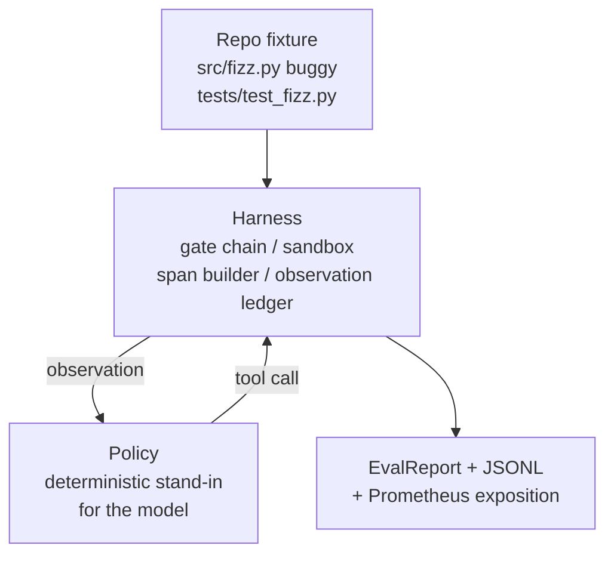
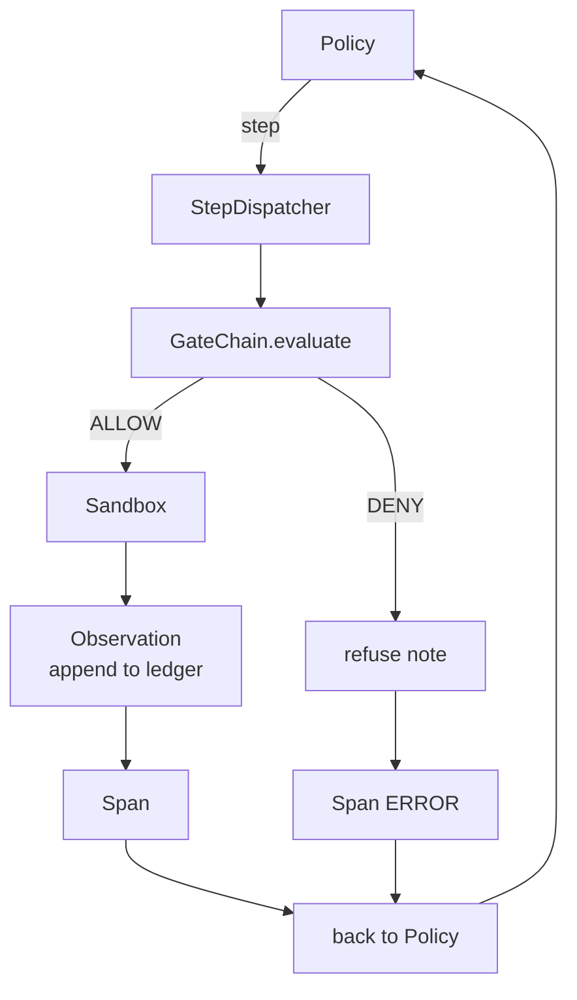

<!-- i18n:manual -->
# Capstone-урок 29: сквозной кодовый агент на харнессе

> Награда за весь Track A. В этом уроке цепочка гейтов, песочница, eval-харнесс и спаны OTel сшиваются в одного работающего кодового агента, который чинит настоящий (маленький, размером с фикстуру) баг в многофайловом Python-проекте. Агент — это детерминированная политика, а не LLM; такая замена делает урок воспроизводимым и показывает, что всё интересное с самого начала было в харнессе. Контракт при этом ровно тот же: настоящая модель подключается в шов политики.

**Type:** Build
**Languages:** Python (stdlib)
**Prerequisites:** Phase 19 · 25 (verification gates), Phase 19 · 26 (sandbox), Phase 19 · 27 (eval harness), Phase 19 · 28 (observability), Phase 14 · 38 (verification gates), Phase 14 · 41 (workbench for real repos), Phase 14 · 42 (agent workbench capstone)
**Time:** ~90 minutes

## Learning Objectives

- Собрать цепочку гейтов, песочницу, eval-харнесс и построитель спанов в один цикл агента.
- Реализовать детерминированную политику, которая чинит фикстурный баг через read_file, run_tests и write_file.
- Соблюдать глобальный бюджет шагов плюс бюджет токенов наблюдений на протяжении всего сквозного прогона.
- Отдавать полные трассировки OTel GenAI и метрики Prometheus за весь прогон.
- Проверить, что агент решает фикстуру меньше чем за 12 шагов и без единого срабатывания гейта на разрешённых инструментах.

> 🎒 **На пальцах.** Два бюджета сразу — это как ограничение и по числу ходов, и по объёму сказанного. Шагов не больше 12, а наблюдений — не больше отведённых токенов, и оба счётчика живут в харнессе, а не в голове агента. Политика из пяти состояний укладывается в 5 шагов, так что запас есть больше чем двукратный.

## The Problem

Большинство демо про агентов работают по отдельности: песочница сама по себе, eval-харнесс сам по себе, отдатчик спанов сам по себе. Выглядят они нормально. Соберите их вместе — и швы полезут наружу.

Цепочка гейтов говорит ALLOW, а песочница отказывает по причине, которую цепочка не предусмотрела. Eval-харнесс записал прохождение, а спаны OTel говорят, что гейт отказал в том самом инструменте, которым агент якобы пользовался. Счётчик Prometheus увеличивается дважды там, где должен увеличиться один раз. Бюджет наблюдений превышен, но агент продолжил идти, потому что бюджет считался в цепочке, а песочница об этом не знала.

> 🎒 **На пальцах.** Все четыре беды — про рассинхрон между компонентами, а не про баг внутри компонента. Каждый из четырёх кусков прошёл свои тесты и всё равно врёт в паре с соседом: счётчик, увеличенный дважды, даёт ровно двукратную ошибку в цене инструмента на дашборде.

Этот урок — интеграционный тест для всего трека. Агент должен сделать четыре вещи по порядку: прочитать проект, прогнать тесты, определить баг по падению теста, написать исправление, перепрогнать тесты и остановиться. Каждая операция идёт через цепочку гейтов. Каждое выполнение инструмента идёт через песочницу. Каждый шаг обёрнут в спан. Eval-харнесс в конце оценивает всё целиком.

> 🎒 **На пальцах.** Обратите внимание на слово «каждая»: ни один инструмент не имеет права выполниться в обход гейта и песочницы. Как раз это правило и ловит рассинхроны — если хоть один путь идёт мимо, у вас появится действие без спана, и в трассировке будет 11 записей на 12 шагов.

## The Concept



Политика агента — это конечный автомат. Пять состояний.

`SURVEY`: агент читает список файлов проекта. Следующее состояние — RUN_TESTS.

`RUN_TESTS`: агент запускает команду тестов. Если тесты проходят, автомат останавливается с успехом. Иначе следующее состояние — INSPECT.

`INSPECT`: агент читает упавший исходный файл. Следующее состояние — FIX.

`FIX`: агент записывает исправленный файл. Следующее состояние — VERIFY.

`VERIFY`: агент снова запускает команду тестов. Если тесты проходят — остановка с успехом. Иначе — остановка с неудачей.

> 🎒 **На пальцах.** Заметьте, что тесты гоняются дважды: до правки и после. Первый прогон нужен не для проверки, а как источник информации — из текста падения агент узнаёт, какой файл и какую строку чинить. Без первого RUN_TESTS у политики просто нет входных данных для FIX.

Каждое состояние соответствует одному вызову инструмента. Каждый вызов инструмента проходит через цепочку гейтов. Если вызову отказано, агент фиксирует отказ в трассировке и останавливается.

> 🎒 **На пальцах.** «Одно состояние — один вызов инструмента» превращает бюджет шагов в понятную величину: пять состояний, пять шагов, лимит 12. Если счётчик добрался до 12, значит автомат где-то зациклился между RUN_TESTS и FIX, и бюджет остановил его вместо того, чтобы дать жечь деньги дальше.

Баг в фикстуре — ошибка на единицу в `fizz.py`. Детерминированная политика определяет баг по сообщению о падении теста через регулярку и выдаёт исправленный файл. Замена политики на LLM не меняет контракт харнесса.

> 🎒 **На пальцах.** Регулярка здесь ровно на месте LLM: и то и другое читает текст падения и решает, что писать в файл. Отличается только надёжность и цена — регулярка права всегда и стоит ноль, модель права примерно всегда и стоит центы. Всё, что вокруг неё, не меняется ни на строку.

```figure
cg-harness-weave
```

## Architecture



Урок самодостаточен. Каждый примитив из предыдущих уроков переписан в минимальном масштабе прямо в `main.py` (гейт, песочница, журнал, спан), чтобы урок работал без импорта соседей. Имена в точности совпадают с уроками 25-28, поэтому соответствие понятий однозначно.

> 🎒 **На пальцах.** Это осознанный размен: немного дублирования кода в обмен на файл, который запускается сам по себе, без установки и без путей к соседним урокам. Совпадение имён — то, что делает размен безопасным: увидев `GateChain`, вы знаете, что это тот же самый `GateChain` из урока 25, только короче.

## What you will build

`main.py` даёт:

1. Минимальные примитивы харнесса, скопированные под теми же именами, что в уроках 25-28: `GateChain`, `Sandbox`, `ObservationLedger`, `SpanBuilder`, `MetricsRegistry`.
2. Класс `CodingAgentPolicy`: конечный автомат из пяти состояний.
3. Помощник `Repo`: готовит временную директорию с вложенной багованной фикстурой.
4. Класс `AgentRun`: крутит политику, разводит вызовы через харнесс, возвращает `AgentRunReport`.
5. Вложенная фикстура (`fixture_repo/`) с src/fizz.py, tests/test_fizz.py и деревом expected/ для eval-харнесса.
6. Демо: гоняет политику от начала до конца, печатает пошаговую трассировку, проверяет прохождение, печатает метрики.

> 🎒 **На пальцах.** `ObservationLedger` — самый недооценённый пункт списка. Именно он копит текст, который вернули инструменты, и следит за бюджетом токенов наблюдений: один `cat` большого файла легко даёт 20 000 токенов и съедает бюджет целиком на втором шаге из пяти.

Вложенная фикстура повторяет форму задач из урока 27: багованный файл и файл с тестами. Сообщение о падении теста содержит достаточно информации, чтобы детерминированная политика определила исправление. Настоящая LLM сделала бы ту же работу медленнее и с более широким кругозором, но ожидания харнесса от этого не изменились бы.

> 🎒 **На пальцах.** Одинаковая форма фикстур в уроках 27 и 29 — не совпадение, а требование: сквозной прогон обязан оцениваться тем же харнессом, что и остальные пять задач. Иначе вы получите два разных набора чисел и не сможете сказать, стало лучше или хуже.

## Why the policy is not an LLM

Настоящая LLM требует API-ключа, сетевого вызова и непроверяемой стохастичности. Уроку важен именно харнесс. Подстановка детерминированной политики позволяет уроку запускаться на любом ноутбуке разработчика без единой внешней зависимости, а тестам — проверять точное число шагов.

> 🎒 **На пальцах.** Ключевое слово — «точное». С моделью тест мог бы утверждать разве что «уложился в 12 шагов», с детерминированной политикой — «ровно 5 шагов, и вот их порядок». Такая жёсткая проверка ловит лишний вызов инструмента, который у стохастического агента списали бы на настроение модели.

Политика урока — строгое подмножество того, что делает LLM-агент. Политика читает репозиторий, видит упавший тест, находит строку и выдаёт исправление. LLM проходит тот же цикл по тому же контракту харнесса; бухгалтерия при этом идентична.

## What the demo asserts

Сквозное демо проверяет пять вещей в момент выхода, а набор тестов подтверждает их же программно.

Политика решила фикстуру меньше чем за 12 шагов.

Бюджет наблюдений ни разу не был превышен.

Ни одного отказа гейта на разрешённых инструментах. (Агент ни разу не выдумал запрещённое имя инструмента.)

У каждого шага есть соответствующий спан в traces.jsonl.

Выдача Prometheus содержит запись `tools_called_total{tool="read_file"}` и гистограмму `tool_latency_ms`.

> 🎒 **На пальцах.** Пять проверок покрывают пять разных компонентов: политику, журнал наблюдений, гейт, спаны и метрики. Уберите любую — и соответствующий кусок сможет тихо сломаться. Особенно полезна четвёртая: она сверяет число шагов с числом спанов, и это единственный способ поймать действие, выполненное в обход трассировки.

## How this composes with the rest of Track A

Этот урок и есть интеграция. Урок 25 написал цепочку гейтов. Урок 26 написал песочницу. Урок 27 написал eval-харнесс. Урок 28 написал наблюдаемость. Урок 29 доказывает, что они работают как система. Настоящий агентный харнесс вырастает отсюда: меняете детерминированную политику на модель, вложенную фикстуру — на задачу из настоящего репозитория, JSONL-экспортёр — на OTLP.

> 🎒 **На пальцах.** Три замены в последнем предложении — это ваш план на после курса, и каждая трогает ровно один шов. Полезно проверить себя вопросом: сколько файлов придётся изменить, чтобы подставить модель вместо политики? Если ответ больше одного, швы проведены неправильно.

## Running it

```bash
cd phases/19-capstone-projects/29-end-to-end-coding-task-demo
python3 code/main.py
python3 -m pytest code/tests/ -v
```

Демо печатает пошаговую трассировку, итоговый отчёт eval и выдачу Prometheus. Код возврата — ноль. Тесты покрывают переходы состояний политики, отказы гейта на синтетических вызовах инструментов, сквозной прогон на вложенной фикстуре и инварианты бюджета шагов.

> 🎒 **На пальцах.** Пошаговая трассировка в выводе — самое ценное для отладки: пять строк вида «состояние → инструмент → вердикт гейта → длительность». Прочитав их сверху вниз, вы за десять секунд понимаете, где агент застрял, и это тот же способ чтения, которым вы будете пользоваться с настоящей моделью на сотне шагов.
