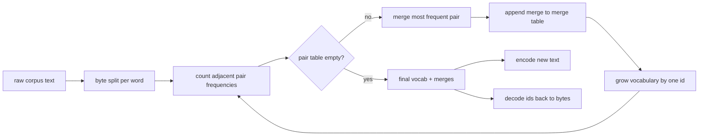
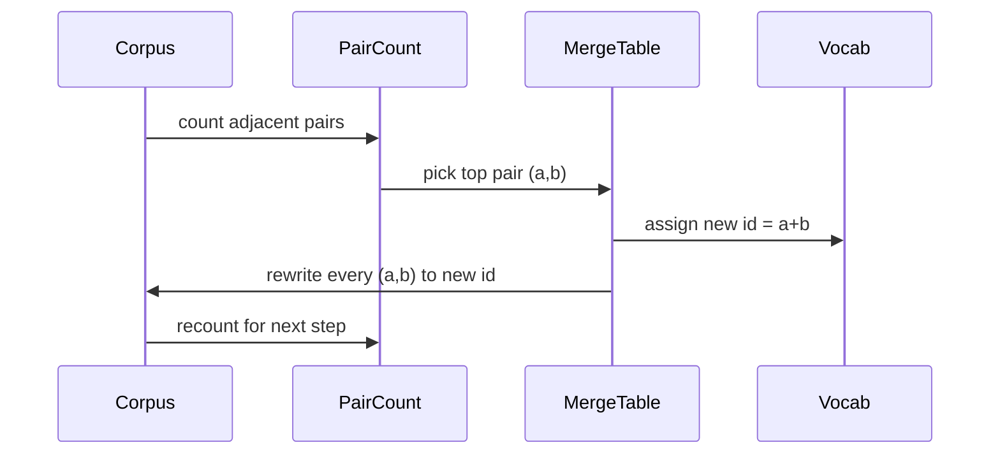

<!-- i18n:manual -->
# BPE-токенизатор с нуля

> Байты на входе, id на выходе, id обратно в те же самые байты. Собираем токенизатор, с которого до сих пор стартует любая современная текстовая модель.

**Type:** Build
**Languages:** Python
**Prerequisites:** Phase 04 lessons, Phase 07 transformer lessons
**Time:** ~90 minutes

## Learning Objectives
- Обучить словарь Byte-Pair Encoding на сыром текстовом корпусе, раз за разом сливая самую частую пару соседних символов.
- Реализовать детерминированную таблицу merges и применить её к новому тексту, чтобы получить поток subword-id.
- Прогнать произвольный UTF-8 в id и обратно без потери информации.
- Зарезервировать и защитить специальные токены (`<|endoftext|>`, `<|pad|>`), чтобы они пережили и обучение, и декодирование.
- Разобраться, почему байтовый алфавит — правильный фундамент для универсального токенизатора.

```figure
cap-bpe-merge
```

> 🎒 **На пальцах.** BPE — это архиватор для слов. Он смотрит, какие пары букв в корпусе встречаются чаще всего, и заводит для каждой такой пары отдельный короткий значок. Слово «низкоуровневый» после обучения превращается не в 26 отдельных символов, а в три-четыре куска вроде «низк», «оуров», «невый».

## The frame

Языковая модель никогда не видит текст. Она видит целые числа. Отображение из строки в список чисел и обратно — это и есть токенизатор. Ошибитесь на этом слое, и любая кривая loss в обучении будет мерить не то, что вы думаете.

Главное семейство subword-токенизаторов для текстовых моделей общего назначения — Byte-Pair Encoding. Идея маленькая. Начните с известного алфавита. Найдите пару соседних символов, которая чаще всего встречается в обучающем корпусе. Слейте её в новый символ. Повторяйте, пока словарь не дорастёт до нужного размера. Кодирование нового текста переиспользует тот же список merges в том же порядке.

Мы построим байтовый вариант. Алфавит — это 256 сырых байтов, а не кодовые точки Unicode. Именно этот выбор позволяет токенизатору проглотить любой UTF-8 и ни разу не свалиться в unknown-токен.

> 🎒 **На пальцах.** «Модель видит числа» — это буквально. Слово «cat» до всякого обучения — это байты 99, 97, 116, то есть три id из первых 256. Всё, что делает BPE дальше, — учит модель писать те же три байта одним номером, если сочетание «cat» встречается достаточно часто.

> 🎒 **На пальцах.** Прокрутите алгоритм на строке «aaabdaaabac» руками. Самая частая пара — «aa», встречается 4 раза; заменяем её на Z, получаем «ZabdZabac». Теперь самая частая пара — «Za» (2 раза), заменяем на Y: «YbdYbac». Строка укоротилась с 11 символов до 7, а словарь вырос на два значка. Вот и весь BPE.

## The pipeline



Сторона обучения и сторона инференса делят одну таблицу merges. Это разделение и есть контракт. Поменяете порядок merges на инференсе — раскодируете совсем другой поток id.

> 🎒 **На пальцах.** Таблица merges — как словарь сокращений, которым вы и пишете, и читаете. Если вы записали «спб» в значении «Санкт-Петербург», а читатель понимает «спб» как «сборник песен», текст формально прочитан, а смысл потерян. Ровно так же модель, обученная с одной таблицей merges, на другой таблице выдаёт мусор.

## The byte alphabet

Первые 256 id зарезервированы под сырые байты от 0x00 до 0xFF. Это гарантирует, что любую входную строку можно выразить в словаре ещё до первого merge. После байтового блока мы резервируем небольшой диапазон под специальные токены. Обучающий цикл никогда не предложит эти id в качестве целей merge, потому что мы вообще не пускаем их в предварительно нарезанный поток.

Пре-токенизатор режет корпус по границам пробелов и пунктуации ещё до того, как его увидит обучение. Без этого разбиения шаг merge с радостью выучил бы слияния через границы слов, и словарь забился бы целыми ходовыми фразами. С разбиением merges остаются внутри слова, и результат обобщается.

> 🎒 **На пальцах.** 256 базовых id закрывают всё, что вообще может лежать в файле, поэтому токен `[UNK]` тут физически невозможен. Эмодзи «🔥» — это 4 байта UTF-8, то есть четыре id из базового блока; китайский иероглиф — три байта. Токенизатор их не понимает, но и не роняет.

> 🎒 **На пальцах.** Что было бы без пре-токенизатора: в корпусе про новости пара «of the» встречается тысячи раз, и BPE честно выучил бы её одним токеном. Звучит выгодно, но такой токен работает только в этом сочетании — на слове «the» в начале предложения он бесполезен. Разбиение по пробелам заставляет алгоритм тратить словарь на куски, которые переиспользуются везде.

## The training loop

На каждом шаге обучения цикл делает три вещи. Он проходит по каждому слову корпуса и считает, как часто встречается каждая пара соседних текущих символов, взвешивая счёт тем, как часто встречается само слово. Он выбирает пару с максимальным счётом. Он переписывает каждое вхождение этой пары в один новый символ, id которого — следующий свободный слот в словаре. Затем он записывает merge.



Цена каждого шага линейна по размеру корпуса, представленного как список последовательностей символов. Для миллиона слов и целевого словаря в десять тысяч id цикл добегает до конца за секунды, потому что последовательности символов укорачиваются по мере того, как приземляются merges.

> 🎒 **На пальцах.** Взвешивание по частоте слова экономит уйму работы. Если «the» встречается в корпусе 50 000 раз, вы не проходите по нему 50 000 раз — вы один раз считаете пару (t, h) и прибавляете к ней сразу 50 000. Корпус хранится как словарь «слово → сколько раз», а не как длинная простыня текста.

> 🎒 **На пальцах.** Почему цикл не тормозит: после каждого merge последовательности становятся короче. Слово «tokenizer» стартует как 9 символов, а к трёхсотому merge может ужаться до трёх («token», «iz», «er»). Работы на следующем шаге меньше, чем на предыдущем, — поэтому десять тысяч шагов проходят за секунды, а не за часы.

## Encoding fresh text

Инференс не вызывает счётчик пар. Он применяет таблицу merges в том же порядке, в котором она была выучена. Для нового слова кодировщик стартует с побайтового разбиения. Он сканирует текущую последовательность в поисках merge с наименьшим рангом (самого раннего из применимых). Он выполняет этот merge. Он сканирует заново. Цикл заканчивается, когда ни один merge из таблицы к текущей последовательности не применим.

Упорядочивание по рангу — это то свойство, которое делает кодирование детерминированным и повторяет поведение обучения на том же входе. Merge, выученный первым, стоит в начале таблицы и применяется первым. Если два merges могли бы примениться в одной позиции, побеждает тот, у кого ранг меньше.

> 🎒 **На пальцах.** Ранг — это просто номер строки в таблице merges: выученный первым получает ранг 0. Кодируем «lower»: сначала сработает merge (l, o) с рангом 5, потом (lo, w) с рангом 40, потом (er) с рангом 12 — порядок применения задаёт таблица, а не позиция в слове. Слово каждый раз кодируется одинаково, хоть с первого запуска, хоть с тысячного.

> 🎒 **На пальцах.** Пример конфликта: в слове «aaa» пара (a, a) применима и в позиции 0, и в позиции 1. Правило «побеждает младший ранг, а при равных рангах — левая позиция» снимает неоднозначность: сливаем первые две «a», третья остаётся отдельной. Без такого правила два запуска на одном тексте дали бы разные id, и модель училась бы на плывущих данных.

## Special tokens

Специальные токены — это id, которые байтовый поток породить не может никогда. Мы резервируем их руками. Для этого урока хватит двух.

- `<|endoftext|>` разделяет документы во время предобучения. Он говорит модели: «здесь начинается новый документ, не давай контексту предыдущего просочиться сюда».
- `<|pad|>` добивает короткие последовательности, чтобы батч стал прямоугольным тензором. Маска loss прячет его во время обучения.

Кодировщик принимает флаг, разрешающий специальные токены во входе. С выключенным флагом строки `<|endoftext|>` и `<|pad|>` токенизируются как байты, которыми они написаны. С включённым — буквальные строки отображаются в свои зарезервированные id и не подпадают ни под один merge.

> 🎒 **На пальцах.** Флаг важнее, чем кажется. Строка `<|endoftext|>` — это 13 обычных символов; с выключенным флагом вы получите около десятка id из байтового блока, с включённым — ровно один зарезервированный номер. Флаг выключают, когда токенизируют пользовательский ввод: иначе кто угодно сможет вписать `<|endoftext|>` в свой промпт и оборвать модели контекст.

## Round-trip guarantee

Кодирование с последующим декодированием обязано вернуть входные байты в точности. Декодер по порядку склеивает байтовое разворачивание каждого id. Поскольку каждый id — это либо сырой байт, либо склейка двух ранее известных id, рекурсивное разворачивание всегда упирается в сырые байты. Дальше декодирование возвращает UTF-8-строку, которую эти байты составляют.

Набор тестов в этом уроке проверяет это свойство на невиданном предложении, на предложении с эмодзи Unicode и на предложении, содержащем буквальный токен `<|endoftext|>`.

> 🎒 **На пальцах.** Каждый id — это маленькое дерево. Пусть id 300 = (id 101, id 116), то есть байты «e» и «t». Тогда id 450 = (id 300, id 115) разворачивается в «et» + «s» = «ets». Разворачивание всегда заканчивается, потому что каждый новый id собран строго из более ранних, а самые ранние — это те самые 256 байтов, дальше которых спускаться некуда.

## What this lesson does not do

Он не строит пре-токенизатор на регулярках в стиле самых больших продакшен-токенизаторов. Пре-токенизатор здесь — это маленькое разбиение по пробелам и пунктуации. Его достаточно, чтобы получить осмысленные merges на небольшом обучающем корпусе, а контракт с остальной цепочкой уроков остаётся тем же. Следующий урок относится к токенизатору как к чёрному ящику и строит поверх него датасет со скользящим окном.

Он не распараллеливает счётчик пар. Цикл на Python по корпусу в несколько тысяч слов отрабатывает сильно меньше чем за секунду. Для корпусов побольше очевидный ход — считать пары по словам параллельно и потом свести результаты.

> 🎒 **На пальцах.** Разница между нашим пре-токенизатором и боевым — примерно как между «порезать по пробелам» и регуляркой GPT-2 на полстроки, которая отдельно обрабатывает сокращения, числа и ведущие пробелы. На корпусе в пару тысяч слов вы этой разницы не заметите; на 15 триллионах токенов она стоит процентов сжатия, то есть денег.

## How to read the code

`main.py` определяет четыре объекта. `BPETokenizer` хранит словарь, таблицу merges и таблицу специальных токенов. `train` — обучающий цикл. `encode` — путь инференса. `decode` — склейка байтов. Демо внизу обучает маленький токенизатор на встроенном корпусе, кодирует отложенное предложение, декодирует id обратно и печатает и то, и другое. Тесты в `code/tests/test_bpe.py` фиксируют свойство round-trip, резервирование специальных токенов и порядок merges.

Запустите демо. Потом поменяйте целевой размер словаря в демо с 300 на 600 и посмотрите, как падает длина закодированного отложенного предложения. Эта кривая и есть кривая сжатия BPE.

> 🎒 **На пальцах.** Кривая сжатия выходит вогнутой, и это стоит увидеть своими глазами. Первые триста merges режут длину сильно — они забирают самые частые куски вроде « the» и «ing». Следующие триста дают куда меньше: остались редкие сочетания. Отсюда практический вывод — удваивать словарь ради пары процентов длины обычно невыгодно, потому что таблица эмбеддингов растёт при этом ровно вдвое.
