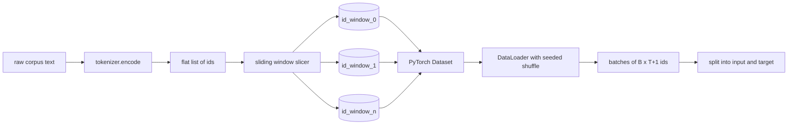
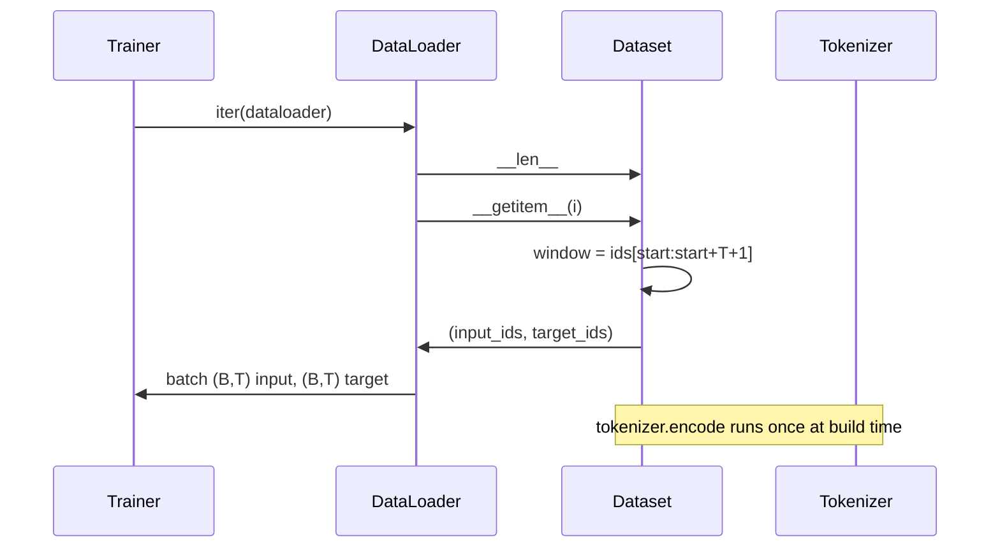

<!-- i18n:manual -->
# Токенизированный датасет со скользящим окном

> Прогон предобучения — это функция из id токенов в градиенты. Этот урок строит конвейер, который подаёт id на вход.

**Type:** Build
**Languages:** Python
**Prerequisites:** Phase 04 lessons, Phase 07 transformer lessons, Lesson 30 of this phase
**Time:** ~90 minutes

## Learning Objectives
- Превратить сырой корпус в поток id токенов одним вызовом токенизатора.
- Нарезать поток id на окна фиксированной длины с настраиваемым шагом перекрытия.
- Собрать PyTorch Dataset, который возвращает входной и целевой тензоры для предсказания следующего токена.
- Обернуть датасет в DataLoader с детерминированным перемешиванием, засеянным на каждую эпоху.
- Разобраться в компромиссе между шагом, избыточностью и эффективным размером датасета.

```figure
cap-sliding-window
```

> 🎒 **На пальцах.** Скользящее окно — это нарезка батона. Длина куска — это `T`, а шаг ножа — это `stride`. Режете шагом в целый кусок — получаете обычные ломти без нахлёста. Режете шагом в полкуска — ломтей вдвое больше, и каждый наполовину повторяет предыдущий.

## The frame

Прогон предобучения читает по одному батчу id токенов за раз и обновляет модель. Форма каждого батча зафиксирована контрактом обучения. Для причинной языковой модели батч держит входные id формы `(B, T)` и целевые id формы `(B, T)`, где цель — это вход, сдвинутый влево на единицу. Задача пайплайна данных — производить этот контракт по требованию, детерминированно и воспроизводимо, из корпуса, который может весить несколько гигабайт сырого текста.

Этот урок строит такой пайплайн. Токенизатор из предыдущего урока превращает текст в длинный плоский список id. Скользящее окно нарезает этот список на обучающие примеры. Свой Dataset отдаёт примеры как тензоры. DataLoader собирает их в батчи и перемешивает с известным seed.

> 🎒 **На пальцах.** «Цель — это вход, сдвинутый влево на единицу» звучит мутно, пока не подставишь числа. Пусть поток id это `[5, 9, 2, 7]`, а `T = 3`. Тогда вход — `[5, 9, 2]`, цель — `[9, 2, 7]`. Модель на позиции 0 видит 5 и должна назвать 9, на позиции 1 видит 5 и 9 и должна назвать 2. Один кусок текста даёт сразу три задачи «угадай следующий токен».

> 🎒 **На пальцах.** Слово «детерминированно» здесь не про аккуратность, а про отладку. Если два прогона видят данные в разном порядке, вы не сможете сказать, из-за чего разошлись кривые loss — из-за нового learning rate или из-за того, что во втором прогоне тяжёлые примеры случайно попали в начало.

## The shape contract

Причинная LM потребляет id формы `(B, T)`, где `B` — размер батча, а `T` — длина контекста. Цель на позиции `t` — это вход на позиции `t+1`. Значит, каждый обучающий пример покрывает `T+1` сырых id. Шаг окна управляет тем, сколько перекрытия остаётся между соседними примерами.



Нарезчик никогда не заезжает за границу корпуса. Если последнему окну не хватает id, чтобы заполнить `T+1` позиций, нарезчик его выбрасывает. Добить хвост токенами `<|pad|>` — тоже допустимый выбор, но он усложняет маску loss. В этом уроке мы выбрасываем.

> 🎒 **На пальцах.** Обратите внимание на `T+1`, а не `T`. При длине контекста 16 из потока надо вырезать 17 id: первые 16 пойдут во вход, последние 16 — в цель, и они перекрываются по 15 штукам. Забудете эту единицу — и последний токен окна останется без правильного ответа.

> 🎒 **На пальцах.** Выбросить хвост дешевле, чем кажется. Из потока в миллион id при `T = 16` вы теряете максимум 16 последних id — это 0,0016% данных. А альтернатива — тащить через весь код маску loss, которая прячет `<|pad|>` от функции потерь, и ловить баги, когда её где-нибудь забыли применить.

## Why a sliding window

Корпус предобучения — это один длинный поток id. Если бы модель видела только непересекающиеся окна, каждый обучающий пример учил бы её одним и тем же границам `T`. Подкрутив шаг, эти границы можно двигать, и модель увидит более разнообразные задачи «предскажи следующий токен».

Шаг, равный `T`, даёт непересекающиеся окна. Шаг `T // 2` даёт пятидесятипроцентное перекрытие и удваивает эффективный датасет. Шаг `1` даёт максимальное перекрытие и увеличивает датасет в `T` раз. Цена — больше вычислений на эпоху. Выгода — больше разнообразия границ. Большинство прогонов предобучения берут шаг, равный длине контекста, потому что корпус и так намного больше, чем модель успеет пройти за одну эпоху, — а значит, аргумент про разнообразие границ слабеет.

> 🎒 **На пальцах.** Посчитайте на потоке из 1000 id при `T = 16`. Шаг 16 даёт 62 примера, шаг 8 — уже 123, шаг 1 — 984. Данные одни и те же, но эпоха при шаге 1 длиннее в шестнадцать раз. Вы не добавили информации, вы добавили счёта.

> 🎒 **На пальцах.** Правило простое: маленький шаг — для маленьких датасетов, где данных физически мало и надо выжать из них всё. Для предобучения на терабайтах текста модель не успевает пройти корпус даже один раз, поэтому перекрытие там — чистая трата GPU-часов, и все ставят шаг ровно `T`.

## The Dataset class

У PyTorch Dataset два обязательных метода. `__len__` возвращает количество примеров. `__getitem__` возвращает один пример парой тензоров. Наш Dataset хранит закодированный поток id и шаг. Индексация в него вычисляет начало окна на лету, поэтому память стоит одну копию потока id независимо от того, сколько примеров породил шаг.



Сдвиг на единицу происходит внутри `__getitem__`. Dataset возвращает `(input, target)`, где `input = window[:-1]`, а `target = window[1:]`. Оба — длинные тензоры PyTorch. Обучающий цикл считает их истиной в последней инстанции.

> 🎒 **На пальцах.** Вот где экономия: при шаге 1 у вас 984 примера, но в памяти лежит по-прежнему один поток на 1000 чисел. `__getitem__(i)` просто считает `start = i * stride` и берёт срез. Если бы вы заранее материализовали все 984 окна по 17 чисел, вышло бы 16 728 чисел вместо 1000 — в шестнадцать раз больше памяти на ровном месте.

> 🎒 **На пальцах.** `window[:-1]` и `window[1:]` — это одно и то же окно, сдвинутое на одну позицию. Из окна `[5, 9, 2, 7]` получается вход `[5, 9, 2]` и цель `[9, 2, 7]`. Никакой отдельной разметки для предобучения не нужно: сам текст и есть свои собственные правильные ответы, поэтому это и называется self-supervised.

## Deterministic shuffle

DataLoader с `shuffle=True` читает из генератора случайных чисел PyTorch. Передав явный `torch.Generator`, засеянный на каждую эпоху, мы получаем одно и то же перемешивание при каждом перезапуске прогона. Это свойство важно, когда вы хотите сравнить два прогона, отличающихся ровно одним гиперпараметром. Без seed два прогона видят данные в разном порядке, и кривые loss расходятся по причинам, не связанным с изменением.

Контракт seed в этом уроке простой. `epoch_seed = base_seed + epoch_index`. Базовый seed передаётся при конструировании. Индекс эпохи трейнер увеличивает в начале каждой эпохи. Перезапуск с тем же базовым seed всегда видит тот же порядок в каждой эпохе.

> 🎒 **На пальцах.** Почему `base_seed + epoch_index`, а не один seed на весь прогон: если seed не менять, все эпохи пройдут в одном и том же порядке, и модель начнёт запоминать не только данные, но и их последовательность. Прибавление номера эпохи даёт новый порядок каждый раз — и при этом полностью воспроизводимый, потому что номер эпохи известен заранее.

> 🎒 **На пальцах.** Практическая польза: упал прогон на эпохе 7 — вы перезапускаетесь с `base_seed` и `epoch_index = 7` и получаете ровно тот порядок данных, который был бы без падения. Без этого «продолжение с чекпоинта» тихо превращается в другой эксперимент.

## Batch sampler

Сэмплер по умолчанию в PyTorch берёт индексы равномерно случайно, без возвращения. Для предобучения нам ровно это и нужно. Для дообучения на маленьком датасете контракт тот же. DataLoader собирает батч, вызывая `__getitem__` `B` раз и складывая результаты в стопку. Поскольку все примеры по построению одной длины, никакой логики паддинга не нужно.

Урок держит `num_workers=0` ради простоты. В боевом прогоне воркеры распараллеливают вызовы `__getitem__`. В нашем пайплайне это почти пустая операция, потому что работа сводится к срезу тензора в памяти, но тот же API Dataset поддерживает воркеров без проблем.

> 🎒 **На пальцах.** «Без возвращения» значит, что за эпоху каждый пример встретится ровно один раз — просто в перемешанном порядке. Это не мелочь: с возвращением какие-то примеры попали бы в эпоху дважды, а какие-то ни разу, и понятие «модель прошла корпус один раз» перестало бы что-либо значить.

> 🎒 **На пальцах.** Отсутствие паддинга — прямое следствие нарезки окнами. Все примеры ровно по `T+1` id, поэтому `torch.stack` из 32 штук просто даёт тензор `(32, 17)`. В задачах дообучения на диалогах, где реплики разной длины, эта роскошь исчезает и приходится городить collate-функцию с паддингом и маской.

## Counting examples

Для потока id длины `N`, длины контекста `T` и шага `S` количество примеров равно `max(0, 1 + (N - (T + 1)) // S)`. Урок выставляет этот расчёт статическим методом на Dataset, чтобы трейнер мог посчитать общее число шагов на эпоху, не перебирая датасет.

> 🎒 **На пальцах.** Подставьте `N = 1000`, `T = 16`, `S = 16`: получаем `1 + (1000 - 17) // 16 = 1 + 61 = 62` примера. Единица снаружи — это самое первое окно, которое стартует с нуля и никакого шага не требует. `max(0, ...)` спасает от отрицательного ответа, когда поток короче одного окна.

## What this lesson does not do

Он не стримит с диска. Корпус кодируется целиком в память и держится одним тензором. Для корпуса в несколько миллионов id это заметно меньше сотни мегабайт и правильная форма для урока. Стриминг с диска — отдельная забота, которая подключается заменой хранилища, но сохраняет контракт Dataset.

Он не работает с несколькими документами. Корпус трактуется как один непрерывный поток id. Граница следующего документа кодируется вставкой id `<|endoftext|>`, когда корпус собирается из нескольких документов. Модель учится предсказывать вокруг этой границы.

> 🎒 **На пальцах.** Без `<|endoftext|>` между документами окно может начаться в конце рецепта борща и закончиться в начале статьи про налоги — и модель будет честно учиться, что после «посолить по вкусу» идёт «согласно пункту 3». Специальный токен на стыке — это сигнал «дальше не продолжение, а новый текст».

## How to read the code

`main.py` определяет два класса и один хелпер. `SlidingWindowDataset` — это PyTorch Dataset. `make_dataloader` возвращает настроенный DataLoader с засеянным генератором. `_encode_corpus_to_ids` — тот самый одноразовый вызов токенизатора. Демо внизу собирает маленький токенизатор прямо в процессе, кодирует встроенный корпус, конструирует датасет и даталоадер, печатает один батч и проверяет контракт формы. Тесты в `code/tests/test_dataset.py` фиксируют формулу количества окон, свойство сдвига на единицу, детерминированное перемешивание и компромисс по шагу.

Запустите демо. Потом поменяйте длину контекста с 16 на 32 и посмотрите, как падает количество примеров на эпоху. Это число и есть ваш бюджет шагов на эпоху.

> 🎒 **На пальцах.** Проверьте предсказание формулой заранее: на потоке в 1000 id при `T = 32` и шаге 32 выходит `1 + (1000 - 33) // 32 = 31` пример вместо 62. Примеров вдвое меньше, но каждый вдвое длиннее — суммарно модель видит те же токены, просто более крупными кусками и за вдвое меньшее число шагов оптимизатора.
