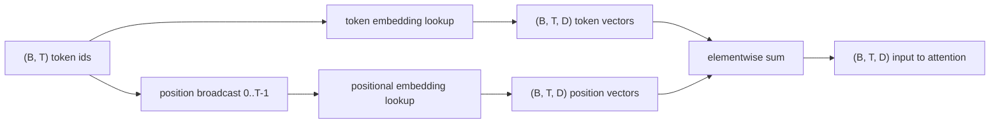
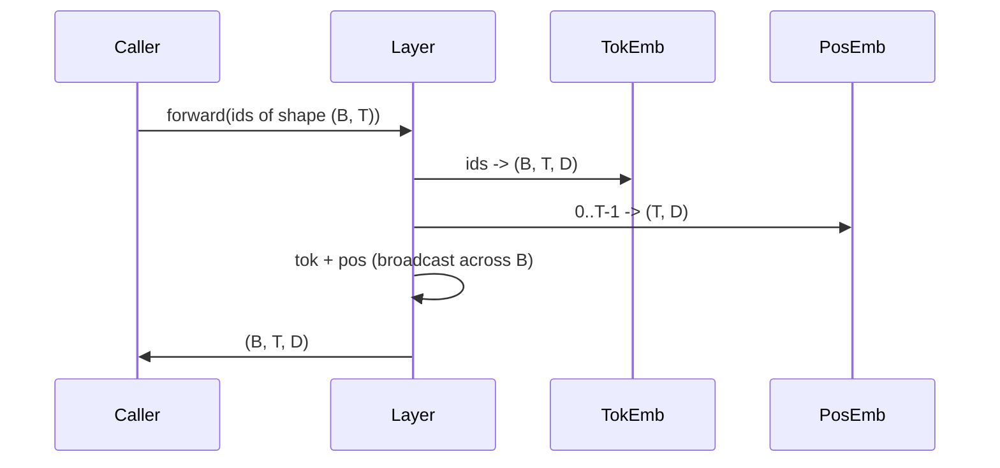

<!-- i18n:manual -->
# Эмбеддинги токенов и позиций

> Id — это целые числа. Модели нужны векторы. Между ними стоят две таблицы поиска, и выбор позиционной решает, чему модель вообще сможет научиться.

**Type:** Build
**Languages:** Python
**Prerequisites:** Phase 04 lessons, Phase 07 transformer lessons, Lessons 30 and 31 of this phase
**Time:** ~90 minutes

## Learning Objectives
- Собрать таблицу эмбеддингов токенов, которая отображает id словаря в плотные векторы.
- Собрать обучаемую таблицу позиционных эмбеддингов, индексируемую позицией.
- Собрать фиксированный синусоидальный позиционный эмбеддинг, индексируемый позицией и не имеющий параметров.
- Сложить эмбеддинги токенов и позиций в единый вход для блока трансформера.
- Сопоставить обучаемые и синусоидальные эмбеддинги по обобщению на длину и по числу параметров.

```figure
cc-embedding-lookup
```

> 🎒 **На пальцах.** Таблица эмбеддингов — это справочник, где на каждый id заведена своя строчка чисел. При словаре в 1000 токенов и размерности 64 это таблица 1000 × 64, то есть 64 000 чисел. Токен номер 317 — это буквально 317-я строка, и никакой хитрости в «поиске» нет: это чтение по индексу.

## The frame

Первый контакт модели с id токена — это чтение строки в матрице эмбеддингов токенов. У матрицы одна строка на каждый id словаря и один столбец на каждое измерение модели. Чтение возвращает вектор, который вся остальная модель трактует как смысл этого id. Backprop обновляет те строки, которые были использованы в прямом проходе. За время обучения геометрия этих строк научается кодировать похожесть направлениями.

У одних только id токенов нет порядка. Модели нужен второй сигнал, который скажет ей, что позиция один отличается от позиции семнадцать. Два главных варианта такого сигнала — обучаемый позиционный эмбеддинг (вторая таблица поиска, по строке на позицию) и фиксированный синусоидальный позиционный эмбеддинг (математическая формула без параметров). У выбора есть последствия. Обучаемая таблица — это параметр, и она ограничена максимальной длиной контекста, на которой модель обучали. Синусоидальная таблица в теории беспараметрическая, а формула продолжается на любую позицию, но `SinusoidalPositionalEmbedding` из этого урока предвычисляет фиксированную таблицу на `max_context_length`, и её `forward` бросает исключение за этой границей; так что здесь обе реализации навязывают максимальную длину контекста. Модель всё равно может буксовать за пределами длины, на которой её обучали, — даже когда таблица достаточно велика, чтобы в неё проиндексироваться.

Этот урок строит обе и складывает их с эмбеддингом токенов в единый вход для блока attention из следующего урока.

> 🎒 **На пальцах.** «Backprop обновляет только использованные строки» — это очень экономно. Батч 16 × 32 — это 512 id, то есть максимум 512 тронутых строк из 50 257 в словаре GPT-2. Остальные 99% таблицы на этом шаге получают ровно нулевой градиент и не меняются вообще.

> 🎒 **На пальцах.** Разница между двумя вариантами простая. Обучаемая таблица — это шкаф с полками: полок ровно `max_context_length`, и на позицию за границей класть некуда, будет ошибка индекса. Синусоида — это формула, которая посчитает вектор для любого номера; здесь её всё равно ограничили таблицей, но ограничение это техническое, а не принципиальное.

## The shape contract

Вход стадии эмбеддингов — батч id токенов формы `(B, T)`. Выход — тензор формы `(B, T, D)`, где `D` — размерность модели. У каждого элемента батча одна и та же длина контекста `T`. У каждой позиции одна и та же размерность вектора `D`.



Композиция — это сумма, а не конкатенация. Суммирование держит `D` постоянным по всей сети и позволяет модели самой решать, для каждого признака отдельно, что важнее на этом слое: смысл токена или позиция.

> 🎒 **На пальцах.** Посчитайте, что происходит с формой. При `B = 4`, `T = 16`, `D = 64` на вход приходит 64 числа (4 × 16 id), а на выход уходит 4096 чисел (4 × 16 × 64). Каждый целочисленный id развернулся в 64 вещественных числа — вот в этот момент дискретный текст и превращается в непрерывную геометрию.

> 🎒 **На пальцах.** Почему сумма, а не склейка: при склейке `D` вырос бы с 64 до 128, а за ним удвоились бы все матрицы attention и MLP на каждом слое. Сумма не стоит ничего. Может показаться, что складывать «смысл» и «позицию» в одном числе — это каша, но `D` измерений хватает, чтобы модель развела эти сигналы по разным направлениям.

## The token embedding matrix

Эмбеддинг токенов — это тензор параметров формы `(V, D)`, где `V` — размер словаря. PyTorch отдаёт его как `nn.Embedding(V, D)`. На инициализации значения тянут из небольшого гауссовского распределения, традиционно со средним ноль и стандартным отклонением около `0.02` для моделей трансформерного масштаба. Точная инициализация важна меньше, чем то, чтобы она была одинаковой от прогона к прогону.

Прямой проход — это одна операция индексации. PyTorch отображает int64-id формы `(B, T)` в числа с плавающей точкой формы `(B, T, D)`, собирая строки. Обратный проход накапливает градиенты только в тех строках, которых коснулся прямой проход. Две строки, не встретившиеся в батче, получают на этом шаге нулевой градиент.

Тонкая деталь. Эмбеддинг токенов и выходная проекция в конце модели часто делят веса (weight tying). Когда так делают, каждый обратный проход трогает каждую строку эмбеддинга через выходную сторону. Этот урок выставляет их как отдельные модули, но в полной модели обе роли могла бы играть одна и та же матрица.

> 🎒 **На пальцах.** Почему именно `0.02`, а не `1.0`: вектор из 64 чисел со стандартным отклонением 1 имеет длину около 8, и скалярные произведения в attention сразу улетают в сотни, а softmax после этого превращается в жёсткий выбор одного токена. Маленький старт держит все векторы близко к нулю, и модель разводит их по мере обучения сама.

> 🎒 **На пальцах.** Экономия от weight tying считается на пальцах: у GPT-2 словарь 50 257 и `D = 768`, то есть таблица весит около 38,6 млн параметров. Связать вход и выход — значит не платить эти 38,6 млн дважды. Заодно это осмысленно: строка «какой вектор означает токен X» и строка «насколько выход похож на токен X» — про одно и то же.

## The learned positional embedding

Обучаемый позиционный эмбеддинг — это второй `nn.Embedding` формы `(max_context_length, D)`. Чтение идёт по id позиции `0, 1, 2, ..., T-1`. Прямой проход размножает этот вектор позиции по измерению батча.

Минус обучаемой таблицы в том, что её нельзя спросить о позиции `T`, если модель обучали только до позиции `T-1`. Такой строки просто нет. Продакшен-модели с декодером, использующие эту схему, зашивают максимальную длину контекста в архитектуру и отказываются обрабатывать более длинный вход.

> 🎒 **На пальцах.** Это тот самый жёсткий потолок контекста, о котором пишут в карточках моделей. У GPT-3 таблица на 2048 строк, и токен на позиции 2048 не «плохо обработается» — он вызовет ошибку выхода за границу. Никакой хитрый промпт этот предел не обходит: строки в таблице физически нет.

## The sinusoidal positional embedding

Синусоидальный позиционный эмбеддинг — это функция из позиции в вектор. Позиция `p` и признак `i` дают

```python
angle = p / (10000 ** (2 * (i // 2) / D))
emb[p, 2k]     = sin(angle)
emb[p, 2k + 1] = cos(angle)
```

У функции нет параметров. У каждой позиции свой уникальный вектор. Длина волны меняется геометрически по измерениям признаков, поэтому нижние измерения кодируют грубую позицию, а верхние — точную.

Свойство, которое следует из совместного выбора `sin` и `cos`: вектор на позиции `p + k` — это линейная функция от вектора на позиции `p`. Это даёт слою attention лёгкий путь к тому, чтобы выучить относительные смещения позиций. Модели не нужен отдельный параметр, чтобы выразить «посмотри на пять токенов назад».

Урок считает полную синусоидальную таблицу один раз при конструировании и на прямом проходе индексируется в неё.

> 🎒 **На пальцах.** Подставьте `p = 0`: угол равен нулю, значит все синусы дают 0, а все косинусы дают 1. Вектор нулевой позиции — это чередование `0, 1, 0, 1, ...` и он одинаков в любой модели с любым `D`. Дальше, на позиции 1, быстрые измерения уже заметно сдвинулись, а медленные почти не шевельнулись.

> 🎒 **На пальцах.** Разберите делитель `10000 ** (2 * (i // 2) / D)` при `D = 64`. Для `i = 0` показатель равен нулю, делитель равен 1, и угол просто равен позиции — эта пара проходит полный оборот каждые 6,28 позиции. Для последней пары делитель почти 10 000, и за тысячу позиций стрелка едва трогается с места. Это часы с 32 стрелками разной скорости, а номер позиции читается по их совместному положению.

> 🎒 **На пальцах.** «Линейная функция» здесь — это поворот на плоскости. Каждая пара измерений `(2k, 2k+1)` — это точка на окружности, и переход с позиции `p` на `p + k` крутит её на фиксированный угол, не меняя длину. Поэтому «на пять назад» для attention — это один и тот же поворот в любом месте текста, а не отдельное правило для каждой пары позиций.

## The composition

Входной пайплайн делает три вещи по порядку. Читает id токенов. Достаёт векторы токенов. Прибавляет векторы позиций. Возвращает сумму.



Броадкаст на шаге суммирования размножает позиционный тензор `(T, D)` вдоль измерения батча. PyTorch делает это автоматически, потому что после unsqueeze у позиционного тензора форма `(1, T, D)`.

> 🎒 **На пальцах.** Броадкаст — это обещание не копировать данные. Тензор `(1, 16, 64)` складывается с `(4, 16, 64)` так, будто его размножили на четыре, но в памяти он лежит в одном экземпляре. Забудете unsqueeze и попробуете сложить `(16, 64)` с `(4, 16, 64)` — PyTorch, кстати, справится и так, но привычка ставить размерность явно спасает от того дня, когда `T` случайно совпадёт с `B`.

## Contrastive analysis

Урок гоняет оба варианта на одних и тех же входах и печатает две диагностики.

Первая — число параметров. Обучаемый вариант добавляет `max_context_length * D` параметров сверх эмбеддинга токенов. Синусоидальный не добавляет ничего.

Вторая — косинусная похожесть между эмбеддингами соседних позиций. У синусоидального варианта спад плавный и предсказуемый, потому что функция непрерывна. У обучаемого варианта на инициализации похожесть почти случайная, потому что строки натянуты независимо. После обучения обучаемый вариант обычно нащупывает похожую плавную структуру, но ему приходится открывать её из данных.

> 🎒 **На пальцах.** Посчитайте цену обучаемой таблицы: `max_context_length = 1024` и `D = 64` дают 65 536 параметров. На фоне словаря это копейки, но при `D = 4096` и контексте 8192 та же формула даёт уже 33,5 млн — и всё это ради того, чтобы модель выучила то, что синусоида знает бесплатно.

> 🎒 **На пальцах.** Диагностика косинусной похожести — хороший тест на «оно вообще работает». У синусоиды соседние позиции похожи почти на единицу, а далёкие — заметно меньше, и график спадает гладко. У обучаемой таблицы до обучения соседи похожи примерно на ноль, как два случайных вектора. Если у вашей синусоиды график тоже скачет — вы перепутали индексацию пар в формуле.

## What this lesson does not do

Он не строит ротационное позиционное кодирование (RoPE) и ALiBi. Именно они — современный выбор в продакшен-трансформерах. Оба следуют тому же контракту формы, что и эмбеддинги здесь (применить зависящее от позиции преобразование к векторам формы `(B, T, D)`), но применяются на шаге проекций attention, а не на входе. Следующий урок строит блок attention, и одно из необязательных расширений — вложить ротацию в проекции query и key прямо там.

Он не обучает эмбеддинг. Для обучения нужен loss, для него нужен выход модели, для него нужны attention и LM-голова. Это следующий урок и тот, что за ним.

> 🎒 **На пальцах.** Разница в точке применения принципиальна. Здесь позиция прибавляется один раз на входе и дальше размывается слоями. RoPE крутит Q и K на каждом слое заново, поэтому сигнал позиции не выцветает вглубь сети — и потому все современные модели, от Llama до Qwen, ушли именно туда.

## How to read the code

`main.py` определяет три модуля. `TokenEmbedding` оборачивает `nn.Embedding(V, D)`. `LearnedPositionalEmbedding` оборачивает `nn.Embedding(L, D)`. `SinusoidalPositionalEmbedding` предвычисляет таблицу и выставляет её как буфер. `EmbeddingComposer` связывает эмбеддинг токенов и позиционный эмбеддинг вместе. Демо внизу печатает формы, число параметров и диагностику похожести соседних позиций. Тесты в `code/tests/test_embeddings.py` фиксируют форму, поведение броадкаста, число параметров и синусоидальную формулу.

Запустите демо. Потом поменяйте размерность модели `D` с 64 на 32 и посмотрите, как меняются полосы длин волн синусоиды.

> 🎒 **На пальцах.** Слово «буфер» тут не случайно: `register_buffer` кладёт таблицу в состояние модуля и переносит её на GPU вместе с моделью, но не отдаёт оптимизатору. То есть таблица сохранится в чекпоинт и поедет на нужное устройство, а градиента у неё не будет никогда — ровно то поведение, которое нужно фиксированной синусоиде.
