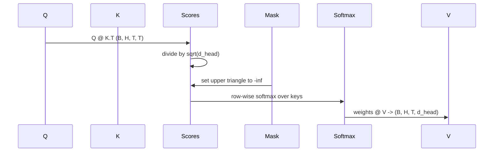

<!-- i18n:manual -->
# Multi-head self-attention своими руками

> Одна линейная проекция, три взгляда, H параллельных голов, одна маска. Блок attention ровно в том виде, в каком его использует модель.

**Type:** Build
**Languages:** Python
**Prerequisites:** Phase 04 lessons, Phase 07 transformer lessons, Lessons 30 through 32 of this phase
**Time:** ~90 minutes

## Learning Objectives
- Реализовать батчевую проекцию Query/Key/Value одним линейным слоем, который потом режется на H голов.
- Посчитать scaled dot-product attention с правильной нормировкой и аккуратной работой с dtype.
- Наложить causal-маску, которая запрещает позиции смотреть на будущие позиции.
- Посмотреть на attention-веса каждой головы для фиксированного входа и понять, куда какая голова глядит.
- Обучить маленький блок attention на игрушечной задаче и увидеть, как loss падает по мере специализации голов.

```figure
cap-multihead-attention
```

> 🎒 **На пальцах.** Пять пунктов выше — это пять кусков одного кода: проекция, счёт, маска, просмотр весов, обучение. Порядок не случайный: каждый следующий пункт нельзя проверить, пока не работает предыдущий. Например, смотреть на веса голов бессмысленно, если маска наложена неверно — вы увидите красивую картинку, где токен 3 честно смотрит на токен 7.

## The frame

Attention — это функция, которая позволяет представлению одного токена подтянуть информацию из других токенов той же последовательности. Self-attention означает, что queries, keys и values получаются из одного и того же входа. Multi-head означает, что проекция разрезана на H параллельных задач attention, выходы которых склеиваются и проецируются обратно.

Эффективный паттерн реализации — один линейный слой, который проецирует из `D` в `3 * D`, а результат режется на три части, потом переформатируется в H голов по `D // H` каждая. Матричное умножение, softmax и взвешенная сумма выполняются как батчевые тензорные операции, поэтому головы работают на ускорителе параллельно.

> 🎒 **На пальцах.** Слово «параллельно» тут буквальное: у GPU нет цикла по головам. При D = 32 и H = 4 один слой выдаёт 96 чисел на токен, они делятся на три куска по 32, каждый кусок — на 4 головы по 8. Дальше все 4 головы едут одной операцией, как четыре одинаковых задачи в батче.

Этот урок собирает такой блок. Плюс добавляет causal-маску, чтобы тот же код работал слоем attention в decoder-only языковой модели. В следующем уроке блок укладывается в полноценный трансформер, а в уроке после — обучается.

## The shape contract

Вход — `(B, T, D)`. Выход — `(B, T, D)`. Маска — `(T, T)` или что-то, что до неё броадкастится. Внутри блока промежуточные тензоры имеют форму `(B, H, T, d_head)`, где `d_head = D // H`. Ограничение: `D % H == 0`.

> 🎒 **На пальцах.** «Контракт по формам» — это обещание блока: что вошло, то и выйдет, той же формы. Возьмите B = 2, T = 12, D = 32, H = 4: внутри живёт тензор (2, 4, 12, 8), а наружу опять выходит (2, 12, 32). Именно из-за этого обещания блоки можно ставить друг на друга штабелем — двенадцать штук подряд без единой переходной прослойки.

```mermaid
flowchart LR
    A["(B, T, D) input"] --> B[Linear D -> 3D]
    B --> C["split into Q, K, V"]
    C --> D["reshape to (B, H, T, d_head)"]
    D --> E["scores = Q @ K.T / sqrt(d_head)"]
    E --> F[apply causal mask]
    F --> G[softmax over keys]
    G --> H["context = weights @ V"]
    H --> I["reshape to (B, T, D)"]
    I --> J[output Linear D -> D]
    J --> K["(B, T, D) output"]
```



Два линейных слоя (проекция QKV и выходная проекция) — единственные параметры в блоке. Маска, softmax, матричные умножения и reshape'ы параметров не содержат вообще.

> 🎒 **На пальцах.** Пройдите по схеме и посчитайте, где веса. Linear D → 3D при D = 32 — это 32 × 96 = 3072 числа. Linear D → D — ещё 32 × 32 = 1024. Всего 4096 обучаемых чисел. Все остальные коробочки на схеме — split, reshape, softmax, маска — не содержат ни одного параметра, это чистая арифметика над тем, что уже посчитано.

## The QKV split

Наивная реализация держит три отдельных линейных слоя — по одному на Q, K и V. Эффективная держит один слой, который выдаёт `3 * D` признаков, и режет результат. Математически это одно и то же, потому что три отдельных умножения на матрицы `(D, D)` — это ровно одно умножение на матрицу `(3D, D)`, сложенную из них.

> 🎒 **На пальцах.** Проверьте эквивалентность на пальцах: если сложить три матрицы 32 × 32 в одну 32 × 96 столбик к столбику, то умножение входа на эту большую матрицу даст те же 96 чисел, что и три отдельных умножения по 32. Числа побитово те же. Меняется только количество вызовов — было три, стало один.

Эффективная версия быстрее, потому что ускоритель запускает один matmul вместо трёх. Её ещё и проще инициализировать: три подматрицы лежат в одном тензоре параметров и инициализируются вместе.

## The head reshape

После разрезания каждый из Q, K, V имеет форму `(B, T, D)`. Чтобы превратить это в H параллельных задач attention, делаем reshape в `(B, T, H, d_head)` и transpose в `(B, H, T, d_head)`. Ось голов теперь стоит рядом с осью батча, поэтому PyTorch считает attention каждой головы как батчевую операцию над `B * H` независимыми экземплярами.

> 🎒 **На пальцах.** Здесь важно, что transpose — не косметика, а бизнес-решение. При B = 2 и H = 4 после перестановки осей получается 2 × 4 = 8 совершенно независимых задачек attention, которые железо разбирает как обычный батч из восьми элементов. Оставьте ось голов на третьем месте — и придётся писать цикл по головам, то есть в четыре раза больше запусков.

Ось d_head остаётся последней, чтобы matmul скоров `Q @ K.transpose(-2, -1)` свернул именно её. Результат — attention-скоры формы `(B, H, T, T)` для каждой головы.

> 🎒 **На пальцах.** «Свернуть ось» значит просуммировать по ней при перемножении. Q формы (…, 12, 8) и транспонированный K формы (…, 8, 12) дают (…, 12, 12): восьмёрки исчезли, они ушли внутрь суммы. То есть каждое из 144 чисел итоговой матрицы — это скалярное произведение двух восьмимерных векторов, ответ на вопрос «насколько токен i интересен токену j».

## Scaling

Скоры делятся на `sqrt(d_head)` перед softmax. Без этого масштабирования скалярные произведения растут вместе с `d_head` и загоняют softmax в режим, где почти вся масса лежит на одной записи, а остальные исчезающе малы. Градиенты в этом режиме крошечные, и обучение встаёт. Деление на `sqrt(d_head)` держит дисперсию скоров примерно одинаковой при любых размерах головы.

> 🎒 **На пальцах.** Скалярное произведение двух случайных векторов длины d растёт как `sqrt(d)`: при d_head = 8 типичный скор порядка 2.8, при d_head = 64 — уже 8, при 128 — 11. Softmax от `[11, 0, 0]` даёт примерно `[0.9999, 0.00003, 0.00003]` — это фактически argmax, и градиент по проигравшим позициям равен почти нулю. Деление на `sqrt(d_head)` возвращает скоры обратно к порядку единицы при любой ширине головы.

## The causal mask

Decoder-only языковая модель, предсказывая следующий токен, имеет право опираться только на прошлое. Маска это и обеспечивает. Конкретно: перед softmax каждая запись выше диагонали матрицы скоров `(T, T)` заменяется на минус бесконечность. После softmax эти позиции получают нулевой вес.

> 🎒 **На пальцах.** Минус бесконечность работает потому, что `exp(-inf) = 0`, а softmax — это как раз нормированные экспоненты. При T = 12 матрица скоров содержит 144 клетки, из них выше диагонали ровно 12 × 11 / 2 = 66. Их зануляют, остаётся 78 разрешённых пар. Первая строка при этом имеет ровно один разрешённый вес, равный 1.0: первый токен может смотреть только на себя.



Маску регистрируем как buffer при конструировании, чтобы она жила на том же устройстве, что и модель, и не попадала в граф градиентов. Маска покрывает максимальную длину контекста, которую блок вообще когда-либо увидит. На forward мы вырезаем левый верхний угол `(T, T)`.

> 🎒 **На пальцах.** Buffer — это тензор, который переезжает вместе с моделью на GPU при `.to(device)`, но не считается параметром и не получает градиента. Маску незачем обучать: она нужна одна и та же на все шаги. Заведите её один раз на 1024 позиции — и на входе из 12 токенов просто отрежете кусок 12 × 12, вместо того чтобы каждый forward выделять новую память.

## The output projection

Получив контекстные векторы по головам `(B, H, T, d_head)`, делаем transpose обратно в `(B, T, H, d_head)`, reshape в `(B, T, D)` и применяем финальную линейную проекцию `(D, D)`. Выходная проекция даёт модели возможность перемешать головы. Без неё H голов смогли бы объединиться только в следующих слоях, и блок был бы искусственно ограничен.

> 🎒 **На пальцах.** До этого места четыре головы жили в четырёх непересекающихся кусках вектора: голова 1 писала в измерения 0–7, голова 2 в 8–15 и так далее. Reshape просто склеивает эти куски встык — они всё ещё не смешаны. Смешивание происходит ровно в матрице 32 × 32: каждое выходное число становится комбинацией всех 32 входных, то есть всех четырёх голов сразу.

## Attention weight inspection

В уроке на forward выставлен флаг `return_weights=True`. Если он включён, блок вместе с выходом возвращает attention-веса каждой головы формы `(B, H, T, T)`. Демо печатает тепловую карту весов одной головы на коротком входе, чтобы вы своими глазами увидели треугольную структуру causal-маски и то, на чём фокусируется каждая позиция.

> 🎒 **На пальцах.** Тепловая карта — это та самая матрица 12 × 12, покрашенная по величине. Верхний правый треугольник обязан быть ровно нулевым — это ваш визуальный тест на то, что маска работает. Каждая строка суммируется в 1.0, потому что это softmax. Если увидите ненулевое число выше диагонали — маска приложена после softmax, а не до, и модель подглядывает в будущее.

В обученной модели разные головы выучивают разные паттерны. Какие-то смотрят на непосредственно предыдущий токен. Какие-то — на начало последовательности. Какие-то размазывают внимание почти равномерно. Хук для просмотра весов — это точка входа в работу по интерпретируемости.

> 🎒 **На пальцах.** Голова «смотрю на предыдущий токен» на тепловой карте выглядит как яркая линия ровно под главной диагональю, а «смотрю на начало» — как яркий первый столбец. Равномерная голова — это бледный треугольник, где в строке 12 каждый из 12 весов примерно 0.083. Три узнаваемые картинки, которые вы научитесь различать за один вечер.

## The training demo

Демо в конце `main.py` подключает блок attention к крошечной LM-голове и обучает всё это на задаче повтора. Каждая строка входа — один случайный id, размноженный на весь контекст. Цель — вход, сдвинутый на единицу, так что модель должна выучить, что следующий токен совпадает с предыдущим. Функция потерь — cross-entropy. При H=4, D=32, T=12 и словаре из 64 токенов loss падает со случайного (около `log(64) ~ 4.16`) до заметно меньше `1.0` за три эпохи на CPU.

> 🎒 **На пальцах.** Задача нарочно тупая: строка вида [7, 7, 7, 7, ...], предсказать надо снова 7. Решается она одной головой, которая научилась смотреть на предыдущий токен, — то есть ровно тем паттерном с яркой линией под диагональю. Стартовый loss 4.16 — это `ln(64)`, честное «не знаю ничего про 64 варианта». Падение ниже 1.0 означает, что модель ставит на правильный токен вероятность больше 0.37.

Смысл демо не в том, чтобы обучить полезную модель. Смысл в том, чтобы убедиться: градиенты текут через каждый кусок блока, и головы что-то выучивают на задаче, где правильный ответ очевиден.

## What this lesson does not do

Здесь нет feed-forward блока. Слой трансформера в реальной модели — это attention, за которым идёт двухслойный MLP, а вокруг каждого из них residual-связь и layer norm. Их добавляет следующий урок.

Здесь нет rotary и AliBi позиционного кодирования. Оба применяются на шаге QKV-проекции внутри того же блока, но это отдельная учебная единица. Собранный здесь блок совместим с любым из них: достаточно преобразовать Q и K перед матричным умножением.

Здесь нет KV cache для инференса. Кеширование ключей и значений между forward-проходами — это та оптимизация, которая делает авторегрессионное декодирование быстрым. Она меняет контракт по формам для K и V, но не для Q. Ей место в уроке про инференс.

## How to read the code

`main.py` определяет `MultiHeadSelfAttention`. Класс держит два линейных слоя и зарегистрированный буфер маски. Forward проецирует, переформатирует, считает скоры, маскирует, применяет softmax, взвешивает, переформатирует обратно и проецирует ещё раз. Демо в конце файла собирает маленькую модель, которая оборачивает attention эмбеддингами токенов и позиций и LM-головой, обучает её на задаче копирования три эпохи и печатает кривую loss и тепловую карту весов по головам. Тесты в `code/tests/test_attention.py` фиксируют контракт по формам, свойство причинности, свойство softmax, свойство разрезания на головы и прохождение градиентов.

Запустите демо. Потом увеличьте `n_heads` с 4 до 8 (оставив `d_model=32`, так что `d_head=4`) и посмотрите, как изменится тепловая карта.

> 🎒 **На пальцах.** Восемь голов при d_model = 32 дают d_head = 4 — четыре измерения на голову, очень тесно. Ждите, что карты станут более шумными и менее выраженными: голове просто не хватает места, чтобы построить чёткий паттерн. Это тот же урок, что и в правиле «d_head обычно 64 или 128», только увиденный на игрушечных числах за пять секунд.
