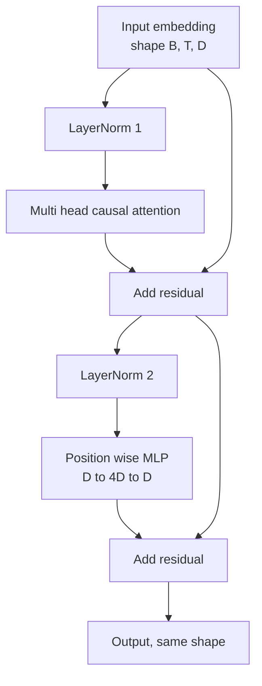
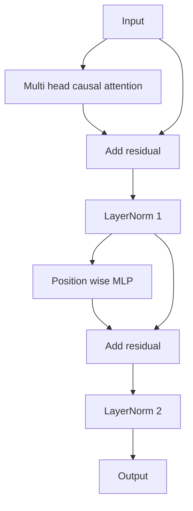

<!-- i18n:manual -->
# Блок трансформера с нуля

> Один блок — это единица, из которой собран любой современный decoder-LLM. Layer norm, multi-head attention, residual, MLP, residual. Вариант pre-LN обучается стабильно без прогрева. Вариант post-LN — то, что вышло в оригинальной статье. Этот урок собирает оба, бок о бок, и показывает, какой из них выживает в стопке из 12 слоёв на обычных learning rate.

**Type:** Build
**Languages:** Python
**Prerequisites:** Phase 19 lessons 30 to 33 (tokenizer, embeddings, attention math, batched data loader)
**Time:** ~90 minutes

## Learning Objectives

- Собрать блок трансформера в PyTorch из четырёх подвижных частей: LayerNorm, multi-head causal attention, residual-связи, поточечный MLP.
- Расставить LayerNorm двумя способами (pre-LN и post-LN) и объяснить, почему один из них обучается стабильно без прогрева.
- Реализовать causal-маскирование внутри multi-head attention, чтобы токен `i` не видел токены `j > i`.
- Проследить поток градиентов через оба варианта на стопке из 12 слоёв и прочитать результат без размахивания руками.
- Переиспользовать блок как готовую деталь, когда следующий урок будет собирать GPT на 124 миллиона параметров.

> 🎒 **На пальцах.** Обратите внимание: из пяти пунктов четыре — про то, где стоит LayerNorm. Это не мелочь оформления. Две одинаковые по формам конструкции ведут себя по-разному на глубине 12, и разница видна только в норме градиента, а не в выходе. Урок ровно про это: одинаковый снаружи блок, разная судьба при обучении.

## The Problem

Трансформер — это один блок, повторённый много раз. Ошибитесь в блоке один раз, повторите его двенадцать — и вы выкатили модель, которая расходится на первой же эпохе или требует костылей с прогревом весь остаток пути. Два способа сломаться, которые вы увидите в этом уроке, вовсе не экзотика. Они вылезают у любого, кто впервые складывает блоки наивно. Первый — слой attention, смотрящий в будущее. Второй — LayerNorm, поставленный там, где он не может усмирить residual-сигнал на глубине.

> 🎒 **На пальцах.** «Повторён много раз» здесь буквально: в GPT-2 Small это один и тот же класс, созданный 12 раз с разными весами. Поэтому баг в блоке не остаётся локальным — он умножается на 12. Если каждый блок гасит градиент вдвое, до первого слоя доедет 1/2^12 ≈ 0.00024 от исходной величины, то есть первые слои просто не будут учиться.

Починка механическая, как только вы её увидели. В блоке ровно два residual-пути и ровно две позиции для нормализации. Расставьте позиции правильно — и весь остальной стек превращается в бухгалтерию.

> 🎒 **На пальцах.** Пересчитайте детали: два LayerNorm, два residual, один attention, один MLP. Четыре типа деталей, шесть штук. Вся вариативность архитектур 2026 года — это перестановки этих шести коробочек плюс замена LayerNorm на RMSNorm и GELU на SiLU. Понимаете этот блок — читаете любую схему decoder-модели.

## The Concept

Каждый decoder-only блок трансформера — это функция, которая берёт тензор формы `(batch, sequence, embedding)` и возвращает тензор такой же формы. Внутри работу делают два подслоя.

> 🎒 **На пальцах.** «Такая же форма на входе и на выходе» — это то, что позволяет ставить блоки штабелем. При batch = 2, sequence = 16, embedding = 384 через все двенадцать блоков едет один и тот же тензор 2 × 16 × 384 = 12 288 чисел. Каждый блок не заменяет его, а дописывает поверх свою поправку.



Это вариант pre-LN. LayerNorm стоит внутри residual-ветки, перед подслоем. Residual-связь несёт вперёд ненормализованный сигнал.

> 🎒 **На пальцах.** Посмотрите на схему: из X выходят две стрелки. Одна идёт в LayerNorm и дальше в attention, вторая — прямо в сложение. Вторая стрелка ничего с сигналом не делает вообще. Это и есть «residual stream» — прямая труба сверху донизу, вдоль которой градиент течёт без потерь, потому что производная от `x` по `x` равна единице.

Вариант post-LN переносит LayerNorm на позицию после сложения с residual.



Формы одинаковы. Поведение при обучении — нет. При post-LN градиент, текущий назад по residual-пути, обязан пройти через LayerNorm. На глубине двенадцать и learning rate `3e-4` он усыхает достаточно быстро, чтобы понадобилось расписание с прогревом. Pre-LN оставляет residual-путь ненормализованным, поэтому градиенты доходят до слоя эмбеддингов чистыми. Именно поэтому pre-LN — конфигурация, с которой поставляются все модели начиная с GPT-2.

> 🎒 **На пальцах.** Сравните две схемы по одному признаку: есть ли на пути от Y обратно к X хоть один блок, который что-то делает с сигналом. В pre-LN такой путь есть — чистое сложение, ничего по дороге. В post-LN каждое сложение немедленно проходит через LayerNorm, и таких проходов на глубине 12 набирается 24. Именно эти 24 нормализации и съедают градиент до эмбеддингов.

### Causal multi head attention

Подслой attention проецирует вход тремя способами — в тензоры query, key, value. Каждый переформатируется из `(B, T, D)` в `(B, H, T, D/H)`, где `H` — число голов. Scaled dot-product attention считает `softmax(Q K^T / sqrt(d_k))` для каждой головы, маскирует верхний треугольник минус бесконечностью, применяет маску через softmax, затем умножает на `V`. Головы склеиваются обратно в один тензор `(B, T, D)` и ещё раз проецируются. Маска — единственная деталь, которая делает модель causal. Забудете маску — обучите модель, которая жульничает.

> 🎒 **На пальцах.** «Жульничает» — это не метафора, а конкретная катастрофа. Без маски, предсказывая токен 5, модель видит сам токен 5 на входе и просто копирует его. Loss на обучении красиво падает почти до нуля, а на генерации модель выдаёт мусор, потому что при инференсе будущего токена нет. Классический баг, который выглядит как успех.

### The MLP

Поточечный MLP применяет одну и ту же двухслойную сеть к каждому токену независимо. Скрытый слой в четыре раза шире эмбеддинга, активация — GELU, после второго линейного слоя идёт dropout. Внутри MLP токены между собой не общаются вообще. Всё перемешивание токенов происходит в attention.

> 🎒 **На пальцах.** Разделение обязанностей тут строгое: attention смешивает токены между собой, MLP обрабатывает каждый токен по отдельности. При D = 768 MLP — это 768 → 3072 → 768, то есть 4 718 592 параметра против 2 359 296 у attention. Две трети веса блока уходит на слой, который вообще не знает, что рядом стоят другие токены.

### Residual connections do two things

Они делают путь градиента аддитивным по глубине, что удерживает норму градиента в разумных пределах через двенадцать слоёв. И они позволяют каждому блоку выучивать аддитивную поправку к текущему представлению, а не полную его замену. Оба эффекта — причина, по которой блок масштабируется.

> 🎒 **На пальцах.** «Аддитивная поправка» значит, что блок пишет `x = x + что-то маленькое`, а не `x = что-то новое`. Двенадцать блоков — это двенадцать редакторских правок одного и того же черновика, а не двенадцать пересказов подряд. Поэтому исходная информация из эмбеддингов доживает до последнего слоя, даже если какой-то блок в середине выдал чепуху.

```figure
cc-transformer-block
```

## Build It

`code/main.py` реализует:

- `class LayerNorm` с обучаемыми масштабом и сдвигом, смещённой eps, применяется к вектору каждого токена.
- `class MultiHeadAttention` с `num_heads`, `head_dim = d_model // num_heads`, слитой QKV-проекцией, зарегистрированной causal-маской, dropout на attention и на residual.
- `class FeedForward` с двумя линейными слоями, активацией GELU и dropout.
- `class TransformerBlock` с флагом `pre_ln`, который переключает между двумя вариантами.
- Демо, которое строит стопку из 6 pre-LN блоков и стопку из 6 post-LN блоков с одинаковым входом и печатает (a) форму выхода, (b) норму градиента на эмбеддингах после одного backward.

> 🎒 **На пальцах.** Ключевая деталь демо — «с одинаковым входом». Оба стека получают один и тот же тензор и одинаково проинициализированные веса, так что разница в норме градиента не может быть объяснена случайностью. Это честный контролируемый эксперимент: меняется ровно одна вещь — позиция LayerNorm.

Запускаем:

```bash
python3 code/main.py
```

Вывод: проверка форм на обоих стеках, нормы градиентов рядом друг с другом. Градиент на эмбеддингах у pre-LN стека на порядок больше, чем у post-LN при том же learning rate, и это эмпирический сигнал того, что pre-LN обучается без прогрева.

> 🎒 **На пальцах.** «На порядок» значит примерно в 10 раз. Если у pre-LN норма градиента на эмбеддингах, скажем, 0.02, то у post-LN будет что-то около 0.002. При lr = 3e-4 первый двигает эмбеддинги на 6e-6 за шаг, второй — на 6e-7. За тысячу шагов разница между «эмбеддинги учатся» и «эмбеддинги стоят там, где их случайно проинициализировали».

## Stack

- `torch` для тензорной математики, autograd и обвязки `nn.Module`.
- Никаких `transformers`, никаких предобученных весов. Блок реализован из примитивов.

## Production patterns in the wild

Три приёма, которые превращают учебный блок в то, что можно выкатывать.

**Fused QKV projection.** Три отдельных линейных слоя стоят трёх запусков ядра и трёх matmul. Один линейный слой ширины `3 * d_model` делает ту же работу за один запуск, а потом результат режется по последней оси. Слитый путь быстрее на любом ускорителе и совпадает с тем, что поставляют референсные реализации GPT-2, LLaMA и Mistral.

> 🎒 **На пальцах.** Проверьте, что это правда одно и то же: три матрицы 768 × 768 рядом друг с другом — это ровно матрица 768 × 2304. Числа те же, результат тот же, просто вызов один вместо трёх. На двенадцати слоях экономия — 24 лишних запуска ядра на каждый forward, и столько же на каждый backward.

**Registered causal mask buffer.** Маска зависит только от максимальной длины контекста. Выделите её один раз при конструировании через `register_buffer`, вырезайте активное окно на каждом forward и не платите за выделение памяти в каждом вызове. Забудете — маска превратится в горячую точку аллокатора на длинном контексте.

> 🎒 **На пальцах.** Маска на контекст 1024 — это матрица 1024 × 1024, миллион с лишним элементов. Создавать её заново на каждом forward в каждом из 12 блоков — это 12 миллионов ненужных записей в память за шаг. Заведите один буфер и режьте из него `[:T, :T]`: при T = 128 вы просто смотрите в левый верхний угол уже готовой таблицы.

**Dropout in two places, not three.** Dropout уместен после softmax в attention (attention dropout) и после второго линейного слоя MLP (residual dropout). Dropout на самом residual ломает аддитивную тождественность, благодаря которой градиент течёт на глубине. Некоторые ранние реализации ошиблись здесь и расплатились хрупким обучением.

> 🎒 **На пальцах.** Разница принципиальная. Dropout внутри ветки зануляет часть поправки — черновик правится чуть менее уверенно, ничего страшного. Dropout на самом residual зануляет 10% исходного сигнала целиком, и та самая «труба с производной 1.0» превращается в трубу с дырками. Первое — регуляризация, второе — поломка механизма, ради которого residual и придумали.

## Use It

- Блок из этого урока вставляется в сборку GPT из урока 35 без единой правки.
- Вариант pre-LN используют все современные LLM с открытыми весами. Вариант post-LN — то, что было в оригинальной статье про attention 2017 года. Знания обоих хватит, чтобы читать любую decoder-архитектуру, которая вам встретится.
- Замените GELU на SiLU — получите активацию семейства LLaMA. Замените LayerNorm на RMSNorm — получите нормализацию семейства LLaMA. Скелет тот же.

> 🎒 **На пальцах.** Последний пункт стоит воспринимать буквально: разница между GPT-2 и LLaMA — это две подмены деталей и замена позиционных эмбеддингов на RoPE. Не новая архитектура, а тот же блок с другими винтами. Поэтому собранный вами класс — это не учебная поделка, а рабочий каркас, который переживёт смену моды.

## Exercises

1. Добавьте флаг `bias=False` в каждый линейный слой блока. Современные LLM с открытыми весами поставляются без bias на линейных слоях. Измерьте, сколько параметров вы сэкономили в модели на 12 слоёв и 768 измерений.
2. Замените `nn.LayerNorm` на написанный руками RMSNorm и убедитесь, что форма выхода не изменилась.
3. Добавьте флаг, который возвращает attention-веса первой головы как тензор `(B, T, T)`. Нарисуйте верхний треугольник и убедитесь, что после softmax он нулевой.
4. Соберите проверку на вменяемость: прогоните тензор `(2, 16, 384)` с `H=6` через оба варианта и проверьте, что выходы forward различаются (например, `not torch.allclose`), когда веса проинициализированы одинаково, а dropout выставлен в ноль.

> 🎒 **На пальцах.** Посчитайте первое задание заранее: на блок приходится bias у QKV (3 × 768 = 2304), у выходной проекции (768) и у двух слоёв MLP (3072 + 768 = 3840), итого 6912. На двенадцати блоках — 82 944 параметра. Против 124 миллионов это меньше одной десятой процента, и всё же современные модели их выкидывают: bias почти ничего не даёт, а лишний тензор усложняет ядра и шардирование.

## Key Terms

| Term | What people say | What it actually means |
|------|-----------------|------------------------|
| Pre-LN | «Pre norm» | LayerNorm внутри residual-ветки, перед каждым подслоем; по residual идёт ненормализованный сигнал |
| Post-LN | «Post norm» | LayerNorm после сложения с residual; так было в статье 2017 года, и именно этому нужен прогрев |
| Causal mask | «Треугольная маска» | Верхний треугольник логитов attention выставлен в минус бесконечность, чтобы токен i не мог прочитать токен j при j больше i |
| Fused QKV | «Объединённая проекция» | Один линейный слой ширины 3D вместо трёх слоёв ширины D; один запуск ядра, один matmul |
| Residual stream | «Skip-связь» | Ненормализованный тензор, который течёт сверху вниз через каждый блок; то, к чему каждый блок прибавляет свою поправку |

## Further Reading

- Phase 7 lesson 02 (self attention from scratch) — математика attention, лежащая под этим блоком.
- Phase 7 lesson 05 (full transformer) — версия того же скелета для схемы энкодер-декодер.
- Phase 10 lesson 04 (pre training mini GPT) — процедура обучения, в которую этот блок вставляется.
- Phase 19 lesson 35 (this track) — урок, где двенадцать таких блоков складываются в GPT-модель.
