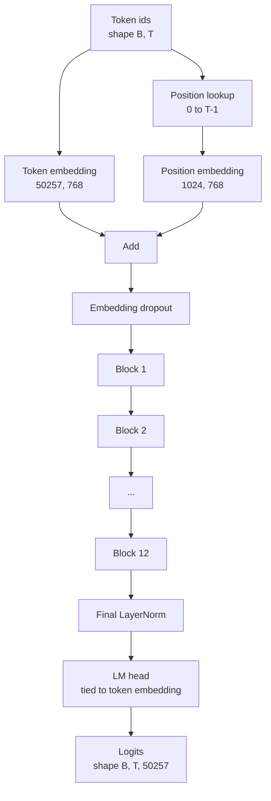
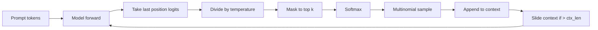

<!-- i18n:manual -->
# Сборка GPT-модели целиком

> Двенадцать блоков стопкой, эмбеддинг токенов, обучаемый эмбеддинг позиций, финальный LayerNorm и связанная по весам языковая голова. Это и есть вся GPT-модель на 124 миллиона параметров. Урок собирает эти детали в рабочий класс, пересчитывает параметры, чтобы убедиться, что модель совпадает по форме с эталонными 124M, и генерирует текст мультиномиальным сэмплированием с temperature и top-k.

**Type:** Build
**Languages:** Python
**Prerequisites:** Phase 19 lessons 30 to 34
**Time:** ~90 minutes

## Learning Objectives

- Собрать блок трансформера из урока 34 в полноценную GPT-модель: эмбеддинг токенов, эмбеддинг позиций, N блоков, финальный LayerNorm, языковая голова.
- Воспроизвести конфигурацию на 124 миллиона параметров: словарь 50257, контекст 1024, эмбеддинг 768, двенадцать голов, двенадцать слоёв.
- Связать веса языковой головы с эмбеддингом токенов и объяснить, почему на таком масштабе это экономит около 38 миллионов параметров.
- Сгенерировать текст по промпту мультиномиальным сэмплированием, масштабированием по temperature и обрезкой top-k, удерживая длину контекста скользящим окном.
- Измерить число параметров и стоимость forward-прохода относительно цели в 124M.

> 🎒 **На пальцах.** Пункт про пересчёт параметров выглядит как бухгалтерия, но это ваш главный тест на правильность сборки. Модель с опечаткой в ширине MLP спокойно запустится и что-то выдаст — но покажет, скажем, 131 миллион вместо 124. Число параметров — это единственная проверка, которая ловит ошибку раньше, чем вы потратите день на обучение.

## The Problem

Сам по себе блок трансформера не делает ничего. Нужно превратить id токенов в векторы, подмешать информацию о позиции, прогнать через стек и спроецировать обратно в логиты словаря. Забудете любой из этих четырёх шагов — и модель либо не пройдёт forward, либо потеряет позиционную информацию, либо не сможет говорить.

> 🎒 **На пальцах.** Четыре шага стоит запомнить как четыре вопроса: «что за слово?» (эмбеддинг токена), «где оно стоит?» (эмбеддинг позиции), «что оно значит в контексте?» (стек блоков), «какое слово следующее?» (голова). Уберите второй — и модель прочитает «собака укусила человека» так же, как «человека укусила собака»: attention сам по себе не различает порядок.

Форма модели тоже важна. Эталонная GPT-2 small — это 124 миллиона параметров ровно при конфигурации выше. Числа не магические. Словарь 50257 умножить на эмбеддинг 768 — это таблица токенов. Позиции 1024 умножить на 768 — это таблица позиций. Двенадцать блоков примерно по 7 миллионов параметров каждый — это 84 миллиона. Финальная голова переиспользует таблицу токенов через weight tying. Сложите куски — и получите 124 миллиона. Модель, у которой число параметров не сходится с эталоном, — признак того, что где-то вы соединили неправильно.

> 🎒 **На пальцах.** Посчитайте сами: 50257 × 768 = 38 597 376 на таблицу токенов, 1024 × 768 = 786 432 на позиции, 12 × 7 080 960 = 84 971 520 на блоки. В сумме примерно 124.4 миллиона. Треть модели — это просто словарь векторов, ещё до всякого attention. Отсюда и понятно, почему увеличение словаря в два раза стоит так дорого.

## The Concept



Id токенов становятся векторами токенов. Id позиций становятся векторами позиций. Эти два складываются и отправляются в стек. Финальный LayerNorm — единственная деталь вне блоков, которая пережила все современные вариации. LM-голова переиспользует матрицу эмбеддингов токенов — это и означает weight tying.

> 🎒 **На пальцах.** Обратите внимание на узел Add: два вектора длины 768 просто складываются поэлементно. Никакой конкатенации, никакого отдельного канала для позиции. Токен «кот» на позиции 0 и тот же «кот» на позиции 5 дают разные векторы, потому что к одному и тому же вектору слова прибавлены разные векторы позиции. Вся позиционная информация в GPT-2 живёт именно в этом сложении.

### Weight tying

Эмбеддинг токенов имеет форму `(vocab, d_model)`. Языковой голове нужно спроецировать из `d_model` обратно в `vocab`. Это транспонированные друг к другу матрицы. Связать их — значит использовать буквально один и тот же тензор параметров дважды. При словаре 50257 и d_model 768 матрица весит 38 миллионов параметров. Без связывания вы платите за неё дважды. Со связыванием — один раз, и вдобавок получаете чуть более чистый градиентный сигнал, потому что эмбеддинг и голова обновляются вместе.

> 🎒 **На пальцах.** Логика простая: если вектор слова «кот» лежит в таблице эмбеддингов, то узнать «модель хочет сказать кот» — значит найти строку таблицы, ближе всего к выходу последнего слоя. То есть та же таблица годится и на вход, и на выход. Экономия конкретная: 38 597 376 параметров, около 30% модели, и на диске это примерно 150 МБ в fp32.

### Position embedding is learned, not sinusoidal

GPT-2 поставляется с обучаемым эмбеддингом позиций. Таблица позиций — это один тензор параметров формы `(1024, 768)`. Модель на каждом forward берёт позиции с 0 по T-1 и прибавляет найденное к эмбеддингу токенов. Это самая простая из схем позиционирования (альтернативы — RoPE, ALiBi, относительный bias из T5), и именно её использует эталонная модель на 124M.

> 🎒 **На пальцах.** «Обучаемая» значит, что вектор позиции 7 не вычисляется по формуле, а подбирается градиентным спуском вместе со всем остальным. Плата за простоту — жёсткий потолок: таблица ровно на 1024 строки, и позиции 1025 в ней физически нет. Именно поэтому GPT-2 нельзя просто так подать 2000 токенов, а RoPE, который считает позицию формулой, растягивается на длинный контекст гораздо легче.

### Generation: temperature, top-k, multinomial

Генерация авторегрессионная. На каждом шаге модель возвращает логиты по всему словарю для каждой позиции. Вы берёте только последнюю позицию, делите на temperature, при желании маскируете всё, кроме топ-k логитов, минус бесконечностью, применяете softmax, чтобы получить вероятности, и сэмплируете один токен из полученного распределения.

> 🎒 **На пальцах.** Здесь спрятана важная неэффективность: forward считает логиты для всех T позиций, а вам нужна ровно одна — последняя. При T = 100 и словаре 50257 модель посчитала 5 миллионов чисел, из которых вы используете 50 257. Обучению нужны все позиции сразу, генерации — только последняя. Именно эта асимметрия и порождает KV cache в следующих уроках.



Три ручки, три разных поведения. Temperature около нуля вырождается в greedy. Temperature единица соответствует естественному распределению модели. Top-k, равный единице, — это greedy. Top-k сорок отсекает длинный хвост. Комбинации имеют значение; следующий урок про обучение использует генерацию как качественный сигнал для оценки.

> 🎒 **На пальцах.** Проверьте на числах. Логиты `[4, 2, 1]` при T = 1 дают после softmax примерно `[0.84, 0.11, 0.04]`. При T = 0.5 логиты становятся `[8, 4, 2]`, а вероятности — `[0.98, 0.02, 0.00]`, почти greedy. При T = 2 получается `[2, 1, 0.5]` и `[0.63, 0.23, 0.14]` — модель заметно чаще пробует второй вариант. Одно деление, и характер текста меняется от занудного до безумного.

```figure
cc-gpt-assembly
```

## Build It

`code/main.py` реализует:

- `class GPTConfig` — dataclass с дефолтами для 124M: `vocab_size=50257`, `context_length=1024`, `d_model=768`, `num_heads=12`, `num_layers=12`, `mlp_expansion=4`, `dropout=0.1`, `use_bias=True`, `weight_tying=True`.
- `class GPTModel` с эмбеддингом токенов, эмбеддингом позиций, dropout на эмбеддингах, двенадцатью `TransformerBlock`, финальным LayerNorm и `lm_head`, который связывается с эмбеддингом токенов, когда флаг включён.
- Хелпер `count_parameters`, возвращающий число уникальных параметров (то есть weight tying в подсчёте учтён).
- Функцию `generate`, которая делает temperature, top-k, мультиномиальное сэмплирование и скользящее окно контекста.
- Демо, которое строит модель, печатает число параметров рядом с эталонными 124M и генерирует короткую последовательность из фиксированного промпта, чтобы показать пайплайн от начала до конца.

> 🎒 **На пальцах.** Слово «уникальных» в описании `count_parameters` — не придирка. Наивный `sum(p.numel() for p in model.parameters())` при включённом weight tying посчитает общую матрицу один раз (PyTorch дедуплицирует по id), а вот наивный обход модулей — дважды, и вы получите 163 миллиона вместо 124. Ровно эта ошибка и заставляет людей думать, что они собрали не ту модель.

Запускаем:

```bash
python3 code/main.py
```

Вывод: число параметров рядом с эталоном 124M, сгенерированные id токенов из случайного промпта и подтверждение, что LM-голова и эмбеддинг токенов делят одно хранилище, когда связывание включено.

> 🎒 **На пальцах.** «Делят одно хранилище» проверяется одной строкой: `model.lm_head.weight.data_ptr() == model.tok_emb.weight.data_ptr()`. Это сравнение адресов в памяти, а не значений. Если адреса совпали — тензор действительно один. Если совпали значения, но не адреса, вы сделали копию, и через сто шагов обучения они разъедутся.

Чтобы демо оставалось быстрым, скрипт дополнительно прогоняет от начала до конца крошечную конфигурацию (`d_model=64`, `num_layers=2`) и печатает сгенерированную последовательность токенов прямо в консоль. Конфигурация на 124M тоже строится, но у неё проверяются только число параметров и один forward-проход.

## Stack

- `torch` для тензорной математики, autograd и обвязки модулей.
- `code/main.py` заново реализует у себя тот же паттерн блока, что и в уроке 34.

## Production patterns in the wild

Три приёма, отделяющие модель, которая запускается, от модели, которую можно выкатить.

**Initialize the residual projections small.** Выходная проекция attention и второй линейный слой MLP оба подают сигнал прямо в сложение с residual. Если проинициализировать их с тем же стандартным отклонением, что и все прочие линейные слои, residual-поток начнёт расти с глубиной и загонит финальный LayerNorm в горячий режим. Домножьте std этих двух проекций на `1 / sqrt(2 * num_layers)` — и residual-поток останется в разумном диапазоне через все двенадцать слоёв.

> 🎒 **На пальцах.** Причина — сложение дисперсий. Каждый блок прибавляет к потоку два независимых слагаемых, так что на 12 слоях набегает 24 добавки, и дисперсия растёт примерно в 24 раза, то есть амплитуда — в 5 раз. Множитель `1 / sqrt(2 × 12) ≈ 0.204` гасит ровно этот рост заранее. Одна строчка в инициализации против расходящегося обучения на третьей тысяче шагов.

**Cache the position id tensor, do not recompute.** `torch.arange(T)` выделяет свежую память на каждом forward. Выделите один раз в `__init__` на максимальный контекст, режьте первые T записей на вызов и не платите за поход к аллокатору.

> 🎒 **На пальцах.** Сам по себе `torch.arange(1024)` — это копейки, 1024 числа. Но forward вызывается десятки тысяч раз за обучение, и каждый раз это выделение памяти, синхронизация и работа сборщика. Приём тот же, что и с буфером маски в предыдущем уроке: всё, что зависит только от максимальной длины контекста, считается один раз при конструировании.

**Tie weights at parameter level, not just by copying.** Присваивание `lm_head.weight = token_embedding.weight` делает тензор общим; копирование — нет. Оптимизатору нужно обновлять один параметр, а графу autograd — одно накопление градиента. Если вы скопируете, голова уедет в сторону от эмбеддинга, и weight tying не даст вам ничего.

> 🎒 **На пальцах.** Разница как между ярлыком и дубликатом файла. Присваивание — это ярлык: два имени, один тензор, один градиент, одно обновление. `copy_` — это дубликат: два тензора по 38 миллионов чисел, два независимых градиента, и через сотню шагов это уже две разные матрицы. Память вы потратили вдвое, а обещанной выгоды не получили.

## Use It

- Класс модели из этого урока имеет ту же форму, что и модель, которую обучает следующий урок.
- Замена обучаемого эмбеддинга позиций на RoPE превращает это в семейство LLaMA, не трогая ни блок, ни голову.
- Замена GELU на SiLU и LayerNorm на RMSNorm даёт остальные отличия семейства LLaMA.
- Функция генерации работает с любым источником логитов, не только с этой моделью. В уроке 37 вы сможете подтянуть логиты из файла с предобученной GPT-2 и переиспользовать тот же цикл генерации.

> 🎒 **На пальцах.** Последний пункт — про правильное разделение обязанностей. `generate` не знает, что внутри модели; ей нужна только функция «дай логиты по контексту». Поэтому один и тот же цикл сэмплирования обслуживает и вашу игрушку с `d_model=64`, и настоящую GPT-2 с весами от OpenAI. Пишите генерацию так с самого начала — и не придётся переписывать её в уроке 37.

## Exercises

1. Развяжите LM-голову и эмбеддинг токенов и пересчитайте параметры. Проверьте, что разница равна 50257 умножить на 768 = 38 миллионов.
2. Замените обучаемый эмбеддинг позиций на синусоидальную таблицу, вычисляемую при конструировании. Убедитесь, что модель по-прежнему делает forward, а число параметров упало на 786 432.
3. Добавьте в генерацию флаг `greedy=True`, который пропускает сэмплирование и берёт argmax. Убедитесь, что последовательность детерминирована от запуска к запуску.
4. Добавьте ручку `repetition_penalty`, которая делит логит любого токена из промпта или уже сгенерированной истории на константу перед softmax. Покажите на фиксированном промпте, что значения больше единицы снижают число повторов в выводе.
5. Добавьте рядом с `top_k` сэмплирование `top_p` (nucleus). Проверка в две строки: сумма вероятностей оставленных токенов превышает `top_p`.

> 🎒 **На пальцах.** Второе задание — хороший способ прочувствовать разницу схем. 786 432 параметра, которые исчезают, — это ровно таблица 1024 × 768. Синусоидальная версия даёт те же векторы позиций по формуле, бесплатно и на любую длину. Обучаемая версия почти всегда чуть лучше на длинах, которые она видела, и полностью бесполезна на тех, которых не видела.

## Key Terms

| Term | What people say | What it actually means |
|------|-----------------|------------------------|
| Weight tying | «Связанные эмбеддинги» | LM-голова и эмбеддинг токенов делят один тензор параметров; экономит vocab на d_model параметров и совпадает с эталонной GPT-2 |
| Position embedding | «Обучаемые позиции» | Отдельная таблица формы (длина контекста, d_model), которая прибавляется к векторам токенов; обучается сквозным образом |
| Sliding window context | «Потолок контекста» | Когда промпт плюс сгенерированные токены превышают длину контекста, самые старые токены выбрасываются, чтобы активное окно влезло |
| Top-k sampling | «Обрезка по K» | Оставить K логитов с самыми большими значениями, остальные замаскировать минус бесконечностью, softmax считать по остатку |
| Temperature | «Температура сэмплирования» | Деление логитов на T перед softmax; T меньше 1 заостряет, T равное 1 сохраняет естественное распределение, T больше 1 сглаживает |

## Further Reading

- Phase 19 lesson 34 — блок, из которого эта модель складывается.
- Phase 19 lesson 36 — цикл обучения, который гоняет эту модель с cross-entropy loss.
- Phase 19 lesson 37 — загрузка предобученных весов GPT-2 ровно в эту архитектуру.
- Phase 7 lesson 07 (GPT causal language modeling) — математика предсказания следующего токена.
- Phase 10 lesson 04 (pre training mini GPT) — исходная процедура обучения на той же архитектуре.
