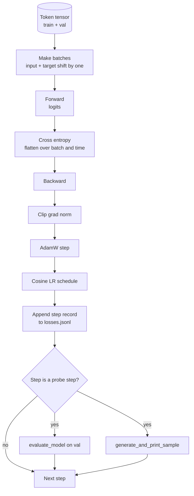

<!-- i18n:manual -->
# Цикл обучения и оценка модели

> Цикл, который ничего не измеряет, — это цикл, который врёт. В этом уроке мы собираем цикл обучения, который двигает GPT-модель: AdamW с раздельным weight decay, расписание learning rate «прогрев плюс косинус», хелпер `calc_loss_batch`, проход `evaluate_model` по отложенным данным, качественную пробу `generate_and_print_sample` каждые K шагов и JSONL-лог потерь, который потом можно нарисовать графиком. Тот же самый скелет обучает любую decoder-LLM, которую вы когда-либо соберёте.

**Type:** Build
**Languages:** Python
**Prerequisites:** Phase 19 lessons 30 to 35
**Time:** ~90 minutes

## Learning Objectives

- Собрать цикл обучения, который считает cross-entropy loss с правильным выравниванием входа и цели для предсказания следующего токена.
- Настроить AdamW так, чтобы weight decay применялся к матрицам весов и не применялся к тензорам LayerNorm и bias.
- Реализовать расписание learning rate с линейным прогревом и косинусным затуханием и научиться читать получившийся LR во времени.
- Оценивать модель на отложенной выборке через `evaluate_model`, чтобы eval loss можно было сравнивать между прогонами.
- Каждые K шагов порождать качественный сэмпл через `generate_and_print_sample` и ловить расходимость раньше, чем её покажет кривая loss.
- Сохранять пошаговый loss в JSONL, чтобы потом перечитать его, нарисовать график и отдать лог обучения как готовый артефакт.

## The Problem

Скрипт обучения, который печатает loss и больше ничего не делает, проваливается тремя способами. Он не скажет вам, падает ли loss по правильной причине (модель могла просто переобучиться на обучающей выборке и не выучить ничего). Он не скажет, началась ли расходимость (loss может скакнуть на один шаг и вернуться, а может скакнуть и рухнуть). Он не скажет, чему модель научилась (loss — это одно число; сгенерированный сэмпл — это целый абзац). Все три провала прячутся, пока цикл не начнёт измерять.

Цикл из этого урока измеряет тремя способами. Loss на обучающем батче — каждый шаг. Loss на отложенном батче — каждые K шагов. Продолжение фиксированного промпта — каждые K шагов. Лог обучения ложится в JSONL, так что артефакт становится показаниями самого цикла.

> 🎒 **На пальцах.** Три измерения — это три разных прибора: спидометр (loss на батче), контрольное взвешивание (loss на отложенных данных) и «а ну-ка скажи что-нибудь» (сгенерированный сэмпл). Если train loss упал с 5.5 до 2.0, а val loss как стоял на 5.4, так и стоит — второй прибор поймал переобучение, которое первый в упор не видит.

## The Concept



> 🎒 **На пальцах.** Прочитайте схему как список дел на один шаг: нарезать батч, forward, посчитать loss, backward, обрезать норму градиента, шаг AdamW, обновить LR, дописать строку в лог. Восемь действий, и только два последних ромба — проба на отложенных данных и сэмпл — срабатывают не всегда, а раз в K шагов.

Два неочевидных места здесь — выравнивание loss и раздельный weight decay в AdamW.

### Loss alignment

Модель предсказывает следующий токен на каждой позиции. Если во входном батче лежат токены `[t0, t1, t2, t3]`, то целевой батч обязан быть `[t1, t2, t3, t4]`. Cross-entropy считается на плоской форме `(batch * seq, vocab)` против плоской цели `(batch * seq,)`. Забудьте про сдвиг — и вы будете учить модель предсказывать саму себя: loss сойдётся к нулю, а модель не выучит ничего полезного.

> 🎒 **На пальцах.** Сдвиг на единицу — это как учить ребёнка продолжать поговорку: вы говорите «без труда не выловишь», он должен сказать «рыбку». Если цель совпадает со входом, вы просите повторить за вами — и он справится идеально, ничего не поняв. Батч 4 на 128 токенов даёт плоскую форму 512 строк, и все 512 целей сдвинуты ровно на одну позицию.

### AdamW decay split

Weight decay регуляризует матрицы весов, но не масштабы нормализации и не смещения. Повесьте decay на scale в LayerNorm — и масштаб медленно уползёт к нулю, сломав нормализацию. Повесить decay на bias математически безвредно, но это пустая трата тактов. Стандартное разделение такое: тензорам-матрицам (веса линейных слоёв, таблицы эмбеддингов) decay достаётся, а всему, что выглядит как масштаб или сдвиг, — нет.

> 🎒 **На пальцах.** Weight decay тянет каждое число к нулю на каждом шаге. Для матрицы весов это полезно: она становится скромнее и меньше переобучается. Но scale в LayerNorm стартует с 1.0 и именно этой единицей возвращает активациям нормальный масштаб — утяните его к нулю, и выход слоя тоже поедет к нулю. Отсюда и две группы параметров в AdamW.

### Warmup plus cosine schedule

Прогрев поднимает learning rate от нуля до целевого значения за первые несколько сотен шагов, чтобы состояние оптимизатора успело наполниться. Косинусное затухание потом опускает learning rate обратно к нулю на оставшихся шагах, так что финальная фаза доводит веса мелкими шажками. Эта комбинация — самое частое расписание в обучении открытых LLM, потому что она убирает почти все хрупкие моменты первой тысячи шагов и последней тысячи шагов.

> 🎒 **На пальцах.** Посчитайте сами: прогрев на 200 шагов до max_lr = 3e-4 означает, что на шаге 100 вы идёте с LR = 1.5e-4, ровно половиной. А косинус в конце опускает шаг обратно почти к нулю — как парковка: разогнались, доехали, и последние метры ползёте, чтобы не задеть бампер.

### Held out evaluation

`evaluate_model` прогоняет фиксированное число батчей из валидационной выборки, накапливает loss, делит на количество батчей и возвращает результат. Без градиентов. Без dropout. Число воспроизводимо между прогонами при том же seed и той же разбивке. Печатать loss на отложенных данных рядом с обучающим — это и есть способ заметить переобучение.

> 🎒 **На пальцах.** «Без градиентов» тут не только про корректность, но и про скорость: `torch.no_grad()` не хранит промежуточные активации, поэтому проход по 10 валидационным батчам стоит дешевле, чем 10 обучающих шагов, и памяти ест в разы меньше. А фиксированный seed нужен, чтобы разница между двумя прогонами была разницей моделей, а не разницей случайных батчей.

### Qualitative sampling as an early signal

Модель, у которой training loss красиво падает, а все сгенерированные сэмплы состоят из одного и того же токена, — сломана. Модель, у которой кривая loss выглядит плоской, а сэмплы постепенно затачиваются в осмысленные слова, — учится. Качественная проба работает быстрее, чем вычитывание всей кривой, и ловит режимы отказа, которые одно скалярное число пропускает.

> 🎒 **На пальцах.** Классический случай: модель нашла самый частый токен (например, пробел) и печатает только его. Loss при этом честно падает — угадывать самый частый символ выгодно. Один взгляд на строку сэмпла вида «          » закрывает вопрос за секунду, а по графику loss вы это не увидите вообще.

```figure
cap-training-loop
```

## Build It

`code/main.py` реализует:

- `make_batches(token_ids, batch_size, context_length)` — нарезает длинный тензор токенов на пары «вход и цель».
- `calc_loss_batch(model, inputs, targets)` — делает forward, разворачивает в плоскую форму и возвращает скалярный cross-entropy.
- `evaluate_model(model, val_loader, max_batches)` — проходит фиксированное число валидационных батчей без градиентов и возвращает средний loss.
- `generate_and_print_sample(model, prompt, max_new_tokens)` — запускает функцию генерации из урока 35 на фиксированном промпте и печатает результат.
- `build_param_groups(model, weight_decay)` — собирает список параметров AdamW из двух групп.
- `cosine_with_warmup(step, warmup_steps, total_steps, max_lr, min_lr)` — возвращает LR на заданном шаге.
- `train(...)` — крутит цикл, сохраняет `outputs/losses.jsonl` и каждые `eval_every` шагов печатает eval loss и сэмпл.
- Демо, которое обучает крошечную модель на синтетических данных небольшое число шагов, пишет JSONL-лог и печатает eval loss и сэмпл в точках проб. Демо отрабатывает на CPU меньше чем за минуту.

Запустите:

```bash
python3 code/main.py
```

Вывод: строка с loss на каждом шаге, eval loss на каждом проверочном шаге, сгенерированный сэмпл на каждом проверочном шаге и итоговый `outputs/losses.jsonl`, который читается построчно через `json.loads`.

> 🎒 **На пальцах.** Обратите внимание, что все семь функций — маленькие и с понятными именами: `make_batches` про данные, `calc_loss_batch` про потери, `evaluate_model` про проверку, `cosine_with_warmup` про расписание. Это не украшательство. Когда обучение пойдёт не так в три часа ночи, вы будете чинить одну функцию из семи, а не двухсотстрочный скрипт целиком.

## Stack

- `torch` — для autograd, оптимизатора и модулей.
- `main.py` заново реализует `GPTModel` из урока 35 и вспомогательные модули прямо у себя внутри.

## Production patterns in the wild

Три приёма превращают учебный цикл в то, что можно оставить работать на всю ночь.

**Gradient norm clipping is non negotiable.** Плохой батч (аномальные данные, скачок LR, численный крайний случай) выдаёт огромный градиент, который стирает часы обучения. Вызов `torch.nn.utils.clip_grad_norm_(params, max_norm=1.0)` после `backward` и до `step` удерживает оптимизатор в безопасном диапазоне. Значение обрезки — свободный параметр; единица — дефолт, который выживает в большинстве конфигураций.

> 🎒 **На пальцах.** Клиппинг работает как ограничитель тяги: он смотрит на длину всего вектора градиента и, если она больше 1.0, делит весь вектор на эту длину. Направление шага остаётся тем же, длина становится ровно 1.0. Градиент нормой 50 после обрезки станет нормой 1 — то есть один взбесившийся батч сдвинет веса ровно настолько же, насколько обычный.

**Resumable JSONL logging, not pickled state.** Пошаговые записи потерь в виде строк `{"step": int, "train_loss": float, "lr": float}` в JSONL долговечны: любое падение оставляет читаемый артефакт, по нему можно грепать, его можно нарисовать тридцатью строками Python, а обучение можно продолжить, прочитав последний шаг. Pickle-состояние привязывает вас к точной раскладке модулей, которая породила файл, а это ломается при любом рефакторинге.

> 🎒 **На пальцах.** JSONL — это «одна запись на строку», ничего больше. Файл на 10 000 шагов весит около мегабайта и открывается любым текстовым редактором. Упал процесс на шаге 7 431 — у вас на диске 7 431 честная строка, и последняя из них говорит, откуда продолжать. С pickle вы получите либо всё, либо обрезанный бинарник, который уже не прочитать.

**Eval batches drawn from a fixed slice.** Валидационные токены нарезаются на батчи один раз при старте скрипта, а не на лету. Воспроизводимость держится на том, что eval-батчи одинаковы от прогона к прогону; иначе сравнение eval loss между двумя прогонами измеряет перемешивание батчей ровно в той же мере, что и саму модель.

> 🎒 **На пальцах.** Это как взвешиваться всегда на одних и тех же весах и в одно и то же время. Если один прогон дал eval loss 3.21, а другой 3.18, вы хотите быть уверены, что разница в модели. Перетасуйте валидационные батчи между прогонами — и эти 0.03 могут оказаться просто другими предложениями, попавшими в проверку.

## Use It

- Цикл из этого урока — тот же самый скелет, что обучает модель на 124M параметров на настоящих данных. Замените синтетический тензор токенов на загрузчик в стиле `datasets`, и цикл поедет без единой правки.
- JSONL-лог — тот самый артефакт, который превращает прогон обучения в доказательство. Следующий урок использует такой лог, чтобы сравнить свежеобученный чекпойнт с предобученным.
- Качественная проба сэмплом — универсальный ловец того, что скалярный loss заменить не может.

## Exercises

1. Добавьте юнит-тесты `weight_decay_groups()`, которые подтверждают: параметры-масштабы и параметры-смещения попадают в группу без decay, а веса линейных слоёв и эмбеддингов — в группу с decay.
2. Замените синтетические случайные токены байтами из небольшого текстового файла, чтобы демо обучалось на чём-то читаемом. Убедитесь, что сгенерированный сэмпл использует символы, которые есть в файле.
3. Добавьте в косинусное расписание нижнюю границу `min_lr` в 10 процентов от `max_lr` и перерисуйте график.
4. Сохраняйте чекпойнт каждые `eval_every` шагов в дополнение к JSONL-логу. Добавьте флаг `resume_from`, который перезагружает состояние модели и состояние оптимизатора.
5. Логируйте пошаговую пропускную способность (токенов в секунду) рядом с loss и убедитесь, что она держится в стабильном коридоре.

> 🎒 **На пальцах.** Начните с задания 5 — оно самое дешёвое и самое полезное. Если на шаге 100 у вас 12 000 токенов в секунду, а на шаге 900 — 4 000, значит что-то течёт: список растёт в памяти, свап, или вы случайно копите тензоры с градиентами. Ровная полка по throughput — признак того, что цикл можно оставлять без присмотра.

## Key Terms

| Term | What people say | What it actually means |
|------|-----------------|------------------------|
| Loss alignment | «Сдвиг на единицу» | Входные токены на позициях 0..T-1, целевые токены на позициях 1..T; cross-entropy считается на развёрнутых плоских формах |
| Decay split | «Две группы» | AdamW получает тензоры-матрицы с weight decay и тензоры-масштабы или смещения без него |
| Warmup | «Разгон» | Learning rate поднимается от нуля до целевого значения за фиксированное число шагов, чтобы состояние оптимизатора успело наполниться |
| Eval batches | «Отложенные батчи» | Фиксированный кусок валидационного тензора токенов, нарезанный один раз при старте скрипта и используемый одинаково на каждой пробе |
| Qualitative probe | «Печать сэмпла» | Короткая генерация с фиксированного промпта, печатаемая каждые K шагов, чтобы ловить режимы отказа, которые один только loss прячет |

## Further Reading

- Фаза 19, урок 35 — модель, которую двигает этот цикл обучения.
- Фаза 19, урок 37 — загрузка предобученных весов в ту же самую модель.
- Фаза 10, урок 04 (предобучение мини-GPT) — та же процедура на настоящих данных.
- Фаза 10, урок 10 (evaluation) — более широкий набор способов оценки за пределами cross-entropy loss.
