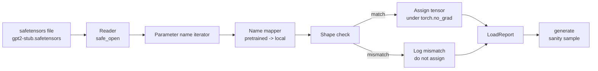

<!-- i18n:manual -->
# Загрузка предобученных весов

> Обучить модель на 124 миллиона параметров с нуля — это решение про бюджет; загрузить опубликованный чекпойнт — это обычный вторник. В этом уроке мы грузим предобученные веса в стиле GPT-2 из файла safetensors ровно в ту архитектуру, что была в уроке 35, разбираем сопоставление имён параметров кусочек за кусочком и проверочно генерируем продолжение, чтобы доказать: загрузка сработала. Ни сети, ни сторонних загрузчиков, ни непрозрачной магии.

**Type:** Build
**Languages:** Python
**Prerequisites:** Phase 19 lessons 30 to 36
**Time:** ~90 minutes

## Learning Objectives

- Прочитать файл safetensors библиотекой `safetensors` для Python и посмотреть имена и формы тензоров.
- Сопоставить каждое имя предобученного параметра с параметром внутри GPT-модели из урока 35.
- Разобраться с двумя разными соглашениями об именах: у опубликованных весов GPT-2 это `wte/wpe/h.N.attn.c_attn/c_proj` и `mlp.c_fc/c_proj`, а у нашей модели — `tok_embed/pos_embed/blocks.N.attn.qkv/out_proj` и `mlp.fc1/fc2`.
- Обнаруживать несовпадение форм и отказываться грузить, выдавая внятную ошибку до того, как хоть один вес будет присвоен.
- Сгенерировать короткое продолжение с загруженными весами и убедиться, что токены пришли из загруженного распределения, а не из случайно инициализированного.

## The Problem

Опубликованные веса не упакованы под вашу архитектуру. Они несут те имена, которые использовала оригинальная реализация. В предобученном файле лежит `transformer.h.0.attn.c_attn.weight` формы `(2304, 768)`; ваша модель ждёт `blocks.0.attn.qkv.weight` формы `(2304, 768)` (это та же самая матрица, только в другом соглашении о раскладке), либо ваша модель использует `nn.Linear`, который хранит матрицу транспонированной. Один и тот же параметр всплывает в трёх слегка разных обличьях (имя, форма, раскладка байтов), и загрузчик обязан примирить все три.

Загрузчик, который копирует вслепую, кладёт правильный тензор не туда, и вы получаете модель, генерирующую бессмыслицу. Загрузчик, который отказывается копировать при несовпадении форм, но ничего не пишет в лог, оставляет вас гадать, какой именно тензор не долетел. Загрузчик из этого урока явный: каждое присваивание логируется, каждая форма проверяется, а `LoadReport` подводит итог по попаданиям, промахам и несовпадениям форм, чтобы вы могли прочитать, что произошло.

> 🎒 **На пальцах.** Это как собрать шкаф из чужой коробки: детали те же, но подписаны по-другому, и часть из них лежит зеркально. Матрица `(2304, 768)` — это склеенные подряд Q, K и V: 768 × 3 = 2304 строки. Перепутайте порядок или забудьте транспонировать — детали физически влезут, а шкаф развалится.

## The Concept



Сопоставитель имён — это просто функция из строки в строку. Проверка формы — это один `if`. Присваивание происходит внутри `torch.no_grad()`, чтобы autograd не отслеживал загрузку. Отчёт хранит исход по каждому имени.

> 🎒 **На пальцах.** Вся схема — конвейер из пяти станков: открыть файл, перебрать имена, переименовать, проверить форму, положить на место. Ромб «совпало / не совпало» — единственная развилка во всём загрузчике. Всё остальное — механическая работа, которую страшно делать руками для 148 тензоров GPT-2 Small.

### The GPT-2 naming convention

Опубликованные веса GPT-2 живут под такими именами:

| Pretrained name | Shape | Meaning |
|-----------------|-------|---------|
| `wte.weight` | (50257, 768) | Таблица token embeddings |
| `wpe.weight` | (1024, 768) | Таблица position embeddings |
| `h.N.ln_1.weight` | (768,) | Масштаб первого LayerNorm в блоке N |
| `h.N.ln_1.bias` | (768,) | Сдвиг первого LayerNorm в блоке N |
| `h.N.attn.c_attn.weight` | (768, 2304) | Веса склеенного линейного слоя QKV |
| `h.N.attn.c_attn.bias` | (2304,) | Смещение склеенного слоя QKV |
| `h.N.attn.c_proj.weight` | (768, 768) | Выходная проекция attention |
| `h.N.attn.c_proj.bias` | (768,) | Смещение выходной проекции attention |
| `h.N.ln_2.weight` | (768,) | Масштаб второго LayerNorm |
| `h.N.ln_2.bias` | (768,) | Сдвиг второго LayerNorm |
| `h.N.mlp.c_fc.weight` | (768, 3072) | Веса fc1 в MLP |
| `h.N.mlp.c_fc.bias` | (3072,) | Смещение fc1 в MLP |
| `h.N.mlp.c_proj.weight` | (3072, 768) | Веса fc2 в MLP |
| `h.N.mlp.c_proj.bias` | (768,) | Смещение fc2 в MLP |
| `ln_f.weight` | (768,) | Масштаб финального LayerNorm |
| `ln_f.bias` | (768,) | Сдвиг финального LayerNorm |

> 🎒 **На пальцах.** Пробегитесь по формам как по описи. `(50257, 768)` — по вектору на каждый токен словаря. `(768, 2304)` — те самые три проекции разом. `(768, 3072)` и `(3072, 768)` — расширение MLP в четыре раза и обратное сжатие. Буква `N` в `h.N` — просто номер блока от 0 до 11, поэтому одна строка таблицы разворачивается в двенадцать реальных тензоров.

Есть два сюрприза, к которым стоит подготовиться. Линейные слои `c_attn`, `c_proj` и `c_fc` хранятся с матрицей, транспонированной относительно того, что ждёт `nn.Linear.weight`. Загрузчик транспонирует их прямо при присваивании. А головы языковой модели в файле нет вообще: модель полагается на weight tying с `wte`, поэтому голова выставляется алиасом сразу после того, как `wte` встал на место.

> 🎒 **На пальцах.** Транспонирование — это как читать таблицу по столбцам вместо строк: числа те же, смысл тот же, но если перепутать, всё поедет. Проверка простая: `nn.Linear(768, 3072).weight` имеет форму `(3072, 768)`, а в файле лежит `(768, 3072)`. Формы «зеркальны» — значит нужен `.T`. Если бы обе были `(768, 768)`, как у `c_proj` в attention, ошибку по форме поймать уже нельзя, и транспонировать надо по правилу, а не на глазок.

### The local naming convention

Модель в нашем треке использует говорящие имена:

| Local name | Meaning |
|------------|---------|
| `tok_embed.weight` | Таблица token embeddings |
| `pos_embed.weight` | Таблица position embeddings |
| `blocks.N.ln1.scale` | Масштаб первого LayerNorm в блоке N |
| `blocks.N.ln1.shift` | Сдвиг первого LayerNorm |
| `blocks.N.attn.qkv.weight` | Склеенный QKV |
| `blocks.N.attn.qkv.bias` | Смещение склеенного QKV |
| `blocks.N.attn.out_proj.weight` | Выходная проекция attention |
| `blocks.N.attn.out_proj.bias` | Смещение выходной проекции |
| `blocks.N.ln2.scale` | Масштаб второго LayerNorm |
| `blocks.N.ln2.shift` | Сдвиг второго LayerNorm |
| `blocks.N.mlp.fc1.weight` | fc1 в MLP |
| `blocks.N.mlp.fc1.bias` | Смещение fc1 в MLP |
| `blocks.N.mlp.fc2.weight` | fc2 в MLP |
| `blocks.N.mlp.fc2.bias` | Смещение fc2 в MLP |
| `final_ln.scale` | Масштаб финального LayerNorm |
| `final_ln.shift` | Сдвиг финального LayerNorm |

Сопоставление — фиксированная функция. Урок поставляет её словарём, по которому загрузчик просто идёт циклом.

> 🎒 **На пальцах.** Положите две таблицы рядом: строка за строкой это один и тот же список из шестнадцати вещей, просто на двух «языках». `wte` ↔ `tok_embed`, `ln_1.weight` ↔ `ln1.scale`, `c_fc` ↔ `fc1`. Именно поэтому словарь-переходник — самый скучный и самый надёжный способ: шестнадцать пар вместо шестнадцати ветвлений в коде.

### The stub fixture

Настоящие веса GPT-2 весят 0,5 ГБ. Демо их не скачивает: при первом запуске оно само генерирует маленькую фикстуру safetensors с точно тем же соглашением об именах GPT-2 и формами под модель из 12 блоков с d_model 192 вместо 768. У фикстуры правильная структура, чтобы прогнать в загрузчике каждую ветку кода. Подмените фикстуру настоящим файлом — и загрузчик заработает без единой правки.

> 🎒 **На пальцах.** Фикстура — это макет двери в мебельном: ручка на месте, замок настоящий, а весит она килограмм вместо сорока. Уменьшение d_model с 768 до 192 режет размеры вчетверо по каждой оси, то есть матрица `(768, 3072)` превращается в `(192, 768)` — в 16 раз меньше чисел. Все имена, все проверки форм и все транспонирования при этом остаются ровно теми же.

```figure
cc-weight-remap
```

## Build It

`code/main.py` реализует:

- Небольшую копию `GPTModel` из урока 35, чтобы этот урок был самодостаточным.
- `make_pretrained_to_local(num_layers)` — разворачивает послойные записи по всем блокам.
- `load_safetensors(model, path)` — перебирает имена, сопоставляет их, проверяет форму, транспонирует веса в стиле conv1d и присваивает под `torch.no_grad()`. Возвращает `LoadReport`.
- `make_stub_safetensors(path, cfg)` — генерирует файл-фикстуру ровно с предобученным соглашением об именах.
- Демо, которое при первом запуске создаёт `outputs/gpt2-stub.safetensors`, строит свежую модель, снимает одно сгенерированное продолжение со случайной инициализации, грузит фикстуру, снимает второе продолжение, печатает оба и проверяет, что они различаются (то есть загрузка действительно изменила модель).

Запустите:

```bash
python3 code/main.py
```

Вывод: путь к фикстуре, лог загрузки по каждому имени, сводка `LoadReport`, продолжение до загрузки, продолжение после загрузки и несовпадение формы на одном намеренно испорченном тензоре, подложенном в фикстуру, чтобы ветка отказа тоже отработала.

> 🎒 **На пальцах.** Проверка «продолжения различаются» — это тест на живучесть в одну строку. Случайно инициализированная модель выдаёт мусор, загруженная — другой текст. Если оба вывода совпали байт в байт, значит ни один тензор не долетел, и загрузчик тихо промахнулся по всем именам сразу. Такое случается от одной опечатки в префиксе вроде `transformer.` — и без этой проверки вы обнаружите её через час.

## Stack

- `safetensors` — формат на диске и потоковый читатель.
- `torch` — модель и арифметика присваивания.
- Ни `transformers`, ни `huggingface_hub`, ни единого сетевого вызова.

## Production patterns in the wild

Три приёма помогают загрузчику выжить при встрече с весами, которые создавали не вы.

**Always validate the file before any assignment.** Откройте файл, перечислите каждое имя тензора с его dtype и формой, прогоните полное сопоставление с проверкой форм и только при успехе начинайте присваивать. Наполовину загруженные модели — это машины по производству тихих отказов.

> 🎒 **На пальцах.** Разница как между «примерить всё перед кассой» и «покупать, не глядя». Если из 148 тензоров GPT-2 Small 147 легли, а один нет, модель запустится и даже что-то сгенерирует — просто хуже. Никакого исключения, никакого краха. Проверка до первого присваивания превращает такой сценарий в честную ошибку на старте.

**Log every assignment with the source name and the destination name.** Когда что-то выглядит неправильно, лог говорит, какой тензор куда лёг; альтернатива — читать hexdump. Датакласс `LoadReport` в этом уроке ведёт списки `loaded`, `missing`, `unexpected` и `shape_mismatch` и печатает сводку в конце.

> 🎒 **На пальцах.** Четыре списка отвечают на четыре разных вопроса. `loaded` — что легло. `missing` — что модель ждала, а в файле не нашлось. `unexpected` — что было в файле, но модели не нужно. `shape_mismatch` — имя нашлось, а размер не тот. Здоровая загрузка выглядит так: `loaded` полный, `missing` пустой, а в `unexpected` разве что служебные буферы масок.

**The LM head is a weight tying alias, not a separate copy.** Присвоение `model.lm_head.weight = model.tok_embed.weight` после загрузки `tok_embed` — канонический приём. Копирование матрицы эмбеддингов в свежий параметр `lm_head.weight` ломает weight tying и молча удваивает число параметров.

> 🎒 **На пальцах.** Алиас — это ярлык на файл, а копия — второй файл. Для GPT-2 Small таблица эмбеддингов весит 50257 × 768 ≈ 38,6 млн параметров, то есть около 154 МБ в fp32. Скопируете вместо алиаса — и модель распухнет на эти 154 МБ, а обучение начнёт разъезжать: вход и выход перестанут делить одно пространство представлений.

## Use It

- Загрузчик работает с любым файлом safetensors, который использует предобученное соглашение об именах. Настоящие файлы GPT-2 (small / medium / large / xl) заходят без правок кода; отличается только конфиг модели.
- Тот же приём распространяется на веса LLaMA, Mistral и Qwen, как только вы обновите карту имён. Проверки форм и отчёт остаются идентичными.
- Проверочная генерация после загрузки — быстрый шлагбаум: если сэмплы после загрузки выглядят как сэмплы до неё, значит загрузка ничего не изменила, а сопоставление тихо промахнулось по всем тензорам.

> 🎒 **На пальцах.** Переход от GPT-2 Small к XL — это только смена конфига: 12 блоков превращаются в 48, d_model 768 в 1600, а карта имён и весь код загрузчика не меняются вообще. Переход к LLaMA дороже, но тоже конечен: там нет смещений и вместо LayerNorm стоит RMSNorm, то есть из карты пропадает примерно половина строк, а логика остаётся той же.

## Exercises

1. Добавьте загрузчику аргумент `dtype`, который приводит каждый тензор к целевому типу (`bfloat16`, `float16`, `float32`) прямо при присваивании. Убедитесь, что модель во `float32` можно опустить до `bfloat16` и она всё ещё генерирует.
2. Добавьте аргумент `expected_layers`, который отказывается грузить чекпойнт, если индексы `h.N` не совпадают с `num_layers` модели.
3. Подключите загрузчик к функции генерации из урока 35 и получите два сэмпла бок о бок: один со случайной инициализации, второй с загруженной фикстуры.
4. Добавьте путь экспорта: запишите текущее состояние модели в новый файл safetensors, используя предобученное соглашение об именах. Прогоните загрузчик туда-обратно и убедитесь, что в отчёте ноль несовпадений форм.
5. Расширьте `NAME_MAP` под соглашение об именах LLaMA (без смещений, RMSNorm, своя раскладка склеенного qkv) и перезапустите загрузчик на сгенерированной вами фикстуре LLaMA.

> 🎒 **На пальцах.** Задание 4 — самое коварное и самое полезное: экспорт заставляет вас развернуть карту имён в обратную сторону и транспонировать обратно. Если круг «сохранил — загрузил» дал ноль несовпадений и те же самые числа, значит вы поняли все три обличья параметра. Задание 1 при этом почти бесплатное: `bfloat16` режет память вдвое, а качество генерации на глаз не меняется.

## Key Terms

| Term | What people say | What it actually means |
|------|-----------------|------------------------|
| Name map | «Переименование ключей» | Функция из имён предобученных тензоров в имена локальных параметров; обычно обычный словарь с одной записью на индекс слоя, развёрнутый циклом |
| Shape mismatch | «Плохая форма» | Предобученный тензор нашёлся под сопоставленным именем, но его размеры не сходятся с локальным параметром; загрузчик отказывается присваивать и записывает пару в лог |
| Transpose-on-load | «Раскладка conv1d» | Опубликованный GPT-2 хранит проекции attention и MLP транспонированными относительно того, что ждёт nn.Linear; загрузчик транспонирует их при присваивании |
| Weight tying alias | «Общая LM-голова» | Присвоение model.lm_head.weight = model.tok_embed.weight, чтобы голова и эмбеддинги делили одну память; именно поэтому головы нет в файле |
| Load report | «Сводка покрытия» | Маленький датакласс со списками loaded, missing, unexpected и shape_mismatch; напечатать его — и есть способ понять, удалась ли загрузка |

## Further Reading

- Фаза 19, урок 35 — архитектура, которая принимает эти веса.
- Фаза 19, урок 36 — цикл обучения, который производит чекпойнт той же формы.
- Фаза 10, урок 11 (quantization) — что делать с загруженными весами, когда памяти в обрез.
- Фаза 10, урок 13 (сборка полного пайплайна LLM) — полный жизненный цикл вокруг загрузки и инференса.
