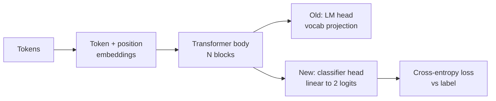
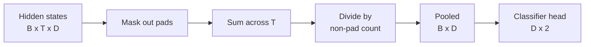
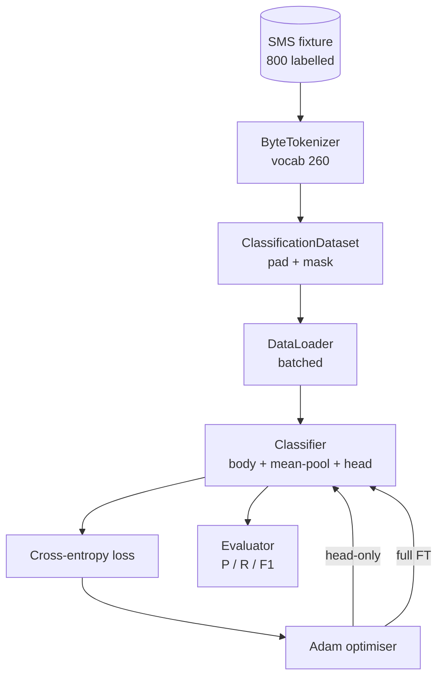

<!-- i18n:manual -->
# Capstone-урок 38: дообучение классификатора заменой головы

> Первый capstone трека B. Предобученная языковая модель — это стопка блоков self-attention, заканчивающаяся головой предсказания токена. Когда вам нужно «спам или не спам», голова не та, а тело почти то. В этом уроке мы отрываем голову, приклеиваем к усреднённому представлению линейный слой на два класса и обучаем классификатор двумя разными способами: только последний слой и полное дообучение. Оцениваем через precision, recall и F1 на отложенной выборке. Вы поймёте, что каждая стратегия даёт и чего стоит.

**Type:** Build
**Languages:** Python (torch, numpy)
**Prerequisites:** Phase 19 lessons 30-37 (NLP LLM track: tokenizer, embedding table, attention block, transformer body, pre-training loop, checkpointing, generation, perplexity)
**Time:** ~90 minutes

## Learning Objectives

- Заменить голову языковой модели на голову классификации, не переинициализируя тело.
- Реализовать два режима обучения — с замороженным телом (только голова) и полное дообучение — на одном общем цикле обучения.
- Собрать пайплайн данных, который знает про токенизатор: добивает паддингом, маскирует паддинг и усредняет выход attention.
- Посчитать precision, recall, F1 и матрицу ошибок прямо из сырых логитов.
- Рассуждать о компромиссе между числом параметров, временем обучения и запасом качества.

## The Problem

Вы предобучили небольшой трансформер на общем корпусе. Выходная голова проецирует последнее скрытое состояние в словарь на 1000 токенов. Теперь у вас есть 800 SMS-сообщений с метками «спам» или «не спам», и вам нужен бинарный классификатор. Вариантов три.

Неправильный вариант — обучить свежий классификатор с нуля на 800 примерах. Тело предобученной модели уже кодирует полезную структуру: какое это слово, на какой позиции, какие слова с какими встречаются рядом. Выбросить всё это — значит выбросить те вычисления, которые его построили.

Два правильных варианта — замена головы с замороженным телом и замена головы с обучаемым телом. Обучение только головы быстрое, почти бесплатное по памяти и на таком объёме данных редко переобучается. Полное дообучение медленнее, на маленьких данных может переобучиться, но достигает большей точности, когда целевой домен уезжает от корпуса предобучения.

В этом уроке мы собираем оба, чтобы вы могли сравнить их на одной и той же фикстуре.

> 🎒 **На пальцах.** Замена головы — это как взять человека, который годами читал книги, и попросить его сортировать письма. Читать заново он не учится, ему нужен только новый навык на выходе. 800 примеров — это очень мало: свежая модель на таком объёме просто запомнит их наизусть, а предобученное тело уже знает, что «выиграли» и «приз» стоят рядом чаще, чем «встретимся» и «приз».

## The Concept



Модель — это функция `f_theta(tokens) -> hidden_states`. Голова — это функция `g_phi(hidden) -> logits`. Замена головы означает, что вы сохраняете `theta` и подменяете `g_phi`. Параметры тела — дорогая часть. Голова — один линейный слой.

> 🎒 **На пальцах.** На схеме от тела `B` идут две стрелки: старая голова в словарь и новая — в 2 логита. Разница в масштабе чудовищная: голова в словарь на 1000 токенов при hidden 64 — это 64 000 весов, а голова классификатора — 64 × 2 = 128 весов плюс два смещения. Вы выбрасываете 64 000 чисел и ставите вместо них 130.

Важны два набора обучаемых параметров:

- `theta` (тело): десятки тысяч весов на каждый блок attention.
- `phi` (голова): `hidden_dim * num_classes` весов плюс смещение.

При обучении только головы вы считаете градиенты по `phi` и обнуляете их по `theta`. PyTorch позволяет сделать это установкой `requires_grad=False` на параметрах тела. Оптимизатор тогда видит только голову, а тело остаётся замороженным.

> 🎒 **На пальцах.** `requires_grad=False` — это не «не считать», а «не запоминать для обратного прохода». Forward всё равно проходит через всё тело, поэтому предсказание не меняется, но память под градиенты и состояния оптимизатора нужна только на 130 чисел вместо десятков тысяч. Отсюда и «почти бесплатно по памяти».

При полном дообучении вы даёте градиентам течь назад через всю стопку. Веса тела уезжают под задачу классификации. Риск — катастрофическое забывание на маленьких данных: предобучение тела вымывается шумом переобучения.

> 🎒 **На пальцах.** Катастрофическое забывание на 800 примерах выглядит так: модель находит, что все сообщения со словом «бесплатно» в фикстуре — спам, и перестраивает под это половину внимания. На тесте из той же фикстуры всё отлично, а на настоящих SMS она развалится. Замороженное тело физически не может так испортиться: у переобучения есть только 130 ручек.

## The Pooling Question

Классификатору нужен один вектор на последовательность, а не по вектору на токен. Три частых варианта:

- **Mean pool**: усреднить скрытые состояния по всей последовательности с весами по маске внимания.
- **CLS pool**: приписать спереди специальный токен и использовать только его выход. Так делает BERT.
- **Last-token pool**: взять последний непаддинговый токен. Так делают классификаторы на моделях класса GPT.

В этом уроке используется mean pooling с явным взвешиванием по маске паддинга. Это самый простой вариант, он даёт стабильный сигнал при разной длине последовательностей и не требует предобучать токен CLS.

> 🎒 **На пальцах.** Взвешивание по маске — это не «поделить на 32», а «поделить на реальную длину». Сообщение из 7 токенов, добитое паддингом до 32: без маски вы сложите 7 осмысленных векторов и 25 нулей и поделите на 32, размыв сигнал в 4,5 раза. С маской вы делите на 7 и получаете честное среднее.



## The Data

Восемьсот SMS-сообщений, поровну 400 спама и 400 не-спама, генерируются детерминированно в `code/main.py`. Генератор берёт фиксированный seed, выбирает шаблоны, подставляет в слоты значения и выдаёт сообщения длиной от 5 до 25 токенов. У настоящих датасетов есть шум, которого в этой фикстуре нет. Смысл фикстуры — в воспроизводимости.

Данные делятся 80/20: 640 на обучение, 160 на тест. Разбиение стратифицированное, так что в тесте сохраняется баланс 50/50. Отложенная выборка с известным балансом позволяет читать precision и recall как честные числа.

> 🎒 **На пальцах.** Баланс 50/50 в тесте важнее, чем кажется. Если бы в тесте было 152 «не-спам» и 8 «спам», модель, всегда отвечающая «не-спам», получила бы 95% точности и ноль пользы. При балансе 80 на 80 такая модель даёт recall = 0 и F1 = 0 — цифры сразу говорят правду.

## The Metrics

Бинарная классификация, где класс 1 — положительный (спам). Считаем:

- `TP`: предсказали спам, и это был спам.
- `FP`: предсказали спам, а это был не-спам.
- `FN`: предсказали не-спам, а это был спам.
- `TN`: предсказали не-спам, и это был не-спам.

Три главные метрики:

- `precision = TP / (TP + FP)`. Из сообщений, помеченных как спам, какая доля действительно спам?
- `recall = TP / (TP + FN)`. Из настоящего спама какую долю модель пометила?
- `F1 = 2 * P * R / (P + R)`. Гармоническое среднее этих двух.

> 🎒 **На пальцах.** Подставьте числа: модель поймала 68 спамов из 80, ошибочно пометила 7 обычных сообщений. Тогда precision = 68 / 75 ≈ 0,91, recall = 68 / 80 = 0,85, а F1 = 2 × 0,91 × 0,85 / (0,91 + 0,85) ≈ 0,88. Precision — про то, насколько вам можно верить, когда вы кричите «спам»; recall — про то, сколько спама вы всё-таки пропустили в почту.

Матрица ошибок печатает эти четыре числа в виде сетки 2x2. Демо выводит её в stdout для обоих режимов обучения.

> 🎒 **На пальцах.** Гармоническое среднее в F1 выбрано не случайно: оно жестоко наказывает перекос. При precision 1,0 и recall 0,1 обычное среднее дало бы благополучные 0,55, а F1 даёт 0,18 — и честно сообщает, что модель почти ничего не ловит. Одна цифра, которую нельзя обмануть, задрав только одну сторону.

```figure
cap-classifier-head-swap
```

## Architecture



Тело — намеренно крошечный трансформер: словарь 260, hidden 64, 4 головы, 2 блока, максимальная длина последовательности 32. Он достаточно мал, чтобы оба режима сошлись меньше чем за девяносто секунд на CPU. В самом уроке он не предобучен; вместо этого хелпер `pretrain_quick` делает пять эпох LM-обучения на тексте той же фикстуры, чтобы дать телу нетривиальную стартовую точку. Так урок остаётся самодостаточным.

> 🎒 **На пальцах.** Словарь 260 — это 256 байтов плюс несколько служебных токенов, включая паддинг: побайтовый токенизатор не требует ни обучения, ни словаря на диске. Hidden 64 при 4 головах даёт по 16 измерений на голову. Вся модель — тысячи параметров, а не миллионы, поэтому вы успеете прогнать оба режима, пока закипает чайник.

## What you will build

Реализация — это один `main.py` плюс один модуль тестов (`code/tests/test_main.py`).

1. `ByteTokenizer`: отображает байты в id и резервирует id под паддинг.
2. `Block`: блок трансформера с multi-head attention и feed-forward слоем. Pre-norm.
3. `LMBody`: эмбеддинги токенов и позиций плюс стопка блоков. Возвращает скрытые состояния.
4. `MeanPool`: взвешенное по маске среднее вдоль оси последовательности.
5. `Classifier`: тело, пулинг, линейная голова. Тело — один и тот же объект в обоих режимах.
6. `freeze_body` и `unfreeze_body`: переключают `requires_grad` на параметрах тела.
7. `train_classifier`: один общий цикл. Принимает модель и оптимизатор, настроенный на ту группу параметров, которая сейчас обучается.
8. `evaluate`: прогоняет тестовую выборку и возвращает `Metrics(precision, recall, f1, confusion)`.
9. `run_demo`: коротко предобучает тело, затем обучает и оценивает режим «только голова», затем полный, печатает оба отчёта и выходит с нулевым кодом.

> 🎒 **На пальцах.** Обратите внимание на пункт 5: тело — один и тот же объект в обоих режимах, а не две копии. Именно поэтому переключение стратегии — это буквально один вызов `freeze_body(model)` или `unfreeze_body(model)`, а не отдельный скрипт. Такой же приём вы потом встретите в LoRA: код обучения общий, меняется только то, у каких параметров стоит `requires_grad`.

## Why the comparison matters

Режим «только голова» обычно обучается быстрее и недоучивается мягче. На этой фикстуре после двадцати эпох обучения одной головы вы обычно видите precision около 0,9 и recall около 0,85. Полное дообучение занимает примерно втрое больше времени и приходит в пределах пары пунктов в ту или другую сторону — в зависимости от случайного seed.

Урок не выбирает победителя. Он учит читать цифры вместе с их ценой. На 800 примерах и крошечном теле правильный выбор — только голова. На 80 000 примерах и теле побольше полное дообучение начинает окупаться. Контракт, который вы забираете из этого урока, — это API: одна и та же функция `train_classifier` обслуживает оба режима, а переключатель — один вызов.

> 🎒 **На пальцах.** «Втрое дольше ради пары пунктов» — это и есть суть решения. Если полное дообучение даёт F1 0,89 вместо 0,88 за 90 секунд вместо 30, на этой задаче вы платите 60 секунд за 0,01. Порог, за которым сделка становится выгодной, сдвигается вместе с объёмом данных: чем больше примеров, тем меньше риск переобучения и тем больше запаса у тела.

## Stretch goals

- Добавьте третий режим, в котором размораживается только последний блок. Это иногда называют частичным дообучением. Стоит дешевле полного дообучения и учит больше, чем одна голова.
- Добавьте расписание learning rate. Косинусное расписание на голове плюс меньший постоянный шаг на теле — частая продакшен-схема.
- Замените mean pooling на обучаемый attention-пулинг: маленький слой attention с одним обучаемым запросом. На длинных последовательностях он обычно обходит простое среднее.

Реализация даёт вам крючки. Тесты фиксируют контракт. Числа — уже ваша забота.

> 🎒 **На пальцах.** Первая цель со звёздочкой самая показательная: в теле два блока, значит разморозка последнего даёт примерно половину параметров тела вместо всех. По качеству это обычно ложится ровно между двумя основными режимами — и наглядно показывает, что «заморозить» и «разморозить» не бинарный выбор, а ползунок.
