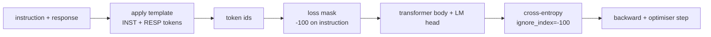
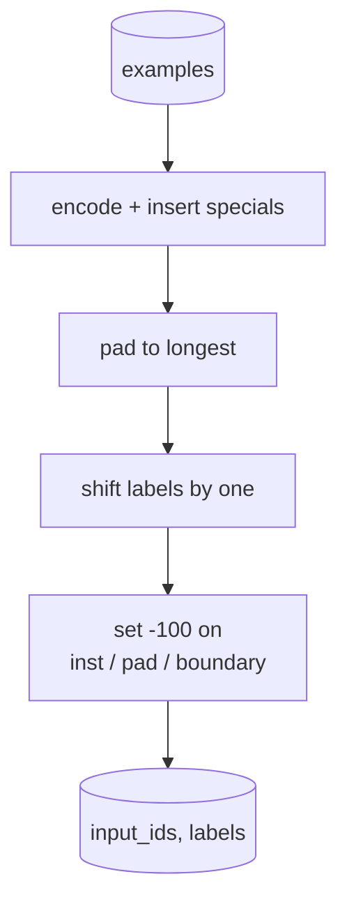
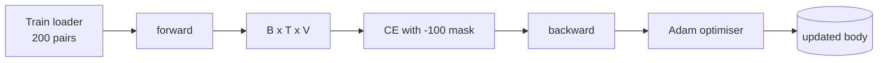

<!-- i18n:manual -->
# Capstone-урок 39: дообучение на инструкциях через supervised fine-tuning

> Предобученная базовая модель умеет продолжить последовательность, но не умеет выполнить инструкцию. Supervised fine-tuning — самое маленькое изменение, которое это чинит: подаём модели пары «инструкция и желаемый ответ» и учим тело сети предсказывать токены ответа. Весь фокус в том, что потери должны считать только ответ, а не инструкцию. В этом уроке мы собираем SFT-цикл в стиле Alpaca со своей collate-функцией, которая маскирует токены инструкции значением `ignore_index=-100`, обучаемся на 200 парах инструкция-ответ и меряем качество на отложенной выборке через exact-match.

**Type:** Build
**Languages:** Python (torch, numpy)
**Prerequisites:** Phase 19 lessons 30-37 (NLP LLM track: tokenizer, embedding table, attention block, transformer body, pre-training loop, checkpointing, generation, perplexity)
**Time:** ~90 minutes

## Learning Objectives

- Складывать пару инструкция-ответ в одну причинную последовательность с явными пограничными токенами.
- Написать collate-функцию, которая маскирует токены инструкции, чтобы перекрёстная энтропия считала только токены ответа.
- Обучить крошечное тело трансформера под задачей SFT и увидеть, как двигается метрика на отложенной выборке.
- Реализовать жадную генерацию и генерацию с температурой, которые уважают границу начала ответа.
- Посчитать exact-match на отложенной выборке по сгенерированным продолжениям.

## The Problem

Базовая модель, обученная предсказывать следующий токен, вообще не знает, что такое инструкция. Покажите ей строку `"What is the capital of France?"` — и она продолжит вопрос или сочинит новое предложение. Язык у модели есть, контракта формата нет.

Контракт SFT — это строковый шаблон. Каждый обучающий пример превращается в одну последовательность с тремя областями:

```text
<INST> What is the capital of France? <RESP> The capital of France is Paris.
```

Пограничные токены — это специальные токены, зарезервированные на этапе обучения. Модель усваивает, что всё после `<RESP>` — это ответ и что оценивают именно ответ. Задача предсказания следующего токена никуда не делась; просто корпус теперь целиком состоит из примеров такой формы.

> 🎒 **На пальцах.** Это бланк заявления: сверху штампик «вопрос», ниже штампик «ответ», и заполнять надо только вторую графу. Посчитайте пример выше: вопрос «What is the capital of France?» — это 30 байт, ответ «The capital of France is Paris.» — 31 байт, плюс два маркера-штампика. Итого одна обучающая последовательность длиной 63 токена.

Но есть подвох. Если скормить всю последовательность обычной перекрёстной энтропии, вы заодно обучаете модель предсказывать токены инструкции. Инструкция и так дана. На этих позициях вам нужен нулевой градиент. Лечится это маской.

> 🎒 **На пальцах.** Представьте диктант: текст читает учитель, а оценку ставят только за то, что написали вы. Без маски модель штрафуют и за 32 позиции инструкции, и за 31 позицию ответа — то есть половину усилий она тратит на то, чтобы научиться сочинять вопросы, которые ей всё равно будут давать готовыми.

## The Concept



`ignore_index` — это возможность `torch.nn.functional.cross_entropy`. Любая позиция цели, равная `ignore_index`, даёт нулевые потери и нулевой градиент. По соглашению в PyTorch это `-100`. Collate-функция строит на каждый пример два тензора: `input_ids` (полная последовательность) и `labels` (копия `input_ids`, где позиции инструкции затёрты значением `-100`).

> 🎒 **На пальцах.** Почему именно `-100`? Потому что это заведомо невозможный номер токена. Словарь тут — 256 байтовых значений плюс три спецтокена, то есть номера от 0 до 258. Отрицательного номера в целях не бывает никогда, поэтому `-100` можно смело трактовать как «эту позицию пропусти» без риска перепутать её с настоящим токеном.

Модель на прямом проходе видит всю последовательность целиком; внимание может смотреть на инструкцию. Потери считают только токены ответа. Это ровно то, что нужно: обусловиться на инструкцию, предсказать ответ.

> 🎒 **На пальцах.** На экзамене вам разрешают перечитывать условие задачи сколько угодно, но балл ставят только за решение. Так же и здесь: attention работает по всем 63 позициям и спокойно смотрит на слово «France» в вопросе, а в сумму потерь попадает только 31 позиция ответа. Смотреть — можно везде, отвечать — только за свою часть.

## The Data

Двести пар инструкция-ответ детерминированно генерируются в `main.py`. Они покрывают шесть типов задач:

- фактовый вопрос в один ход (столица страны X)
- арифметика
- извлечение списка
- краткий пересказ одним предложением
- код (напечатать, отсортировать)
- определение

> 🎒 **На пальцах.** Шесть типов на 200 примеров — это примерно по 33 штуки на тип. Разнообразие тут важнее объёма: если бы все 200 примеров были про столицы, модель выучила бы не «формат ответа», а «после любого вопроса называй город». Разные типы задач заставляют её усвоить именно контракт — «после `<RESP>` идёт ответ по существу».

У каждой задачи шаблонная инструкция и детерминированный ответ. Это сделано нарочно просто. Exact-match — метрика хрупкая, и урок использует фикстуру, где правильный ответ — одна конкретная строка. Настоящим SFT-датасетам нужны нечёткие метрики; принцип при этом ровно тот же.

Разбиение — 160 обучающих примеров и 40 тестовых. Тестовый набор покрывает все шесть типов задач, поэтому exact-match можно показать в разбивке по категориям.

> 🎒 **На пальцах.** 160 и 40 — это классическое разбиение 80/20. Обратите внимание, чем это оборачивается для метрики: один тестовый пример стоит ровно 2,5%, поэтому exact-match может принимать только значения 0,000, 0,025, 0,050 и так далее. Результат 0,85 означает буквально «34 ответа из 40 совпали посимвольно», а разница между 0,85 и 0,875 — это один-единственный пример.

## Tokenisation and Padding

Токенизатор байтовый, с тремя зарезервированными спецтокенами:

- `INST_ID = 256`: отмечает начало области инструкции.
- `RESP_ID = 257`: отмечает границу между инструкцией и ответом.
- `PAD_ID = 258`: паддинг для батчей с разной длиной.

> 🎒 **На пальцах.** Байтовый токенизатор — это когда «токен» просто равен байту, поэтому номера от 0 до 255 уже заняты и первый свободный — 256. Отсюда и три спецтокена подряд: 256, 257, 258. Итоговый размер словаря — ровно 259, и именно столько чисел выдаёт LM-голова на каждую позицию.

Последовательность выглядит как `[INST] inst_bytes [RESP] resp_bytes [PAD]*`. Collate-функция делает следующее:

1. Токенизирует каждый пример.
2. Дополняет каждый пример в батче до самой длинной последовательности в этом батче.
3. Строит `labels` = `input_ids`, сдвинутые на единицу (цель причинной языковой модели), где:
   - Область инструкции заменена на `-100`.
   - Область паддинга заменена на `-100`.
   - Сама позиция границы `RESP_ID` заменена на `-100` (вы не учите модель предсказывать пограничный токен; она предсказывает то, что идёт после него).

> 🎒 **На пальцах.** Паддинг — это как выровнять стопку бумаг разной длины, подложив снизу пустые листы. Пусть в батче четыре примера длиной 40, 52, 63 и 48 токенов: все дополняются до 63, а первому дописывается 23 токена `PAD_ID = 258`. В `labels` эти 23 позиции сразу становятся `-100`, иначе модель прилежно училась бы предсказывать пустоту — и метрика потерь выглядела бы отлично при бесполезной модели.



Сдвиг — стандартный причинный трюк: позиция `i` в `input_ids` предсказывает позицию `i+1`, поэтому `labels[i] = input_ids[i+1]` (последняя позиция выбрасывается из входа, первая — из цели). Маска накладывается после сдвига, чтобы попасть на нужные позиции.

> 🎒 **На пальцах.** Порядок здесь важнее, чем кажется. Из последовательности в 63 токена после сдвига получается 62 входа и 62 цели. Наложите маску до сдвига — и все единицы съедут на одну позицию влево: вы начнёте штрафовать модель за предсказание маркера `<RESP>` и одновременно перестанете штрафовать за первый настоящий токен ответа. Обучение при этом не упадёт, просто модель выучится чуть-чуть не тому.

## Training



Цикл — стандартный SFT-цикл на PyTorch. Adam, скорость обучения примерно от 3e-4 до 1e-3, от десяти до двадцати эпох на этой фикстуре, без планировщика. Модель достаточно мала (скрытая размерность 96, 2 блока, максимальная длина 64), чтобы обучиться до сходимости на CPU меньше чем за две минуты.

> 🎒 **На пальцах.** Сравните масштабы: два блока против 32 у Llama 7B, скрытая размерность 96 против 4096. Отсюда и две минуты на процессоре без всякой видеокарты. Максимальная длина 64 выбрана не случайно — наш пример «столица Франции» занял 63 токена, то есть фикстура подобрана впритык под окно модели.

Каждую пятую эпоху цикл прогоняет маленькую оценку на отложенном наборе и печатает exact-match. Наблюдать, как exact-match идёт от 0.0 на первой эпохе к чему-то вроде 0.85 на пятнадцатой, — и есть главная награда урока: видно, как модель одновременно учит формат и ответы.

> 🎒 **На пальцах.** Двадцать эпох при замере каждую пятую — это всего четыре точки на графике: эпохи 5, 10, 15 и 20. Мало, зато почти бесплатно: генерация 40 ответов на каждом замере стоит куда дороже одной обучающей эпохи. Первый ноль — не поломка: модель ещё не научилась даже останавливаться, и её вывод не совпадает с эталоном ни в одном из 40 случаев.

## Generation

На этапе оценки модель получает префикс инструкции `[INST] inst_bytes [RESP]` и генерирует токены, пока не случится одно из двух:

- последовательность дошла до `max_len`, либо
- модель выдала особую эвристику остановки: два подряд байта конца предложения (`.`, `!`, `?`).

> 🎒 **На пальцах.** Настоящего токена «конец ответа» тут нет, поэтому нужна самодельная стоп-эвристика. Без неё модель на вопросе про Париж выдаст правильные 31 токен, а потом продолжит болтать до упора в `max_len = 64` — и exact-match честно поставит ноль за лишний хвост. Два знака конца предложения подряд — грубый, но дешёвый сигнал «я договорил».

Урок поставляется с жадным декодированием и опциональным сэмплером с температурой. Exact-match использует жадное, потому что температура сделала бы метрику случайной. Настоящие системы часто сэмплируют, а потом судят нечётко; такой пайплайн — это урок 41.

## Exact-Match Evaluation

Exact-match — самая строгая текстовая метрика. Предсказанная строка ответа нормализуется (нижний регистр, обрезка пробелов по краям, схлопывание двойных пробелов) и сравнивается с эталонным ответом, нормализованным так же. Метрика на каждом примере равна либо 1, либо 0. Итог — среднее.

> 🎒 **На пальцах.** Нормализация спасает от косметики, но не от смысла. Строка `"  The  Capital of France is Paris. "` после нормализации превращается в `"the capital of france is paris."` и совпадает с эталоном — получите 1. А вот честный и правильный ответ `"Paris."` даст 0: слов меньше, строка другая. Именно поэтому в уроке 41 рядом с exact-match появляется token F1.

Настоящие SFT-пайплайны дополняют exact-match потокенным F1 (урок 41) и моделью-судьёй. Exact-match остаётся полезным, потому что он однозначен: если он говорит 0.7, значит ровно 70 процентов тестовых инструкций дали эталонный ответ символ в символ.

```figure
cc-sft-loss-mask
```

## What you will build

Реализация — один `main.py` плюс тесты.

1. `InstructionTokenizer`: байтовый кодировщик с зарезервированными спецтокенами. Кодирует либо префикс инструкции, либо полную пару.
2. `make_dataset`: генерирует 200 пар по шести типам задач с фиксированным зерном.
3. `SFTDataset`: возвращает `(input_ids, labels)` на каждый пример, уже подготовленные под маску.
4. `sft_collate`: динамический паддинг, сборка тензора батча, простановка `-100` на позициях инструкции и паддинга.
5. `TinyGPT`: тело трансформера плюс связанная или несвязанная LM-голова.
6. `train_sft`: сам цикл SFT с хуками оценки на каждой эпохе.
7. `generate`: причинное декодирование от префикса, жадное или с сэмплированием, с эвристикой остановки.
8. `exact_match`: сравнение нормализованных строк, возвращает число в `[0, 1]`.
9. `run_demo`: собирает данные, обучает двадцать эпох, оценивает, печатает разбивку по категориям, выходит с нулевым кодом при успехе.

## Why the mask matters

Без маски потери трактуют токены инструкции как цели. Модель учится предсказывать инструкцию. Это другая задача, и она портит модель дважды. Во-первых, ёмкость модели тратится на восстановление входа, который пользователь всегда даёт сам. Во-вторых, вклад ответа в сумму градиента становится меньше, потому что в большинстве батчей токенов инструкции больше, чем токенов ответа; эффективная скорость обучения на той части, которая вам важна, оказывается ниже задуманной. Маска — это не полировка, это сама постановка задачи.

> 🎒 **На пальцах.** Посчитайте на нашем примере: 32 позиции инструкции против 31 позиции ответа. Без маски градиент по ответу разбавлен примерно вдвое — вы поставили `lr = 1e-3`, а на нужную вам часть задачи реально действует около `5e-4`. И это ещё мягкий случай: в реальных датасетах инструкция часто в пять-десять раз длиннее ответа, и тогда разбавление становится десятикратным.

## Stretch goals

- Добавьте прогрев скорости обучения с последующим косинусным затуханием. SFT чувствительнее к lr, чем предобучение.
- Добавьте потокенное логирование потерь и постройте кривую потерь по ходу обучения. Заметьте, что ранние эпохи заняты в основном шаблонными токенами (`<RESP>`, общие префиксы), а поздние — уже настоящими токенами ответа.
- Расширьте оценку до BLEU-1 или chrF. Exact-match занижает оценку моделям, которые выдают перефразировку с тем же ответом.
- Добавьте чат-шаблон с многоходовым форматированием и обучитесь на фикстуре с уточняющими вопросами.

> 🎒 **На пальцах.** Начните со второго пункта — он самый поучительный. Вы увидите, что сначала быстро падает часть потерь, отвечающая за формат (модель за пару эпох выучивает, что после маркера идёт слово с заглавной буквы), а потом кривая надолго упирается в плато: это она мучительно доучивает содержание ответов. Формат стоит дёшево, знания — дорого.

Реализация даёт вам контракт формата, маску и цикл. Переход от базовой модели к исполнителю инструкций — это одна collate-функция.
