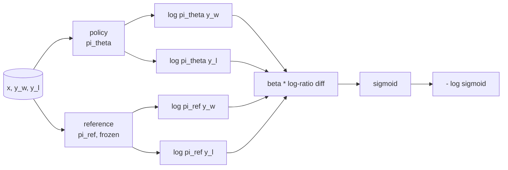
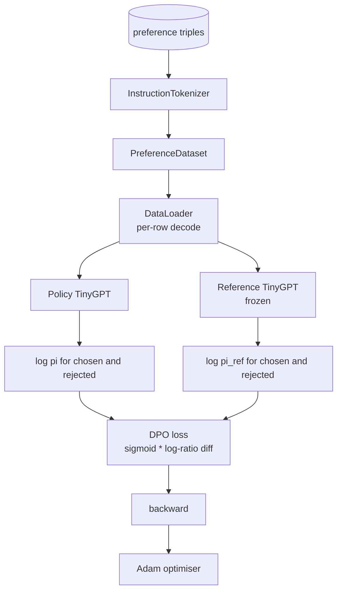

<!-- i18n:manual -->
# Capstone-урок 40: прямая оптимизация предпочтений с нуля

> Модель награды и PPO — классический стек RLHF. DPO схлопывает этот стек в одну функцию потерь обучения с учителем, которая подгоняет политику прямо под пары предпочтений. В этом уроке мы выводим потери DPO из тождества для разности наград, поднимаем рабочую пару «reference-модель плюс модель-политика», считаем потокенные логарифмы вероятностей и обучаем крошечный трансформер на фикстуре предпочтений из выбранных и отвергнутых продолжений. Тесты фиксируют математику потерь и направление градиента, чтобы вы знали: реализация совпадает со статьёй.

**Type:** Build
**Languages:** Python (torch, numpy)
**Prerequisites:** Phase 19 lessons 30-37 (NLP LLM track: tokenizer, embedding table, attention block, transformer body, pre-training loop, checkpointing, generation, perplexity)
**Time:** ~90 minutes

## Learning Objectives

- Вывести потери DPO как сигмоиду от масштабированной разности логарифмов отношений и связать её с неявной наградой.
- Собрать пару «reference-модель плюс модель-политика», где референс заморожен, а политика обучаема.
- Считать логарифмы вероятностей на уровне последовательности под обеими моделями, маскируя токены промпта.
- Обучить политику на тройках `(prompt, chosen, rejected)` и увидеть, как логарифм вероятности выбранного продолжения растёт относительно отвергнутого.
- Закрепить поведение тестами на математику потерь, знак градиента и неизменность референса.

## The Problem

У вас есть SFT-модель. Она выполняет инструкции, но её выводы неровные: одни продолжения ясные, другие многословные или просто неверные. Ещё у вас есть маленький датасет пар предпочтений: на один и тот же промпт человек пометил одно продолжение как выбранное, а другое как отвергнутое.

Классический ответ RLHF — двухэтапный пайплайн. Обучить модель награды на предпочтениях. Оптимизировать политику под эту награду через PPO. Это работает, но дорого: две модели в памяти во время PPO, контроль KL, чтобы политика не убежала от референса, и взлом награды, когда модель награды оказывается хрупкой.

> 🎒 **На пальцах.** RLHF — это когда вы сначала нанимаете судью и учите его отличать хорошее от плохого, а потом натаскиваете спортсмена под этого судью. Проблем сразу две: судью надо содержать (лишняя модель в памяти на всё время PPO) и спортсмен рано или поздно находит его слабости — начинает выигрывать не мастерством, а трюками, которые нравятся конкретному судье. Это и называется взломом награды.

DPO заменяет оба этапа одной функцией потерь обучения с учителем. Модель награды не существует явно вообще. Политика обучается прямо на парах предпочтений, с явным KL-штрафом в сторону SFT-референса. То же оптимальное решение при модели предпочтений Брэдли-Терри, кода в разы меньше.

## The Concept

Начнём с модели Брэдли-Терри. Даны промпт `x` и два продолжения `y_w` (выбранное) и `y_l` (отвергнутое); вероятность того, что человек предпочтёт `y_w`, равна

```text
P(y_w > y_l | x) = sigmoid( r(x, y_w) - r(x, y_l) )
```

где `r` — какая-то скрытая функция награды. RLHF сначала подгоняет `r` под предпочтения, а потом обучает политику `pi` максимизировать `r` с KL-якорем:

```text
max_pi   E_{x, y~pi} [ r(x, y) ] - beta * KL(pi || pi_ref)
```

Вывод DPO замечает, что оптимальная политика `pi*` при такой целевой функции выражается через `r` в замкнутой форме:

```text
pi*(y | x) = (1/Z(x)) * pi_ref(y | x) * exp( r(x, y) / beta )
```

> 🎒 **На пальцах.** Читайте эти две формулы вместе. Первая говорит: «набирай награду, но не уходи далеко от референса», где beta — длина поводка. Вторая — точный ответ на эту задачу: возьми распределение референса и домножь каждый вариант на `exp(r / beta)`. Если вариант лучше на 1 балл награды, а beta = 0.1, его вероятность вырастает в `exp(10)` — примерно в 22 тысячи раз. Маленькая beta — короткий поводок в первой формуле, но резкая перестановка вероятностей во второй.

Перевернём относительно `r`:

```text
r(x, y) = beta * ( log pi*(y | x) - log pi_ref(y | x) ) + beta * log Z(x)
```

> 🎒 **На пальцах.** Это ключевой шаг: награда оказалась выражена через сами модели, а не через отдельную обученную сеть. Пусть политика даёт продолжению логарифм вероятности −20.0, а референс −22.0, и beta = 0.1. Тогда награда равна `0.1 · (−20 + 22)` = 0.2 плюс какая-то константа. Ни один нейрон судьи для этого не понадобился — только два числа с выходов двух моделей.

Слагаемое `log Z(x)` одинаково для `y_w` и `y_l` (оно зависит от `x`, а не от `y`), поэтому сокращается, когда вы считаете разность предпочтений:

```text
r(x, y_w) - r(x, y_l) = beta * ( log pi_theta(y_w|x) - log pi_ref(y_w|x)
                                - log pi_theta(y_l|x) + log pi_ref(y_l|x) )
```

> 🎒 **На пальцах.** Константу `Z(x)` никто не умеет считать — это сумма по всем возможным продолжениям, а их бесконечно много. Спасает то, что оба продолжения отвечают на один и тот же промпт, поэтому в разности неизвестная величина просто вычитается сама из себя. Именно поэтому DPO принципиально работает с *парами*: одиночный ответ упёрся бы в невычислимую `Z(x)`.

Подставим в сигмоиду Брэдли-Терри и возьмём отрицательное логарифмическое правдоподобие по парам предпочтений:

```text
L_DPO(theta) = - E_{(x, y_w, y_l)} [
  log sigmoid( beta * ( log pi_theta(y_w|x) - log pi_ref(y_w|x)
                       - log pi_theta(y_l|x) + log pi_ref(y_l|x) ) )
]
```

Это и есть потери. Сигмоида от одного скаляра на пример, посчитанного из четырёх логарифмов вероятностей. Никакой отдельной модели награды. Никакого PPO. Никакого KL-слагаемого в потерях; ограничение KL уже вшито в вывод замкнутой формы.

> 🎒 **На пальцах.** Свернём всё в арифметику. Четыре числа: политика на выбранном −20.0, референс на выбранном −22.0, политика на отвергнутом −30.0, референс на отвергнутом −29.0. Разность отношений равна `(−20 + 22) − (−30 + 29)` = 3.0, при beta = 0.1 аргумент сигмоиды выходит 0.3, потери — `−log(0.574)` ≈ 0.554. Одна строка кода на весь RLHF.



## The Sign of the Gradient

Полезная проверка здравого смысла до любого запуска обучения. Возьмём градиент по `log pi_theta(y_w | x)`:

```text
d L_DPO / d log pi_theta(y_w | x) = - beta * (1 - sigmoid(z))
```

где `z` — аргумент сигмоиды. Он отрицателен при любых `z`, а значит: увеличение логарифма вероятности выбранного продолжения под политикой уменьшает потери. Симметрично, градиент по `log pi_theta(y_l | x)` положителен: увеличение логарифма вероятности отвергнутого продолжения увеличивает потери. Обучение тянет выбранное вверх, а отвергнутое вниз. Референс заморожен и не двигается.

> 🎒 **На пальцах.** Обратите внимание на множитель `(1 - sigmoid(z))` — это встроенный тормоз. При beta = 0.1 и `z = 0` (модель ещё не различает варианты) градиент равен `−0.1 · 0.5` = −0.05, шаг полноценный. При `z = 3` сигмоида уже 0.953, градиент падает до −0.0047 — примерно в десять раз меньше. Модель сама сбавляет напор, когда пара уже уверенно разведена, и не тратит обучение на то, что и так решено.

## The Data

С уроком поставляются двенадцать троек предпочтений. Каждая — это `(prompt, chosen, rejected)`. Выбранное продолжение короткое и точное. Отвергнутое многословное, не по теме или неверное. Пары покрывают те же семейства задач, что и урок 39 (столица, арифметика, список), поэтому у политики, стартовавшей с SFT-базы, есть разумная точка старта.

> 🎒 **На пальцах.** Здесь мы учим не фактам, а вкусу. В паре про столицу Франции оба продолжения могут содержать слово «Paris» — правильный ответ есть в обоих. Разница только в том, что выбранное отвечает сразу, а отвергнутое сначала три предложения ходит вокруг да около. Именно эту разницу DPO и переносит в веса.

Фикстура намеренно крошечная. В продакшене DPO работает на десятках тысяч пар; здесь смысл в том, что математика потерь и цикл обучения проходят от начала до конца на игрушечном датасете, а разрыв между логарифмами вероятностей выбранного и отвергнутого заметно растёт.

> 🎒 **На пальцах.** Двенадцать пар — это не «мало данных», это отладочный стенд. На таком объёме модель просто запомнит двенадцать ответов, и её разрыв вырастет за тридцать шагов. Смотреть надо не на качество итоговой модели, а на график margin: если он не растёт даже на двенадцати парах, значит где-то перепутан знак, и на пятидесяти тысячах будет ровно та же беда, только незаметнее.

## Reference Invariance

Реализация DPO обязана аккуратно обращаться с reference-моделью. Референс — это SFT-модель, замороженная на месте. Должны выполняться три свойства:

- Параметры референса никогда не получают градиентов.
- Логарифмы вероятностей референса не меняются между эпохами.
- Политика стартует с тех же весов, что и референс. (Оптимальная `theta` — это референс плюс выученное обновление; инициализация политики копией референса — корректно определённый старт.)

> 🎒 **На пальцах.** Референс — это нулевая отметка на линейке: она полезна ровно до тех пор, пока не двигается. В самом начале обучения политика — точная копия референса, поэтому все четыре логарифма попарно равны, `z` равен нулю, а потери на каждой из двенадцати пар составляют `−log(0.5)` ≈ 0.693. Увидели на первом шаге ровно 0.693 — копирование весов сработало правильно.

Реализация обеспечивает это так:

- Оборачивает референс в `torch.no_grad()` на прямых проходах.
- Ставит `requires_grad=False` каждому параметру референса.
- Строит политику через `policy.load_state_dict(reference.state_dict())` после того, как референс собран.

> 🎒 **На пальцах.** Три строки страхуют от трёх разных ошибок. Забыли `requires_grad=False` — и Adam потащит референс за собой, нулевая отметка поедет вместе с политикой, а разрыв наград навсегда останется около нуля. Забыли `no_grad()` — обучение всё ещё верное, но вы зря храните граф вычислений и тратите память. Забыли `load_state_dict` — политика стартует со случайных весов, и `z` на первом шаге будет каким угодно, только не нулём.

```figure
cap-dpo-preference
```

## Architecture



Модель — тот же TinyGPT, что и в уроке 39 (только декодер, причинный, байтовый токенизатор). Референс и политика делят архитектуру; веса политики под обучением уползают от референса, а сам референс остаётся неподвижным.

> 🎒 **На пальцах.** Две модели в памяти — это не удвоение затрат, а меньше. Политике нужны веса, градиенты и два момента Adam, то есть примерно четыре копии параметров. Референсу — одна копия весов и всё. Итого пять копий вместо четырёх, накладные расходы около 25 процентов, а не 100. У PPO же в памяти живут ещё модель награды и функция ценности со своими оптимизаторами.

## What you will build

Реализация — один `main.py` плюс тесты.

1. `InstructionTokenizer`: байтовый токенизатор со спецтокенами `INST` и `RESP`. Тот же, что в уроке 39.
2. `TinyGPT`: трансформер только с декодером. Такой же, как в уроке 39, чтобы урок был самодостаточным, даже если 39-й вы пропустили.
3. `make_preferences`: возвращает двенадцать троек `(prompt, chosen, rejected)`.
4. `sequence_log_prob`: по модели, префиксу-промпту и продолжению возвращает сумму логарифмов вероятностей следующего токена по всему продолжению (позиции промпта не вносят вклад).
5. `dpo_loss`: принимает четыре логарифма вероятностей и `beta`, возвращает тензор потерь по примерам и разность неявных наград для логирования.
6. `train_dpo`: цикл по эпохам, который считает логарифмы вероятностей выбранного и отвергнутого под политикой и референсом, применяет потери и делает шаг Adam.
7. `evaluate_margins`: возвращает средний разрыв между логарифмами вероятностей выбранного и отвергнутого под политикой в любой момент.
8. `run_demo`: строит референс и политику из короткого разогревающего предобучения, копирует веса, обучает тридцать шагов, печатает потери и разрыв на каждом шаге, выходит с нулевым кодом при успехе.

> 🎒 **На пальцах.** Прикиньте объём работы на одну эпоху: `sequence_log_prob` вызывается четыре раза на пару (политика на выбранном и отвергнутом, референс на них же), значит 12 × 4 = 48 прямых проходов. Из них 24 — по замороженному референсу, и они каждую эпоху дают одни и те же числа. Отсюда очевидная оптимизация продакшен-реализаций: посчитать логарифмы референса один раз и закешировать, срезав треть вычислений.

## Why DPO works

DPO математически эквивалентен RLHF при модели предпочтений Брэдли-Терри, с точностью до параметризации награды. Неявная награда `r(x, y) = beta * (log pi(y|x) - log pi_ref(y|x))` определяется по предпочтениям с точностью до функции от `x`, которая сокращается в разности. Замкнутая форма политики позволяет пропустить явную модель награды. Ограничение KL обеспечивается структурно: любое отклонение `pi` от `pi_ref` увеличивает логарифм отношения, сигмоида насыщается, и это гасит градиент, когда политика уходит слишком далеко. Референс — ваша страховочная сетка.

> 🎒 **На пальцах.** В RLHF KL-штраф — это отдельное слагаемое, которое надо явно прописать и настроить его коэффициент. В DPO его нет в коде вовсе, и это не упущение: сигмоида сама выполняет его роль. Ушла политика далеко — `z` вырос, `1 − sigmoid(z)` стал почти нулём, градиент иссяк. Тот же тормоз, но бесплатный и без отдельного гиперпараметра.

## Stretch goals

- Добавьте нормировку по длине к сумме логарифмов вероятностей: поделите на длину продолжения. Смещение по длине — известный режим отказа DPO, когда модель начинает предпочитать короткие продолжения просто потому, что их логарифмы вероятностей больше по абсолютной величине.
- Добавьте вариант потерь IPO: замените сигмоиду с логарифмом на `(z - 1)^2`. Сравните сходимость на фикстуре.
- Добавьте параметр сглаживания меток, который интерполирует между жёсткой меткой «выбранное против отвергнутого» и равномерной 0.5.
- Замените референс на модель поменьше и подешевле (в духе дистилляции знаний).

> 🎒 **На пальцах.** Начните с первого пункта — смещение по длине легко посчитать руками. Пусть каждый токен имеет вероятность 0.5: продолжение из 10 токенов даёт `10 · log(0.5)` ≈ −6.9, а из 20 токенов — уже ≈ −13.9. Модель ничем не хуже, просто ответ длиннее, а логарифм вероятности вдвое отрицательнее. В нашей фикстуре выбранные ответы как раз короткие — значит часть «победы» DPO берётся из длины, а не из качества.

Реализация даёт вам потери, неизменность референса и цикл обучения. Урок здесь — математика. Код лишь делает её осязаемой.
