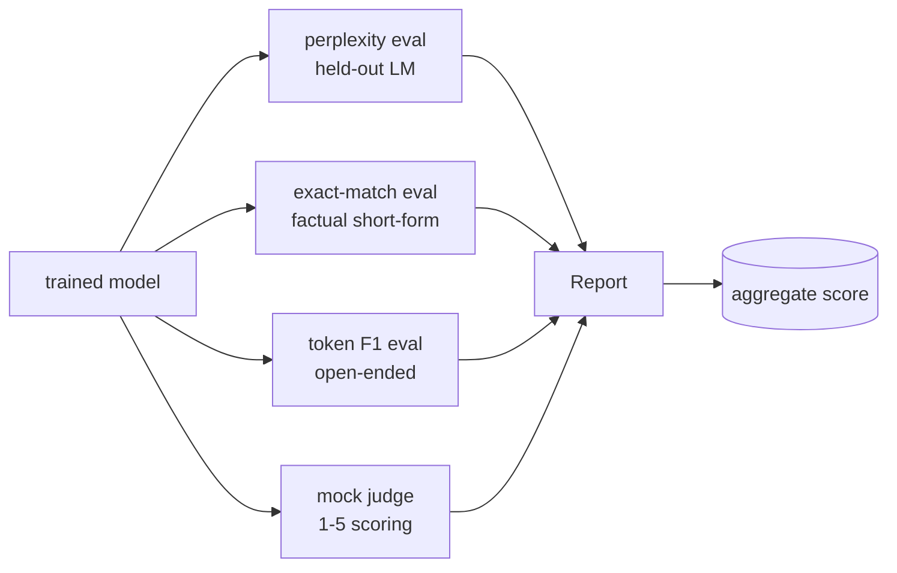
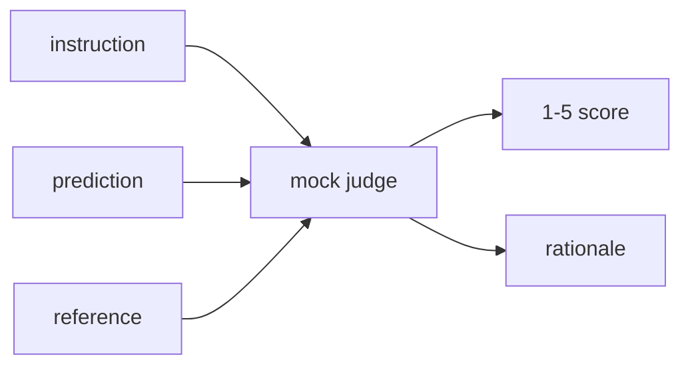
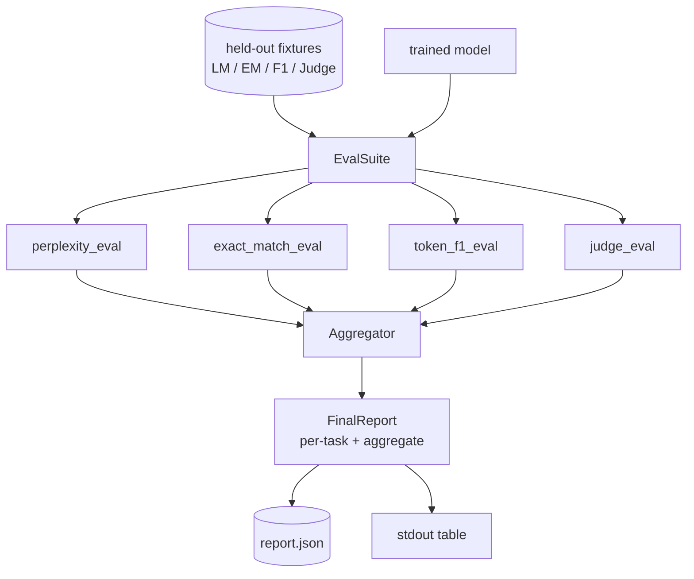

<!-- i18n:manual -->
# Capstone-урок 41: полный eval-пайплайн

> Обучение — та часть, за которой можно следить по кривым потерь. Оценка — та часть, которую приходится проектировать. В этом уроке мы строим единый eval-пайплайн: он берёт любую обученную языковую модель, прогоняет по ней четыре разнородных eval'а, сводит результаты в отчёт с разбивкой по задачам и поставляется с локальным мок-судьёй LLM-as-judge, чтобы цикл работал без сети. Четыре eval'а покрывают измерения, нужные любой выпускаемой модели: языковое моделирование (perplexity), точность коротких ответов (exact-match), близость свободных формулировок (token F1) и качественная оценка (судья).

**Type:** Build
**Languages:** Python (torch, numpy)
**Prerequisites:** Phase 19 lessons 30-37 (NLP LLM track: tokenizer, embedding table, attention block, transformer body, pre-training loop, checkpointing, generation, perplexity)
**Time:** ~90 minutes

## Learning Objectives

- Считать perplexity на отложенной выборке с корректным учётом замаскированных токенов на крошечном трансформере.
- Прогонять exact-match на коротких фактовых промптах.
- Считать потокенный F1 между предсказанной и эталонной строками с нормализацией.
- Собрать локального мок-судью LLM-as-judge, который оценивает выводы модели по шкале от 1 до 5.
- Свести четыре eval'а в один взвешенный отчёт с разбивкой по задачам.

## The Problem

Одна метрика никогда не описывает языковую модель. Perplexity говорит, насколько хорошо модель ложится на распределение языка, но ничего не говорит о том, отвечает ли она на вопросы. Exact-match говорит, выдала ли модель эталонную строку, но наказывает за правильную перефразировку. Token F1 прощает перефразировку, но обманывается лексическим пересечением с неверным содержанием. LLM-as-judge ловит качественные измерения, но стоит дорого и работает случайно.

> 🎒 **На пальцах.** Это как обследование у врача: температура, давление, анализ крови и осмотр. Ни один прибор сам по себе не ставит диагноз. Модель с прекрасной perplexity 3.0 может выдавать грамотный, гладкий и абсолютно неверный текст — perplexity меряет, насколько правдоподобно звучит фраза, а не насколько она верна. Именно поэтому дальше приборов будет четыре, а не один.

Пайплайн, который вам на самом деле нужен, содержит все четыре. Каждый eval покрывает измерение, которое остальные упускают. Каждый работает на своём подмножестве отложенных данных, подогнанном под эту метрику. Итоговый отчёт показывает цифры по задачам рядом друг с другом плюс агрегат, чтобы проверяющий с одного взгляда видел, какие компромиссы делает модель.

> 🎒 **На пальцах.** Обратите внимание на слова «на своём подмножестве». Нельзя мерить perplexity на тех же двадцати фактовых вопросах, на которых считается exact-match: для языкового моделирования нужен связный текст, а не короткие реплики. Поэтому в уроке четыре отдельные фикстуры по двадцать примеров — 80 отложенных примеров суммарно, и каждый живёт ровно под свою метрику.

Этот урок строит такой пайплайн от начала до конца в одном файле.

## The Concept



Каждый eval — это функция из `(model, dataset)` в `EvalResult`. Результат несёт значение метрики, подробности по каждому примеру для разбора и имя для агрегата. Пайплайн собирает их вместе через конфиг, который говорит, какие eval'ы запускать и с какими весами.

> 🎒 **На пальцах.** Это розетка со стандартным штекером: пока каждый eval возвращает один и тот же `EvalResult`, агрегатору всё равно, что внутри — деление логарифмов или вызов сети. Добавить пятую метрику — значит написать пятую функцию с той же сигнатурой и дописать строку в конфиг. Ничего в самом пайплайне менять не придётся.

## Perplexity, properly counted

Perplexity — это `exp(mean negative log-likelihood per token)`. В реализации две ловушки:

- Среднее должно браться по реальным позициям токенов, а не по batch * sequence. Токены паддинга обязаны быть исключены из знаменателя, иначе perplexity будет выглядеть лучше, чем есть.
- Модель предсказывает следующий токен, поэтому логиты на позиции `i` предсказывают токен на позиции `i+1`. Ошибки на единицу здесь молчаливые: потери всё ещё обучают, а метрика становится бессмысленной.

> 🎒 **На пальцах.** Посчитайте цену первой ловушки. Батч из 4 последовательностей по 64 позиции — это 256 клеток, но настоящих токенов в них, скажем, 120, остальное паддинг. Правильная средняя потеря 2.0 даёт perplexity `e^2` ≈ 7.4. Разделите ту же сумму на 256 вместо 120 — получите 0.94 и perplexity 2.6. Модель не стала лучше, вы просто разделили на пустоту.

Eval считает по каждому батчу суммы `-log p(token)` по непаддинговым позициям и количество токенов в батче, а делит уже в самом конце. Это численно безопаснее, чем усреднять perplexity по батчам (что недооценивает короткие последовательности), и совпадает с учебниковым определением.

> 🎒 **На пальцах.** Разница между «сложить всё и поделить в конце» и «усреднить средние» видна на двух батчах: в первом 200 токенов со средней потерей 2.0, во втором 20 токенов со средней 4.0. Честное среднее — `(200·2 + 20·4) / 220` = 2.18. Среднее средних — `(2 + 4) / 2` = 3.0. Второй способ раздул вклад маленького батча в десять раз просто потому, что он оказался отдельным батчем.

## Exact-match, with normalisation

Харнесс нормализует и предсказание, и эталон перед сравнением:

- Приводит к нижнему регистру.
- Обрезает пробелы по краям.
- Схлопывает внутренние серии пробелов до одного.
- Убирает завершающий знак конца предложения (`.`, `!`, `?`), если стороны различаются только пунктуацией.

Нормализация делает exact-match полезным на практике. Модель, которая говорит `"Paris"`, права; та, что говорит `"Paris."`, тоже права; та, что говорит `"  paris  "`, тоже права. Метрика по-прежнему требует, чтобы после нормализации ответ был той же самой строкой.

> 🎒 **На пальцах.** Все четыре правила чинят косметику, а не смысл. `"  Paris.  "` после обрезки, нижнего регистра и снятия точки превращается в `"paris"` и совпадает с эталоном — балл засчитан. А вот `"The capital is Paris"` против эталона `"Paris"` даст ноль: нормализация не умеет выбрасывать лишние слова. Именно эту дыру и закрывает следующая метрика.

## Token F1, the right way

Token F1 — это гармоническое среднее точности и полноты, посчитанных по мешку токенов. Шаги:

1. Нормализовать предсказание и эталон (те же правила, что у exact-match).
2. Разбить каждую строку в список токенов (токенизация по пробелам).
3. Посчитать пересечение мультимножеств.
4. Precision = `intersection_count / len(pred_tokens)`. Recall = `intersection_count / len(ref_tokens)`. F1 = гармоническое среднее.

> 🎒 **На пальцах.** Прогоним пример из прошлого раздела. Предсказание `"the capital is paris"` — это 4 токена, эталон `"paris"` — 1 токен, пересечение — 1 токен. Precision = 1/4 = 0.25, Recall = 1/1 = 1.0, F1 = `2 · 0.25 · 1.0 / 1.25` = 0.4. Exact-match поставил ноль, а F1 честно говорит: смысл угадан, но ответ разбавлен лишними словами.

Если и предсказание, и эталон пусты, F1 равен 1 (пустое совпадение). Если пуста только одна сторона, F1 равен 0. Этот шаблон совпадает с эталонной реализацией оценки SQuAD и даёт стабильные числа на перефразировках.

> 🎒 **На пальцах.** Случай «оба пусты» выглядит крючкотворством, но без него код падает на делении на ноль. И он не так уж редок: молчащая модель на промпте, где эталон тоже пустой, формально права. А вот молчание там, где эталон непустой, — это ноль, никаких поблажек. Проверяйте эти два случая тестами, они всплывают в реальных прогонах чаще, чем кажется.

## Local Mock LLM-as-Judge

Настоящий судья — это фронтирная модель за API. Для этого урока судья должен работать офлайн. Мок-судья — детерминированный оценщик, который берёт инструкцию, предсказание модели и эталон, а возвращает балл из `{1, 2, 3, 4, 5}` плюс однострочное обоснование. Правила оценивания заданы явно:

- 5, если нормализованное предсказание равно нормализованному эталону.
- 4, если token F1 между предсказанием и эталоном не меньше 0.8.
- 3, если token F1 лежит в `[0.5, 0.8)`.
- 2, если token F1 лежит в `[0.2, 0.5)`.
- 1 в остальных случаях.

> 🎒 **На пальцах.** Возьмём наш F1 = 0.4 и прогоним по лестнице сверху вниз: не равно эталону — не 5; меньше 0.8 — не 4; меньше 0.5 — не 3; попадает в `[0.2, 0.5)` — итог 2 балла из 5. Обратите внимание, что мок-судья ничего не «понимает», он просто переводит непрерывный F1 в пять ступенек. Зато делает это детерминированно: один и тот же вход всегда даёт один и тот же балл.

Это не настоящий судья, но у него правильный интерфейс. Позже подставите настоящую модель, поменяв одну функцию. Пайплайну всё равно.

> 🎒 **На пальцах.** Вот это и есть главная мысль раздела. Настоящий судья отличается от мока тремя вещами: он стоит денег, ходит в сеть и даёт разные ответы на один и тот же вход. Всё остальное — сигнатура функции, формат балла, поле с обоснованием — уже написано и протестировано на моке. Отладить пайплайн на бесплатном детерминированном судье, а потом заменить одну функцию куда дешевле, чем ловить ошибки сборки отчёта через платный API.



## Aggregation

Агрегат — это взвешенное среднее нормализованных оценок eval'ов. Каждый eval сообщает своё число в `[0, 1]`:

- Perplexity: нормализуется как `1 / (1 + log(perplexity))`. Perplexity, равная 1, отображается в 1, бесконечность — в 0.
- Exact-match: уже в `[0, 1]`.
- Token F1: уже в `[0, 1]`.
- Судья: поделить на 5.

> 🎒 **На пальцах.** Формула нормализации perplexity выглядит произвольной, пока не подставить числа. Идеальная модель с perplexity 1.0 даёт `1 / (1 + 0)` = 1.0. Наша модель с perplexity 7.4 (логарифм равен 2) даёт `1 / 3` = 0.33. Довольно слабая модель с perplexity 20 даёт 0.25. Логарифм здесь сжимает шкалу: разница между 7.4 и 20 — это всего 0.08 балла, потому что обе модели одинаково далеки от идеала.

Веса настраиваются. Смесь по умолчанию — 0.2 perplexity, 0.3 exact-match, 0.3 token F1, 0.2 судья. Выбор весов — продуктовое решение; урок выносит эту ручку наружу, чтобы вы могли поэкспериментировать.

> 🎒 **На пальцах.** Соберём агрегат целиком: perplexity дала 0.33, exact-match 0.70, token F1 0.62, судья 3.4 балла (то есть 0.68). Итог = `0.2·0.33 + 0.3·0.70 + 0.3·0.62 + 0.2·0.68` = 0.066 + 0.21 + 0.186 + 0.136 ≈ 0.60. Веса в сумме дают ровно 1.0 — это обязательное условие, иначе агрегат перестанет быть числом от 0 до 1 и сравнивать версии модели станет нечем.

```figure
cg-eval-quadrant
```

## Architecture



`EvalSuite` — тонкий оркестратор. Каждый отдельный eval — свободная функция, которая принимает `(model, tokenizer, dataset, config)` и возвращает `EvalResult`. `Aggregator` собирает результаты и производит итоговый отчёт. Демо печатает таблицу и пишет JSON-копию, которую может съесть CI дальше по конвейеру.

> 🎒 **На пальцах.** Слово «свободная» тут ключевое: eval — не метод класса, а обычная функция. Значит, её можно вызвать в тесте одной строкой, без сборки всего `EvalSuite`, подсунув фейковую модель на три примера. Оркестратор при этом не знает про метрики ничего, кроме того, что они возвращают `EvalResult`, — и поэтому его самого тестировать почти не нужно.

## What you will build

Реализация — один `main.py` плюс тесты.

1. `TinyGPT`: та же архитектура только с декодером, что в уроках 38-40, включена сюда, чтобы урок стоял отдельно.
2. `InstructionTokenizer`: байтовый токенизатор со спецтокенами INST / RESP / PAD.
3. Четыре фикстуры: корпус для языкового моделирования, набор для EM, набор для F1 и набор для судьи. По двадцать примеров, детерминированные.
4. `perplexity_eval`: возвращает `EvalResult` со значением perplexity и гистограммой потерь по токенам.
5. `exact_match_eval`: возвращает средний EM и записи по каждому примеру.
6. `token_f1_eval`: возвращает средний token F1 и записи по каждому примеру.
7. `mock_judge` и `judge_eval`: балл и обоснование по каждому примеру, средний балл по набору.
8. `Aggregator.normalise`: правило нормализации для каждого eval'а.
9. `Aggregator.aggregate`: взвешенное среднее и собранный отчёт.
10. `run_demo`: коротко обучает крошечную модель, прогоняет все четыре eval'а, печатает таблицу отчёта и пишет JSON, выходит с нулевым кодом при успехе.

## Reading the report

У отчёта три слоя. Наверху агрегированная оценка. Под ней четыре числа по отдельным eval'ам. Под ними разбивки по каждому примеру для диагностики. Упавшему прогону CI обычно нужен агрегат, а проверяющему, который ловит регрессию, нужна разбивка по примерам, чтобы увидеть, на каких входах модель ошиблась.

> 🎒 **На пальцах.** Три слоя нужны трём разным читателям. CI смотрит на одно число: было 0.60, стало 0.57 — красный свет. Вы, увидев красный свет, смотрите на второй слой и обнаруживаете, что упал только exact-match, а F1 не шелохнулся: значит модель начала перефразировать, а не глупеть. И только на третьем слое видно, что все просадки — в одной категории вопросов. Без нижних слоёв первое число ничего не объясняет.

JSON-дамп использует стабильные ключи, чтобы дашборд CI мог строить тренды по версиям. Красиво напечатанная таблица — для людей, которые пялятся в терминал после прогона обучения.

## Stretch goals

- Добавьте eval калибровки: совпадают ли softmax-вероятности модели с её точностью? Разложите предсказания по корзинам уверенности и покажите эмпирическую точность в каждой корзине.
- Добавьте eval устойчивости: пометьте каждый пример типом возмущения (опечатка, перефразировка, отвлекающий текст) и покажите просадку метрики по каждому типу.
- Замените мок-судью на настоящую модель за HTTP-вызовом. Сигнатура функции при этом не меняется.
- Добавьте обучение весов по задачам: вместо фиксированных весов подберите такие, чтобы порядок моделей совпал с целевым.

> 🎒 **На пальцах.** Первый пункт стоит сделать первым: калибровка ловит опаснейший тип поломки. Модель, которая ошибается в 30% случаев, но каждый раз заявляет уверенность 0.95, в отчёте выглядит так же, как честная модель с той же точностью, — а в проде она гораздо хуже, потому что по её уверенности нельзя решить, когда звать человека. Корзины уверенности показывают это за пять строк кода.

Реализация даёт вам четыре eval'а, агрегатор и отчёт. Настоящие пайплайны оценки наслаивают сверху куда больше измерений; шаблон при этом остаётся тем же: одна функция на eval, один агрегатор, один отчёт.
