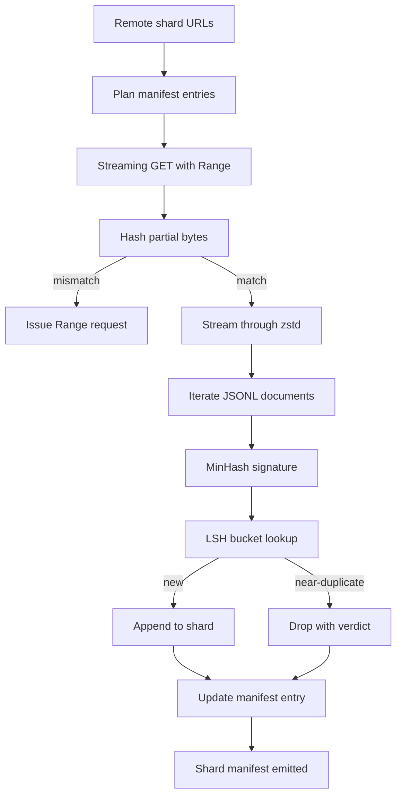

<!-- i18n:manual -->
# Загрузчик большого корпуса

> Обучение языковой модели начинается задолго до первого forward pass. Корпус сперва должен лечь на диск — распакованным, дедуплицированным и адресуемым, причём сценарий возобновления надо продумать раньше, чем сеть отвалится на четырёх процентах. В этом уроке мы строим потоковый загрузчик: он тянет сжатые шарды, на лету распаковывает их через Zstandard, снимает отпечатки почти-дублей через MinHash плюс locality-sensitive hashing и пишет манифест шардов, которому может доверять весь остальной пайплайн.

**Type:** Build
**Languages:** Python
**Prerequisites:** Phase 19 lessons 30-37
**Time:** ~90 minutes

## Learning Objectives

- Тянуть удалённые шарды потоком через `urllib` и распаковывать через `zstandard`, ни разу не загружая файл целиком в память.
- Возобновлять оборванные загрузки, отправляя HTTP-запросы с заголовком `Range` от проверенного байтового смещения.
- Строить MinHash-подпись для каждого документа и раскладывать её по корзинам LSH, чтобы почти-дубли сталкивались.
- Выдавать манифест шардов с хешем содержимого, размером в байтах, числом документов и вердиктом дедупликации.

> 🎒 **На пальцах.** Скачать корпус — это не `requests.get` на одну строчку, а работа грузчика с накладной. Прикиньте масштаб: 200 ГБ по каналу в 100 Мбит/с — это примерно 4,5 часа непрерывной качки. За 4,5 часа сеть моргнёт хотя бы раз, поэтому возобновление и учёт — не украшение, а условие того, что корпус вообще доедет.

## The Problem

Первый раз, когда вы качаете корпус на 200 ГБ, сеть падает на 41 проценте и скрипт вылетает с исключением `urllib`. Второй раз падает на 78 процентах. К 99 процентам вы уже трижды переписали цикл. Два отказа, под которые надо проектировать с первой минуты, — это возобновление недокачанного файла и удаление дублирующихся документов. У обоих есть известные решения; оба обычно пропускают, потому что пайплайн начинался как однострочный вызов `requests.get`, которому потом отросли зубы.

> 🎒 **На пальцах.** Посчитайте цену падения на 41 проценте: 0,41 × 200 ГБ = 82 ГБ уже на диске, и без возобновления вы выбрасываете их и качаете заново. Это как нести домой два часа покупок и на пороге высыпать пакет обратно на улицу, потому что забыли ключи.

Возобновление — это HTTP-задача. Сервер обязан поддерживать `Range`, клиент обязан хранить проверенное смещение рядом с записью на диске, а само смещение обязано пережить смерть процесса. Если смещение и файл разъедутся хотя бы на один байт, возобновлённая загрузка запишет мусор, и корпус окажется испорчен так, что вылезет это только на этапе токенизации.

> 🎒 **На пальцах.** Смещение — это закладка в книге. Ошиблись на одну страницу — и дальше читаете складно, но не то. Разница в один байт из 200 миллиардов не даст ни ошибки, ни предупреждения: файл откроется, распаковка пойдёт, а токены получатся битые.

Дедупликация — это задача про подписи. Дедуп по точному хешу не ловит почти-дубли: та же статья Wikipedia приходит с тремя разными подвалами, тот же файл кода — с другой лицензионной шапкой, тот же пост в блоге — с трекинг-параметром в каждой ссылке. MinHash плюс LSH ловят такое за сублинейную цену. Плата — одна подпись на документ и один поиск по корзине на подпись.

> 🎒 **На пальцах.** Точный хеш — это сравнение отпечатков пальцев: одна изменённая буква в подвале страницы полностью меняет sha256, и две копии одной статьи выглядят как два разных документа. MinHash сравнивает не отпечатки, а содержание: он скажет «эти два текста совпадают на 95%» и выкинет копию.

## The Concept



> 🎒 **На пальцах.** Прочитайте схему как маршрут посылки на складе. Ключевых развилок ровно две: у `Verify` — совпал хеш или нет (не совпал — идём переспрашивать по `Range`), у `Bucket` — новый документ или почти-дубль. И заметьте: обе ветки после `Bucket` сходятся в `Manifest`, то есть выброшенный дубль тоже попадает в отчёт, а не исчезает молча.

### Streaming with `urllib`

Стандартная библиотечная функция `urllib.request.urlopen` возвращает файлоподобный объект. Оберните его в `zstandard.ZstdDecompressor().stream_reader` — и байты потекут из сети через распаковщик прямо в итератор документов, причём ни сжатый шард, ни распакованный ни разу не окажутся в памяти целиком. Единственная плата по памяти — буфер строки, MinHash-подпись текущего документа и индекс LSH.

> 🎒 **На пальцах.** Это как пить из шланга, а не наполнять сначала бассейн. Шард на 5 ГБ в сжатом виде и 20 ГБ в распакованном требует по памяти не 25 ГБ, а несколько мегабайт: одна строка, одна подпись из 128 чисел и индекс. Именно поэтому загрузчик работает на ноутбуке с 8 ГБ RAM.

### Resume with `Range`

Загрузчик пишет на шард два файла: сам шард и чекпойнт `.partial.json`. Чекпойнт хранит `verified_bytes`, `expected_size`, `sha256_prefix` (посчитанный по первым `verified_bytes` байтам) и исходный URL. При старте загрузчик читает чекпойнт, заново считает `sha256_prefix` по байтам на диске и возобновляет закачку только при совпадении хешей. Если хеш не сошёлся — недокачанный файл выбрасывается и загрузка стартует с нулевого байта. Тихое повреждение здесь невозможно, потому что проверенные байты именно проверяются, а не принимаются на веру.

> 🎒 **На пальцах.** Чекпойнт — это расписка «принято 82 ГБ, вот их контрольная сумма». Перед продолжением загрузчик пересчитывает сумму по этим 82 ГБ на диске и сверяет с распиской. Сошлось — просим у сервера байты начиная с 82-го гигабайта. Не сошлось — честно начинаем с нуля, потому что три часа перекачки дешевле, чем битый корпус.

### MinHash plus LSH

MinHash оценивает Jaccard-сходство двух множеств в фиксированном объёме памяти. Для документа множество — это его шинглы (перекрывающиеся n-граммы) текста. Подпись — это `k` минимальных хеш-значений, по одному на независимую хеш-функцию. У двух документов с Jaccard-сходством `s` вероятность совпасть по любой отдельной компоненте подписи равна `s`.

> 🎒 **На пальцах.** Подпись фиксированного размера значит, что документ на 500 слов и документ на 500 000 слов оба сжимаются до 128 чисел. Дальше вся арифметика идёт по этим 128 числам, а не по тексту: сравнить две подписи стоит одинаково дёшево независимо от того, статья это или роман.

Дальше LSH группирует `k` компонент в `b` полос по `r` строк в каждой, где `k = b * r`. Два документа сталкиваются хотя бы в одной полосе с вероятностью `1 - (1 - s^r)^b`, а это резкий порог около того значения `s`, под которое вы подбираете пару `(b, r)`. Типичный порог для дедупликации корпуса — `s = 0.8`, и исследовательская литература по LSH выходит на него при `k = 128`, `b = 32`, `r = 4`.

> 🎒 **На пальцах.** Проверьте формулу руками при s = 0.8, r = 4, b = 32. Внутри: 0.8⁴ = 0.41, значит одна полоса совпадает с вероятностью 41%. Но полос 32, и хотя бы одно совпадение случается с вероятностью 1 − (1 − 0.41)³² ≈ 0.99999995 — практически единица. Это как искать знакомого по 32 приметам: каждая по отдельности ненадёжна, а все вместе не промахиваются.

### Shard manifest as a contract

Единственный долгоживущий результат работы загрузчика — это манифест. Манифест хранит по каждому шарду: URL, число байт после распаковки, число документов, число уникальных документов после дедупликации и sha256 итогового файла шарда. Токенизация ниже по течению читает манифест, а не листинг директории. Если шард пропал или его sha256 не тот, манифест велит следующей стадии не запускаться. Манифест — это ребро, отделяющее «данные скачаны» от «данные скачаны и проверяемы».

> 🎒 **На пальцах.** Манифест — это накладная к грузу, а не сам груз. Кладовщик не пересчитывает коробки на глаз, он сверяется с бумагой: заявлено 12 шардов, sha256 у каждого такой-то. Не сошёлся один хеш — конвейер встал сразу, а не через шестнадцать часов обучения на битых токенах.

```figure
cap-corpus-downloader
```

## Build It

`code/main.py` реализует:

- `ShardPlanner` — читает список URL шардов и выдаёт запланированные записи манифеста.
- `StreamingDownloader` — открывает поток `urllib` с опциональным `Range`, пишет во временный файл, обновляет чекпойнт `.partial.json` на каждом куске и проверяет префикс sha256 при возобновлении.
- `ZstdDocIterator` — оборачивает файлоподобный поток в `zstandard.ZstdDecompressor` и отдаёт по одному документу на строку.
- `MinHasher` — строит подпись из `k` компонент для строки, используя фиксированный набор хеш-сидов.
- `LSHIndex` — раскладывает подписи по корзинам по полосам и сообщает о столкновениях.
- `Dedup` — соединяет хешер и индекс, помечая каждый документ как `keep` или `near_duplicate` вместе с id совпавшего шарда.
- `ManifestWriter` — собирает статистику по шардам и пишет `manifest.json`.

Демо в конце файла собирает на диске маленький синтетический корпус, сжимает его через `zstandard`, скачивает по `file://` URL, дедуплицирует и печатает манифест.

> 🎒 **На пальцах.** Семь классов — семь обязанностей, и ни один не знает про соседа больше нужного. Обратите внимание на трюк с демо: адрес `file://` заставляет тот же самый код скачивать корпус с вашего же диска. Никакой сети, никаких 200 ГБ — а путь байтов ровно тот же, что в бою.

Запустите:

```bash
python3 code/main.py
```

Скрипт завершается с нулевым кодом и печатает сводку по манифесту.

## Production Patterns

Четыре приёма масштабируют этот урок до настоящих корпусов.

**Checkpoint before write.** Файл `.partial.json` обязан быть сброшен на диск через `fsync` до того, как байты допишутся в шард. Иначе потеря питания переставит порядок: байты шарда на диске есть, а чекпойнта про них нет, следующее возобновление считает, что проверенных байт меньше, чем на самом деле, и продублированный хвост портит файл. Сперва чекпойнт, потом запись. Это та же дисциплина, что у write-ahead log.

> 🎒 **На пальцах.** Правило простое: сначала расписка, потом товар. Если чекпойнт скажет «82 ГБ», а на диске окажется 82 ГБ плюс 4 МБ, дозагрузка допишет эти 4 МБ второй раз — и в середине корпуса появится склеенный кусок. Как в бухгалтерии: запись в журнале делают до выдачи наличных, а не после.

**Sharded LSH index.** Один LSH-индекс на весь корпус не влезает в RAM на масштабе 200 ГБ. Разбейте индекс по хешу первой полосы, храните части на диске и заглядывайте только в ту часть, куда попала бы новая подпись. Плата — одно лишнее чтение с диска на документ; выигрыш — LSH-индекс перестаёт быть жёстким потолком по памяти.

**Tombstone, not delete.** Выброшенные дубли записываются в манифест с вердиктом `near_duplicate` и id того шарда, с документом которого они столкнулись. Если их просто удалить, теряется связь между дублем и его оригиналом. Надгробие сохраняет след для аудита и позволяет следующему проходу передумать насчёт порога.

> 🎒 **На пальцах.** Разница между «выкинуть» и «пометить» — это разница между стёртой строкой и зачёркнутой. Захотели завтра поднять порог с 0.8 до 0.9 — с надгробиями вы просто пересматриваете вердикты, а без них надо качать 200 ГБ заново, чтобы понять, что именно вы вчера выбросили.

**Per-shard sha256 in the manifest, plus a manifest sha256.** Сам манифест тоже получает хеш содержимого. Следующие стадии проверяют хеш манифеста прежде, чем поверить записям по шардам. Без этого манифест становится тихой поверхностью атаки: тот, кто может отредактировать один файл, портит весь пайплайн.

## Use It

Production patterns:

- **Resume on every CI run.** Раннеры CI одноразовые. Загрузчик обязан считать, что диск на каждом запуске чистый, и восстанавливаться из кеша или из сети. Флаг `--cache-dir` тут первоклассный гражданин, а не опция.
- **Dedup before tokenization.** Токенизация дорогая. Прогнать её дважды по одному документу — это двойная цена за ту же кривую loss. Дедупликация стоит выше токенизации по течению, а не ниже.
- **Manifest as merge gate.** Обучающий запуск читает sha256 манифеста из зафиксированного коммита. Новая версия датасета требует нового коммита манифеста. Связь между кодом и данными — это git, а не устные предания.

> 🎒 **На пальцах.** Второй пункт — чистая экономика. Если 30% корпуса на 200 ГБ это дубли, то дедуп до токенизации экономит 60 ГБ работы токенизатора, а после — не экономит ничего, потому что деньги уже потрачены. Порядок стадий здесь стоит дороже, чем оптимизация любой отдельной из них.

## Ship It

Файл `outputs/skill-corpus-downloader.md` на реальном проекте описывал бы, какие URL кормят загрузчик, как разложена директория чекпойнтов, какая ширина шингла и какая тройка `(k, b, r)` используются в дедупликации и где лежит манифест в системе контроля версий. Этот урок поставляет движок.

## Exercises

1. Добавьте флаг `--shingle-width` и измерьте, как меняется вердикт дедупликации при ширине 3, 5 и 9. Обоснуйте выбранное значение по умолчанию.
2. Добавьте поддержку gzip рядом с zstd, определяя формат по магическим байтам. Загрузчик не должен требовать от вызывающего указывать кодек.
3. Добавьте режим `--resume-only`, который отказывается начинать загрузку с нуля, если чекпойнт не найден. Полезно в CI, чтобы один запуск случайно не потянул 200 ГБ заново.
4. Перенесите LSH-индекс в shelf или в файл sqlite и измерьте пропускную способность против варианта в памяти.
5. Добавьте проверку sha256 манифеста при старте. Загрузчик должен падать закрыто, если манифест на диске расходится с хешем в `manifest.lock`.

> 🎒 **На пальцах.** Первое упражнение — самое поучительное: шинглы по 3 слова совпадают почти у любых двух текстов на одну тему, а по 9 слов — только у настоящих копий. То есть на ширине 3 вы выкинете лишнее, на 9 — пропустите дубли, и «правильного» ответа в отрыве от корпуса не существует. Именно поэтому в задании просят обосновать значение по умолчанию, а не угадать его.

## Key Terms

| Term | What people say | What it actually means |
|------|-----------------|------------------------|
| Shard | «Файл» | Самодостаточный кусок корпуса со своим sha256, единица возобновления и дедупликации |
| MinHash signature | «Отпечаток» | Скетч множества из `k` компонент, где каждая компонента — минимум одной независимой хеш-функции по множеству |
| LSH band | «Корзина» | Группа из `r` компонент подписи, используемая как единый ключ корзины для поиска столкновений |
| Verified bytes | «Смещение для возобновления» | Байты на диске, чей префикс sha256 совпал с чекпойнтом; единственное безопасное смещение для продолжения |
| Manifest | «Индекс» | Единственная долгоживущая запись о том, что произвёл загрузчик, включая хеши содержимого |

## Further Reading

- [RFC 7233](https://datatracker.ietf.org/doc/html/rfc7233) — HTTP Range requests, протокол возобновления
- [Zstandard format specification](https://datatracker.ietf.org/doc/html/rfc8478) — формат фреймов, который делает потоковую распаковку безопасной
- [MinHash](https://en.wikipedia.org/wiki/MinHash) — семейство подписей, которое используется в этом уроке
- [Locality-sensitive hashing](https://en.wikipedia.org/wiki/Locality-sensitive_hashing) — схема с полосами, стоящая за порогом дедупликации
- Phase 19 · 43 — тот самый токенизированный корпус в HDF5, который кормит загрузчик
- Phase 19 · 44 — косинусное расписание, по которому идёт обучение на этом корпусе
- Phase 19 · 45 — цикл с AMP, который потребляет это расписание
