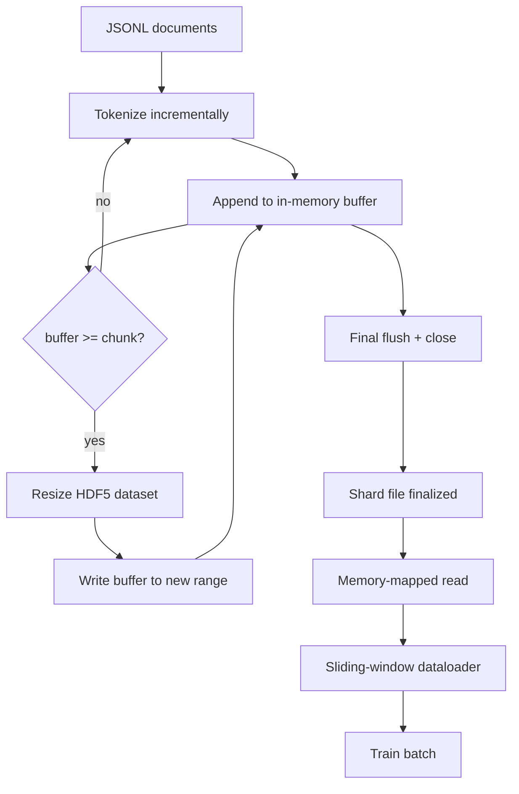

<!-- i18n:manual -->
# Токенизированный корпус в HDF5

> Скачанный корпус должен лечь в такой раскладке, из которой тренер сможет читать на скорости провода. JSONL на диске не переживает 16 воркеров dataloader. HDF5 с расширяемым чанкованным целочисленным датасетом — переживает. В этом уроке мы строим потоковую токенизацию в расширяемый датасет HDF5, шардированную запись в несколько файлов, чтение через memory map во время обучения и dataloader со скользящим окном, который выдаёт последовательности фиксированной длины с правильной упаковкой.

**Type:** Build
**Languages:** Python
**Prerequisites:** Phase 19 lessons 30-37
**Time:** ~90 minutes

## Learning Objectives

- Заливать документы потоком в расширяемый целочисленный датасет HDF5 с детерминированным чанкованием.
- Шардировать запись по нескольким файлам HDF5, чтобы отказ был ограничен, а параллелизм — возможен.
- Читать токены обратно через чанкованную раскладку HDF5, опирающуюся на page cache, чтобы dataloader копировал данные в батчевые буферы только в момент сборки батча.
- Реализовать dataloader со скользящим окном, который выдаёт обучающие последовательности фиксированной длины по явным правилам упаковки.

> 🎒 **На пальцах.** Разница между JSONL и HDF5 — это разница между стопкой писем в коробке и картотекой с номерами ящиков. Чтобы достать письмо номер 4 217 884 из коробки, надо перебрать все предыдущие; в картотеке вы сразу выдвигаете нужный ящик. Токенов миллиарды, и «перебрать все предыдущие» — не вариант.

## The Problem

Современный запуск обучения языковой модели читает токены сотнями тысяч сэмплов в секунду через десятки воркеров. JSONL на диске умирает на первом же промахе холодного кеша: парсер JSON медленный, границы документов не адресуемы, а чтобы дойти до «сэмпла 4 217 884», надо просканировать файл. Даже Parquet, который хорошо сжимает, тут плохо подходит: тренеру не нужны колонки, ему нужен плоский поток токенов с произвольным доступом за O(1).

> 🎒 **На пальцах.** Прикиньте, что значит «сотни тысяч сэмплов в секунду». При 200 000 сэмплов в секунду у вас есть 5 микросекунд на сэмпл — а один разбор JSON-строки стоит десятки микросекунд. То есть парсер JSON опаздывает не на проценты, а в разы, и GPU просто стоит и ждёт данные, как повар без продуктов.

HDF5 подходит, потому что даёт чанкованный, расширяемый, чисто целочисленный датасет, чьи чанки дружелюбны к page cache при чтении. Тренер просит срез `tokens[3,200,000 : 3,200,8192]`, и HDF5 копирует запрошенный гиперслэб из page cache в свежий массив NumPy. Плата — один открытый файловый дескриптор и след в page cache размером с чанк на каждого воркера, что пренебрежимо мало по сравнению с ценой декодирования JSONL.

> 🎒 **На пальцах.** «Гиперслэб» — страшное слово ровно для одной вещи: вырезать кусок массива по индексам. Срез из примера выше — это 8192 токена подряд, то есть примерно 16 КБ при двух байтах на токен. Это как попросить у библиотекаря страницы с 500-й по 508-ю, а не всю книгу целиком.

Проблема сборки — сделать честной сторону записи. Расширяемые датасеты легко использовать неправильно: пишете по одному документу — и файл HDF5 фрагментируется до состояния «пользоваться нельзя». Пишете все документы одним расширением — и смерть процесса теряет весь шард. Правильная дисциплина — буферизовать, потом расширять, причём размер буфера совпадает с размером чанка, а шардированная запись разносит работу по файлам, чтобы падение стоило максимум одного шарда.

> 🎒 **На пальцах.** Это выбор между «носить кирпичи по одному» и «везти все разом на одной тачке, которая может опрокинуться». Буфер размером с чанк — золотая середина: набрали ровно тачку, отвезли, записали. Упали на середине корпуса из 12 шардов — потеряли один шард, то есть 8% работы, а не всё.

## The Concept



> 🎒 **На пальцах.** Заметьте петлю в середине схемы: `Buffer` → `Flush?` → «нет» → обратно в `Tokenize`. Это и есть вся дисциплина записи, нарисованная одной стрелкой: пока буфер не набрал чанк, на диск никто не ходит. Ровно так же вы не бегаете к мусорному баку с каждым фантиком, а ждёте, пока наберётся ведро.

### Resizable HDF5 done right

Датасет токенов создаётся с `maxshape=(None,)` и фиксированным `chunks=(chunk_size,)`. Запись идёт через буферизацию токенов в массиве NumPy длиной `chunk_size`. Когда буфер заполняется, датасет расширяется ровно на `chunk_size`, и буфер пишется в новый диапазон. В конце шарда остаток буфера пишется в финальный неполный диапазон. Каждая запись непрерывна и выровнена по чанку, кроме последней, — а её читателю велено обрезать по значению `token_count`, записанному в атрибутах HDF5 этого шарда.

> 🎒 **На пальцах.** `maxshape=(None,)` — это обещание «длина заранее неизвестна, расти сколько надо». Возьмите `chunk_size` = 8192 и корпус в 20 000 токенов: получится два полных расширения по 8192 и хвост в 20 000 − 16 384 = 3616 токенов. Именно ради этого хвоста и хранят `token_count` — иначе читатель дочитает до конца выделенного места и наберёт нулей.

### Sharded write

Один файл HDF5 — это единая точка отказа. Пайплайн пишет шарды параллельно: каждый входной шард из урока 42 фазы 19 даёт один выходной шард HDF5. Индекс `shards.json` записывает по каждому шарду путь к файлу, число токенов, число документов и sha256 по токенам. Тренер читает `shards.json`, чтобы посчитать глобальные смещения и проверить корпус.

> 🎒 **На пальцах.** Глобальные смещения — это простое сложение. Шард A на 1 000 000 токенов, шард B на 800 000: у A глобальные индексы 0–999 999, у B — 1 000 000–1 799 999. Тренер просит токен номер 1 200 000, и по `shards.json` мгновенно видно, что это шард B, позиция 200 000. Никаких сканирований — одна арифметика.

### Memory-mapped read

Во время обучения каждый воркер открывает свою долю файлов HDF5 в режиме `swmr=True` и просит `tokens[start:stop]`. Чанковая раскладка HDF5 делает это чтением из page cache, как только чанк прогрет. Воркер никогда не материализует файл целиком: срез копируется в батчевый буфер dataloader, а тот уже в момент сборки батча копирует его в обучающий тензор в pinned memory. На горячем пути один системный вызов на переход между чанками, всё остальное — доступ к RAM.

> 🎒 **На пальцах.** Page cache — это память ОС о том, что она недавно читала с диска. Первое обращение к чанку стоит похода на диск (сотни микросекунд), а второе, третье и сотое — уже наносекунды из RAM. Поэтому «прогретый» чанк работает в тысячи раз быстрее холодного, и вся игра в том, чтобы читать подряд, а не прыгать.

### Sliding-window dataloader

Dataloader — единственная стадия, которая знает про длину обучающей последовательности. Он выбирает случайный стартовый индекс в глобальном потоке токенов, читает `window_size + 1` токенов и возвращает `(input, target) = (tokens[:-1], tokens[1:])`. Границы документов не соблюдаются: окно может лежать сразу на двух документах, а между ними стоит явный `boundary_token_id`, чтобы модель научилась пользоваться разделителем. Это стандартное правило упаковки; оно же — то самое правило, которое новичок забывает, получая корпус на 8 процентов из служебных токенов-границ и на 92 процента из живого текста.

> 🎒 **На пальцах.** Сдвиг на один токен — вся суть обучения языковой модели. Прочитали 5 токенов «кот сидит на окне и», тогда input = «кот сидит на окне», target = «сидит на окне и». Модель на каждой позиции угадывает следующее слово. Вот почему читают `window_size + 1` токенов, а не `window_size`: лишний токен нужен, чтобы у последней позиции был правильный ответ.

```figure
cc-hdf5-corpus
```

## Build It

`code/main.py` реализует:

- `Tokenizer` — детерминированный побайтовый токенизатор, достаточный для демо. Интерфейс — `encode(text) -> list[int]` и `vocab_size`.
- `HDF5ShardWriter` — открывает расширяемый целочисленный датасет, буферизует токены до размера чанка, расширяет и пишет шагами фиксированного размера, при закрытии записывает `token_count` и `sha256` в атрибуты HDF5.
- `ShardedTokenizationPipeline` — проходит по входным документам, направляет их в писателя и выдаёт индекс `shards.json`.
- `MmapTokenStore` — открывает файлы шардов для чтения через memory map, считает глобальные смещения, предоставляет единственный API `get_slice(start, stop)`.
- `SlidingWindowDataloader` — выбирает случайные окна из глобального потока и отдаёт пары массивов NumPy `(input_ids, target_ids)`.

Демо в конце файла собирает крошечный корпус в памяти, токенизирует его в два шарда, открывает их через memory map, гоняет dataloader 10 батчей и печатает форму каждого батча и контрольную сумму.

> 🎒 **На пальцах.** Пять классов выстроены в цепочку «текст → токены → диск → срез → батч», и каждый следующий знает только про соседа слева. Проверьте это по интерфейсам: `MmapTokenStore` отдаёт наружу ровно одну функцию `get_slice(start, stop)` и ничего не знает про длину окна, а `SlidingWindowDataloader` не знает, в скольких файлах лежат токены.

Запустите:

```bash
python3 code/main.py
```

Скрипт завершается с нулевым кодом и печатает контрольные суммы батчей.

## Production Patterns

Четыре приёма масштабируют этот урок до настоящего обучающего запуска.

**Chunk size equals the typical read.** Тренер читает `window_size + 1` токенов на сэмпл. Сделайте чанк HDF5 кратным `window_size` — и чтения будут выровнены по page cache. Несовпадающие чанки режут пропускную способность вдвое, потому что каждый сэмпл задевает два чанка.

> 🎒 **На пальцах.** Задеть два чанка вместо одного — это два похода на диск вместо одного, отсюда и «вдвое». Как с нарезкой хлеба: если ломтики совпадают с толщиной бутерброда, берёте один; если нет — каждый раз приходится доставать два и склеивать.

**Token count in attributes, not in the dataset.** Хвостовой срез датасета может быть заполнен частично, потому что размер чанка не делится по границе документа. Храните настоящий `token_count` как атрибут HDF5 на датасете и заставьте читателя обрезать по этому значению. Без этого читатель уезжает за конец данных в нулевой паддинг, и модель учится предсказывать ноль.

> 🎒 **На пальцах.** «Модель учится предсказывать ноль» — это не метафора, а буквальный исход. Если в хвосте шарда 4576 настоящих токенов и 3616 нулей, каждая сороковая обучающая последовательность будет наполовину из нулей, и модель честно выучит, что после текста идут нули. Атрибут `token_count` — это отметка «дальше пусто», как черта уровня в мерном стакане.

**Sharded sha256 with parallel verification.** У каждого шарда свой sha256 по байтам токенов. Тренер может проверить все шарды параллельно ещё до старта обучения. Неправильный sha256 роняет запуск сразу, а не на третьей эпохе через шестнадцать часов.

> 🎒 **На пальцах.** Считайте это осмотром машины перед выездом, а не на трассе. Проверка двенадцати шардов параллельно занимает минуты, а шестнадцать часов обучения на битом шарде — это ещё и деньги за GPU, которые никто не вернёт.

**`swmr=True` on both sides, with `libver="latest"` on the writer.** Режим Single-Writer-Multiple-Reader требует, чтобы писатель открывал файл с `libver="latest"`, создавал все датасеты заранее, а потом выставлял `file.swmr_mode = True`. После этого писатель обязан вызывать `dataset.flush()` после каждого расширения, чтобы воркеры-читатели (открытые с `swmr=True`) видели согласованные данные. Пропуск `libver="latest"` или включение SWMR после структурных изменений — типичный источник ошибок «file is locked».

## Use It

Production patterns:

- **One HDF5 per source shard.** Загрузчик (урок 42) выдаёт один шард на URL; токенизация (этот урок) выдаёт один HDF5 на исходный шард. Соответствие один к одному делает возобновление и восстановление после частичного отказа тривиальными.
- **Boundary token id.** Токен-граница входит в словарь токенизатора и является единственным токеном, который вставляет dataloader. Обучающий loss маскирует токен-границу, если модель должна его игнорировать; иначе она учится использовать его как разделитель последовательностей.
- **`shards.json` as the source of truth.** Добавить новый шард — значит записать HDF5, посчитать его sha256 и дописать запись. Тренер читает этот файл один раз на старте и никогда не заглядывает в листинг директории.

> 🎒 **На пальцах.** Правило «один к одному» окупается в момент падения. Упал третий шард из двенадцати — вы перезапускаете токенизацию ровно для него, а не для всего корпуса. Без соответствия один к одному пришлось бы гадать, какая часть выходного файла соответствует какому входному.

## Ship It

Файл `outputs/skill-hdf5-tokenized-corpus.md` на реальном проекте описывал бы, какой токенизатор кормит пайплайн, какой размер чанка соответствует окну тренера, где лежит `shards.json` в системе контроля версий и как воркеры dataloader разделены по файлам. Этот урок поставляет движок.

## Exercises

1. Добавьте флаг `--compression gzip` в писателя HDF5 и измерьте, во что это обходится по пропускной способности на демо-корпусе. Обоснуйте выбранное значение по умолчанию.
2. Добавьте детерминированный seed в dataloader со скользящим окном и убедитесь, что два запуска с одним seed дают одинаковые батчи.
3. Добавьте режим `--validate`, который читает каждый шард, пересчитывает sha256 по его токенам и сравнивает с `shards.json`. CI должен запускать это до старта обучения.
4. Сравните пропускную способность dataloader при размерах чанка, равном, вдвое меньшем и вдвое большем размера окна. Опишите эффект page cache.
5. Добавьте флаг `--max-document-tokens`, который обрезает очень длинные документы на этапе записи. Обоснуйте компромисс против решения на этапе чтения.

> 🎒 **На пальцах.** Второе упражнение — это про воспроизводимость, и оно куда важнее, чем кажется. Без seed «случайное окно» означает, что два запуска с одинаковым кодом дадут разные loss, и вы никогда не отличите улучшение модели от везения генератора случайных чисел.

## Key Terms

| Term | What people say | What it actually means |
|------|-----------------|------------------------|
| Resizable dataset | «Только дозапись» | Датасет HDF5 с `maxshape=(None,)`, который растёт вызовами `resize` шагами размером с чанк |
| Chunked layout | «Как HDF5 это хранит» | Страницы фиксированного размера на диске, которые ядро может отобразить в память, а dataloader — читать подряд |
| `swmr` mode | «Чтение во время записи» | Режим Single-Writer-Multiple-Reader, позволяющий воркерам dataloader безопасно делить файл |
| Shard index | «shards.json» | Долгоживущий индекс всех шардов с токенами, со смещениями и хешами содержимого |
| Sliding window | «Обучающий сэмпл» | Срез фиксированной длины из глобального потока токенов, которому тренер сопоставляет цель со сдвигом на единицу |

## Further Reading

- [HDF5 chunking documentation](https://support.hdfgroup.org/documentation/hdf5/latest/hdf5_chunking.html) — та самая чанкованная расширяемая раскладка датасета, которую использует этот урок
- [h5py user guide](https://docs.h5py.org/en/stable/) — привязки HDF5 для Python
- [NumPy memory mapping](https://numpy.org/doc/stable/reference/generated/numpy.memmap.html) — примитив на стороне чтения, который HDF5 выставляет наружу через h5py
- Phase 19 · 42 — загрузчик, чей вывод токенизирует этот урок
- Phase 19 · 44 — косинусное расписание, которое потребляет этот dataloader
- Phase 19 · 45 — цикл с AMP, который оборачивает шаг обучения
