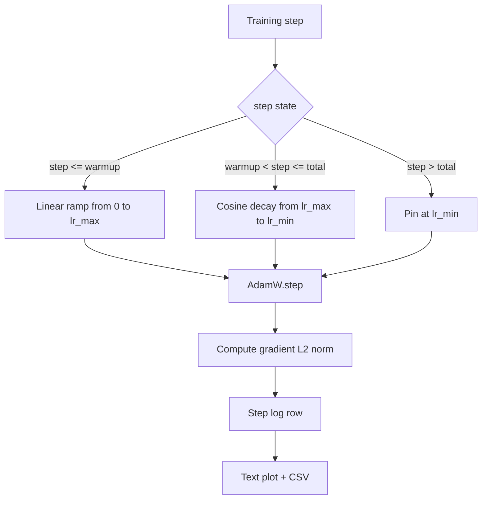

<!-- i18n:manual -->
# Косинусный learning rate с линейным разогревом

> Расписание learning rate — второе по важности решение после функции потерь. AdamW с косинусным затуханием и линейным разогревом — современный стандарт для обучения языковых моделей, потому что он даёт модели маленький эффективный шаг на хрупкой первой тысяче обновлений, поднимает его до заданного пика и плавно гасит обратно к нулю. В этом уроке мы строим такое расписание, рисуем кривую по шагам обучения, логируем нормы градиента рядом с расписанием и доказываем, что расписание соблюдает границы разогрева, пика и затухания.

**Type:** Build
**Languages:** Python
**Prerequisites:** Phase 19 lessons 30-37
**Time:** ~90 minutes

## Learning Objectives

- Реализовать оптимизатор AdamW, подключённый к косинусному расписанию learning rate с линейным разогревом.
- Считать точное значение расписания на любом шаге без накопления ошибки с плавающей точкой между запусками.
- Логировать L2-норму градиента бок о бок с learning rate, чтобы здоровье обучения было наблюдаемым.
- Рисовать расписание в виде текстового графика, читаемого глазом, и CSV, который прочитает любой инструмент.

> 🎒 **На пальцах.** Расписание learning rate — это профиль скорости на поездке: разгон от светофора, крейсер, торможение у дома. Три параметра задают всю кривую: `warmup_steps` (сколько разгоняемся), `lr_max` (крейсерская скорость), `lr_min` (скорость на парковке). Всё остальное в уроке — про то, как не ошибиться в этих трёх числах на один шаг.

## The Problem

Первая тысяча обучающих обновлений — самая шумная. Веса модели ещё близки к инициализации. Бегущая оценка второго момента у оптимизатора ещё не устоялась. Норма градиента большая и дёрганая. Если learning rate в этот момент стоит на пике, модель либо прямо расходится, либо садится на плато loss, с которого уже не слезает. Два известных лекарства — это gradient clipping, которому посвящён урок 45 фазы 19, и расписание learning rate, которое начинает с малого и разгоняется.

> 🎒 **На пальцах.** «Второй момент» у Adam — это его собственная оценка того, насколько велики градиенты обычно. На шаге ноль он пустой, и оптимизатор буквально не знает масштаба задачи. Просить у него полный шаг в этот момент — то же самое, что топить педаль в пол на непрогретой машине в незнакомом дворе.

У расписания «косинус плюс разогрев» три области. От нулевого шага до шага `warmup_steps` learning rate линейно растёт от нуля до заданного пика `lr_max`. От шага `warmup_steps` до шага `total_steps` learning rate идёт по верхней половине косинусной кривой, затухая от `lr_max` до `lr_min`. После `total_steps` learning rate прибит к `lr_min`, чтобы криво настроенный тренер, проскочивший конец, не вылетел из расписания молча.

> 🎒 **На пальцах.** Три области — три разных вопроса к одному числу «шаг». Возьмите `warmup_steps` = 2000 и `total_steps` = 100 000: шаг 1500 попадает в разгон, шаг 50 000 — в косинус, шаг 120 000 — в пол. Одна функция, три ответа, и ни одного места, где она может вернуть что-то неопределённое.

Проблема сборки в том, что в расписаниях легко промахнуться на единицу. Такая ошибка на единицу вылезает через шесть часов обучения как learning rate на 1 процент выше или ниже нужного ровно в тот момент, когда модель начинает переобучаться, — и это невидимо, если расписание не протестировано исчерпывающе на границах.

> 🎒 **На пальцах.** Ошибка на единицу тут не роняет программу — в этом и беда. Расписание вернёт значение, обучение пойдёт, кривая на графике будет выглядеть красиво. Поэтому границы проверяют тестами, а не глазами: шаг 0, шаг `warmup_steps`, шаг `total_steps` и шаг `total_steps + 1` — четыре ассерта, которые ловят весь класс этих ошибок.

## The Concept



> 🎒 **На пальцах.** Схема читается как один `if` с тремя ветками: разгон, косинус, пол. Обратите внимание, что все три ветки сходятся в `AdamW.step` — то есть оптимизатор один и тот же, меняется только число, которое ему подают. И сразу после шага считается норма градиента, потому что смотреть на learning rate без неё — всё равно что смотреть на спидометр, не слыша мотора.

### Warmup formula

Для `step` из `[0, warmup_steps]` при `warmup_steps > 0` learning rate равен `lr_max * step / warmup_steps`. Вырожденный случай `warmup_steps = 0` трактуется как «без разогрева»: расписание стартует прямо с `lr_max` на нулевом шаге и сразу входит в косинусное затухание. Некоторые тестовые обвязки подают `warmup_steps = 0`, чтобы проверить, что расписание всё ещё выдаёт пригодную кривую.

> 🎒 **На пальцах.** Подставьте числа: `lr_max` = 3e-4, `warmup_steps` = 2000. На шаге 500 получается 3e-4 × 500/2000 = 7.5e-5, то есть четверть пика. На шаге 2000 — ровно 3e-4. Прямая линия, никаких сюрпризов, и деление на ноль отдельно оговорено, чтобы код не падал на `warmup_steps = 0`.

### Cosine formula

Для `step` из `(warmup_steps, total_steps]` learning rate равен `lr_min + 0.5 * (lr_max - lr_min) * (1 + cos(pi * progress))`, где `progress = (step - warmup_steps) / max(1, total_steps - warmup_steps)`. При `step = warmup_steps` косинус даёт `cos(0) = 1`, что даёт `lr_max` и в точности совпадает с концом разогрева. При `step = total_steps` косинус даёт `cos(pi) = -1`, что даёт `lr_min` и в точности совпадает с концом затухания.

> 🎒 **На пальцах.** Проверьте середину: при `progress` = 0.5 косинус от pi/2 равен нулю, значит lr = `lr_min` + 0.5 × (`lr_max` − `lr_min`). С `lr_max` = 3e-4 и `lr_min` = 3e-5 это 3e-5 + 1.35e-4 = 1.65e-4 — ровно половина пути между полом и пиком. Косинус здесь просто говорит: «на полпути будь на полскорости», а гасит мягко в начале и в конце.

Непрерывность на обеих границах — не случайность. Именно поэтому расписание реализовано одной функцией от `step`, а не тремя разными, склеенными вместе. Склеенное расписание теряет одну границу в первый же раз, когда меняют `lr_max`.

> 🎒 **На пальцах.** «Потерять границу» значит вот что: вы поправили `lr_max` в одной ветке и забыли в другой, и на стыке кривая делает скачок. Одна функция такое исключает по построению — `lr_max` в ней записан один раз. Это то же правило, что и с истиной в базе данных: одно значение, одно место, ноль шансов на расхождение.

### Floor after total steps

Для `step > total_steps` learning rate остаётся равен `lr_min`. Контракт явный: расписание не падает с ошибкой и не экстраполирует, оно прибивается к полу и позволяет тренеру записать предупреждение. Тем, кому нужно продлить обучение, следует менять `total_steps` расписания, а не цикл.

> 🎒 **На пальцах.** Экстраполяция косинуса за `total_steps` дала бы отрицательный learning rate — то есть модель начала бы разучиваться, шагая вверх по loss. Пол вместо этого просто держит `lr_min`. Как ограничитель на регуляторе громкости: крутите дальше сколько угодно, тише нуля не станет.

### Gradient norm logging alongside the rate

Расписание — это половина здоровья обучения. Вторая половина — норма градиента. Обучающий цикл логирует обе величины на каждом шаге. Расходящийся запуск показывает скачок нормы градиента раньше, чем скачок loss; хорошо настроенный разогрев держит норму растущей линейно вместе с learning rate; слишком агрессивный пик виден как норма, которая остаётся высокой после разогрева. На диске лежит датасет `step, lr, grad_l2_norm, loss`. CSV — единственная долгоживущая запись.

> 🎒 **На пальцах.** Норма градиента — это одно число вместо миллиардов: длина вектора всех градиентов сразу. Она предупреждает раньше loss, и это главное: loss показывает, что уже плохо, а взлетевшая норма — что станет плохо через десяток шагов. Четыре колонки `step, lr, grad_l2_norm, loss` — весь приборный щиток обучения.

```figure
cap-cosine-warmup
```

## Build It

`code/main.py` реализует:

- `CosineWithWarmup` — функция без состояния `lr(step) -> float` по заданному расписанию.
- `TrainState` — заворачивает модель, оптимизатор `AdamW` и расписание в единственную функцию шага.
- `TrainState.step` — делает один forward pass, один backward pass, логирует L2-норму градиента и применяет `lr(step)` к оптимизатору.
- `plot_schedule_ascii` — рисует расписание текстовым графиком, читаемым глазом.
- `write_schedule_csv` — выдаёт по строке на шаг со значением learning rate.

Демо в конце файла собирает крошечную модель `nn.Linear`, обучает её 20 шагов на фиксированном батче входов и печатает learning rate, норму градиента и loss на каждом шаге. Расписание также рисуется текстовым графиком для визуальной проверки на вменяемость.

> 🎒 **На пальцах.** Ключевое слово в описании `CosineWithWarmup` — «без состояния»: функция не помнит, сколько раз её звали, она просто считает значение из номера шага. Поэтому `lr(5000)` даёт одно и то же число, сколько бы раз вы её ни вызвали и с какой бы точки ни возобновили обучение. Это как формула площади круга — она не зависит от того, какие круги вы считали до этого.

Запустите:

```bash
python3 code/main.py
```

Скрипт завершается с нулевым кодом и печатает лог обучения по шагам плюс график расписания.

## Production Patterns

Четыре приёма поднимают расписание до уровня продакшен-артефакта.

**Schedule lives in a config, not in code.** Тренер читает `warmup_steps`, `total_steps`, `lr_max`, `lr_min` из YAML- или JSON-конфига, который лежит в git. Расписание воспроизводимо, потому что конфиг адресуется по содержимому; расписание проверяемо, потому что конфиг попадает в дифф пул-реквеста.

> 🎒 **На пальцах.** Числа в коде — это числа, которые никто не заметит. Числа в конфиге видно в дифф-е, и ревьюер спросит «почему пик стал 6e-4 вместо 3e-4?» до запуска, а не после сожжённых суток на GPU. Это разница между «изменили» и «изменили и объяснили».

**Step counter is monotonic and decoupled from epochs.** Некоторые фреймворки путают шаг и эпоху, когда датасет шардирован или dataloader перезапускается. Расписание читает `global_step` из чекпойнта тренера, а не из локального счётчика. Возобновлённый запуск продолжается с правильной точки расписания, потому что счётчик шагов — это долгоживущая ось.

> 🎒 **На пальцах.** Представьте, что обучение упало на шаге 60 000 из 100 000, а после перезапуска локальный счётчик начался с нуля. Расписание решит, что вы снова в разогреве, и подаст полный `lr_max` на почти обученную модель — та мгновенно вылетит из найденного минимума. `global_step` из чекпойнта — это как километраж на одометре, а не время с момента поворота ключа.

**Schedule plot in the run directory.** Каждый обучающий запуск пишет `outputs/lr_schedule.png` (или, как в этом уроке, текстовый график) в свою директорию. Ревьюер, пробегающий глазами директорию, может проверить расписание на вменяемость, ничего не перезапуская. Это ловит целый класс багов «расписание настроено криво» ещё на этапе пул-реквеста.

**Log row schema is fixed.** `step, lr, grad_l2_norm, loss` именно в этом порядке. Ноутбук или дашборд ниже по течению читает эту схему; переименование колонки без поднятия версии обнуляет все существующие дашборды.

## Use It

Production patterns:

- **Sweep peak before sweeping anything else.** `lr_max` — самая чувствительная ручка. Переберите её сперва на маленькой модели: оптимальный `lr_max` слабо зависит от размера модели, поэтому перебор на маленькой модели — сильный априор для большой.
- **Warmup is a fraction of total steps, not an absolute count.** Запуск на 200 миллионов шагов с 2000 шагов разогрева выходит на пик почти сразу; запуск на 20 000 шагов с тем же числом разогревается 10 процентов времени. Задавайте разогрев долей (типично 1-3 процента), чтобы расписание масштабировалось вместе с длительностью обучения.
- **`lr_min` is non-zero on purpose.** Пол в 10 процентов от `lr_max` держит оптимизатор обучающимся на длинном хвосте. Расписание с `lr_min = 0` даёт кривую обучения, которая отлично смотрится на графике, и модель, которая на самом деле не доучилась.

> 🎒 **На пальцах.** Посчитайте второй пункт: 2000 из 200 000 000 — это 0.001% обучения, а 2000 из 20 000 — целых 10%. Одно и то же число даёт две совершенно разные кривые. Поэтому разогрев задают процентом, как чаевые: не «двести рублей всегда», а «десять процентов от счёта».

## Ship It

Файл `outputs/skill-cosine-warmup.md` на реальном проекте описывал бы, какой конфиг несёт расписание, из какого шага тренера читается глобальный счётчик и какой перебор `lr_max` дал задеплоенное значение. Этот урок поставляет движок.

## Exercises

1. Добавьте вариант расписания с обратным квадратным корнем и сравните его на игрушечном обучении в 200 шагов. Какая кривая даёт меньший финальный loss?
2. Добавьте флаг `--restart`, который вставляет второй разогрев на шаге `total_steps / 2`. Обоснуйте, помогают тёплые рестарты на игрушечном запуске или мешают.
3. Добавьте юнит-тест на непрерывность расписания: для каждого шага из `[0, total_steps]` разность `|lr(step+1) - lr(step)|` ограничена величиной `lr_max / warmup_steps`.
4. Подключите расписание к `torch.optim.lr_scheduler.LambdaLR`, чтобы оно складывалось с кодом фреймворка. В уроке используется простая функция от шага; что меняет обёртка?
5. Добавьте флаг `--plot-png`, который пишет настоящий график через `matplotlib`. Обоснуйте, что лучше по умолчанию для запусков в CI — текстовый график урока или PNG.

> 🎒 **На пальцах.** Третье упражнение стоит разобрать: при `lr_max` = 3e-4 и `warmup_steps` = 2000 граница равна 3e-4 / 2000 = 1.5e-7 за шаг. Это самый крутой участок всей кривой — разгон; косинус везде положе. Значит одна простая проверка накрывает и разогрев, и затухание, и стык между ними.

## Key Terms

| Term | What people say | What it actually means |
|------|-----------------|------------------------|
| Warmup | «Медленный старт» | Линейный подъём от нуля до `lr_max` за первые `warmup_steps` обновлений |
| Cosine decay | «Плавный спад» | Верхняя половина косинусной кривой от `lr_max` до `lr_min` на оставшихся шагах |
| Floor | «После обучения» | Фиксированное значение `lr_min`, к которому расписание прибито за пределами `total_steps` |
| Gradient norm | «L2 от градиентов» | Евклидова норма склеенного вектора градиентов, логируемая на каждом шаге |
| Global step | «Ось расписания» | Монотонный счётчик шагов, который переживает перезапуски и управляет расписанием |

## Further Reading

- [Loshchilov and Hutter, SGDR: Stochastic Gradient Descent with Warm Restarts (arXiv 1608.03983)](https://arxiv.org/abs/1608.03983) — статья-первоисточник косинусного расписания
- [Loshchilov and Hutter, Decoupled Weight Decay Regularization (arXiv 1711.05101)](https://arxiv.org/abs/1711.05101) — статья-первоисточник AdamW
- [PyTorch torch.optim.lr_scheduler](https://docs.pytorch.org/docs/stable/optim.html#how-to-adjust-learning-rate) — как функции от шага складываются с планировщиками фреймворка
- Phase 19 · 42 — загрузчик, чей корпус потребляет это расписание
- Phase 19 · 43 — dataloader, с которым это расписание развивается вместе
- Phase 19 · 45 — gradient clipping и AMP, следующий слой в цикле
