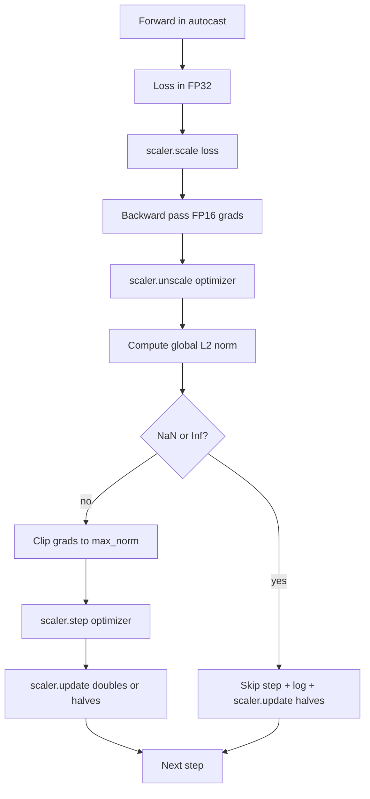

<!-- i18n:manual -->
# Gradient clipping и смешанная точность

> Оптимизатор и расписание из прошлого урока исходят из того, что градиенты вменяемые. Обычно это не так. Один плохой батч способен подбросить норму градиента на три порядка. Обучение в смешанной точности добавляет сверху переполнение FP16 на стороне лосса. Этот урок собирает два ремня безопасности, без которых продакшн-обучение не выпускают: клиппинг градиентов по заданной глобальной норме L2 и цикл смешанной точности с autocast и GradScaler, который ловит NaN и Inf, аккуратно пропускает шаг и логирует масштабирующий множитель для разбора полётов.

**Type:** Build
**Languages:** Python
**Prerequisites:** Phase 19 lessons 30-37
**Time:** ~90 minutes

## Learning Objectives

- Считать глобальную норму L2 по градиентам всех параметров и обрезать их на месте, когда она превышает заданный порог.
- Оборачивать шаг обучения в autocast плюс GradScaler, чтобы прямой и обратный проход в FP16 переживали переполнение.
- Ловить NaN и Inf в лоссе или градиенте, пропускать шаг оптимизатора и писать пропуск в лог.
- Выводить масштабирующий множитель GradScaler на каждом шаге, чтобы длинная серия пропусков была видна сразу.

## The Problem

Прогон, который вчера шёл чисто, выдаёт кривую лосса, уходящую вертикально вверх на шаге 8217. Виноват один-единственный батч с нормой градиента 4200 — в двадцать раз выше предыдущего пика. Без клиппинга оптимизатор делает шаг, который стирает всё, чему модель научилась за прошедший час. С глобальным клиппингом L2 на уровне 1.0 тот же батч вносит обновление единичной нормы; лосс остаётся на своей линии тренда; прогон выживает.

> 🎒 **На пальцах.** Клиппинг — это ограничитель скорости на руле: направление вы оставляете, а величину рывка режете до допустимой. Посчитайте: норма 4200 при пороге 1.0 означает, что все градиенты делятся на 4200, то есть шаг ужимается в четыре тысячи раз. Направление обновления при этом не меняется ни на градус — режется только длина вектора.

Обучение в смешанной точности поднимает пропускную способность в 2-3 раза, считая прямой проход и большую часть обратного в FP16. Плата за это — узкий диапазон экспоненты у FP16. Типичный градиент, переполнивший FP16, превращается в Inf, тот расползается по следующим слоям как NaN, и на очередном шаге оптимизатора все веса становятся NaN. GradScaler из PyTorch решает это так: умножает лосс на большой масштабирующий множитель перед обратным проходом и делит градиенты на тот же множитель перед шагом оптимизатора. Если на момент обратного масштабирования хоть один градиент оказался Inf или NaN, скейлер пропускает шаг и делит множитель пополам; если предыдущие N шагов прошли чисто — удваивает его. За время обучения множитель находит максимальное значение, которое позволяет диапазон FP16.

> 🎒 **На пальцах.** GradScaler работает как громкость на диктофоне: тихий сигнал сначала усиливают, чтобы он не потерялся в шуме, а потом делят обратно. Градиент масштабируется, например, на 65536, спокойно живёт в FP16, а перед шагом оптимизатора делится на те же 65536. Если после усиления что-то зашкалило — множитель уменьшают вдвое (65536 становится 32768) и шаг просто пропускают.

Сложность сборки — правильно соединить эти две вещи. Обрежете до обратного масштабирования — и порог будет применён к масштабированным градиентам; обрежете после — и начинает иметь значение порядок операций у GradScaler. Правильный порядок такой: `scaler.scale(loss).backward()`, затем `scaler.unscale_(optimizer)`, затем `clip_grad_norm_`, затем `scaler.step(optimizer)`, затем `scaler.update()`. Любой другой порядок даёт молча сломанный цикл.

> 🎒 **На пальцах.** «Молча сломанный» — самое неприятное слово в этом абзаце: ошибки не будет, обучение просто пойдёт хуже. Например, если обрезать до `unscale_`, то порог 1.0 применится к градиентам, умноженным на 65536, — то есть фактически не применится вообще, потому что реальная норма после деления окажется 1/65536. Запомните цепочку из пяти вызовов как одно заклинание.

## The Concept



### Global L2 norm

Глобальная норма L2 — это евклидова норма склеенного вектора всех градиентов, а не норма каждого параметра по отдельности. В PyTorch это `torch.nn.utils.clip_grad_norm_(parameters, max_norm)`. Функция возвращает норму до обрезки, чтобы в уроке можно было логировать и естественное, и обрезанное значение — без этого не поставить диагноз «мы обрезаем на каждом шаге».

> 🎒 **На пальцах.** Разница «глобальная против пер-параметрической» важнее, чем кажется. Если у модели три тензора с нормами 3, 4 и 12, то глобальная норма — это не максимум 12, а корень из `9 + 16 + 144`, то есть 13. Обрезка по глобальной норме делит все три тензора на одно и то же число и сохраняет их пропорции; обрезка по отдельности перекосила бы соотношение между слоями.

### autocast and GradScaler

`torch.amp.autocast(device_type)` — это контекстный менеджер, который выборочно гоняет подходящие операции (в основном всё, что похоже на matmul) в FP16. `torch.amp.GradScaler(device_type)` — помощник, который масштабирует лосс перед обратным проходом и обратно масштабирует градиенты перед шагом оптимизатора. Эти двое спроектированы вместе; использовать одного без другого — ошибка конфигурации, которую должен ловить тест.

В уроке используется CPU-autocast, потому что именно он крутится в CI; тот же шаблон переносится на CUDA дословно, заменой `device_type="cpu"` на `device_type="cuda"`. GradScaler на CPU — заглушка (CPU-autocast и так работает в BF16 по умолчанию и не нуждается в масштабировании лосса), но в уроке вызовы оставлены, чтобы обвязка была идентична GPU-циклу.

> 🎒 **На пальцах.** Обратите внимание, почему на CPU скейлер не нужен: там autocast работает в BF16, у которого диапазон экспоненты как у FP32, и переполняться просто нечему. Вызовы всё равно оставлены — чтобы, переехав на GPU, вы поменяли ровно одну строку `device_type="cpu"` на `device_type="cuda"`, а не переписывали цикл.

### NaN and Inf detection

Проверка происходит в двух местах. Во-первых, сам лосс проверяется через `torch.isfinite` до обратного прохода; Inf или NaN в лоссе не даст полезных градиентов, и такой шаг пропускается, не доходя до оптимизатора. Во-вторых, после `scaler.unscale_(optimizer)` урок просматривает размасштабированные градиенты функцией `has_non_finite_grad(...)` и считает любой Inf или NaN поводом пропустить шаг. Две проверки вместе покрывают отказы и на прямом проходе, и на обратном.

> 🎒 **На пальцах.** Две проверки нужны потому, что беда приходит с двух сторон. Лосс может стать Inf ещё на forward — например, если в батч попал выброс и `exp` переполнился. А может быть здоровый лосс и Inf, родившийся уже на backward при умножении на масштаб 65536. Первая проверка стоит одну редукцию по тензору, зато экономит целый шаг обучения.

### Scaling factor diagnostics

Масштабирующий множитель — это внутреннее состояние GradScaler. На каждом шаге урок читает `scaler.get_scale()` и логирует его рядом с learning rate и нормой градиента. Здоровый прогон показывает множитель, растущий степенями двойки, пока он не насытится где-то около `2^17` или `2^18`. Больной прогон показывает множитель, скачущий между высокими и низкими значениями, — это сигнал, что градиенты модели то попадают в диапазон, то нет. Без логирования эта диагностика невидима.

> 🎒 **На пальцах.** `2^17` — это 131072, и здоровый скейлер добирается туда примерно за 17 удвоений, то есть за пару тысяч шагов при удвоении раз в 2000 шагов. Если же в логе видно 65536, потом 32768, потом снова 65536 и опять вниз — модель балансирует на краю диапазона FP16, и это повод переходить на BF16, а не «немножко подождать».

```figure
grad-clip-monitor
```

## Build It

`code/main.py` реализует:

- `clip_global_l2_norm` — обёртка над `torch.nn.utils.clip_grad_norm_`, возвращающая норму и до обрезки, и после.
- `has_non_finite_grad` — помощник, просматривающий градиенты на NaN и Inf.
- `AmpTrainState` — держит модель, оптимизатор `AdamW`, GradScaler и устройство для autocast. Отдаёт метод `step(inputs, targets)`, который прогоняет весь конвейер: обрезку, масштабирование и пропуск при NaN.
- `StepLog` и `SkipLog` — структурированные записи по шагам.
- Демо, которое обучает маленькую модель `nn.Linear` 20 шагов, подсовывает Inf в градиент на шаге 5, чтобы задействовать ветку пропуска, и печатает получившийся лог.

Запустите:

```bash
python3 code/main.py
```

Скрипт завершается с нулём и печатает лог по шагам, где каждая строка помечена `STEP` или `SKIP`; хотя бы одна строка — `SKIP`.

> 🎒 **На пальцах.** Инъекция Inf на шаге 5 — это не костыль, а способ проверить редкую ветку кода. Ждать настоящего переполнения можно тысячи шагов, а тут вы гарантированно получаете один `SKIP` из 20 строк лога и сразу видите, что скейлер уполовинил множитель. Такие «учебные аварии» полезно оставлять в тестах насовсем.

## Production Patterns

Четыре шаблона превращают этот цикл в продакшн-шаг обучения.

**Skip counter as an alert, not a log line.** Пара пропущенных шагов за прогон — это здоровье. Сотни пропусков за эпоху — жёсткий алерт: модель ушла в режим, который FP16 не удерживает, и цикл молча буксует. Урок считает долю пропусков в скользящем окне 1000 шагов и в продакшне звонил бы дежурному при доле выше 5 процентов.

> 🎒 **На пальцах.** Переведите проценты в штуки: 5 процентов от окна в 1000 шагов — это 50 пропущенных шагов. То есть каждый двадцатый батч выброшен, и обучение идёт на 5 процентов медленнее, чем показывает счётчик шагов. Один-два пропуска в том же окне (0,2 процента) — обычный фон, тревожиться не о чем.

**Clip threshold lives in the config.** `max_norm = 1.0` — современное значение по умолчанию для обучения языковых моделей. Сначала прогоните перебор на маленькой модели; большие пороги дают модели восстанавливаться после действительно трудных батчей, маленькие ограничивают худший случай ценой более шумной кривой лосса. Порог должен лежать в том же YAML или JSON, что и расписание из урока 44.

**Norm log goes to a CSV with the schedule.** Колонки CSV такие: `step, lr, grad_l2_pre_clip, grad_l2_post_clip, loss, skipped, skip_reason, scaler_scale`. Ревьюер, открывший файл, видит в одной строке и расписание, и историю градиента, и масштабирующий множитель, и исход шага с причиной пропуска. Разносить эти колонки по разным файлам — рецепт несовпадающих анализов.

> 🎒 **На пальцах.** Ценность одной строки в том, что связи видны глазами. Если в строке `grad_l2_pre_clip` равен 4200, а `grad_l2_post_clip` — ровно 1.0, вы мгновенно понимаете: клиппинг сработал. Если же `pre_clip` всегда 0.9, а порог 1.0, значит клиппинг не срабатывает никогда и его можно ослабить.

**`scaler.update()` runs every step, even on skip.** На чистом шаге скейлер читает свой счётчик «без Inf», увеличивает его и, возможно, удваивает множитель. На пропущенном шаге скейлер делит множитель пополам и обнуляет счётчик. Забыть `update()` на ветке пропуска — тот самый баг, из-за которого «масштабирующий множитель никогда не менялся».

## Use It

Production patterns:

- **Autocast device matches optimizer device.** `torch.amp.autocast(device_type="cuda")` для обучения на GPU; `torch.amp.autocast(device_type="cpu")` для CPU. Смешение устройств даёт молчаливую ошибку типов, которая проявляется так: кривая лосса выглядит нормально, а модель не учится.
- **Loss check before backward.** `torch.isfinite(loss).all()` — это одна редукция по тензору; стоит она копейки, а экономит на NaN-лоссе целый шаг обучения. Делайте её всегда.
- **`set_to_none=True` в `zero_grad`.** Ставит градиенты в `None` вместо нуля, что позволяет оптимизатору пропустить вычисления для незатронутых групп параметров. Настройка даёт бесплатный прирост пропускной способности и слегка сокращает поверхность для багов.

> 🎒 **На пальцах.** Третий пункт стоит понять буквально. При `zero_grad()` без аргументов каждый тензор градиентов заполняется нулями — это проход по всей памяти градиентов на каждом шаге. При `set_to_none=True` тензор просто выбрасывается, и оптимизатор видит `None` и не трогает такой параметр вообще. Для модели на 7B это разница в гигабайты записей за шаг.

## Ship It

`outputs/skill-clip-amp.md` в реальном проекте описывал бы, какой порог обрезки и какое устройство autocast использует шаг обучения, где в системе контроля версий лежит CSV по шагам и какой порог алерта на долю пропусков стоит в продакшне. Этот урок поставляет сам движок.

## Exercises

1. Замените синтетическую инъекцию Inf на настоящий всплеск лосса (умножьте цель одного батча на 1e8) и убедитесь, что ветка пропуска срабатывает.
2. Добавьте режим `--bf16`, переключающий autocast на BF16 вместо FP16. У BF16 диапазон экспоненты шире, чем у FP16, и масштабирование лосса ему почти никогда не нужно; убедитесь, что доля пропусков на том же демо падает до нуля.
3. Добавьте юнит-тест на то, что обёртка обрезки корректно возвращает норму до и после, когда обрезки не происходит.
4. Добавьте подсчёт доли пропусков в скользящем окне и флаг CLI, который валит прогон, если доля превышает заданный порог 100 шагов подряд.
5. Подключите к циклу запись канонического CSV (`step, lr, grad_l2_pre_clip, grad_l2_post_clip, loss, skipped, skip_reason, scaler_scale`) и убедитесь, что файл переживает Ctrl-C за счёт сброса буфера после каждой строки.

> 🎒 **На пальцах.** Задание 2 — самый практичный вывод урока: на современных картах BF16 почти всегда лучше связки FP16 плюс GradScaler, потому что снимает весь этот танец с множителем. Задание 5 про сброс буфера тоже не мелочь: без явного flush последние сотни строк CSV живут в буфере ОС и исчезают при жёстком убийстве процесса — то есть пропадает ровно тот кусок лога, ради которого вы и лезли смотреть.

## Key Terms

| Term | What people say | What it actually means |
|------|-----------------|------------------------|
| Global L2 norm | "Clip target" | Евклидова норма склеенного вектора градиентов по всем обучаемым параметрам |
| autocast | "Mixed precision" | Выборочное выполнение подходящих операций в FP16 (или BF16) внутри блока `with` |
| GradScaler | "Loss scaler" | Помощник, который умножает лосс перед обратным проходом и обратно масштабирует градиенты перед шагом оптимизатора |
| Skip | "Bad step" | Шаг оптимизатора, от которого отказались из-за неконечного градиента или лосса; скейлер уполовинивает множитель |
| Scaling factor | "Scaler state" | Текущий множитель GradScaler; удваивается после чистых серий и делится пополам на каждом пропуске |

## Further Reading

- [Micikevicius et al., Mixed Precision Training (arXiv 1710.03740)](https://arxiv.org/abs/1710.03740) — исходное предложение масштабировать лосс
- [Pascanu, Mikolov, Bengio, On the difficulty of training recurrent neural networks (arXiv 1211.5063)](https://arxiv.org/abs/1211.5063) — работа-первоисточник по клиппингу градиентов
- [PyTorch torch.amp.GradScaler](https://docs.pytorch.org/docs/stable/amp.html) — API скейлера, который оборачивает этот урок
- [PyTorch torch.nn.utils.clip_grad_norm_](https://docs.pytorch.org/docs/stable/generated/torch.nn.utils.clip_grad_norm_.html) — примитив обрезки, который использует этот урок
- Phase 19 · 42 — загрузчик, чей корпус кормит этот цикл
- Phase 19 · 43 — даталоадер, который этот цикл потребляет
- Phase 19 · 44 — расписание, с которым этот цикл сочетается
