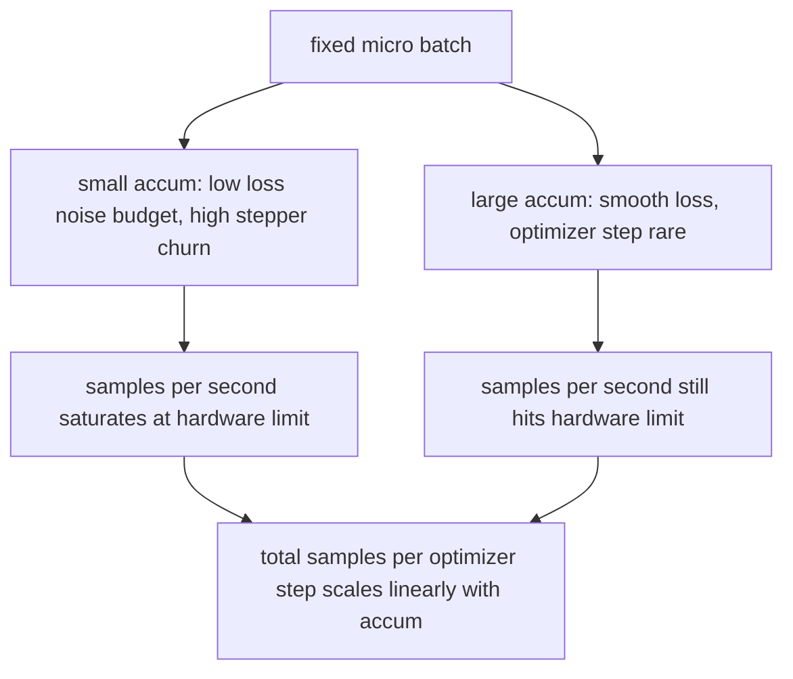

<!-- i18n:manual -->
# Накопление градиентов

> Обучайтесь на эффективном батче, который вам не по карману, — по одному микробатчу за раз. Масштабируйте лосс, придержите шаг оптимизатора и дайте градиентам накопиться.

**Type:** Build
**Languages:** Python
**Prerequisites:** Phase 19 lessons 42 to 45
**Time:** ~90 minutes

## Learning Objectives

- Вывести тождество эффективного батча: `effective_batch = micro_batch * accum_steps`.
- Реализовать масштабирование лосса на каждом микробатче так, чтобы накопленный градиент совпал с одним обратным проходом по полному батчу.
- Пропускать синхронизацию оптимизатора до последнего микробатча (синхронизация на последнем шаге).
- Читать кривую пропускной способности по эффективному батчу и объяснять, почему отдача убывает.

## The Problem

Вы хотите учиться на эффективном батче 512, потому что кривая лосса тогда глаже, а шаг оптимизатора на таком масштабе осмысленнее. Ускоритель у вас на столе держит 32 примера, дальше кончается память. Удвоить батч нельзя. Ужать модель вдвое нельзя. Приём, за который поле схватилось в 2017 году и с тех пор не отпускает, такой: прогнать 16 обратных проходов, дать градиентам накопиться прямо в буферах параметров и сделать шаг оптимизатора только тогда, когда счётчик дойдёт до цели.

> 🎒 **На пальцах.** Это как носить песок вёдрами, когда самосвала нет: за 16 ходок вы всё равно перевезёте кузов. Проверьте арифметику урока: микробатч 32 умножить на 16 накоплений — ровно 512, тот самый эффективный батч. Память при этом занята только под 32 примера за раз, потому что каждый микробатч отработал и освободил активации.

Риск в том, что лосс перестаёт быть тем же числом, каким был на большом батче. Кросс-энтропия 16 мини-батчей, сложенная в лоб, в 16 раз больше лосса одного полного батча. Без масштабирования направление градиента верное, а величина — нет, и шаг оптимизатора получается в 16 раз больше нужного. Лечится одним делением. Забывается это деление тоже легко.

> 🎒 **На пальцах.** Разберитесь, откуда берётся множитель 16. PyTorch не усредняет градиенты между вызовами `backward()`, он их складывает: 16 вызовов дают сумму 16 градиентов, а полный батч дал бы их среднее. Сумма ровно в 16 раз больше среднего — отсюда и деление лосса на 16 в каждом микробатче.

## The Concept


Контракт короткий:

- Лосс каждого микробатча делится на `accum_steps` перед `backward()`. PyTorch по умолчанию складывает градиенты в `param.grad`; деление возвращает накопленную сумму к правильному масштабу.
- Шаг оптимизатора срабатывает один раз на эффективный батч, после обратного прохода последнего микробатча. Шаг в середине накопления перекашивает каждый параметр, от которого зависит весь остаток прогона.
- Состояние оптимизатора (буферы моментума, моменты Adam) продвигается один раз на эффективный шаг, а не на каждый микробатч. Иначе экспоненциальные скользящие средние увидят неправильную частоту и прожгут расписание.
- На одном устройстве это просто бухгалтерия. На многоранговом кластере тот же шаблон оборачивает все неконечные микробатчи в контекст `no_sync`, который пропускает all-reduce градиентов; последний микробатч сводит весь накопленный градиент за один проход вместо того, чтобы платить за сеть N раз.

> 🎒 **На пальцах.** Третий пункт легко упустить, а он важен для Adam. Моменты Adam — это скользящие средние с горизонтом порядка 1/(1−β), то есть около 1000 шагов при β2 = 0.999. Если делать шаг на каждом микробатче, вы за тот же объём данных сделаете в 16 раз больше шагов, и горизонт усреднения по факту сожмётся в 16 раз.

> 🎒 **На пальцах.** Четвёртый пункт — это чистая экономия на сети. При 16 микробатчах наивный код гоняет all-reduce 16 раз за эффективный шаг, а с `no_sync` — один раз. Объём обмена равен размеру градиентов: для модели на 1B параметров в FP16 это 2 ГБ, и разница между 2 ГБ и 32 ГБ трафика на шаг вполне заметна.

### The equivalence proof in code

```python
loss = criterion(model(x_full), y_full)
loss.backward()
opt.step()
```

эквивалентно

```python
for x, y in chunks(x_full, y_full, n):
    scaled = criterion(model(x), y) / n
    scaled.backward()
opt.step()
```

с точностью до порядка суммирования чисел с плавающей точкой. Буфер накопленного градиента в конце цикла — тот же самый тензор, который дал бы один обратный проход по полному батчу. Код урока подтверждает это проверкой `equivalence_check`, где максимальная абсолютная разница меньше 1e-4.

> 🎒 **На пальцах.** Два фрагмента выше отличаются ровно одним символом смысла — делением на `n`. Уберите его, и градиенты станут в `n` раз больше, то есть при `n = 4` шаг оптимизатора улетит в четыре раза дальше, чем задумано. Разница 1e-4 в тесте — это не «примерно похоже», а честный уровень шума float32 при другом порядке сложения.

### Where the cost goes

Каждый микробатч стоит одного прямого и одного обратного прохода. С накоплением вы меняете память на время. Кривая пропускной способности в `outputs/accum-curve.json` показывает, что происходит при росте эффективного батча и фиксированном микробатче:



Бесплатного обеда нет. Удвоение `accum_steps` удваивает время на один шаг оптимизатора. Меняется другое — дисперсия оценки градиента: при том же бюджете времени вы сделали меньше шагов оптимизатора, зато каждый усреднён по большему числу примеров. Литература считает большой и маленький батч разными задачами оптимизации; урок здесь механический, а не статистический.

> 🎒 **На пальцах.** Смотрите на схему как на честную сделку. Пропускная способность в примерах в секунду упирается в железо и почти не зависит от `accum_steps` — карта всё равно считает те же микробатчи. Меняется только то, сколько примеров приходится на один шаг оптимизатора: при 16 накоплениях это 512 примеров вместо 32, а значит, шум градиента падает примерно в четыре раза (корень из 16).

```figure
cc-grad-accumulation
```

## Build It

`code/main.py` — это запускаемый артефакт. Он делает три вещи.

### Step 1: equivalence check

`equivalence_check()` строит две копии одной сети с одним и тем же зерном. Первая видит батч из 16 примеров за один прямой проход. Вторая видит четыре куска по 4 примера, где лосс поделён на четыре. Функция сравнивает буферы градиентов до шага оптимизатора и параметры после. Утверждение проверки — `max_abs_diff < 1e-4`.

> 🎒 **На пальцах.** Это самый полезный тест во всём уроке, потому что накопление ломается молча. Сравнивают именно буферы градиентов до шага оптимизатора: если бы сравнивали только лосс, ошибка в делении вообще не проявилась бы, ведь лосс печатается отдельно. Одно зерно на обе сети нужно, чтобы стартовые веса совпали до бита.

### Step 2: sync-on-last-step pattern

`train_one_optimizer_step` идёт по микробатчам. Для каждого микробатча, кроме последнего, он входит в `no_sync_context(model)`. В одном процессе этот контекст ничего не делает; на DDP именно здесь пропускается all-reduce градиентов. Бухгалтерия в обоих случаях одна и та же. Счётчик `sync_counter` фиксирует, сколько раз мы вышли из области no_sync; для N микробатчей это один раз на эффективный шаг, а не N.

> 🎒 **На пальцах.** Обратите внимание, что на одной машине контекст — пустышка, и код от этого не портится. Смысл в том, чтобы структура цикла уже была правильной к моменту переезда на кластер: там `sync_counter` из 1 вместо 16 сразу превращается в экономию сетевого времени. Тестировать это можно и без второй GPU — просто проверив, что счётчик равен числу эффективных шагов.

### Step 3: the throughput curve

`sweep_effective_batches` гоняет одну и ту же модель с фиксированным микробатчем и списком значений накопления. Для каждой настройки он логирует:

- `samples_per_sec`: всего просмотрено примеров, делённое на время по часам
- `median_step_ms`: 50-й перцентиль на один эффективный шаг
- `sync_calls`: сколько раз задействованы коллективные операции
- `avg_loss`: среднее по шагам оптимизатора внутри перебора

Результат ложится в `outputs/accum-curve.json` и переиспользуется из ноутбука.

> 🎒 **На пальцах.** Поле `sync_calls` — это ваш детектор ошибки в обвязке. Для перебора из 10 эффективных шагов при 8 микробатчах правильное значение 10, а не 80. Увидели 80 — значит `no_sync` не подключён, и на кластере вы будете платить за сеть в восемь раз больше, чем нужно.

Запустите:

```bash
python3 code/main.py
```

Скрипт печатает разницу в проверке эквивалентности, затем таблицу перебора, затем путь к JSON. Код выхода — ноль.

> 🎒 **На пальцах.** Медиана вместо среднего в `median_step_ms` выбрана не случайно: первый шаг всегда медленнее из-за прогрева ядер и аллокаций, и одно такое значение утащит среднее вверх. Например, при шагах 100, 102, 101 и одном 400 мс среднее даст 176 мс, а медиана — 101 мс, что и есть правда про установившийся режим.

## Use It

В продакшн-обучении накопление градиентов живёт за одной ручкой. Шаблон PyTorch такой: `accumulation_steps = effective_batch // (micro_batch * world_size)`. Фреймворки, которыми здесь пользоваться нельзя, оборачивают тот же цикл, но шаги те же: отмасштабировать лосс, пропустить синхронизацию на неконечных микробатчах, накопить, сделать один шаг.

Три шаблона из жизни:

- Размер микробатча выбирают так, чтобы насытить память устройства. Меньше — впустую тратятся такты ускорителя. Больше — падение по памяти.
- Эффективный батч выбирают из расписания learning rate. Большим эффективным батчам нужны увеличенные learning rate и warmup; это то самое правило линейного масштабирования, о котором говорят с 2017 года.
- Число накоплений — мост между этими двумя величинами и единственная ручка, которую вы вольны крутить на ходу, не переписывая загрузчик данных.

> 🎒 **На пальцах.** Формула с `world_size` объясняет, почему на кластере накоплений нужно меньше. Возьмите эффективный батч 512 и микробатч 32: на одной карте `accumulation_steps` равно 16, а на восьми картах — `512 // (32 * 8)`, то есть 2. Данные параллелизм уже даёт восьмикратный батч, накоплению остаётся добрать двукратный.

## Ship It

`outputs/skill-gradient-accumulation.md` фиксирует рецепт так, чтобы коллега мог перенести его в новый репозиторий: делить лосс на `accum_steps`, пропускать синхронизацию оптимизатора на неконечных микробатчах, делать шаг оптимизатора один раз на эффективный батч и писать пропускную способность против эффективного батча в JSON, чтобы размен был виден.

> 🎒 **На пальцах.** Обратите внимание, что рецепт состоит из четырёх пунктов, и три из них — про порядок действий, а не про формулы. Именно поэтому накопление градиентов проще всего сломать не математикой, а перестановкой строк: шаг оптимизатора внутри цикла по микробатчам или `zero_grad()` не там, где надо. JSON с пропускной способностью нужен, чтобы разница между 2 и 16 накоплениями обсуждалась числами, а не ощущениями.

## Exercises

1. Перезапустите перебор с `--num-steps 100` и постройте график примеров в секунду против эффективного батча. Где кривая выходит на полку?
2. Добавьте вариант с неправильным масштабированием (без деления) и покажите разницу параметров на шаге 1 относительно эталона.
3. Замените SGD на AdamW и убедитесь, что состояние оптимизатора продвигается один раз на эффективный шаг, а не на каждый микробатч.
4. Введите настоящую обёртку `DistributedDataParallel` и направьте `no_sync_context` в её метод. Убедитесь, что `sync_calls` падает на N-1 на каждый эффективный батч.
5. Измените проверку эквивалентности так, чтобы она сравнивала два разных разбиения на микробатчи (2 по 8 против 4 по 4), и объясните, какой допуск вам пришлось ослабить и почему.

> 🎒 **На пальцах.** Задание 2 стоит сделать обязательно: без деления параметры на первом же шаге разъедутся ровно в `accum_steps` раз по величине обновления, и вы увидите этот множитель глазами. Задание 5 показывает границу точности: 2 по 8 и 4 по 4 дают математически один результат, но складывают числа в разном порядке, поэтому допуск 1e-4 иногда приходится ослаблять до 1e-3.

## Key Terms

| Term | What people say | What it actually means |
|------|-----------------|------------------------|
| Micro batch | The batch you forward | Кусок, который помещается в память за один прямой проход |
| Accum steps | Backward passes per step | Сколько обратных проходов суммируется до одного шага оптимизатора |
| Effective batch | The batch | Микробатч, умноженный на число накоплений и на размер мира data parallel |
| Loss scaling | Divide by N | Деление лосса на каждом микробатче, чтобы сумма градиентов совпала с полным батчем |
| Sync on last | Skip the rest | Запускать коллективную операцию по градиентам только на последнем обратном проходе в окне |

## Further Reading

- Документация PyTorch по `DistributedDataParallel.no_sync` — продакшн-версия приёма с синхронизацией на последнем шаге.
- Goyal et al., 2017, про линейное масштабирование для обучения на больших батчах — каноническая причина вообще думать про эффективный батч.
- Трекер задач PyTorch про взаимодействие накопления градиентов с обратным масштабированием в смешанной точности.
- Уроки 42-45 фазы 19 покрывают модель, загрузчик данных, оптимизатор и обвязку тренера, которые этот урок считает готовыми.
- Урок 47 фазы 19 покрывает чекпойнт и возобновление, благодаря которым долгий прогон с накоплением переживает ограничение по времени.
