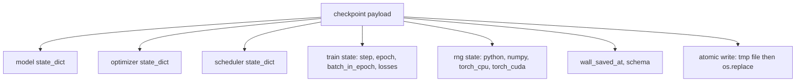
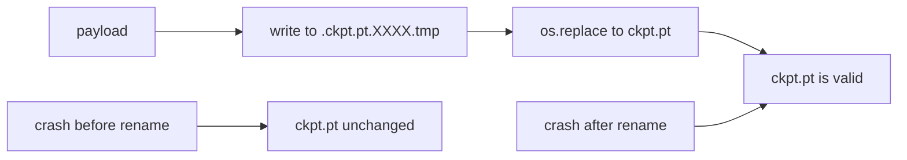
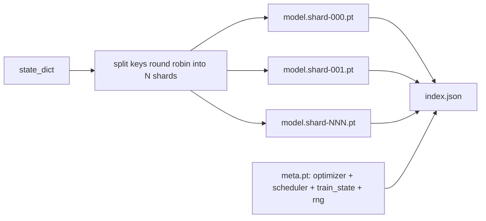

<!-- i18n:manual -->
# Сохранение чекпойнта и возобновление

> Прерывания убивают прогоны обучения; чекпойнты позволяют их продолжить. Сохраняйте модель, оптимизатор, планировщик, историю лосса, счётчик шагов и состояние генераторов случайных чисел — атомарно, чтобы убийство процесса в любой момент оставляло на диске корректный файл.

**Type:** Build
**Languages:** Python
**Prerequisites:** Phase 19 lessons 42 to 45
**Time:** ~90 minutes

## Learning Objectives

- Собирать полное состояние обучения в один payload, который можно загрузить в свежий процесс.
- Реализовать атомарное сохранение через запись во временный файл и переименование, чтобы падение никогда не оставляло недописанный файл.
- Восстанавливать состояние генераторов случайных чисел Python, NumPy и PyTorch, чтобы лосс после возобновления совпал с непрерывным эталоном.
- Собрать шардированную раскладку чекпойнта для моделей, которые больше не влезают в один файл, с проверкой хешей шардов и JSON-индексом.

## The Problem

Вы поставили задачу обучения на 18 часов. Ограничение по времени в очереди — 4 часа. Кластер перезагружается на одиннадцатом часу, потому что кто-то рангом выше согласовал обновление ядра. Без чекпойнтов вы начинаете заново. Без возобновления вы теряете ещё и состояние оптимизатора, которое набиралось эти 11 часов: даже если веса модели уцелели, моменты AdamW пропали, и следующий шаг рванёт в сторону, которую траектория обучения давно прошла.

> 🎒 **На пальцах.** Разница между «сохранить веса» и «сохранить всё» видна в цифрах Adam. Моменты — это скользящие средние по тысячам последних шагов; потеряв их, оптимизатор начинает с нулей и первые сотни шагов ведёт себя как новичок, хотя веса уже обучены. Одиннадцать часов работы превращаются не в ноль, но в заметный откат назад.

Правильный артефакт — один файл, который содержит всё нужное для продолжения: параметры модели, состояние оптимизатора, состояние планировщика, историю лосса для графиков, текущие счётчики шага, эпохи и батча внутри эпохи, а также состояние всех источников случайности. Без состояния генераторов возобновлённая кривая лосса будет уже другой кривой. Та же модель, те же данные — но другое перемешивание, другая маска dropout, другое число на дашборде.

> 🎒 **На пальцах.** Проверьте себя: почему без RNG кривая другая, если данные те же? Потому что порядок батчей задаётся генератором, и после перезапуска с нуля он выдаст другую перестановку — модель на шаге 5000 увидит не тот батч, что увидела бы. Плюс dropout: те же веса при другой маске дают другой лосс уже на первом шаге.

Атомарное сохранение — вторая половина контракта. Запись сразу в финальное имя означает, что падение посреди записи оставляет битый файл, и возобновление читает мусор. Запись во временный файл в той же директории с последующим переименованием означает, что падение посреди записи оставляет нетронутым предыдущий хороший файл. Переименование на POSIX-файловых системах атомарно.

> 🎒 **На пальцах.** «Атомарно» здесь значит буквально: для любого читателя файл либо старый целиком, либо новый целиком, промежуточного состояния не существует. Сравните с записью напрямую: чекпойнт на 5 ГБ пишется секунды, и всё это время файл на диске недописан. Убьют процесс в этом окне — потеряете и новый чекпойнт, и старый.

## The Concept



### The five state buckets

| Bucket | Why it matters |
|--------|----------------|
| Model | Веса и буферы; собственно то, чем модель является. |
| Optimizer | Моментум и адаптивные моменты; без них следующий шаг — уже другая задача оптимизации. |
| Scheduler | Где learning rate находится на своей кривой; косинусным расписаниям это особенно важно. |
| Train counters | Шаг, эпоха, батч внутри эпохи плюс история лосса, по которой рисуется дашборд. |
| RNG state | Детерминизм для dropout, перемешивания данных и любого сэмплирования внутри модели. |

> 🎒 **На пальцах.** Строка Scheduler объясняет, почему одних весов мало. Косинусное расписание считает learning rate от номера шага: если после возобновления счётчик сбросился в ноль, вы получите стартовый learning rate вместо почти нулевого в конце обучения — и обученная модель разъедется за десяток шагов. Пять корзин надо сохранять все пять, четыре не работают.

### Atomic save



Два правила. Первое: временный файл лежит в той же директории, что и целевой, чтобы переименование осталось внутри одной файловой системы; переименования между устройствами не атомарны. Второе: временное имя уникально для каждой попытки, чтобы два писателя не затоптали друг друга.

> 🎒 **На пальцах.** Правило про одну файловую систему — частая ловушка. Если писать во временный файл в `/tmp`, а целевой лежит на сетевом хранилище, то `os.replace` выродится в копирование байт с диска на диск, и вся атомарность исчезнет. Достаточно класть временный файл рядом с целевым — например, `ckpt.pt.a8f3.tmp` в той же папке.

### Sharded checkpoints

Когда модель разрастается, однофайловый payload становится слишком большим: его долго грузить, неудобно смотреть и больно читать, если сетевая шара икнула посреди чтения. Лечится это разбиением состояния параметров на шарды и записью маленького индекса, который их связывает.



Индекс записывает число шардов, sha256 каждого шарда и sha256 файла meta. Загрузчик падает громко, если хоть один хеш не сошёлся. Шарды могут лежать на разных физических дисках; meta мал и читается первым.

> 🎒 **На пальцах.** Смысл sha256 — поймать не злоумышленника, а обрезанную загрузку. Файл на 4 ГБ, скачанный на 99 процентов, откроется без ошибки и даст веса, в которых последние слои заполнены мусором, а лосс просто окажется странным. Хеш превращает эту тихую беду в честное исключение при загрузке.

### Resume continues mid epoch

Возобновление, которое прыгает к началу следующей эпохи, выбрасывает от нескольких минут до суток работы. Лечится парой `(epoch, batch_in_epoch)` плюс состоянием генераторов. После загрузки цикл обучения прокручивает генератор случайных чисел вперёд мимо батчей, уже съеденных в текущей эпохе, и продолжает с `batch_in_epoch`. Код урока делает именно это; утверждение проверки — что траектория лосса после возобновления совпадает с непрерывным эталоном с точностью 1e-4.

> 🎒 **На пальцах.** Посчитайте цену округления до эпохи: если эпоха идёт 6 часов, а упали вы на пятом часу, то прыжок к началу следующей эпохи стоит пять часов вычислений. Прокрутка генератора вперёд стоит миллисекунды, потому что она не считает модель, а только двигает состояние RNG на нужное число вызовов.

```figure
cc-atomic-checkpoint
```

## Build It

`code/main.py` даёт четыре примитива и демо-драйвер.

### Step 1: capture and restore RNG state

`capture_rng_state` возвращает словарь с `random.getstate` из Python, `np.random.get_state` из NumPy и байтами состояния RNG PyTorch для CPU и CUDA. `restore_rng_state` делает обратное. Состояние CPU — это буфер байтов uint8, который RNG PyTorch умеет принимать.

> 🎒 **На пальцах.** Обратите внимание, что источников случайности сразу четыре, и все они независимы. Перемешивание в даталоадере обычно идёт от `random` или NumPy, dropout — от PyTorch на CPU или CUDA. Восстановите три из четырёх — и кривая всё равно разъедется, просто найти причину будет тяжелее.

### Step 2: atomic save

`atomic_save` пишет payload во временный файл в целевой директории, а затем `os.replace` подставляет его под финальным именем. `atomic_write_json` делает то же самое для шардированного индекса.

### Step 3: full checkpoint round trip

`save_checkpoint` упаковывает модель, оптимизатор, планировщик, состояние обучения и RNG в один словарь. `load_checkpoint` делает обратное и возвращает `TrainState`. Поле schema — это крючок для апгрейдов: будущие изменения формата поднимают строку версии, и загрузчик разветвляется по ней.

> 🎒 **На пальцах.** Поле schema стоит копейки сейчас и спасает через полгода. Строка вроде `"v1"` в payload позволяет загрузчику сказать «а, это старый формат, добери поле по умолчанию» вместо падения с невнятным KeyError. Добавить такое поле задним числом невозможно — старые файлы уже записаны без него.

### Step 4: sharded variant

`save_sharded_checkpoint` раскладывает ключи параметров по N шардам по кругу, пишет каждый шард своим атомарным сохранением, пишет файл meta с состоянием оптимизатора, планировщика и обучения и пишет JSON-индекс с sha256 шардов. `load_sharded_checkpoint` проверяет каждый шард перед склейкой.

> 🎒 **На пальцах.** Раскладка «по кругу» означает: ключ 0 идёт в шард 0, ключ 1 — в шард 1, и так далее по циклу. При 100 тензорах и 4 шардах в каждом окажется 25 ключей, и размеры получатся примерно равными без всякой умной логики. Это не оптимально по байтам, зато предсказуемо и умещается в три строки кода.

### Step 5: resume demo

`run_resume_demo` обучает маленькую модель `total_steps` шагов, сохраняет чекпойнт на `interrupt_at`, а затем продолжает. Второй процесс восстанавливает чекпойнт и проходит оставшиеся шаги. Функция возвращает максимальную абсолютную разницу между двумя траекториями лосса после точки прерывания. При восстановленном RNG разница равна нулю или шуму плавающей точки.

> 🎒 **На пальцах.** Это и есть главный тест урока, и он бинарный по духу. Если RNG восстановлен правильно, разница будет порядка 1e-7 — это чистый шум float32. Если забыли восстановить хотя бы один генератор, разница окажется порядка 1e-1, то есть не «чуть-чуть хуже», а сразу очевидно другая кривая.

Запустите:

```bash
python3 code/main.py
```

Демо и с одним файлом, и с шардами проверяют, что максимальная разница меньше 1e-4. Сводка ложится в `outputs/resume-demo.json`.

## Use It

Продакшн-стеки обучения поставляют чекпойнтинг как часть тренера. Форма всегда одна: модель плюс оптимизатор плюс планировщик плюс счётчики плюс RNG, записанные атомарно и названные по номеру шага, чтобы последний было легко найти. Шардированные раскладки обеспечивают загрузку больших моделей параллельным чтением; работает это благодаря index.json.

Три правила, которые стоит соблюдать:

- **Schema is a string in the payload.** Миграции ветвятся по ней. Без неё вы не сможете развивать формат, не ломая старые прогоны.
- **Sha256 every shard.** Молча обрезанная загрузка — худший вид бага; загрузчик либо падает сразу, либо падает поздно.
- **Keep checkpoint cadence honest.** Сохраняйтесь каждые N шагов и каждые N минут по часам — что наступит раньше. Иначе долгий шаг, на котором вы упали, съест целое окно работы.

> 🎒 **На пальцах.** Третье правило про два условия сразу — не перестраховка. Представьте сохранение каждые 1000 шагов: пока шаг длится 0,5 секунды, это 8 минут потерь при падении, терпимо. Но если вы включили накопление градиентов на 16 микробатчей и шаг стал 8 секунд, те же 1000 шагов — это уже 2 часа работы под нож. Условие по часам страхует от такой смены режима.

## Ship It

`outputs/skill-checkpoint-save-resume.md` — это рецепт для любого нового скрипта обучения: форма payload, атомарная запись, захват RNG, шардированный индекс. Положите навык в репозиторий, подключите `save_checkpoint` в месте периодического сохранения, `load_checkpoint` — на старте, и прогон начнёт переживать убийства процесса.

## Exercises

1. Замените шардирование по кругу на шардирование по группам параметров (слои, оканчивающиеся на `.weight`, против `.bias`). Когда какая раскладка предпочтительнее?
2. Расширьте цикл сохранения так, чтобы он держал последние K чекпойнтов и удалял старые. Какое K правильное, когда диск маленький?
3. Добавьте флаг `--ckpt-every-seconds`, который запускает сохранение по интервалу часов, а не только по числу шагов.
4. Добавьте путь проверки контрольных сумм, который отрабатывает на старте, просматривает каждый чекпойнт в директории и сообщает, какие из них битые.
5. Реализуйте функцию `migrate_v1_to_v2`, которая добавляет в payload новое поле и поднимает строку schema. Сделайте так, чтобы загрузка терпела обе версии.

> 🎒 **На пальцах.** Задание 2 полезно посчитать в байтах: чекпойнт модели на 1B параметров с моментами AdamW весит около 12 ГБ (2 на веса плюс 8 на моменты плюс мелочь), и при K = 10 это 120 ГБ диска. Отсюда обычный ответ: держать K = 2-3 свежих и отдельно один «якорный» по расписанию, а не десяток подряд.

## Key Terms

| Term | What people say | What it actually means |
|------|-----------------|------------------------|
| Atomic save | "Write and pray" | Записать во временный файл в той же директории, затем os.replace под целевым именем |
| State dict | "The weights" | Параметры и буферы модели, разложенные по именам параметров |
| Sharded checkpoint | "Big model file" | Несколько файлов, по одному на шард, плюс файл meta и JSON-индекс с sha256 |
| RNG state | "Random seed" | Захваченное состояние для python random, numpy, torch CPU, torch CUDA — не просто зерно |
| Mid-epoch resume | "Restart" | Прокрутить RNG вперёд и продолжить со следующего батча в той же эпохе |

## Further Reading

- Семантика POSIX-вызова `rename` — основание для утверждения об атомарности, на которое опирается `os.replace`.
- Документация PyTorch по `torch.save` и `torch.load`, включая `map_location` для восстановления на другом устройстве.
- Урок 46 фазы 19 покрывает накопление градиентов, которое payload этого урока переносит через перезапуск.
- Урок 48 фазы 19 покрывает распределённые обёртки, чей формат state dict эта схема умеет принять.
- Документация по `fsync` в ядре Linux — гарантия долговечности, стоящая за атомарным переименованием.
