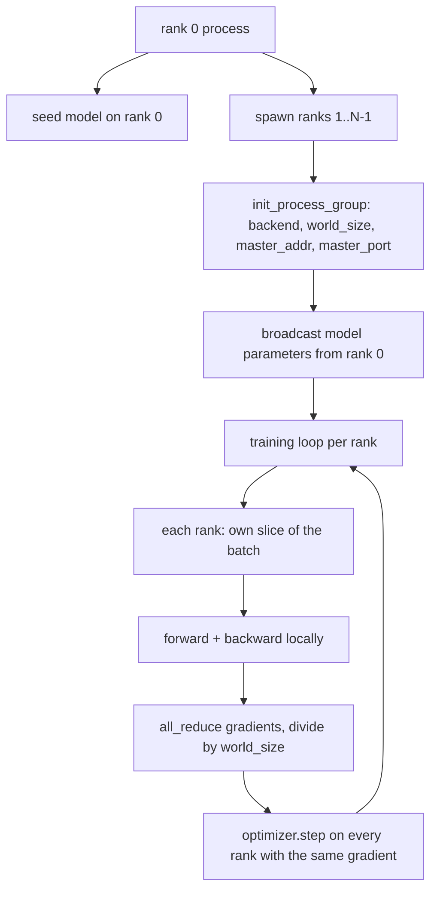
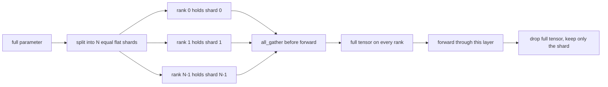

<!-- i18n:manual -->
# Distributed Data Parallel и FSDP с нуля

> Обучение на нескольких рангах — это две коллективные операции и одно правило. Разошлите параметры на старте, усредните градиенты после backward и никогда не позволяйте рангам разойтись во мнении о том, на каком шаге они находятся.

**Type:** Build
**Languages:** Python
**Prerequisites:** Phase 19 lessons 42 to 45
**Time:** ~90 minutes

## Learning Objectives

- Поднять process group на N рангах с бэкендом `gloo`, без специального железа.
- Реализовать минимальную обёртку DDP: она рассылает параметры при создании и делает all-reduce градиентов после backward.
- Доказать, что all-reduce поранговых градиентов совпадает с градиентом одного процесса на склеенном входе.
- Набросать шардирование параметров в стиле FSDP: каждый ранг хранит свой срез, полный тензор собирается на прямом проходе и выбрасывается сразу после.

## The Problem

Модель влезает в одно устройство. Датасет — нет. Бюджет оптимизации говорит, что вы хотите видеть в N раз больше примеров на каждую секунду настенного времени. Первый рычаг — data parallel: каждый ранг гоняет одну и ту же модель на своём куске батча, а перед шагом оптимизатора градиенты усредняются. Второй рычаг — FSDP: модель тоже не влезает в одно устройство, поэтому каждый ранг держит долю каждого параметра и восстанавливает полные тензоры слой за слоем во время прямого прохода.

> 🎒 **На пальцах.** Два рычага решают две разные боли. Data parallel — это «данных много»: батч на 8 примеров при 4 рангах превращается в 2 примера на ранг, и шаг идёт вчетверо быстрее. FSDP — это «модель большая»: каждый ранг хранит 1/4 каждой матрицы весов и собирает её целиком только на те доли секунды, пока считает этот слой.

Боль тут в бухгалтерии. Если параметры на рангах разъедутся, прогон молча испортится. Если вы усредняете градиенты, но не loss, дашборд будет врать. Если бэкенд коллективных операций не сойдётся на топологии, прогон зависнет навсегда. Лечится это тем, что коллективные операции пишутся руками один раз — и после этого вы не доверяете обёртке, которую не можете воспроизвести.

> 🎒 **На пальцах.** «Молча испортится» — самое неприятное слово в этом абзаце: ошибок не будет, loss будет падать, а модель на выходе окажется мусором. Представьте четырёх бухгалтеров, которые ведут одну книгу, но каждый начал с разных остатков: цифры сходятся у каждого по отдельности и не сходятся нигде вместе. Именно поэтому broadcast на старте не опция, а обязанность.

Этот урок работает на CPU. Наличие CUDA не предполагается. Бэкенд `gloo` идёт в комплекте с любой сборкой PyTorch и умеет работать с воркерами `torch.multiprocessing`; тот же самый код переключается на `nccl` на узле с несколькими GPU без изменения структуры.

## The Concept



> 🎒 **На пальцах.** Прочитайте схему как рецепт из пяти шагов: посеяли модель на ранге 0, подняли группу, разослали веса, а дальше в цикле каждый ранг считает свой кусок и после каждого backward все складывают градиенты и делят на world_size. При world_size = 4 деление на 4 — это и есть «усреднение»: сумма четырёх градиентов, делённая на четыре.

### The two collectives that matter

| Collective | What it does | When |
|------------|--------------|------|
| `broadcast` | Копирует тензор с одного ранга на все остальные | Инициализация параметров, состояние шедулера, любая синхронизация «один ко всем» |
| `all_reduce` | Складывает (или усредняет, или берёт максимум) тензор по всем рангам, и результат получает каждый ранг | Усреднение градиентов после backward |
| `all_gather` | Каждый ранг вносит свой тензор, и каждый ранг получает конкатенацию | Сбор логитов, разворачивание параметров в FSDP |

Контракт DDP — это `broadcast` при создании и `all_reduce` после backward. Набросок FSDP добавляет `all_gather` перед прямым проходом каждого слоя.

> 🎒 **На пальцах.** Различие в одной фразе: broadcast — «все получают копию одного», all_reduce — «все получают сумму всех», all_gather — «все получают список всех». Если у четырёх рангов лежат числа 1, 2, 3, 4, то после all_reduce у каждого будет 10, после all_gather — `[1, 2, 3, 4]`, а после broadcast с ранга 0 — четыре единицы.

### Gradient averaging matches single-process gradient

Модель, обученная на батче из B примеров на N рангах, обязана давать тот же градиент, что и один процесс, обучающийся на батче из N*B. Фокус в том, что сумма поранговых градиентов, делённая на N, и есть градиент среднего loss — ровно то, что кросс-энтропия с усреднением выдала бы на полном батче. Код урока проверяет это утверждением `max-abs-diff < 1e-3` между градиентом после ручного all-reduce и эталонным градиентом одного процесса.

> 🎒 **На пальцах.** Это школьное свойство среднего: среднее по 8 числам равно среднему двух средних по 4 числа, если группы одинакового размера. Отсюда и требование делить батч поровну — при 8 примерах и 2 рангах это 4 и 4, а не 5 и 3. Проверка проходит с огромным запасом: реальная разница около 1e-8, а порог 1e-3, то есть в сто тысяч раз мягче.

### FSDP sketch



> 🎒 **На пальцах.** Схема читается слева направо: полный параметр режется на N плоских кусков, каждый ранг держит свой, перед прямым проходом all_gather собирает всё обратно, а после — полный тензор выбрасывается. Матрица весов на 1 000 000 чисел при 4 рангах превращается в 250 000 чисел на ранг, и только на момент счёта слоя ранг снова держит миллион.

Выигрыш по памяти точный: память под параметры на одном ранге падает до 1/N. Цена — сбор, который платится на каждом прямом проходе. Продакшен-FSDP перекрывает сбор с вычислением предыдущего слоя, поэтому по настенному времени цена намного меньше, чем предсказывает наивный подсчёт. Урок делает круговой рейс по каждому параметру и проверяет, что восстановленный тензор побитово равен исходному.

> 🎒 **На пальцах.** «Побитово равен» — это сильное обещание: не «примерно совпадает», а совпадает до последнего бита, потому что мы ничего не считаем, а только режем и склеиваем. Про перекрытие думайте как про повара, который достаёт продукты для следующего блюда, пока текущее ещё жарится: время на дорогу к холодильнику никуда не делось, но оно больше не тормозит плиту.

### CPU and the gloo backend

Продакшен-цель — это CUDA, но те же самые пути кода существуют и на CPU. `gloo` — это CPU-бэкенд коллективных операций. Он медленнее `nccl` на GPU на порядки, но набор API у них одинаковый. Process group в уроке инициализируется с `backend="gloo"`, а ранги порождаются через `torch.multiprocessing`, а не через `torchrun`; и то и другое приходит к одним и тем же вызовам `torch.distributed`. На узле с несколькими GPU меняются только три вещи: `backend="nccl"`, тензоры на устройстве и `torchrun` для запуска.

> 🎒 **На пальцах.** Это как учиться водить на пустой парковке: скорость смешная, но руль, педали и правила ровно те же. Отсюда практический вывод — весь этот урок можно пройти на ноутбуке без единой GPU, а при переезде на боевой узел вы поменяете одну строку с названием бэкенда, а не архитектуру скрипта.

```figure
cg-allreduce-ring
```

## Build It

`code/main.py` — запускаемый артефакт.

### Step 1: bring up the process group

```python
os.environ["MASTER_ADDR"] = "127.0.0.1"
os.environ["MASTER_PORT"] = str(port)
dist.init_process_group(backend="gloo", rank=rank, world_size=world_size)
```

`MASTER_ADDR` и `MASTER_PORT` — это точка встречи: все ранги дозваниваются на один и тот же порт одного и того же хоста. Урок выбирает свободный порт трюком «занять и сразу отпустить», чтобы не было коллизий, когда на одной машине идут несколько прогонов.

> 🎒 **На пальцах.** Точка встречи — это как назвать друзьям адрес и время: если хоть один услышал другой номер дома, встреча не состоится, и все будут ждать вечно. Именно так выглядит зависший распределённый прогон — не ошибка, а тишина. Трюк со свободным портом нужен, чтобы два ваших прогона не назначили встречу в одной и той же квартире.

### Step 2: broadcast at construction

`MinimalDDP.__init__` обходит каждый параметр и каждый буфер и вызывает `dist.broadcast(tensor, src=0)`. Значения ранга 0 становятся канонической инициализацией. Без этого каждый ранг инициализируется своим сидом, и ранги расходятся с первого же шага.

> 🎒 **На пальцах.** Обратите внимание на слово «буфер»: рассылать надо не только веса, но и, например, скользящие средние батч-нормализации, иначе разъедется именно они. Проверить легко — напечатайте сумму всех параметров на каждом ранге: до broadcast это будут четыре разных числа, после — одно и то же с точностью до последнего знака.

### Step 3: all-reduce gradients after backward

```python
def all_reduce_grads_(module, world_size):
    for p in module.parameters():
        if p.grad is None:
            p.grad = torch.zeros_like(p.data)
        dist.all_reduce(p.grad.data, op=dist.ReduceOp.SUM)
        p.grad.data.div_(world_size)
```

Каждый ранг в итоге получает один и тот же усреднённый градиент. Шаг оптимизатора теперь становится функцией от одинакового входа на каждом ранге — именно поэтому параметры остаются синхронными на протяжении всего прогона.

> 🎒 **На пальцах.** Разберите код по строкам: сначала если градиента нет, ставим нули (иначе ранг без данных сломает сумму), потом складываем по всем рангам, потом делим на world_size. При 4 рангах с локальными нормами градиента 2, 4, 6 и 8 сумма даёт 20, а деление — 5 на каждом ранге. Одинаковый градиент плюс одинаковые веса дают одинаковые веса и после шага — вот и вся синхронизация.

### Step 4: prove the equivalence

`manual_all_reduce_matches_single_process` строит ту же модель на ранге 0 и сравнивает градиент после all-reduce с градиентом, который посчитал бы один процесс на склеенном входе. Максимальная разница по модулю получается около 1e-8.

> 🎒 **На пальцах.** 1e-8 — это не «почти правильно», а «ровно правильно с точностью float32»: числа порядка 1e-8 берутся из того, что сложение вещественных чисел в разном порядке даёт чуть разный последний бит. Если бы вы забыли деление на world_size, разница была бы не 1e-8, а примерно в N раз больше самого градиента — такую ошибку тест поймает мгновенно.

### Step 5: FSDP round trip

`fsdp_round_trip_sketch` вытягивает каждый параметр в плоский вектор, дополняет до кратности `world_size`, режет на срезы, делает all_gather и убирает дополнение. Восстановленный тензор на каждом ранге равен исходному. Это шаг разворачивания; обратный ему (шардировать заново после прямого прохода) — это один срез из собранного тензора.

Запустите:

```bash
python3 code/main.py
```

По умолчанию world size равен 2. Порождаются два CPU-процесса, они общаются друг с другом через `gloo` и выходят с кодом ноль. Файл `outputs/ddp-demo.json` фиксирует суммы параметров по рангам, норму градиента после all-reduce, результат кругового рейса FSDP и разницу между ручным и эталонным градиентом.

> 🎒 **На пальцах.** Зачем дополнение: тензор на 1002 числа при world_size = 4 не делится нацело, поэтому его добивают нулями до 1004 и режут на четыре среза по 251. После сборки лишние два нуля отрезаются — и получается ровно исходная тысяча с двумя. Без этого шага последний ранг получил бы срез другого размера, и all_gather просто упал бы.

## Use It

Продакшен-стеки обучения зовут ровно те же примитивы. `DistributedDataParallel` из PyTorch добавляет: хуки после backward, которые перекрывают all-reduce с самим backward; бакетированный all-reduce, объединяющий несколько мелких градиентов в одну коллективную операцию; и контекст `no_sync`, который использовал урок 46.

FSDP из PyTorch добавляет: плоское представление параметров на слой, чтобы каждый ранг держал один непрерывный буфер; перекрытие разворачивания следующего слоя с вычислением текущего; и опциональную выгрузку шардов на CPU.

Форма остаётся той же: broadcast на старте, reduce после backward, шардирование параметров, когда они перестают влезать.

> 🎒 **На пальцах.** Бакетирование — это про накладные расходы на каждый вызов, а не про объём данных. У модели с 200 слоями будет 400 тензоров градиентов, и 400 отдельных коллективных операций стоят дороже, чем 20 операций по 25 мегабайт каждая — примерно как 400 поездок в магазин против 20 с полной корзиной. Разница на практике легко доходит до двух раз по времени шага.

## Ship It

`outputs/skill-distributed-fsdp-ddp.md` содержит рецепт нового обучающего скрипта: поднять process group с `gloo` для CPU и `nccl` для GPU, обернуть модель в оболочку DDP, которая рассылает веса при создании и усредняет градиенты после backward, и при желании шардировать параметры по схеме all_gather из наброска FSDP.

## Exercises

1. Запустите с `--world-size 4` и убедитесь, что разброс параметров держится ниже 1e-3 на протяжении всего прогона.
2. Замените ручное усреднение на `dist.all_reduce(op=dist.ReduceOp.AVG)` и замерьте разницу по времени.
3. Добавьте в обёртку DDP хук после backward, чтобы all-reduce перекрывался с остатком обратного прохода; измерьте выигрыш по настенному времени.
4. Реализуйте шаг обратного шардирования в FSDP: после прямого прохода снова замените полный тензор локальным срезом. Убедитесь, что память на ранг падает.
5. Переключите бэкенд на `nccl` на машине с CUDA. Отметьте, какие переменные окружения меняются, а какие остаются прежними.

> 🎒 **На пальцах.** Начните с первого задания — оно самое дешёвое и сразу показывает главное. «Разброс параметров» здесь считается просто: возьмите сумму всех весов на каждом из 4 рангов и вычтите минимум из максимума; если broadcast и all-reduce работают, вы увидите что-то вроде 1e-7, а если забыли одну из двух операций — числа порядка единиц.

## Key Terms

| Term | What people say | What it actually means |
|------|-----------------|------------------------|
| Backend | «gloo или nccl» | Библиотека, реализующая коллективные операции; gloo — для CPU, nccl — для GPU |
| World size | «Всего рангов» | Число процессов в группе; именно группа — та единица, над которой работают коллективные операции |
| Rank | «Номер воркера» | Идентификатор процесса внутри группы, нумерация с нуля |
| All-reduce | «Сложи градиенты» | Сложить тензор по всем рангам так, чтобы у каждого ранга оказался один и тот же результат |
| Unshard | «Собери параметры» | Восстановить полный тензор из поранговых срезов через all_gather |

## Further Reading

- Документация PyTorch по `torch.distributed` — семантика коллективных операций, на которую опирается этот урок.
- Список коллективных операций библиотеки `gloo` — по форме он совпадает с примитивами `nccl`, работающими поверх CUDA.
- Урок 46 фазы 19 — паттерн накопления градиентов, который заворачивает all-reduce из DDP в `no_sync`.
- Урок 47 фазы 19 — раскладка чекпоинтов, которая переживает прогоны и на DDP, и на FSDP.
- Документация PyTorch по FSDP — продакшен-реализация того шардирования параметров, которое здесь только набросано.
