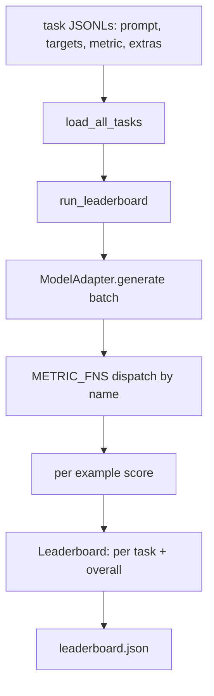
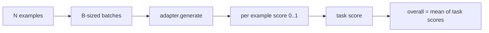

<!-- i18n:manual -->
# Харнесс для оценки языковых моделей

> Модель, которая хорошо справляется с задачей, которую вы не можете сформулировать, справляется хорошо случайно. Харнесс — это одновременно определение задачи, метрика, раннер и лидерборд, собранные в одну короткую и легко заменяемую форму.

**Type:** Build
**Languages:** Python
**Prerequisites:** Phase 19 lessons 42 to 45
**Time:** ~90 minutes

## Learning Objectives

- Описать задачу как JSONL-файл, где у каждого примера есть `prompt`, `targets`, `metric` и необязательные `extras`.
- Реализовать пять метрик: exact match, F1 по rouge-l, проверка исполнением, множественный выбор и вхождение подстроки.
- Собрать раннер, который бьёт примеры задачи на батчи и отправляет их в заменяемый адаптер модели.
- Выдать лидерборд в JSON с баллами по задачам, задержкой и воспроизводимым общим средним.

## The Problem

Новая языковая модель выходит каждую неделю. Маркетинг утверждает, что она хороша. Честный вопрос: хороша в чём? Честный ответ — в том лидерборде, который вы написали сами, потому что лидерборд вендора — это тот, под который он подгонялся.

Без харнесса в вашем репозитории вы сравниваете две модели на глазок. С харнессом вы сравниваете их по баллу на фиксированном наборе задач с фиксированной метрикой, а на выходе получаете JSON, который можно продиффить. Харнесс — это контракт между вчерашним прогоном и сегодняшним. Без него регрессии уезжают в продакшен.

> 🎒 **На пальцах.** «На глазок» звучит безобидно, пока вы не попробуете это повторить. Спросите себя: если вы вчера сказали «новая модель лучше», сможете ли вы сегодня назвать число? Харнесс превращает ощущение «вроде получше» в строку вида 0,82 против 0,79 на одних и тех же 100 примерах — и эту строку можно положить в git рядом с кодом.

Ловушка — переподгонка харнесса под одну конкретную модель. Лечится та же ловушка наоборот: харнесс достаточно мал, чтобы прочитать его за пятнадцать минут, задачи достаточно малы, чтобы лежать в репозитории, метрики написаны с нуля, чтобы коллега мог их проверить, а адаптер — единственное место, где живёт код под конкретную модель. Замените адаптер — лидерборд сдвинется; замените задачи — лидерборд сдвинется. Больше двигаться не должно ничего.

> 🎒 **На пальцах.** Это правило одной подвижной детали. Если у вас поменялись сразу и модель, и формулировка задачи, и метрика, то по упавшему баллу вы не поймёте ничего. Меняйте по одному: сначала адаптер при тех же задачах, потом задачи при том же адаптере — как в физическом эксперименте, где за раз крутят одну ручку.

## The Concept



> 🎒 **На пальцах.** Схема — это конвейер из шести коробочек: файлы задач, загрузчик, раннер, адаптер, метрики, лидерборд. Важно, что стрелки идут в одну сторону и нигде не ветвятся: метрика ничего не знает про модель, а адаптер ничего не знает про метрику. Поэтому подменить можно любую коробочку, не трогая соседние.

### Task spec

Каждый пример — это одна строка JSONL:

```json
{"id": "arith-00", "prompt": "compute: 2 + 2", "targets": ["4"], "metric": "exact_match"}
```

Для метрик, которым нужны вспомогательные данные для оценивания, побочная нагрузка едет в `extras`:

```json
{
  "id": "code-00",
  "prompt": "python: write a function f that doubles its input",
  "targets": ["ok"],
  "metric": "code_exec",
  "extras": {"io_pairs": [[1, 2], [3, 6]]}
}
```

Задача — это файл `.jsonl` в каталоге `outputs/tasks/`. Имя файла и есть имя задачи. Все примеры внутри одного файла используют одну метрику.

> 🎒 **На пальцах.** Разберите первую строку по полям: `prompt` — что подаём модели, `targets` — список допустимых правильных ответов, `metric` — чем меряем. Список у `targets` не случаен: на вопрос «2 + 2» подойдёт и `"4"`, и `"four"`, если вы обе строки туда положите. Формат JSONL выбран потому, что каждая строка независима — можно дописать пример в конец файла, не перечитывая остальные.

> 🎒 **На пальцах.** Поле `extras` — это карман для всего, что нужно оценщику, но не модели. В примере с кодом там лежат пары вход-выход `[[1, 2], [3, 6]]`: функция должна удваивать число, значит из 1 получить 2, а из 3 получить 6. Модель этих пар не видит — она получает только текст промпта, и в этом весь смысл честной проверки.

### The five fixture tasks

| Task | Metric | What it tests |
|------|--------|---------------|
| arithmetic | exact_match | Точность на уровне токенов при детерминированном ответе |
| summary | rouge_l | F1 по наибольшей общей подпоследовательности против однострочного эталонного пересказа |
| code-exec | code_exec | Проверка исполнением: предсказанная функция обязана удовлетворять списку пар вход-выход |
| multiple-choice | multiple_choice | Первая буква предсказания должна совпасть с одной из разрешённых букв |
| generation | substring_contains | Свободный текст должен содержать хотя бы одну целевую подстроку |

> 🎒 **На пальцах.** Пять задач подобраны так, чтобы покрыть пять разных типов ответа: точный, пересказ, исполняемый, выбор из вариантов и свободный текст. Заметьте, как падает строгость сверху вниз: arithmetic не простит лишнего пробела, а generation засчитает ответ на сто слов, если внутри есть нужная подстрока. Именно поэтому нельзя мерить всё одной метрикой.

### The metric contract

Каждая метрика — это функция вида `(prediction, targets, extras) -> float in [0.0, 1.0]`. Харнесс усредняет поэкземплярные оценки и получает балл задачи, а потом усредняет баллы задач и получает общий итог. Сами функции метрик крошечные:

- `exact_match`: привести к нижнему регистру, схлопнуть пробелы, сравнить на равенство.
- `substring_contains`: та же нормализация, проверка на вхождение подстроки.
- `multiple_choice`: первый символ, приведённый к верхнему регистру.
- `rouge_l`: длина наибольшей общей подпоследовательности, делённая на длины предсказания и эталона, затем F1 от точности и полноты.
- `code_exec`: выполнить предсказание в урезанном пространстве имён, вызвать `f(x)` на каждой паре вход-выход, посчитать совпадения.

Метрика code_exec запускает предсказание в пространстве имён с вырезанными builtins. Тест урока проверяет, что `import os` падает, потому что `os` в этом пространстве имён нет; из предсказанного кода до файловой системы не дотянуться.

> 🎒 **На пальцах.** Контракт из одной строки — это то, что делает харнесс расширяемым: любая ваша метрика, которая берёт три аргумента и возвращает число от 0 до 1, встанет в систему без правок раннера. Посчитайте общий балл руками: пять задач с баллами 1,0, 0,8, 1,0, 0,6 и 0,4 дают общий 0,76 — то есть среднее по задачам, а не по всем примерам сразу.

> 🎒 **На пальцах.** Про безопасность: `code_exec` буквально выполняет текст, который сгенерировала модель, а модель могла написать что угодно, включая удаление файлов. Урезанное пространство имён — это песочница: слова `os` в ней просто не существует, поэтому `import os` падает до того, как успеет навредить. Прежде чем запускать чужой код у себя, всегда спрашивайте, что именно ему доступно.

### The model adapter

```python
class ModelAdapter(Protocol):
    def generate(self, prompts: Sequence[str]) -> List[str]: ...
    @property
    def name(self) -> str: ...
```

Адаптер — это шов. Урок поставляет `ToyAdapter`, детерминированный сопоставитель шаблонов, который возвращает правильный ответ на каждый промпт из пяти учебных задач. Настоящий адаптер зовёт модель и возвращает её выход. Харнессу всё равно, какой из них перед ним.

> 🎒 **На пальцах.** «Шов» — это место, где систему можно разрезать и сшить заново. Весь контракт умещается в две строчки: метод `generate`, который берёт список промптов и возвращает список строк, и свойство `name` для лидерборда. Игрушечный адаптер отвечает правильно всегда — он нужен, чтобы отладить сам харнесс: если с ним общий балл не равен 1,0, значит баг в вашем коде, а не в модели.

### The runner

`run_task` берёт по `batch_size` промптов за раз и отправляет результат в функцию метрики. `run_leaderboard` обходит каждую задачу и усредняет. `write_leaderboard` выдаёт JSON со строкой схемы, чтобы будущие изменения формата не ломали дашборды молча.



> 🎒 **На пальцах.** Обратите внимание на два усреднения подряд: сначала внутри задачи по примерам, потом между задачами. Если в arithmetic 100 примеров, а в generation всего 5, при таком порядке они всё равно весят одинаково — по половине общего балла на двоих. Хотите другого поведения — усредняйте по всем примерам сразу, но тогда одна большая задача начнёт диктовать итог.

```figure
eval-harness-matrix
```

## Build It

`code/main.py` — запускаемый артефакт.

### Step 1: seed fixture tasks

`seed_fixture_tasks(target_dir)` пишет пять файлов `.jsonl`. Первый запуск `main.py` создаёт их, если каталог пуст.

### Step 2: load tasks

`load_all_tasks(task_dir)` читает каждый `.jsonl` и возвращает словарь из имени задачи в список записей `Example`. Строки-комментарии, начинающиеся с `#`, и пустые строки пропускаются, чтобы участники могли оставлять пометки прямо в файлах.

> 🎒 **На пальцах.** Комментарии в JSONL — это удобство, а не стандарт: обычный JSON-парсер на строке с `#` упадёт, поэтому такие строки отсекаются до разбора. Практическая польза видна сразу — вы можете написать над примером «этот кейс сломался в проде 12 марта» и не заводить отдельный документ.

### Step 3: implement metrics

Каждая метрика — маленькая функция со своим юнит-тестом. Набор тестов в уроке содержит 13 кейсов, покрывающих нормализацию, частичное совпадение, исполнение кода и отказ на небезопасном коде.

> 🎒 **На пальцах.** 13 тестов на пять пятистрочных функций выглядят перебором ровно до первого бага в метрике. Подумайте, что тогда произойдёт: метрика не падает, а просто немного врёт, и вы неделю сравниваете модели по кривой линейке. Тест на нормализацию ловит именно это — ответ `" Paris "` должен давать 1,0, а не 0,0 из-за двух пробелов.

### Step 4: write the runner

`run_task` идёт по батчам и выдаёт `TaskResult` с баллом, числом верных, общим числом и задержкой. `run_leaderboard` обходит все задачи и выдаёт `Leaderboard` с общим средним.

### Step 5: emit JSON

`write_leaderboard` сериализует таблицу. Флаг `--include-per-example` выгружает поэкземплярные записи, чтобы можно было продиффить предсказания с предыдущим прогоном, когда баллы сдвинулись.

Запустите:

```bash
python3 code/main.py
```

Скрипт создаёт учебные файлы при первом запуске, оценивает их игрушечным адаптером (тот отвечает верно на всё) и пишет `outputs/leaderboard.json`. С игрушечным адаптером общий балл равен 1,0; тест заглушки в `test_main.py` показывает, что тот же самый харнесс выдаёт 0,0, когда адаптер отвечать не умеет.

> 🎒 **На пальцах.** Пара 1,0 и 0,0 — это калибровка вашей линейки по двум концам. Верхний конец говорит «харнесс умеет засчитывать правильные ответы», нижний — «харнесс умеет не засчитывать неправильные». Пока оба конца не проверены, любой промежуточный балл вроде 0,73 ничего не значит: вдруг метрика всегда возвращает что-то среднее.

## Use It

Чтобы подключить настоящую модель, напишите адаптер. Форма такая:

```python
class HttpAdapter:
    name = "vendor.v1"

    def __init__(self, endpoint, api_key):
        self.endpoint = endpoint
        self.api_key = api_key

    def generate(self, prompts):
        out = []
        for prompt in prompts:
            response = http_post(self.endpoint, prompt, self.api_key)
            out.append(response["text"])
        return out
```

Замените `ToyAdapter` на `HttpAdapter` в начале `main()`. Харнесс, задачи, метрики и лидерборд остаются прежними.

> 🎒 **На пальцах.** Правка ровно в одну строку — это и есть проверка того, что шов проведён правильно. Заметьте, что `HttpAdapter` внутри просто ходит по промптам циклом и складывает ответы: батч из 8 промптов превратится в 8 HTTP-запросов. Раннер об этом не знает и знать не должен — для него это по-прежнему «дал список, получил список».

Три правила, которые стоит соблюдать, когда харнесс уезжает в реальный проект:

- **Pin the task files.** В leaderboard.json либо лежит хеш содержимого задач, либо сами JSONL рядом; иначе балл поедет вместе с файлом задачи, и вы не поймёте, что именно изменилось.
- **Diff predictions, not just scores.** Флаг `--include-per-example` позволяет увидеть, что именно ответила модель в тот день, когда балл упал.
- **Cap the batch size.** У настоящих адаптеров есть лимиты по частоте запросов. Небольшой размер батча оставляет харнесс совместимым с разными вендорами.

> 🎒 **На пальцах.** Первое правило про то, что балл — это функция двух вещей: модели и задач. Если вы вчера получили 0,85, а сегодня 0,80, но при этом кто-то дописал в файл десять сложных примеров, то модель, возможно, не изменилась вообще. Хеш sha256 от файла задач в лидерборде отвечает на этот вопрос за секунду.

## Ship It

`outputs/skill-lm-eval-harness.md` содержит рецепт: спецификация задач в JSONL, пять метрик, заменяемый адаптер, батчевый раннер, лидерборд в JSON со строкой схемы. Файлы задач в `outputs/tasks/` — это учебные заготовки; скопируйте их в реальный проект как стартовый набор.

## Exercises

1. Добавьте шестую задачу со своей метрикой, написанной с нуля (перекрытие в духе BLEU, оценивание по эталону в духе BLEURT — что угодно с внятным контрактом).
2. Расширьте `code_exec` так, чтобы он перехватывал stdout и принимал список ожидаемых stdout в качестве targets.
3. Добавьте команду диффа лидербордов: по двум файлам `leaderboard.json` печатать, какие задачи сдвинулись и насколько.
4. Ограничьте задержку на пример. Оберните вызов адаптера в таймаут; выведите отдельную колонку `timeouts` в лидерборде.
5. Зафиксируйте содержимое задач через sha256 в лидерборде, чтобы будущий читатель мог убедиться, что оценивались те же самые задачи.

> 🎒 **На пальцах.** Третье задание — самое полезное на практике и самое простое в коде. Общий балл упал с 0,84 до 0,81, и это ни о чём не говорит; а дифф покажет, что arithmetic вырос с 0,90 до 0,95, зато code-exec рухнул с 0,80 до 0,50. Дальше вы идёте смотреть предсказания именно в code-exec, а не перечитываете весь прогон.

## Key Terms

| Term | What people say | What it actually means |
|------|-----------------|------------------------|
| Task spec | «Формат для eval» | JSONL-файл, где у каждого примера есть prompt, targets, metric и необязательные extras |
| Metric | «Чем считаешь балл» | Функция из (prediction, targets, extras) в вещественное число от 0 до 1 |
| Adapter | «Клиент модели» | Объект с методом generate(prompts) -> list[str]; единственное место с кодом под конкретную модель |
| Leaderboard | «Табло с результатами» | JSON с баллами по задачам, числом примеров, задержкой и общим средним |
| Code exec metric | «Запусти и проверь» | Выполнить предсказание в урезанном пространстве имён и сравнить с парами вход-выход |

## Further Reading

- Исходный lm-evaluation-harness — продакшен-эталон, намного крупнее нашего, но той же формы.
- lighteval от HuggingFace — альтернативная реализация того же самого контракта.
- Урок 46 фазы 19 — паттерны накопления градиентов в том обучающем стеке, модели которого оценивает харнесс.
- Урок 47 фазы 19 — формат чекпоинтов, которые вы оцениваете; фиксируйте хеш чекпоинта в лидерборде.
- Урок 48 фазы 19 — распределённый обучающий стек, который произвёл проверяемую модель.
