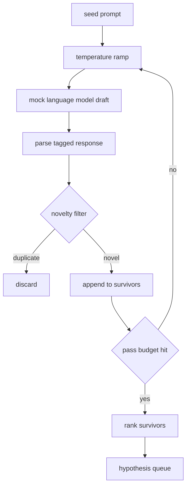

<!-- i18n:manual -->
# Генератор гипотез

> Исследовательский агент, который дважды задаёт один и тот же вопрос, жжёт токены впустую. Весь фокус в том, чтобы каждый следующий черновик приземлялся в новом месте.

**Type:** Build
**Languages:** Python
**Prerequisites:** Phase 19 Track A lessons 20-29
**Time:** ~90 minutes

## Learning Objectives
- Гонять сэмплер от стартового промпта и превращать его выходы в типизированные записи гипотез.
- Поднимать температуру сэмплера на каждом проходе, чтобы следующий черновик уходил дальше от предыдущего.
- Отсеивать почти-дубликаты маленькой embedding-моделью и порогом косинусного расстояния.
- Ранжировать выживших функцией оценки, которая смешивает новизну, конкретность и проверяемость.
- Держать каждый шаг детерминированным, чтобы один и тот же seed всегда давал одну и ту же очередь.

## Why generate, then filter

Планировщик, который спросил модель один раз, получает одну гипотезу. Для учебного примера сойдёт. Для исследовательского цикла форма неправильная. Циклу нужна ранжированная очередь с запасом по глубине: когда первая гипотеза провалится, у прогонщика уже готова следующая, и платить за целый новый проход сэмплирования не надо.

> 🎒 **На пальцах.** Это как список запасных планов на вечер. Один звонок — один вариант, и если друг занят, вечер сорвался. Шесть проходов сэмплера дают шесть гипотез сразу, и провал первой стоит вам ноль дополнительных вызовов модели.

Очередь получается из двух идей. Первая — разгон температуры: каждый проход через сэмплер поднимает температуру на ступеньку, чтобы поздние черновики охотнее уходили в сторону. Вторая — фильтр новизны: после каждого черновика генератор меряет расстояние в пространстве эмбеддингов до всех уже принятых гипотез и выбрасывает всё, что попало внутрь кластера.

> 🎒 **На пальцах.** Две идеи работают в паре, как газ и тормоз. Температура толкает модель в новые места, фильтр новизны проверяет, что она правда туда доехала. Без газа шесть черновиков будут шестью пересказами одной мысли, без тормоза в очередь попадут пять почти одинаковых записей и одна полезная.

Урок поставляется с mock-моделью, которая на фиксированные промпты возвращает заранее прописанные последовательности токенов. Этого хватает, чтобы прогнать весь путь: стартовый промпт на входе, разгон температуры, разбор кандидатов, фильтр новизны, ранжированная очередь на выходе.

## The Hypothesis shape

```text
Hypothesis
  id             : int           (monotonic within a run)
  text           : str           (the claim)
  variables      : list[str]     (what changes between conditions)
  metric         : str           (what the runner will measure)
  baseline_ref   : str | None    (which paper or run the comparison cites)
  draft_pass     : int           (which sampler pass produced this)
  temperature    : float         (the sampler setting at draft time)
  novelty_score  : float         (distance from prior survivors, 0..1)
  rank_score     : float         (weighted sum used for ordering)
```

`variables` и `metric` — не свободный текст. Парсер вытаскивает их из размеченного ответа. Прогонщик из урока пятьдесят два читает эти поля напрямую, когда собирает конфиг эксперимента.

> 🎒 **На пальцах.** Девять полей записи — это контракт между уроками, как накладная между складом и курьером. Урок 50 заполняет `variables` и `metric`, урок 52 читает ровно их и больше ничего не спрашивает. Если парсер оставит `metric` пустым, эксперимент нечего будет измерять — и запись отвалится ещё на входе.

`baseline_ref` необязателен, но желателен. Оценщику из урока пятьдесят три нужна база для сравнения. Если гипотеза её не назвала, оценщик откатывается на предыдущий прогон по той же метрике.

> 🎒 **На пальцах.** Без базы фраза «перплексия 18.4» ничего не значит, как «я пробежал за 25 минут» без дистанции. Поэтому в `testability_score` наличие `baseline_ref` стоит ровно половину балла: с метрикой и базой — 1.0, с одной метрикой — 0.5.

```figure
cg-novelty-ramp
```

## Architecture



Цикл простой. Интересно то, что у каждой коробки на схеме есть жёсткий контракт.

> 🎒 **На пальцах.** Найдите на схеме единственную стрелку назад: от «pass budget hit — no» обратно к разгону температуры. Это и есть весь цикл. При шести проходах по ней пройдут пять кругов, потом ветка «yes» уведёт выживших на ранжирование, и очередь готова.

## Temperature ramp

Стартуем с `t_min`, заканчиваем на `t_max`, шаг `(t_max - t_min) / (n_passes - 1)`. Каждый проход вызывает сэмплер на текущей температуре, и `GeneratorConfig.schedule()` выдаёт `n_passes` равномерно расставленных значений. Mock-модель уважает температуру: она переключается между небольшим набором прописанных ответов по ключу `(prompt, temp_bucket)`. Корзины заданы открытыми интервалами, поэтому маленькое изменение температуры попадает в другую корзину и даёт другой черновик. В проде на месте сэмплера была бы настоящая модель, которой передан `temperature=t`.

> 🎒 **На пальцах.** Подставьте дефолты в формулу шага: (1.2 − 0.2) / (6 − 1) = 0.2. Расписание получается 0.2, 0.4, 0.6, 0.8, 1.0, 1.2 — шесть ровных ступенек. Это как разогрев на плите: сначала аккуратно, потом всё смелее, и каждая ступенька попадает в свою корзину ответов.

Расписание по умолчанию — шесть проходов от `0.2` до `1.2`. Шести хватает, чтобы наполнить очередь и не платить за сэмплы, которые фильтр новизны всё равно отбракует. Ниже `0.2` модель просто пересказывает стартовый промпт. Выше `1.2` ответы уплывают от темы и валят парсер.

> 🎒 **На пальцах.** Границы 0.2 и 1.2 подобраны по двум видам брака, и оба видны на дефолтах. Слишком холодно — черновик почти повторяет seed, и фильтр новизны его убьёт, то есть вызов модели потрачен зря. Слишком горячо — текст не разберёт парсер, и вызов потрачен зря снова. Полезная зона ровно между ними.

## Novelty filter

После разбора очередного черновика генератор строит эмбеддинг текста и сравнивает его с каждой уже принятой гипотезой. Эмбеддинг — маленький хешированный мешок словных токенов, нормированный на единичную длину. Косинусное расстояние между двумя единичными векторами равно `1 - dot(a, b)`. Черновик проходит, если минимальное расстояние до любого предыдущего выжившего больше `novelty_threshold`. По умолчанию — `0.25`.

> 🎒 **На пальцах.** Порог 0.25 в переводе на скалярное произведение значит: `dot(a, b)` должен быть меньше 0.75. Два черновика, у которых три четверти существительных общие, дадут dot около 0.8, расстояние 0.2 — и второй улетит в мусор. Это как редактор, который вычёркивает абзац, если он на три четверти повторяет предыдущий.

Хешированный эмбеддинг — вещь незамысловатая. Зато он детерминированный, тянет ноль зависимостей и ловит очевидный случай: два черновика с почти одинаковым набором существительных. В боевом развёртывании сюда подставили бы небольшую sentence-модель. Интерфейс при этом не меняется.

> 🎒 **На пальцах.** «Мешок слов» буквально означает, что порядок слов выброшен. Для фраз «attention снижает loss» и «loss снижает attention» вектор один и тот же, расстояние 0 — фильтр решит, что это дубликат. Для отсева пересказов это нормально, для тонких различий уже нет, и вот тут в проде появляется настоящая модель.

## Rank score

```text
rank_score = w_novelty * novelty_score
           + w_specificity * specificity_score
           + w_testability * testability_score
```

Три подоценки. `novelty_score` — минимальное расстояние в эмбеддингах до предыдущих выживших. `specificity_score` — количество конкретных переменных в гипотезе, делённое на целевое количество. `testability_score` равен единице, если гипотеза называет и метрику, и базу, половине — если только метрику, и нулю в остальных случаях.

> 🎒 **На пальцах.** Посчитаем одну гипотезу на дефолтных весах 0.4 / 0.3 / 0.3. Новизна 0.5, конкретность 1.0 (все нужные переменные названы), проверяемость 0.5 (метрика есть, база нет). Итог: 0.4 × 0.5 + 0.3 × 1.0 + 0.3 × 0.5 = 0.2 + 0.3 + 0.15 = 0.65. Допишите базовую работу — проверяемость станет 1.0, и балл вырастет до 0.8.

Веса по умолчанию — `0.4`, `0.3`, `0.3`. Они живут в конфиге генератора, чтобы следующий урок мог их подвинуть, не форкая код.

> 🎒 **На пальцах.** Веса — это ваш ответ на вопрос «что мы ценим». Ставьте `w_novelty` в 0.8 — наверх полезут дикие, но неизмеримые идеи. Ставьте `w_testability` в 0.8 — наверх полезет скучное, зато проверяемое. Дефолт 0.4 / 0.3 / 0.3 — компромисс, а не истина, и он специально вынесен в конфиг.

## Mock language model

```python
class MockLLM:
    def sample(self, prompt: str, temperature: float, seed: int) -> str:
        ...
```

Сэмплер детерминирован по тройке `(prompt, temperature, seed)`. Mock хранит таблицу прописанных ответов по ключу `(prompt_signature, temperature_bucket)`. Если записи под ключ нет, сэмплер возвращает заглушку, которая валит парсер. Этот путь отказа проверяется одним из тестов.

> 🎒 **На пальцах.** Детерминизм здесь как рецепт: те же продукты и та же плита — то же блюдо. Одна и та же тройка (промпт, 0.6, seed 42) всегда даёт один и тот же текст, поэтому тест может сравнивать результат побайтово. Настоящая модель на температуре 0.6 давала бы разный текст каждый раз, и тест пришлось бы писать гораздо мягче.

Seed подмешивается в ответ, поэтому одна и та же пара `(prompt, temperature)` с разными seed даёт разные черновики. В тестах seed прибит гвоздями ради воспроизводимости. В настоящем развёртывании seed брался бы из системных часов или из счётчика.

## Output queue

На выходе — список записей `Hypothesis`, отсортированный по `rank_score` по убыванию. Прогонщик из урока пятьдесят два снимает голову очереди, проводит эксперимент, а оценщик из урока пятьдесят три пишет обратно вердикт. Если вердикт говорит, что гипотеза неверна, прогонщик снимает следующую.

> 🎒 **На пальцах.** Очередь работает как стопка резюме, отсортированная по баллу. Взяли верхнее с баллом 0.65, проверили, не подошло — берём следующее с 0.61, и никаких новых вызовов модели. Заново сэмплировать придётся, только когда стопка кончится.

Очередь конечна. Когда она опустела, оркестратор либо расширяет стартовый промпт и запускает генератор снова, либо останавливается и сообщает, что бюджет исчерпан.

## How to read the code

`code/main.py` определяет `Hypothesis`, `MockLLM`, `HypothesisGenerator` и детерминированное демо. У генератора один метод `run(seed_prompt)`, который возвращает отсортированную очередь; число проходов читается из `GeneratorConfig.n_passes`, а не передаётся аргументом. Эмбеддинг — хешированный мешок токенов. Фильтр новизны — одна функция. Оценка ранга — одна функция. От `numpy` не зависит ничего: вся математика эмбеддингов на голой стандартной библиотеке, чтобы урок оставался переносимым.

> 🎒 **На пальцах.** Обратите внимание, что число проходов читается из конфига, а не приходит аргументом в `run`. Это мелочь с большими последствиями: подпись метода одна и та же и для шести проходов, и для двадцати, поэтому оркестратор может менять бюджет, ничего не зная про внутренности генератора.

`code/tests/test_generator.py` покрывает прямой путь, путь отбраковки дубликата, путь падения парсера, границы разгона температуры и порядок ранжирования.

## Where this slots in

Урок пятьдесят производит очередь. Урок пятьдесят один берёт голову очереди и запускает поиск литературы, чтобы подтвердить или опровергнуть гипотезу. Урок пятьдесят два берёт ту же голову и проводит настоящий эксперимент. Урок пятьдесят три читает оба выхода и пишет вердикт. Четыре урока складываются в исследовательский цикл без человека внутри; при этом человек может вмешаться на любой границе.

> 🎒 **На пальцах.** Порядок стадий выбран по цене. Поиск литературы стоит доли секунды, эксперимент — минуты машинного времени. Поэтому сначала дешёвая проверка «а это уже доказали?», и только выжившие гипотезы доходят до запуска сэндбокса. Так же вы сначала гуглите симптом и только потом записываетесь к врачу.
