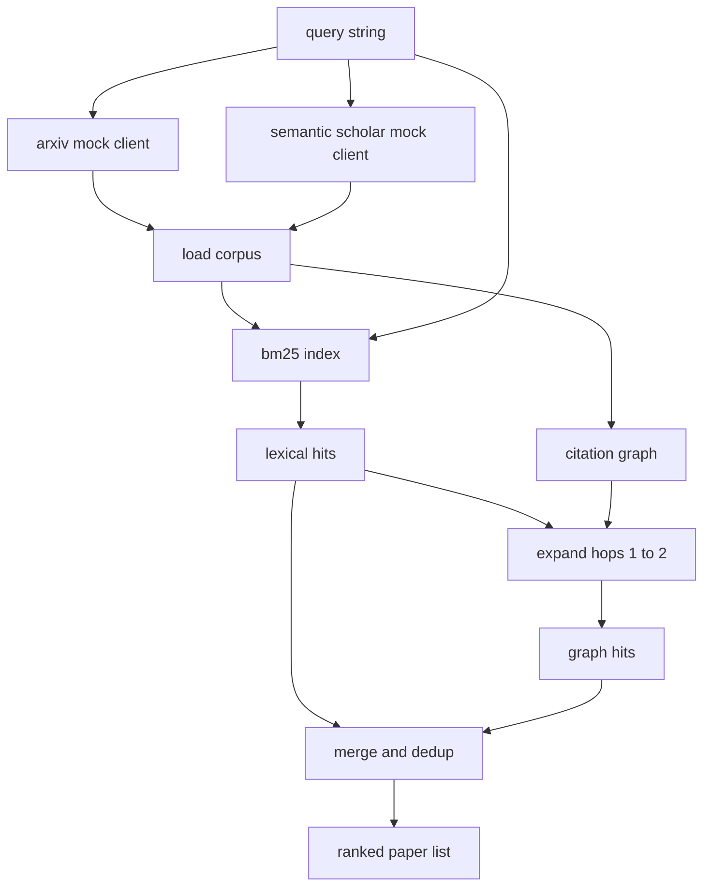

<!-- i18n:manual -->
# Поиск литературы

> Гипотеза стоит дёшево. Дорого стоит знание о том, доказал ли это кто-то до вас. Соберите слой поиска, который отвечает на этот вопрос раньше, чем прогонщик поднимет песочницу.

**Type:** Build
**Languages:** Python
**Prerequisites:** Phase 19 Track A lessons 20-29
**Time:** ~90 minutes

## Learning Objectives
- Описать компактную запись статьи с теми полями, которые цикл будет читать дальше по конвейеру.
- Построить BM25-индекс по аннотациям на одних лишь структурах данных стандартной библиотеки.
- Пройтись по графу цитирований и вытащить статьи, которые словесный поиск пропустил.
- Схлопнуть дубликаты между словесным и графовым проходами по стабильному идентификатору статьи.
- Спрятать два mock-овых внешних API за одним клиентом, чтобы место вызова не поменялось, когда появятся настоящие эндпоинты.

## Why two retrieval passes

Поиск по ключевым словам в аннотациях возвращает статьи, у которых с запросом общий словарь. Это закрывает большую часть поверхности. Но мимо проходят два случая. Первый — когда основополагающая работа пользуется другой лексикой: запрос «sparse attention» не найдёт статью под названием «block selection in transformer routing». Второй — когда нужная работа является продолжением и цитирует известный якорь; дешевле найти якорь и шагнуть вперёд, чем перебирать весь пул аннотаций.

> 🎒 **На пальцах.** Это как искать человека по фамилии и через общих знакомых. По фамилии находится тот, кто записан ровно так; если он сменил фамилию, поиск пуст. Тогда вы идёте к его знакомому и спрашиваете дальше — ровно это и делает обход графа цитирований.

Урок строит оба прохода. BM25 по аннотациям ловит словесные попадания. Обход графа цитирований расширяет стартовый набор вперёд и назад на один-два шага. Объединение схлопывается по идентификатору статьи и ранжируется небольшой комбинированной оценкой.

## The Paper shape

```text
Paper
  id          : str           (stable identifier, "p001" for the mock corpus)
  title       : str
  abstract    : str
  year        : int
  authors     : list[str]
  references  : list[str]     (paper ids this paper cites)
  citations   : list[str]     (paper ids that cite this paper)
  source      : str           (which mock api supplied it, "arxiv" or "s2")
```

Поля references и citations и образуют направленный граф цитирований. Два mock-овых API возвращают пересекающиеся, но не одинаковые наборы полей, поэтому загрузчик корпуса объединяет их по `id`.

> 🎒 **На пальцах.** `references` и `citations` — это одно и то же ребро, прочитанное с двух концов, как «мой отец» и «мой сын». Если статья p007 ссылается на p003, то p003 обязана лежать в `references` у p007 и p007 — в `citations` у p003. Именно поэтому по графу можно ходить в обе стороны одним и тем же обходом.

```figure
cg-citation-hops
```

## Architecture



Клиент поиска владеет обоими проходами и слиянием. Вызывающий отдаёт ему запрос и получает ранжированный список, где у каждой записи есть поля с оценками (`bm25_score`, `graph_distance`, `recency_score`, `final_score`), объясняющие ранжирование.

> 🎒 **На пальцах.** Обратите внимание, что наружу выходят не только итоговые баллы, но и слагаемые. Увидели статью с `final_score` 0.68 и `bm25_score` около нуля — значит, её принёс граф, а не текст. Это как чек в магазине: важна не только сумма, но и строчки, из которых она сложилась.

## BM25 from scratch

Реализация — стандартный Okapi BM25 с параметрами по умолчанию `k1=1.5`, `b=0.75`. Индекс — это два словаря: `term -> doc_frequency` и `term -> list of (doc_id, term_count)`. Длина документа — количество токенов в аннотации. Средняя длина документа считается один раз при постройке индекса. Оценка запроса — сумма по терминам запроса от `idf * tf_norm`, где `tf_norm` — стандартная нормированная по длине частота термина из BM25.

> 🎒 **На пальцах.** Два словаря — это весь индекс, и он устроен как предметный указатель в конце учебника. Слово «attention» → список страниц, где оно встречается, и сколько раз на каждой. Искать по такому указателю в сто раз быстрее, чем листать все сто аннотаций подряд.

Токенизатор делает `lower` и режет по не-буквенно-цифровым символам. Стемминга нет. Боевая система подставила бы сюда небольшой стеммер. Интерфейс при этом не меняется.

> 🎒 **На пальцах.** Отсутствие стемминга означает, что «adapter» и «adapters» для индекса — два разных слова. Запрос про «adapters» просто не увидит статью, где везде написано «adapter». На корпусе из ста статей это переживаемо, на миллионе — уже нет, и стеммер становится обязательным.

```text
idf(t)      = log((N - df + 0.5) / (df + 0.5) + 1.0)
tf_norm(t)  = (f * (k1 + 1)) / (f + k1 * (1 - b + b * dl / avgdl))
score(d, q) = sum over t in q of idf(t) * tf_norm(t)
```

> 🎒 **На пальцах.** Подставьте в формулу idf числа корпуса: N = 100. Слово встречается в 50 аннотациях: log((100 − 50 + 0.5) / 50.5 + 1) = log(2) ≈ 0.69. Слово встречается в 2 аннотациях: log(98.5 / 2.5 + 1) = log(40.4) ≈ 3.7. Редкий термин весит впятеро больше частого — поэтому «distillation» тянет результат, а «model» почти нет.

## Citation graph traversal

Граф строится по корпусу один раз. Рёбра вперёд ведут от статьи к её ссылкам. Рёбра назад ведут от статьи к тем, кто её цитирует. Обход — это поиск в ширину, стартующий от лучших попаданий BM25 и ограниченный двумя шагами.

Два шага — сознательный потолок. Одного мало: агенту часто нужен непосредственный предок или потомок. Три раздувают размер результата на связном графе и уводят от темы. Урок выносит предел по шагам в конфиг, чтобы цикл ниже по конвейеру мог его подкрутить.

> 🎒 **На пальцах.** Прикиньте рост на пальцах. Если у каждой статьи в среднем пять ссылок и пять цитирований, то один шаг от пяти стартовых даёт около 50 кандидатов, два шага — уже около 500, три — 5000 при корпусе всего в 100 статей. Так же растёт список знакомых: друзья друзей — ещё круг общения, друзья друзей друзей — весь город.

## Dedup and ranking

Два прохода возвращают пересекающиеся множества. Слияние идёт по идентификатору статьи. Для каждой статьи итоговый балл — взвешенная смесь.

```text
final_score = w_bm25 * bm25_score_norm
            + w_graph * graph_score
            + w_recency * recency_score
```

`bm25_score_norm` — это балл BM25, делённый на максимальный балл BM25 в слитом наборе (так поле живёт в диапазоне от нуля до единицы). `graph_score` равен единице для прямых словесных попаданий, затем `0.6` за один шаг, `0.3` за два шага и нулю в остальных случаях. `recency_score` — линейный подъём от нуля на минимальном годе корпуса до единицы на максимальном.

> 🎒 **На пальцах.** Соберём один балл целиком на весах 0.5 / 0.3 / 0.2. Статья найдена графом за один шаг: `bm25_score_norm` 0.8, `graph_score` 0.6, корпус с 2018 по 2026, статья 2022 года, значит recency = (2022 − 2018) / (2026 − 2018) = 0.5. Итог: 0.5 × 0.8 + 0.3 × 0.6 + 0.2 × 0.5 = 0.4 + 0.18 + 0.1 = 0.68.

> 🎒 **На пальцах.** Нормализация на максимум нужна потому, что сырые баллы BM25 не имеют потолка: на одном запросе лучший балл 4.2, на другом 19.7. Делим на максимум — и оба превращаются в 1.0, после чего их можно честно складывать с `graph_score` и `recency_score`, которые и так живут в диапазоне от нуля до единицы.

Веса по умолчанию — `0.5`, `0.3`, `0.2`. Веса лежат в конфиге: на устоявшейся теме свежесть можно приглушить, на быстро меняющейся — поднять.

> 🎒 **На пальцах.** Разница видна на одном примере. По теме «BM25» статья 2009 года — классика, и вес свежести 0.2 стоит опустить до 0.05, иначе её задавят свежие пересказы. По теме «агенты на LLM» работа 2021 года устарела почти полностью, и свежесть смело поднимают до 0.4.

## Mock corpus

Корпус — сто статей, порождаемых функцией `build_corpus()`. У каждой статьи написанные вручную заголовок и аннотация по одной из пяти тем: разреженность внимания, дополнение поиском, низкоранговые адаптеры, дистилляция датасетов и обвесы для оценки. Ссылки и цитирования проложены так, что каждая тема образует связный подграф с несколькими межтемными рёбрами.

> 🎒 **На пальцах.** Сто статей на пять тем — это ровно по двадцать на тему. Такой корпус специально сделан «комковатым»: внутри темы всё связано плотно, между темами — пара мостиков. Как районы города с несколькими мостами: обход в ширину внутри района собирает всё быстро, а в соседний район попадает только через мост.

Два mock-овых API-клиента (`ArxivMockClient`, `SemanticScholarMockClient`) читают из одного и того же корпуса, но отдают разные поля. Arxiv возвращает title, abstract, year, authors. Semantic Scholar добавляет references и citations. Клиент поиска объединяет их по id; разбор расхождений в полях между клиентами отложен до следующего урока.

> 🎒 **На пальцах.** Обратите внимание, кто чем полезен: без Semantic Scholar у вас вообще нет графа, потому что Arxiv не отдаёт ни ссылок, ни цитирований. То есть из двух источников один кормит BM25, а второй — обход графа. Уберите второй, и весь второй проход поиска молча выродится в ноль результатов.

## What lessons 52 and 53 read

Прогонщик из урока пятьдесят два читает `paper.id`, `paper.title` и первые три предложения аннотации как контекст для эксперимента. Оценщик из урока пятьдесят три читает `paper.year` и `paper.references`, чтобы привязать базовое сравнение к конкретной статье.

Клиент поиска возвращает `RetrievalResult`, где лежат и ранжированный список, и метрики по запросу: число попаданий, средний балл, лучший балл, суммарное время. Прогонщик их логирует, чтобы дальше по конвейеру наблюдаемость могла построить график качества во времени.

> 🎒 **На пальцах.** Три предложения аннотации — это бюджет контекста, а не каприз. Сто найденных статей по полной аннотации в 200 слов — это 20 000 слов в промпте; по три предложения — примерно 5000. Как в аннотации на обложке книги: чтобы решить, читать ли, хватает нескольких строк.

## How to read the code

`code/main.py` определяет `Paper`, `ArxivMockClient`, `SemanticScholarMockClient`, `BM25Index`, `CitationGraph`, `RetrievalClient` и детерминированное демо. Mock-клиенты и корпус лежат в том же файле, чтобы урок оставался переносимым. Реализация BM25 — один класс на шестьдесят строк. Обход графа — один метод.

`code/tests/test_retrieval.py` покрывает словесный путь, графовый путь, слияние, схлопывание дубликатов и пустой запрос.

> 🎒 **На пальцах.** Пустой запрос стоит в списке тестов не случайно: это классическое место падения. Терминов ноль, значит сумма по терминам пуста, максимальный балл BM25 равен нулю — и нормализация `bm25_score / max_bm25` честно делит на ноль. Такие граничные случаи ловятся одним тестом на три строки.

## Where this slots in

Урок пятьдесят производит гипотезу. Урок пятьдесят один ищет по литературе, не решён ли вопрос уже. Урок пятьдесят два ставит эксперимент, если не решён. Урок пятьдесят три читает и результат поиска, и метрики эксперимента, чтобы написать вердикт. Клиент поиска — самая дешёвая из четырёх стадий, и в оркестраторе он идёт первым.

> 🎒 **На пальцах.** «Самая дешёвая» здесь буквально про деньги и секунды: BM25 по ста аннотациям отрабатывает за миллисекунды и не стоит ничего, а эксперимент занимает минуты процессорного времени. Порядок стадий выбран так, чтобы дорогая работа делалась только над тем, что пережило дешёвую проверку.
