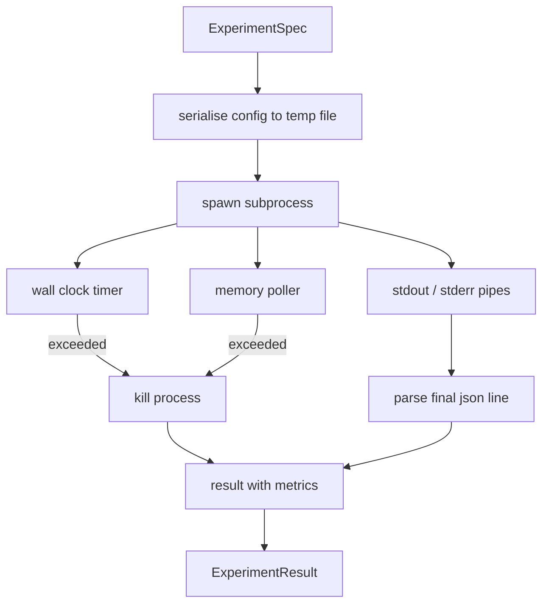

<!-- i18n:manual -->
# Прогонщик экспериментов

> Цикл честен ровно настолько, насколько честны его измерения. Соберите прогонщик, который берёт спецификацию, исполняет её в изолированном подпроцессе и выдаёт json-блоб с метриками, которому оценщик может верить.

**Type:** Build
**Languages:** Python
**Prerequisites:** Phase 19 Track A lessons 20-29
**Time:** ~90 minutes

## Learning Objectives
- Закодировать эксперимент как типизированную спецификацию, которую прогонщик умеет сериализовать в подпроцесс.
- Запускать подпроцесс с жёстким таймаутом по настенным часам и мягким потолком по памяти и выводить оба как терминальные условия.
- Складывать stdout, stderr и структурированный блоб метрик в одну запись результата.
- Строить таблицу абляций, которая крутит по одной ручке конфигурации за раз поверх фиксированной базовой спецификации.
- Держать каждый результат детерминированным при заданном seed, чтобы оценщик видел одни и те же числа от прогона к прогону.

## Why a subprocess

Исследовательский цикл исполняет недоверенный код. Гипотеза пришла из сэмплера, скрипт эксперимента пришёл оттуда же; считать любое из этого безопасным внутри своего процесса — значит напрашиваться на падение, которое утащит с собой оркестратор. Подпроцесс — самая простая изоляция, которая идёт в комплекте с языком: отдельный процесс, независимое адресное пространство, ручка сигнала на стороне родителя.

> 🎒 **На пальцах.** Отдельное адресное пространство — это как готовить на соседней плите, а не в вашей кастрюле. Скрипт может съесть всю свою память, поделить на ноль и упасть с segfault — оркестратор об этом узнает как о коде возврата, а не как о собственной смерти.

Прогонщик из этого урока не реализует полноценную песочницу. Здесь нет ни cgroup, ни фильтра seccomp, ни переназначения пространств имён. Что здесь есть — таймаут по настенным часам, опрашивающий цикл для роста памяти и путь убийства, который прибивает процесс при выходе за любой из лимитов. Это тот рантайм-контракт, который расширяет любая более сложная песочница. Урок держит контракт достаточно маленьким, чтобы прочитать его за один присест.

> 🎒 **На пальцах.** Две ручки — время и память — закрывают два самых частых способа испортить прогон: бесконечный цикл и утечка. Всё остальное (сеть, файлы, права) урок сознательно не трогает. Как ремень и подушка безопасности: они не защищают от всего, но стоят копейки и ловят большинство случаев.

## The ExperimentSpec shape

```text
ExperimentSpec
  spec_id        : str            (stable id, "exp_001")
  hypothesis_id  : int            (link back to the queue from lesson 50)
  script_path    : str            (path to the python script to run)
  config         : dict           (passed to the script as one json arg)
  seed           : int            (deterministic seed for the experiment)
  wall_timeout_s : float          (hard timeout, killed on exceed)
  memory_cap_mb  : int            (soft cap, polled; killed on exceed)
  metric_keys    : list[str]      (which fields the evaluator will read)
```

Скрипт лежит на диске; прогонщик пишет конфиг во временный файл, путь к которому скрипт читает. От скрипта ожидается одна json-строка в stdout, набор ключей которой является надмножеством `metric_keys`. Всё остальное из stdout захватывается, но парсером метрик игнорируется.

> 🎒 **На пальцах.** «Надмножество» здесь важно: скрипт может напечатать двадцать ключей, а прогонщик потребует четыре из `metric_keys` — и это нормально. Не нормально обратное: напечатал три из четырёх — строка не считается блобом метрик, и парсер пойдёт искать дальше. Как чек: лишние строки не мешают, а вот без суммы это не чек.

```figure
cg-runner-limits
```

## Architecture



Прогонщик — один класс с одним главным методом. Опросчик — маленький поток, который просыпается раз в интервал опроса и читает то, что даёт `psutil`-эквивалент, из proc-файловой системы, когда она доступна, и вырождается в no-op на платформах, где такого нет.

> 🎒 **На пальцах.** Посмотрите на схему: к коробке kill ведут ровно две стрелки — от таймера и от опросчика памяти. Это и есть все способы, которыми прогонщик убивает эксперимент по своей инициативе. Всё остальное завершается само, и тогда работает нижняя ветка с разбором json.

## Why a soft memory cap

Жёсткие потолки по памяти требуют `resource.setrlimit` и работают только на POSIX. Урок использует переносимый подход: опрашивать resident set size у платформы и убивать подпроцесс, если он вылез за потолок. Потолок мягкий, потому что у опросчика ненулевой интервал: процесс может подскочить выше потолка между двумя опросами и снова опуститься. Прогонщик записывает максимальный увиденный RSS, чтобы оценщик видел, насколько близко прогон подошёл к лимиту.

> 🎒 **На пальцах.** Мягкость потолка — это ровно про интервал опроса. При опросе раз в 100 мс процесс, который на 30 мс раздулся до 900 МБ при потолке 512 и тут же сдулся, проскочит незамеченным. Как контролёр в электричке: он ходит по вагонам, а не стоит у каждого сиденья, и между обходами возможно всякое.

На системах без поддержки инспекции процессов опросчик один раз пишет предупреждение и выключает себя. Таймаут по настенным часам при этом продолжает действовать. Тесты урока покрывают оба пути.

> 🎒 **На пальцах.** Обратите внимание на выбор: опросчик отключается, но прогон не отменяется. Это осознанная деградация — лучше одна защита из двух, чем ноль. И `peak_rss_mb` в результате станет `None`, что честно говорит оценщику «мы не мерили», а не «памяти ушло ноль».

## Capturing stdout and stderr

Прогонщик читает оба канала, вычерпывая их по завершении. Stdout просматривается построчно; последняя строка, которая разбирается как json со всеми обязательными `metric_keys`, берётся за блоб метрик. Более ранние json-строки сохраняются в результате как `intermediate_metrics`; оценщик может использовать их для кривых обучения.

> 🎒 **На пальцах.** Берётся именно последняя подходящая строка, и это спасает от печати по эпохам. Скрипт напечатал десять json-строк — по одной на эпоху; девять первых уедут в `intermediate_metrics` и дадут кривую обучения, а десятая станет итоговыми метриками. Как в дневнике: оценки за четверть видно все, но в аттестат идёт итоговая.

Stderr захватывается дословно в результат. Прогонщик никогда не бросает исключение на ненулевом коде возврата; вместо этого он записывает код в результат. Любой ненулевой выход помечается как `"crash"`, даже если скрипт успел напечатать метрики, — так оценщик по умолчанию считает частичные прогоны провалом.

> 🎒 **На пальцах.** Правило «упал — значит crash, даже с метриками» защищает от самой опасной ошибки. Скрипт напечатал perplexity 12.1 на пятой эпохе из десяти и умер по нехватке памяти: числа выглядят прекрасно, потому что модель просто недоучилась. Принять их за результат — значит записать в победы недоделанную работу.

## Ablation table

```python
def ablate(base: ExperimentSpec, knob: str, values: list[Any]) -> list[ExperimentSpec]:
    ...
```

По базовой спецификации и имени ручки помощник возвращает по одной спецификации на каждое значение, с переопределённым `config[knob]`. Каждая спецификация получает производный `spec_id` (`f"{base.spec_id}_{knob}_{value}"`). В комплекте идёт `AblationRunner`, который прогоняет их по порядку и возвращает `AblationTable` с ключом по значению ручки.

> 🎒 **На пальцах.** Производный `spec_id` — это самодокументирующееся имя. Из базы `exp_001` и ручки `sparsity` со значениями 0.1, 0.5, 0.9 получаются `exp_001_sparsity_0.1`, `exp_001_sparsity_0.5`, `exp_001_sparsity_0.9`. Через неделю в логах видно, что за прогон, без похода в базу конфигов.

Почему по одной ручке за раз. Полный факторный перебор растёт экспоненциально и выдаёт результаты, которые оценщик не может интерпретировать. Одна ручка за раз даёт чистую ось, которую оценщик может нарисовать. Урок поддерживает многоручечные развёртки только как повторённые одноручечные абляции, склеенные вызывающим.

> 🎒 **На пальцах.** Посчитайте на трёх ручках по четыре значения. По одной за раз: 3 × 4 = 12 прогонов, и каждый график — честная линия «метрика против значения ручки». Полный факторный: 4 × 4 × 4 = 64 прогона, и результат уже не нарисовать одной осью. Дороже в пять раз и понятнее не стало.

## Determinism

Каждая спецификация несёт seed. Прогонщик передаёт seed скрипту через словарь конфига (`config["__seed"] = spec.seed`). Mock-скрипты экспериментов в `code/experiments/` уважают seed и выдают одинаковые метрики от прогона к прогону. Оценщик из урока пятьдесят три на это опирается: без детерминизма «регрессия» может оказаться просто другой случайной инициализацией.

> 🎒 **На пальцах.** Представьте, что оценщик увидел perplexity 18.4 против 18.1 и объявил регрессию. Без фиксированного seed эти 0.3 могли целиком прийти из другого случайного старта весов. С фиксированным seed повторный запуск той же спецификации даёт ровно 18.4, и любое расхождение — настоящее.

## The mock experiment script

Урок поставляется с одним скриптом эксперимента: `code/experiments/sparsity_experiment.py`. Это настоящий скрипт: он читает свой файл конфига, симулирует небольшой тренировочный прогон случайным проходом на numpy и печатает json-блоб метрик. Скрипт уважает ручку `sleep_s` для тестирования таймаутов и ручку `allocate_mb` для тестирования опросчика памяти.

> 🎒 **На пальцах.** Две ручки `sleep_s` и `allocate_mb` — это встроенные кнопки «сломай меня». Ставите `sleep_s` больше `wall_timeout_s` — гарантированно получаете terminal `"timeout"`. Ставите `allocate_mb` больше `memory_cap_mb` — получаете `"oom"`. Без таких кнопок тестировать защиту пришлось бы настоящим бесконечным циклом.

Симуляция ничего настоящего не обучает. Это численные вычисления, повторяющие форму тренировочного цикла: кривая лосса, финальная перплексия, время работы. Смысл урока — прогонщик, а не симуляция. Настоящий скрипт эксперимента импортировал бы модель.

## Result shape

```text
ExperimentResult
  spec_id              : str
  hypothesis_id        : int
  exit_code            : int
  terminal             : "ok" | "timeout" | "oom" | "crash"
  wall_time_s          : float
  peak_rss_mb          : float | None
  metrics              : dict
  intermediate_metrics : list[dict]
  stdout_tail          : str
  stderr_tail          : str
```

Оценщик первым делом читает `metrics` и `terminal`. Если terminal не равен `"ok"`, эксперимент считается провалившимся прогоном и вердикт оценщика выставляется автоматически. Иначе метрики отправляются в проверку значимости.

> 🎒 **На пальцах.** У поля `terminal` ровно четыре значения: `ok`, `timeout`, `oom`, `crash`. Три из них закрывают вопрос без всякой статистики — оценщик даже не смотрит на числа. И только `ok` открывает дорогу к дорогой проверке значимости. Как на входе в самолёт: сначала проверяют посадочный, и только потом занимаются багажом.

## How to read the code

`code/main.py` определяет `ExperimentSpec`, `ExperimentResult`, `ExperimentRunner`, `AblationRunner` и детерминированное демо. Управление подпроцессом — один класс. Опросчик памяти — маленький поток. Помощник абляций — одна функция.

`code/experiments/sparsity_experiment.py` — mock-эксперимент, используемый в тестах. Он читает путь к своему файлу конфига из argv и по завершении пишет одну json-строку с метриками.

`code/tests/test_runner.py` покрывает успешный путь, путь по таймауту, путь падения, таблицу абляций и проверку детерминизма на двух прогонах.

> 🎒 **На пальцах.** Проверка детерминизма устроена буквально так: запустить одну и ту же спецификацию дважды и сравнить словари метрик на равенство. Если в скрипт просочился незасеянный `random` или время, тест упадёт на первом же прогоне пары. Три строки теста ловят класс ошибок, который иначе выстрелил бы через месяц в уроке пятьдесят три.

## Where this slots in

Урок пятьдесят порождает гипотезу. Урок пятьдесят один отсеивает всё, что литература уже решила. Урок пятьдесят два ставит эксперимент по тому, что осталось. Урок пятьдесят три читает результат, проводит проверку значимости и пишет вердикт, который оркестратор сохраняет против идентификатора гипотезы.

> 🎒 **На пальцах.** Поле `hypothesis_id` есть и в спецификации, и в результате — это ниточка, которая связывает всю цепочку. Гипотеза №7 из урока 50 становится `exp_001` с `hypothesis_id: 7`, и вердикт урока 53 ложится обратно к записи №7. Без такой сквозной нитки после сорока прогонов вы не соберёте, какой результат к какой идее относится.
