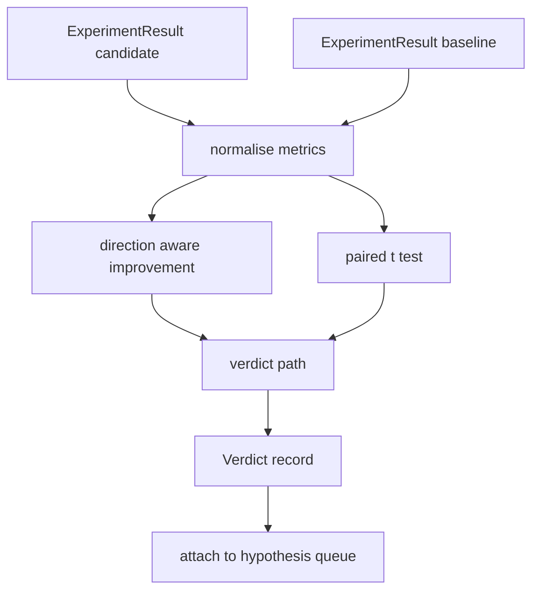

<!-- i18n:manual -->
# Оценка результата

> Раннер выдал числа. Оценщик решает, улучшение это, регрессия или шум. Постройте путь до вердикта, который превращает метрики в вывод длиной в одну строку.

**Type:** Build
**Languages:** Python
**Prerequisites:** Phase 19 Track A lessons 20-29
**Time:** ~90 minutes

## Learning Objectives
- Сравнивать прогон-кандидат с базовым, учитывая направление метрики и фиксированный порог.
- Считать парный t-тест с нуля по метрикам каждого сида и читать получившееся p-значение.
- Нормализовать метрики в логарифмической шкале, чтобы отчёт ниже по потоку смешал их с линейными.
- Выдавать по каждой гипотезе вердикт, который оркестратор прицепит к очереди из урока пятьдесят.
- Держать каждый шаг чистым: одни и те же входы всегда дают один и тот же вердикт.

## Why a paired test

Одно число от раннера не говорит, настоящее ли изменение. Та же конфигурация с другим сидом даёт другую перплексию. Изменение может оказаться шумом. Правильное сравнение — парное: те же сиды на тех же данных, один прогон с кандидатом и один с базой. Каждый сид даёт свою разницу. Среднее этих разниц — эффект. Стандартная ошибка этих разниц — уровень шума.

> 🎒 **На пальцах.** Это как сравнивать двух бегунов: нечестно мерить одного в дождь, а другого в сушь. Парный тест ставит их на одну дорожку — сид 0 против сида 0, сид 1 против сида 1 — и смотрит на разницу внутри каждой пары. Погода сокращается, остаётся эффект самого изменения.

Урок реализует тест с нуля. Никакого `scipy.stats`. Математика умещается в один экран.

```text
diffs    = [a_i - b_i for i in seeds]
mean     = sum(diffs) / n
variance = sum((d - mean) ** 2 for d in diffs) / (n - 1)
t_stat   = mean / sqrt(variance / n)
df       = n - 1
p_value  = two_sided_p(t_stat, df)
```

> 🎒 **На пальцах.** Подставьте числа: пусть на четырёх сидах разницы вышли -0.4, -0.3, -0.5 и -0.2. Среднее равно -0.35, дисперсия по формуле выше примерно 0.0167, значит sqrt(0.0167 / 4) ≈ 0.065 и t ≈ -5.4 при df = 3. Такое t далеко за пределами шума — эффект настоящий.

Двустороннее p-значение считается через регуляризованную неполную бета-функцию. В уроке лежит маленькая реализация на цепной дроби Лентца. Всё вместе — шестьдесят строк математики на stdlib.

> 🎒 **На пальцах.** Бета-функция здесь — просто калькулятор, который переводит t = -5.4 и df = 3 в вероятность «а могло ли так совпасть случайно». Пусть название не пугает: в коде это одна функция без зависимостей, и её единственная работа — вернуть одно число от 0 до 1.

## Direction aware improvement

У одних метрик лучше значит больше (accuracy, throughput). У других лучше значит меньше (loss, perplexity, время работы). Оценщик носит на каждой метрике поле `direction`.

```text
if direction == "higher_is_better":
    improvement = (candidate - baseline) / abs(baseline)
elif direction == "lower_is_better":
    improvement = (baseline - candidate) / abs(baseline)
```

Улучшение знаковое. Отрицательное улучшение на метрике «больше — лучше» значит, что кандидат хуже. Путь до вердикта читает знак и величину вместе.

> 🎒 **На пальцах.** Проверьте на числах: база accuracy 0.80, кандидат 0.84 — улучшение (0.84 - 0.80) / 0.80 = 0.05, плюс пять процентов. Та же пара чисел для loss читается наоборот: (0.80 - 0.84) / 0.80 = -0.05, то есть стало хуже. Числа одни и те же, знак разный — всё решает поле direction.

Плоский порог (`improvement_threshold=0.02`, два процента) решает, достаточно ли изменение велико, чтобы о нём вообще говорить. Ниже порога вердикт «noise» независимо от p-значения; циклу неинтересны изменения, которых пользователь не почувствует.

> 🎒 **На пальцах.** Два порога делают разную работу, и путать их нельзя. p-значение отвечает на вопрос «уверены ли мы, что разница есть», а порог в 2% — на вопрос «есть ли нам до неё дело». Прирост в 0.3% бывает железно значимым на сотне сидов и при этом совершенно бесполезным.

```figure
cg-paired-verdict
```

## Architecture



Оценщик выполняет три независимых вычисления и сводит их в пути до вердикта. Каждое вычисление — чистая функция без общего состояния.

> 🎒 **На пальцах.** Смотрите на схему как на конвейер: нормализация стоит первой, потому что и улучшение, и t-тест обязаны работать с одинаково подготовленными числами. Дальше две ветки друг про друга не знают, поэтому их можно тестировать по отдельности; сходятся они только в квадратике verdict path.

## Log normalisation

Перплексия экспоненциальна по лоссу. Падение лосса на 0.1 — это гораздо большее падение перплексии. Сравнивать перплексию напрямую между двумя конфигурациями нормально, но смешивать её с линейными метриками в одном отчёте можно только после нормализации.

Урок нормализует любую метрику, у которой поле `scale` равно `"log"`, беря натуральный логарифм перед вычислением улучшения. Порог тогда применяется в логарифмическом пространстве. Падение перплексии с 32 до 28 — это `log(28) - log(32) = -0.133` на метрике «меньше — лучше», что заметно выше порога в два процента.

> 🎒 **На пальцах.** Логарифм тут работает переключателем шкалы: вместо «на сколько единиц упало» он меряет «во сколько раз упало». 28 к 32 — это падение примерно на 12.5%, и логарифм честно возвращает 0.133. А голая разница 32 - 28 = 4 сама по себе не значит ничего, пока вы не знаете, от чего эти четыре.

```text
if scale == "log":
    a = log(candidate)
    b = log(baseline)
else:
    a = candidate
    b = baseline
```

Метрики со `scale="linear"` (значение по умолчанию) пропускают преобразование. Одна и та же ветка кода обрабатывает оба случая.

> 🎒 **На пальцах.** Обратите внимание, что весь «сложный» логарифмический режим — это четыре строки и одно условие. Ниже по коду не меняется ничего: улучшение, t-тест и порог видят просто числа a и b и не знают, логарифмы это или нет.

## Per seed paired test

Раннер из урока пятьдесят два выдаёт один финальный блоб метрик на прогон. Для парного теста оценщику нужен один блоб на сид для кандидата и один на сид для базы. Оркестратор гоняет один и тот же эксперимент в обеих конфигурациях по списку сидов и отдаёт оценщику два списка записей `ExperimentResult`.

Оценщик спаривает их по сиду (сид лежит в `result.metrics["seed"]`) и проходит по запрошенной метрике. Если сиды в двух списках не совпадают, оценщик бросает `PairingError`. Оркестратору следует перезапустить прогон.

> 🎒 **На пальцах.** Спаривание по сиду — это сверка двух ведомостей по номерам, а не по порядку строк. Если кандидат отработал сиды 0, 1, 2, а база — 0, 2, 3, то тихое сравнение построчно поставит сид 1 против сида 2 и выдаст чушь. Поэтому здесь исключение, а не «как-нибудь подгоним».

## The Verdict shape

```text
Verdict
  hypothesis_id          : int
  metric                 : str
  direction              : "higher_is_better" | "lower_is_better"
  scale                  : "linear" | "log"
  candidate_mean         : float
  baseline_mean          : float
  improvement            : float       (signed, fraction; see direction rules)
  p_value                : float | None  (None if n < 2)
  significance_threshold : float
  improvement_threshold  : float
  verdict                : "improved" | "regressed" | "noise" | "failed"
  rationale              : str
```

Путь до вердикта — маленькая таблица решений:

> 🎒 **На пальцах.** Заметьте строку `p_value : float | None` и приписку «None при n < 2». На одном сиде разброс мерить не из чего: у единственной разницы нет стандартной ошибки. Оценщик честно возвращает None, а правило номер три ниже превращает такой прогон в «noise».

```text
1. If any candidate result has terminal != "ok": verdict = "failed"
2. else if |improvement| < improvement_threshold:  verdict = "noise"
3. else if p_value is None or p_value > significance: verdict = "noise"
4. else if improvement > 0:                          verdict = "improved"
5. else:                                             verdict = "regressed"
```

Rationale — одна человекочитаемая строка, которую оркестратор запишет в лог напротив идентификатора гипотезы.

> 🎒 **На пальцах.** Порядок пунктов в таблице — не украшение, а логика. Сначала отсекаются упавшие прогоны (сравнивать нечего), потом слишком маленькие изменения (нам всё равно), потом незначимые (могло совпасть), и только двумя последними строками решается знак. Переставьте пункты 1 и 2 — и упавший прогон с крошечной разницей уедет в «noise» вместо «failed».

> 🎒 **На пальцах.** Rationale — это то, что вы прочитаете в логе через месяц. Строчка вида «improvement -0.133 at p=0.004, threshold 0.05: improved» сразу отвечает на вопрос «почему так решили», без раскопок в числах. Одна строка на гипотезу стоит копейки, а экономит вечер.

## How to read the code

`code/main.py` определяет `MetricSpec`, `Verdict`, `Evaluator`, помощников для t-статистики и неполной бета-функции и детерминированное демо. t-тест написан на чистой математике из stdlib; numpy нужен только чтобы прочитать список метрик и посчитать средние с дисперсиями.

`code/tests/test_evaluator.py` покрывает путь improved, путь regressed, путь noise (маленькое улучшение), путь noise (мало n), путь failed по терминальному статусу, путь с логарифмической нормализацией, t-тест против известного эталонного значения и ошибку спаривания.

> 🎒 **На пальцах.** Восемь тестов — это ровно по одному на каждую ветку таблицы решений плюс проверка самой математики и ошибка спаривания. Такой список пишется не после кода, а прямо по таблице: каждая строка правила становится одним тестом в файле.

## Where this slots in

Урок пятьдесят выдал очередь гипотез. Урок пятьдесят один отсеял всё, что литература уже закрыла. Урок пятьдесят два прогнал эксперимент в конфигурациях кандидата и базы по сидам. Урок пятьдесят три читает эти прогоны и пишет вердикт. Оркестратор сшивает четвёрку вместе:

```text
for hypothesis in queue:
    literature = retrieval.search(hypothesis.text)
    if literature_settles(hypothesis, literature):
        attach(hypothesis, verdict="settled")
        continue
    candidates = runner.run_all(specs_for(hypothesis))
    baselines  = runner.run_all(baseline_specs_for(hypothesis))
    metric_spec = MetricSpec("perplexity", direction=LOWER, scale=LOG)
    verdict = evaluator.evaluate(hypothesis.id, metric_spec, candidates, baselines)
    attach(hypothesis, verdict)
```

Этого оркестратора в уроке нет; четыре урока складываются в него без всякого клея, кроме датаклассов, которые каждый из них уже определил.

> 🎒 **На пальцах.** Прочитайте цикл сверху вниз — это весь исследовательский конвейер в двенадцать строк: гипотеза, поиск по литературе, ранний выход через `continue`, два прогона (кандидат и база), вердикт, запись. Ни одна из четырёх частей не знает про остальные, они разговаривают только датаклассами.
