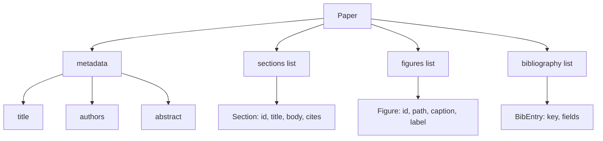
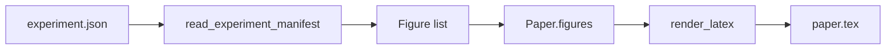
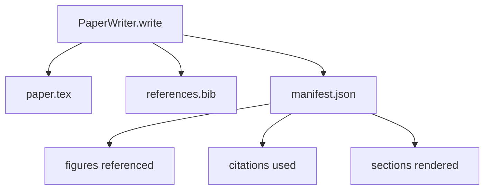

<!-- i18n:manual -->
# Написание статьи

> Скелет LaTeX — это контракт между исследователем и вёрсткой. Нарушите контракт — документ не соберётся, и провал будет громким. Сперва стройте скелет, потом заполняйте.

**Type:** Build
**Languages:** Python
**Prerequisites:** Phase 19 lessons 50-53
**Time:** ~90 minutes

## Learning Objectives

- Относиться к научной статье как к структурному артефакту с известным графом разделов, а не к свободному тексту.
- Генерировать скелет LaTeX, который объявляет аннотацию, разделы, слоты под рисунки и ключи библиографии до того, как написана хоть строчка прозы.
- Вставлять рисунки из выходов эксперимента (пути и подписи) в скелет через детерминированный механизм слотов.
- Подключать замоканный генератор прозы, который заполняет каждый раздел по структурированному плану, чтобы обвес тестировался без модели.
- Выдавать один `paper.tex` плюс `references.bib` плюс манифест, где перечислен каждый упомянутый рисунок и каждая использованная цитата.

```figure
ch-paper-skeleton
```

## Why a skeleton first

Черновик, который начинается с прозы, копит структурный долг. Введение обрастает тремя абзацами, чьё место в разделе про смежные работы. На рисунок ссылаются раньше, чем его определили. В библиографии оказываются три ключа на одну и ту же статью. К моменту, когда автор это замечает, переписать стоит дороже, чем написать.

> 🎒 **На пальцах.** Структурный долг — тот же технический долг, только в тексте. Три ключа на одну статью выглядят безобидно, пока рецензент не спросит, почему одна работа процитирована трижды под разными именами. Чинить это в готовом тексте — значит трогать все места, где стоят ссылки.

Скелет переворачивает картину. Структура объявлена сразу как данные. Разделы — это слоты с именами и порядком. Рисунки — слоты с идентификаторами и подписями. Ключи библиографии объявлены сверху вместе с записями, на которые они указывают. Проза генерируется в эти слоты по одной штуке. Обвес умеет проверить ещё до написания первой строчки прозы, что у каждого рисунка есть слот, у каждой цитаты — запись, а каждый раздел попал в оглавление.

> 🎒 **На пальцах.** Это как разложить пустые коробки с подписями до переезда, а не искать место для чайника с чайником в руках. Проверка «у каждой цитаты есть запись» на пустом скелете стоит миллисекунды и один проход по списку ключей, а на готовом тексте её пришлось бы делать разбором LaTeX.

Ровно эту же дисциплину предыдущие уроки применяли к планам, вызовам инструментов и трассам. Структура и есть контракт.

> 🎒 **На пальцах.** Заметьте повторяющийся приём курса: сначала типизированная форма, потом содержимое. У плана это шаги со статусами, у вызова инструмента — схема аргументов, у трассы — поля события. Статья ничем не отличается: тот же ход, только вместо шага плана — раздел.

## The Paper shape



Каждое поле — обычные данные Python. Рендерер — чистая функция из `Paper` в строку LaTeX. Обвес умеет заглянуть в статью до рендера: посчитать разделы, перечислить недостающие файлы рисунков, проверить, что у каждого `\cite{key}` есть подходящая `BibEntry`.

> 🎒 **На пальцах.** Смотрите на дерево как на оглавление, только машиночитаемое: у Paper четыре ветки — метаданные, разделы, рисунки, библиография. Проверка «нет ли цитаты без записи» — это сравнение двух множеств строк из двух веток, десяток строк кода и ни одного регулярного выражения по тексту.

## The render contract

Рендерер гарантирует три свойства. Первое: каждый слот рисунка в скелете выдаёт блок `\begin{figure}` со стабильной меткой вида `fig:<id>`. Второе: каждый раздел выдаёт `\section{}` со стабильной меткой вида `sec:<id>`, чтобы работали перекрёстные ссылки. Третье: библиография выдаёт блок `\bibliography`, чей `references.bib` содержит ровно объявленные на статье записи, ни одной лишней и ни одной пропущенной.

> 🎒 **На пальцах.** «Стабильная метка» значит, что идентификатор считается из данных, а не придумывается на ходу: раздел с id `method` всегда получит `sec:method`, в первом прогоне и в сотом. Именно поэтому ссылка `\ref{sec:method}`, написанная в другом разделе, не разъедется после перегенерации.

Нарушение любого из трёх — ошибка рендера, а не предупреждение. Скелет и есть контракт; рендер, который молча выкинул рисунок, контракт ломает.

> 🎒 **На пальцах.** Разница между warning и ошибкой тут практическая. Предупреждение уедет в лог, статья соберётся, и вы увидите пропажу рисунка на странице PDF за час до дедлайна. Исключение падает сразу, на секунде рендера, и показывает, какой именно слот остался пустым.

## Figure injection from experiments

Предыдущие уроки этого трека выдавали выходы экспериментов в виде JSON-манифестов. В каждом манифесте есть список артефактов с путями и короткими подписями. Пишущий статью читает этот манифест и делает записи `Figure`.



Вставка детерминированная. Идентификаторы рисунков собираются из имени эксперимента плюс монотонный счётчик. Подписи берутся из манифеста. Пути нормализуются относительно выходного каталога статьи, чтобы LaTeX собирался даже тогда, когда выходы эксперимента лежат совсем в другом месте диска.

> 🎒 **На пальцах.** «Имя эксперимента плюс счётчик» даёт `lr-sweep-1`, `lr-sweep-2`, `lr-sweep-3` — и завтра на тех же данных получатся ровно те же три имени. Если бы id брались из времени или из случайного числа, каждая перегенерация ломала бы все ссылки `\ref{fig:...}` в тексте.

## The mocked prose generator

Урок не вызывает модель. `MockProseGenerator` читает форму плана и детерминированно выдаёт прозу. Форма плана — одна короткая строка на раздел. Генератор разворачивает эту строку в два коротких абзаца с вплетённым заголовком раздела. Сгенерированная проза упоминает рисунки и цитаты ровно тогда, когда план их объявляет.

> 🎒 **На пальцах.** Мок здесь не бедный родственник настоящей модели, а инструмент отладки: он бесплатный, мгновенный и всегда одинаковый. Если тест упал, вы точно знаете, что виноват обвес, а не то, что модель сегодня написала другой абзац.

Этого хватает, чтобы протестировать всё поведение писателя. Настоящая реализация подменит генератор вызовом модели. Обвес вокруг него не изменится. В этом и ценность объявления генератора прозы как вызываемого объекта: в тестах подставляется детерминированный, в проде — модельный, остальной конвейер идентичен.

> 🎒 **На пальцах.** «Вызываемый объект» тут значит одно: писатель знает только сигнатуру «дай план — верни текст». Ему всё равно, что за ней — три строки форматирования или запрос к API за секунду и полцента. Поменять одно на другое — одна строка при сборке объекта.

## The manifest output

Писатель кладёт в выходной каталог три файла.



Манифест — это то, что читает оценщик или цикл критика ниже по потоку. Он не разбирает LaTeX; он читает манифест. Следующий урок, цикл критика, берёт этот манифест на вход и выдаёт список замечаний. Поэтому в контракт входит манифест, а не LaTeX.

> 🎒 **На пальцах.** Представьте, что критику пришлось бы вылавливать рисунки из `.tex` регуляркой: одна лишняя фигурная скобка или закомментированный блок — и счёт поехал. Манифест уже содержит готовый список: три рисунка, семь цитат, пять разделов. Читать JSON — это одна строка кода, разбирать LaTeX — вечная гонка с исключениями.

## Validation gates

Писатель прогоняет четыре калитки до того, как запишет хоть один файл.

1. Каждый идентификатор рисунка уникален внутри статьи.
2. Поле `cites` каждого раздела ссылается на ключ библиографии, объявленный на статье.
3. Аннотация непуста.
4. Заголовок непуст.

> 🎒 **На пальцах.** Все четыре проверки — это счёт и сравнение множеств, ни одна не требует модели. Уникальность id рисунков ловится сравнением `len(ids)` и `len(set(ids))`: было пять рисунков, уникальных четыре — значит, кто-то продублировал слот, и `\ref` уехал бы не туда.

Провалившаяся калитка бросает `PaperValidationError` с точной причиной. Обвес показывает эту причину как режим отказа. Частичной записи не бывает: либо выдаются все три файла, либо ни одного.

> 🎒 **На пальцах.** «Либо все три, либо ни одного» спасает от самого мерзкого состояния — каталога, где `paper.tex` новый, а `references.bib` от прошлого прогона. Такой полурезультат собирается, выглядит рабочим и врёт. Проверить всё до первой записи дешевле, чем потом откатывать.

## How to read the code

`code/main.py` определяет `Paper`, `Section`, `Figure`, `BibEntry`, `PaperValidationError`, `MockProseGenerator`, `PaperWriter` и функцию `render_latex`. Метод `write` принимает выходной каталог и выдаёт `paper.tex`, `references.bib` и `manifest.json`. Помощник `read_experiment_manifest` превращает список манифестов эксперимента в записи `Figure`.

`code/tests/test_paper_writer.py` покрывает: рендер скелета без разделов, полный рендер с двумя разделами и двумя рисунками, калитку недостающей цитаты, калитку дублирующегося идентификатора рисунка, содержимое манифеста и контракт на строку LaTeX (каждый раздел даёт `\section{}`, каждый рисунок даёт `\begin{figure}`).

> 🎒 **На пальцах.** Шесть тестов делятся на три пары: два на рендер (пустой и полный), два на калитки (нет цитаты, дубль id), два на выход (манифест и строка LaTeX). Пустой случай в таком списке не формальность — именно он ловит рендерер, который падает, когда разделов ноль.

## Going further

Два расширения, которые захочет настоящая реализация. Первое: рендер в несколько форматов — та же форма `Paper` собирается в Markdown для блога и в HTML для превью. Рендерер становится стратегией на `Paper`. Второе: обогащение цитат — писатель тянет записи BibTeX по ключу цитаты, имея локальный кэш DOI. Оба полезны, оба добавляются без единого касания контракта скелета.

Ставка сделана на скелет. Разделы, рисунки и цитаты объявлены как данные, проза генерируется в слоты, манифест выдаётся рядом с LaTeX. Любое другое улучшение прикладывается сверху.

> 🎒 **На пальцах.** Проверьте расширения на прочность сами: чтобы отдать статью в Markdown, нужна ли новая структура данных? Нет — те же разделы, рисунки и ключи, другой шаблон вывода. Это и есть признак того, что контракт выбран верно: новые фичи меняют рендерер, а не форму.
