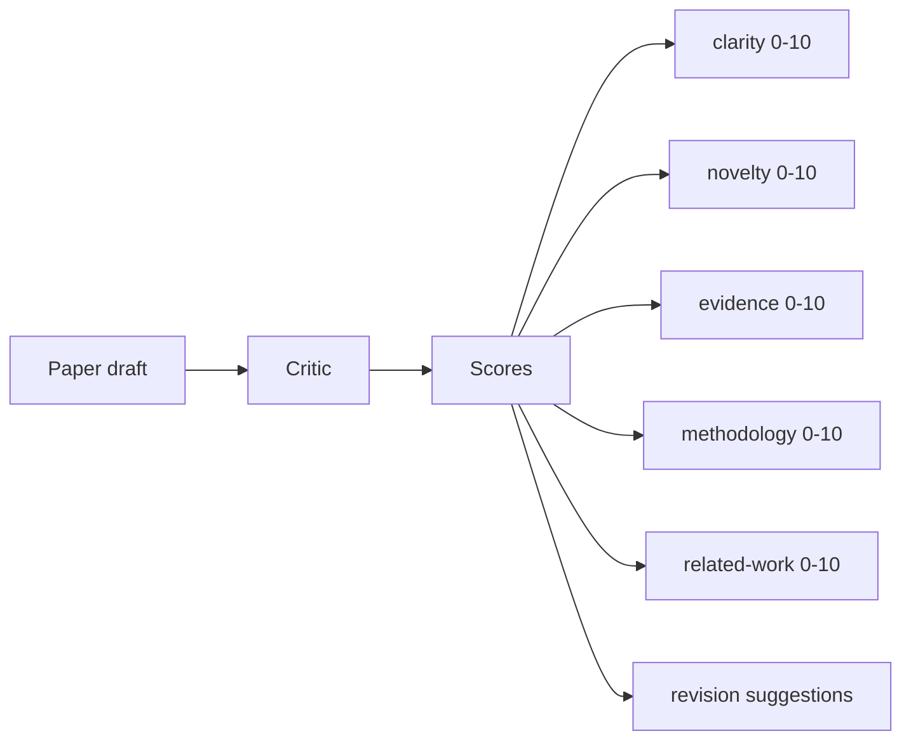
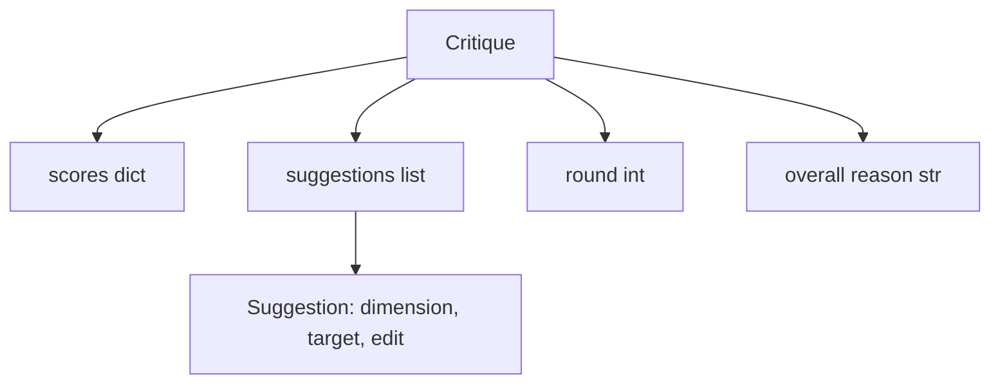
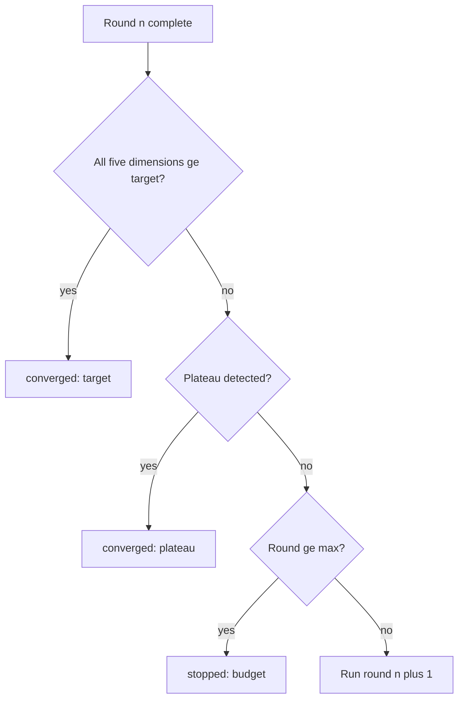
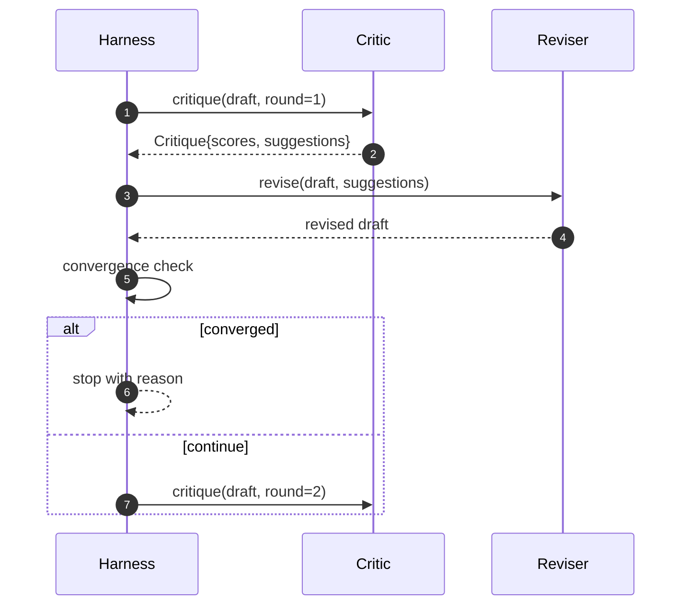

<!-- i18n:manual -->
# Цикл критика

> Критик, который с первого раза отвечает «всё хорошо», сломан. Критик, который всегда отвечает «надо доработать», сломан тоже. Интересен тот, который сходится, а сходимость приходится проектировать.

**Type:** Build
**Languages:** Python
**Prerequisites:** Phase 19 lessons 50-53
**Time:** ~90 minutes

## Learning Objectives

- Оценивать черновик статьи по пяти фиксированным измерениям: clarity, novelty, evidence, methodology, related-work.
- Применять рецензию каждого раунда как структурированный диф правок, а не как вольное переписывание.
- Ловить сходимость сравнением оценок между раундами; останавливаться на плато, на достигнутой цели или на исчерпанном бюджете.
- Ограничивать число раундов бюджетом итераций, чтобы несходящийся критик не крутился вечно.
- Выдавать трассу по раундам, чтобы дашборд или следующий этап нарисовали траекторию оценок.

```figure
ch-critic-converge
```

## Why five fixed dimensions

Вольный критик — это модель, которая возвращает абзац предложений. Правка следующего раунда воспринимает этот абзац как фоновый контекст. Учла ли переписанная версия замечание — проверить невозможно, потому что у замечания никогда не было структуры.

> 🎒 **На пальцах.** Сравните два отзыва учителя: «работа сыровата, поработай над аргументацией» и «за структуру 6, за источники 4, добавь ссылку в третий абзац». Первый нельзя проверить в следующем черновике, второй проверяется числом и адресом. Весь урок — про переход от первого ко второму.

Пять измерений дают обвесу контракт.



Оценка — это вектор. Обвес следит за каждым измерением по раундам. Правка, которая подняла clarity, но обвалила evidence, — это регрессия по evidence, и проверка сходимости её увидит. Критик из одной только модели такой гарантии не даст.

> 🎒 **На пальцах.** Вот почему одно среднее число обманывает: было (7, 7, 7, 7, 7), стало (9, 9, 3, 7, 7). Сумма в обоих случаях 35, среднее ровно 7.0 и там и там — а evidence обвалился с 7 до 3. Вектор эту дыру показывает, среднее её прячет.

## The Critique shape



Каждое предложение несёт измерение, которое оно улучшает, раздел, на который нацелено, и инструкцию `edit`, которую применит правщик. Правщик тоже вызываемый объект. Урок поставляет детерминированного правщика, который трактует инструкцию как операцию «дописать в раздел». Правщик на модели прочитал бы то же поле как промпт. Контракт не меняется.

> 🎒 **На пальцах.** Три поля предложения отвечают на три вопроса: что чиним (dimension), где чиним (target) и что делаем (edit). Уберите target — и правка поедет не в тот раздел; уберите dimension — и вы не сможете проверить, поднялась ли именно та оценка, ради которой предложение появилось.

## Convergence rules, in order

Цикл критика завершается, когда сработало любое из трёх условий.



Цель — самый строгий случай: каждое из пяти измерений (clarity, novelty, evidence, methodology, related_work) обязано дотянуть до `>= target_score` (по умолчанию `8.0`), прежде чем цикл вернёт успех. Высокое среднее с одним слабым измерением не считается. Детектор плато сравнивает среднее текущего раунда со средним предыдущего. Если прирост держится ниже `plateau_epsilon` (по умолчанию `0.1`) два раунда подряд, цикл выходит с `plateau`. Бюджет — жёсткий потолок по раундам (по умолчанию `5`), выход с `budget`.

> 🎒 **На пальцах.** Посчитайте на примере: (9, 9, 9, 9, 7) даёт среднее 8.6, но цикл не остановится, потому что последнее измерение ниже 8.0. А (8, 8, 8, 8, 8) со средним ровно 8.0 остановится сразу. Правило смотрит на минимум по вектору, а не на среднее.

Порядок важен. Цель бьёт плато, плато бьёт бюджет. Если третий раунд попадает в цель на той же итерации, где сработало бы и плато, результат будет `target`, а не `plateau`.

> 🎒 **На пальцах.** Разница только в названии, но название читает человек. `target` значит «дошли, куда хотели», `plateau` — «дальше не растёт, но и цели нет», `budget` — «кончились деньги, качество неизвестно». Перепутайте приоритет — и удачный прогон будет годами выглядеть в логах как упёршийся в потолок.

## Why plateau detection runs over two rounds

Плато за один раунд — это шум. Настоящий критик выдаёт на каждой итерации слегка разные оценки даже на неизменном черновике, потому что детерминированная оценка всё равно зависит от того, какие предложения были применены и в каком порядке. Требование двух подряд плоских раундов этот шум отфильтровывает. Если обвес доложил о плато, черновик действительно перестал улучшаться.

> 🎒 **На пальцах.** Представьте средние по раундам: 7.0, 7.4, 7.45, 7.9. Прирост на третьем раунде — 0.05, ниже epsilon 0.1, и по правилу одного раунда цикл бы тут остановился, потеряв скачок до 7.9. Требование двух подряд как раз и спасает от такой преждевременной сдачи.

## The deterministic critic in this lesson

Урок не вызывает модель. Поставляемый критик — вызываемый объект, который оценивает черновик по трём сигналам: средняя длина тела раздела (clarity), количество рисунков и цитат (evidence) и поле `originality_tag` в метаданных статьи (novelty). Правщик знает, как толкнуть каждую оценку вверх.

> 🎒 **На пальцах.** Обратите внимание, что все три сигнала — это счёт, а не мнение: длина, штуки, значение поля. Такой критик стоит ноль вызовов модели и всегда даёт один и тот же ответ на один и тот же вход, а значит, тест может утверждать «оценка выросла» и не быть флаки.

```text
clarity      grows when the average section body length increases
novelty      grows when originality_tag is set to "high"
evidence     grows when a section's figure_refs is non-empty
methodology  grows when a section titled "Method" exists with body
related-work grows when a section titled "Related Work" exists with body
```

Правщик трактует каждое предложение как точечное дописывание. После первого раунда обвес видит, как оценка ползёт вверх. Тесты используют это свойство, чтобы утверждать: цикл сокращает разрыв.

> 🎒 **На пальцах.** Прочитайте пять строк выше как список рычагов: чтобы поднять methodology, достаточно завести раздел с заголовком «Method» и непустым телом. В игрушке это честное правило, в жизни — карикатура; и именно поэтому критик на этих правилах годится для тестов обвеса, но не для оценки настоящей статьи.

## The full loop contract



Обвес владеет счётчиком раундов, трассой и проверкой сходимости. Критик владеет оценкой. Правщик владеет дифом. Ни один из трёх не трогает состояние остальных.

> 🎒 **На пальцах.** Разделение как на кухне ресторана: один пробует, второй готовит, третий следит за временем и решает, подавать ли. Если бы критик сам крутил счётчик раундов, он мог бы поставить себе «сошлось» и выйти; отдельный обвес это исключает.

## The Trace output

Каждый раунд выдаёт одно событие трассы с номером раунда, вектором оценок, количеством предложений и вердиктом сходимости. Полная трасса возвращается вместе с финальным черновиком. Дашборд ниже по потоку нарисует график «оценка по раундам». Следующий урок, планировщик итераций, читает трассу, чтобы решить, стоит ли держаться за эту ветку.

> 🎒 **На пальцах.** Четыре поля на раунд — это примерно строчка JSON, то есть пять строк на весь прогон. За такую цену вы получаете ответ на вопрос «а что вообще происходило», и не надо запускать пять раундов заново, чтобы это узнать.

## Budgets that protect against bad critics

Критик, чьи предложения никогда не поднимают оценку, загонит цикл прямо в потолок итераций. Трасса делает это видимым: пять раундов, оценки плоские, вердикт `budget`. Пользователь читает это как баг критика, а не как проблему черновика. Альтернатива — показывать только финальный черновик — прячет диагноз. Дизайн «сначала трасса» его показывает.

> 🎒 **На пальцах.** Разница в диагностике огромна. Без трассы вы видите один посредственный черновик и начинаете чинить генератор прозы. С трассой вы видите пять строк с одинаковыми оценками и сразу понимаете: правки применялись, а оценка не двигалась — значит, врёт критик, а не писатель.

## How to read the code

`code/main.py` определяет `Critique`, `Suggestion`, протокол `Critic`, протокол `Reviser`, `CriticLoop` и фабрику `make_deterministic_critic_pair`, которая возвращает детерминированного критика и подходящего ему правщика. Минимальная форма `Paper` включена сюда же, чтобы урок стоял отдельно.

`code/tests/test_critic_loop.py` покрывает: монотонный рост после первого раунда, сходимость по цели на подстроенном черновике, детект плато после двух плоских раундов, исчерпание бюджета, когда ни одно предложение не улучшает, применение предложения правщиком и форму трассы.

> 🎒 **На пальцах.** Заметьте, что три теста проверяют ровно три причины остановки — target, plateau, budget, — по одному на ветку из схемы выше. Это удобный приём: сколько выходов у вашего цикла, столько минимум и тестов, иначе одна из веток живёт непроверенной.

## Going further

Два расширения, которые захочет настоящая реализация. Первое: веса измерений — статья для воркшопа ценит novelty выше methodology, журнал ценит наоборот. Проверка сходимости превращается во взвешенное среднее. Второе: парные критики — один критик ставит оценки, второй судит предложения до того, как их увидит правщик. Оба полезны, оба ложатся на ту же форму `Critique`.

Ставка сделана на вектор оценок. Как только рецензия структурирована, любое другое улучшение — правило сходимости, дашборд, парный критик — вставляется без изменения самого цикла.

> 🎒 **На пальцах.** Второе расширение — это ровно CRITIC из фазы 14, поднятый на уровень выше: проверку получает не черновик, а сами замечания. Полезно оно там, где критик любит выдавать десять предложений, из которых работают два, а остальные восемь стоят вам восьми лишних правок.
