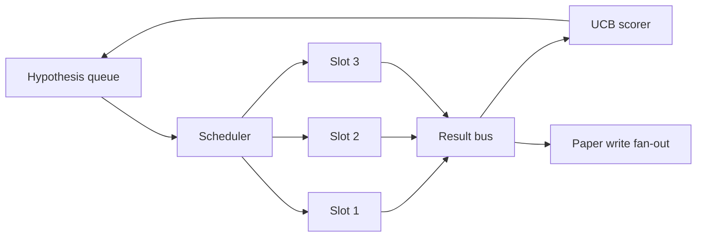
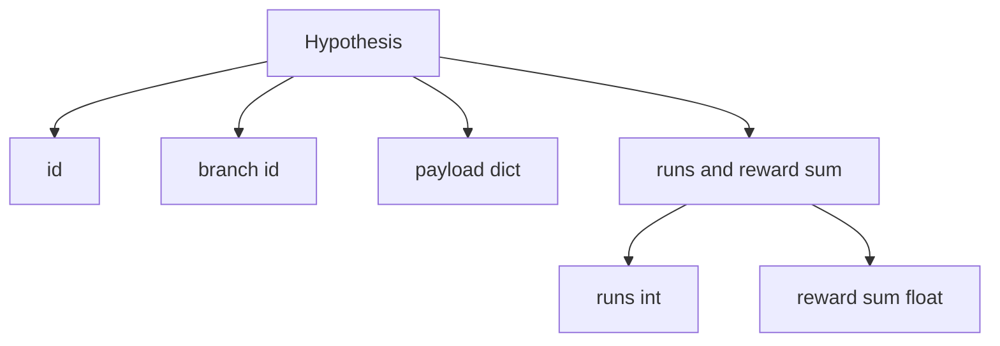
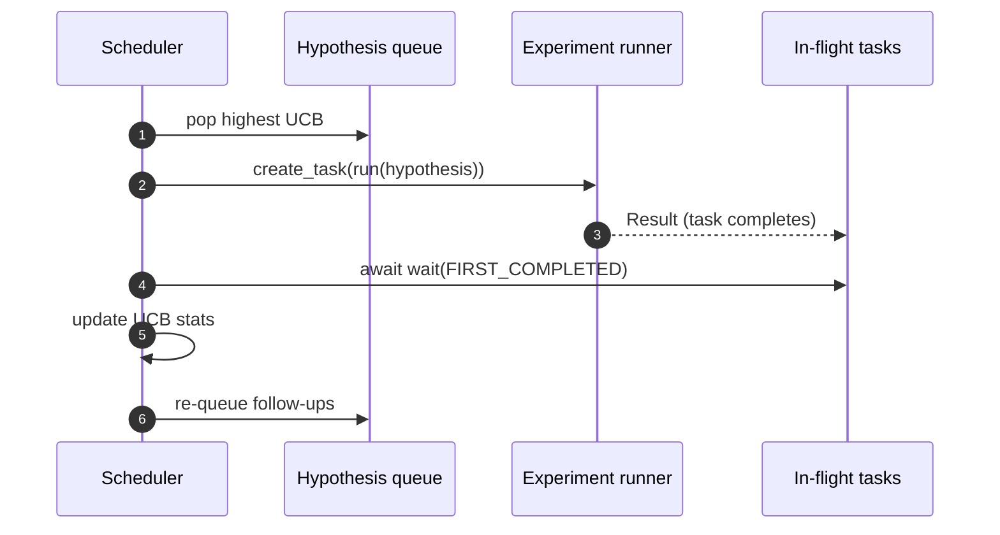

<!-- i18n:manual -->
# Iteration Scheduler — планировщик итераций исследовательского цикла

> Исследовательский цикл без планировщика — это очередь, вообразившая себя стратегией. Планировщик — то самое место, где цикл решает, что перестать исследовать, и в этом решении вся игра.

**Type:** Build
**Languages:** Python
**Prerequisites:** Phase 19 lessons 50-53
**Time:** ~90 minutes

## Learning Objectives

- Описать исследовательский процесс как очередь гипотез, которая питает параллельные слоты экспериментов, а результаты стекаются обратно.
- Гонять несколько экспериментов одновременно через asyncio, чтобы планировщик держал все слоты занятыми.
- Оценивать каждую ветку гипотез через UCB, чтобы планировщик отсекал малодоходные ветки, не убивая исследование как таковое.
- Разводить готовые результаты на стадию написания статьи и на стадию возврата в очередь, чтобы доходная ветка порождала гипотезы-продолжения.
- Показывать трассу по каждой итерации: оценки веток, занятость слотов, решения об отсечении.

```figure
ch-ucb-scheduler
```

## Why a scheduler, not a worklist

Плоский список задач выполняет их в порядке подачи. Это нормально, когда задачи независимы. Исследование независимым не бывает: находка из третьего эксперимента меняет приоритет четвёртого и пятого. Планировщик, который читает входящие результаты и переупорядочивает очередь, успевает сделать больше полезного на ту же единицу вычислений.

Интересное проектное решение здесь — правило оценки. Жадный оценщик всегда берёт текущего лидера и никогда не исследует. Равномерный оценщик никогда не эксплуатирует найденное. UCB (upper confidence bound) — средний путь: эксплуатируем лидера, но резервируем мощность под ветки, которые пробовали меньше.

> 🎒 **На пальцах.** Представьте три игровых автомата. Жадный игрок после одного выигрыша дёргает только первый и никогда не узнает, что третий платит вдвое больше. Равномерный честно делит монеты поровну и сливает две трети на заведомо плохих автоматах. UCB делает третье: играет на лидере, но время от времени проверяет тех, кого трогал реже всех.

> 🎒 **На пальцах.** «Переупорядочивает очередь» — это не про красоту, а про деньги. Если из шести экспериментов четыре уходят в ветку, которая уже показала себя пустой, вы просто сожгли две трети бюджета GPU. Планировщик — это способ не платить за уже опровергнутую идею.

## The system shape



В очереди лежат гипотезы. Когда освобождается слот, планировщик берёт гипотезу с максимальным UCB. Каждый слот прогоняет эксперимент асинхронно. Законченные эксперименты выкидывают свой результат на шину. Шина обновляет UCB-статистику ветки-родителя и разводит результат на стадию написания статьи, когда доходность ветки переваливает порог.

> 🎒 **На пальцах.** Схема читается как кольцо: очередь → планировщик → слоты → шина → оценщик → снова очередь. Именно замкнутость кольца делает это исследованием, а не пакетным прогоном: результат шестого эксперимента влияет на то, каким будет седьмой. Разомкните стрелку от оценщика к очереди — и получится обычный worklist.

## The Hypothesis shape



`branch` — это ключ для UCB-статистики. Несколько гипотез могут делить одну ветку (ветка — это направление исследования, а гипотеза — одна попытка внутри него). `runs` — число завершённых экспериментов ветки, `reward_sum` — накопленная награда. UCB читает оба поля.

> 🎒 **На пальцах.** Разница между гипотезой и веткой — как между попыткой и направлением. Ветка «увеличить размер батча» может содержать три гипотезы: батч 32, батч 64, батч 128. Статистика копится на ветке, а не на попытке: три запуска с наградами 0.8, 0.6 и 0.7 дают `runs = 3` и `reward_sum = 2.1`, то есть среднее 0.7.

## UCB scoring

Формула UCB в этом уроке — классический UCB1.

```text
ucb(branch) = mean_reward(branch) + c * sqrt( ln(total_runs) / runs(branch) )
```

`total_runs` — число всех завершённых экспериментов по всем веткам. `c` — вес исследования; по умолчанию в уроке `sqrt(2)`. Ветка с нулём запусков получает `+inf`, поэтому непробованные ветки планируются первыми. Ветка с высокой средней наградой держит высокий счёт, пока остальные её не догонят; ветка, которую гоняли много раз без заметной награды, оказывается перекрыта менее исхоженными альтернативами.

> 🎒 **На пальцах.** Посчитаем на числах. Пусть всего сделано 10 запусков, `ln(10) ≈ 2.30`, а `c ≈ 1.414`. Ветка A: 3 запуска, среднее 0.6 → бонус `1.414 * sqrt(2.30/3) ≈ 1.24`, итог 1.84. Ветка B: 1 запуск, среднее 0.9 → бонус `1.414 * sqrt(2.30/1) ≈ 2.14`, итог 3.04. B выигрывает не только средним, но и своей неизученностью.

> 🎒 **На пальцах.** Бесконечность для нуля запусков — это не хак, а правило «сначала попробуй всё хотя бы раз». Без него планировщик мог бы вцепиться в первую же ветку, случайно давшую 0.9, и никогда не открыть соседнюю с настоящими 0.95.

Калитка отсечения устроена отдельно от выбиралки. Отсечение убирает ветку из будущего планирования, когда её средняя награда падает ниже абсолютного пола (по умолчанию `0.2`) после как минимум `prune_after_runs` попыток (по умолчанию `3`). Это держит очередь ограниченной.

> 🎒 **На пальцах.** Два порога здесь работают в паре: пол по награде и минимум попыток. Ветка с наградами 0.1, 0.2 и 0.15 даёт среднее 0.15 — ниже пола 0.2, и после третьего запуска её выкидывают. А вот убить её после одного неудачного 0.1 было бы ошибкой: одна попытка ничего не доказывает.

## Parallel slots with asyncio

Планировщик запускает эксперименты через `asyncio.create_task`. Каждая задача крутит раннер эксперимента (вызываемый объект `async def`), который возвращает `Result`. Главный цикл ждёт множество задач в полёте через `asyncio.wait(..., return_when=asyncio.FIRST_COMPLETED)` и на каждом завершении дёргает обновление оценок.



Три слота работают одновременно. Главный цикл никогда не блокируется на одном эксперименте. Планировщик стартует новые задачи сразу, как только освобождается слот, — пока очередь не опустеет и в полёте не останется ни одной задачи.

> 🎒 **На пальцах.** `FIRST_COMPLETED` — это как повар, который не ждёт, пока сварятся все три кастрюли, а снимает ту, что закипела первой. При задержке 5 мс на эксперимент шесть штук подряд заняли бы 30 мс, а на трёх слотах — примерно 10 мс. Выигрыш ровно в число слотов, пока есть чем их заполнить.

> 🎒 **На пальцах.** Условие остановки двойное: пусто в очереди И пусто в полёте. Одного мало — задача, которая ещё считается, может вернуть результат, породить два продолжения и снова наполнить очередь.

## Fan-out: paper triggers

Когда средняя награда ветки переваливает `paper_threshold` (по умолчанию `0.7`), а статью эта ветка ещё не породила, планировщик выкидывает событие `paper.trigger` в выходной список. Дальше по конвейеру его подхватил бы писатель статей из урока пятьдесят четыре. В этом уроке триггер просто складывается в список, чтобы тесты могли его проверить.

> 🎒 **На пальцах.** Оговорка «ещё не породила» защищает от спама: без неё ветка со средним 0.75 дёргала бы триггер после каждого нового результата и заказала бы десять статей про одно и то же. Флаг «статья уже была» стоит одного булева поля и экономит девять лишних прогонов писателя.

## Fan-out: follow-up hypotheses

Когда приземляется доходный результат, планировщик может позвать пользовательский `expander`, чтобы тот произвёл одну или несколько гипотез-продолжений на той же ветке. `expander` — чистая функция из `Result` в `list[Hypothesis]`. В уроке идёт детерминированный expander, который делает два продолжения для любого результата с наградой выше порога статьи.

> 🎒 **На пальцах.** Здесь цикл сам себя кормит: одна удачная гипотеза превращается в две новые. Осторожно с арифметикой — если каждый успех даёт два продолжения, а успешна половина запусков, очередь в среднем не убывает. Ровно поэтому следующий раздел про бюджеты не опционален.

## Budgets

Два бюджета защищают планировщик от разноса вразнос.

```text
max_experiments    : total count of experiments run across all branches
max_seconds        : wall-clock cap (asyncio time)
```

Когда срабатывает любой из них, планировщик перестаёт ставить новые задачи, дожидается тех, что в полёте, и возвращает финальную трассу. В трассе есть поле `stop_reason`.

> 🎒 **На пальцах.** Два бюджета ловят два разных провала. Счётчик экспериментов защищает от «слишком много дешёвых запусков», а стенные часы — от «один эксперимент завис на час». Один без другого дырявый: сто мгновенных запусков и один вечный одинаково плохи.

## The Trace and final report

Каждое решение планировщика (выбор, отправка, результат, отсечение, разведение) порождает одно событие. Финальный отчёт сводит статистику по веткам, общее число запусков, общее время по стенным часам и сработавшие триггеры статей. Следующий урок, сквозное демо, читает этот отчёт, чтобы запустить писателя статей.

> 🎒 **На пальцах.** Трасса — это чёрный ящик самолёта для вашего цикла. Когда через час прогона вы увидите, что до статьи не дошло ничего, единственный способ понять почему — прочитать, какие ветки отсекли и на каком шаге. Без событий останется только гадать по итоговому числу.

## How to read the code

`code/main.py` определяет `Hypothesis`, `Result`, `BranchStats`, `IterationScheduler` и фабрику `make_deterministic_runner`, которая возвращает asyncio-раннер экспериментов с предсказуемыми наградами. Раннер спит фиксированные `delay_ms` (по умолчанию `5ms`), чтобы параллельность была видна.

`code/tests/test_scheduler.py` покрывает: UCB сначала берёт непробованные ветки, занятость параллельных слотов, триггеры статей при переходе порога, отсечение веток после малодоходных попыток, разведение гипотез-продолжений и выход по бюджету (и по числу экспериментов, и по стенным часам).

> 🎒 **На пальцах.** Сон в 5 мс здесь — не имитация тяжёлых вычислений, а способ сделать конкурентность наблюдаемой. Если бы раннер возвращал результат мгновенно, все три слота отработали бы по очереди в одном тике, и тест на занятость слотов ничего бы не измерил.

## Going further

Три расширения, которые понадобятся настоящей реализации. Первое — сохраняемая UCB-статистика между сессиями: сейчас счётчики живут в памяти, а настоящий планировщик писал бы их в чекпоинт, чтобы перезапуск не терял уже потраченный бюджет исследования. Второе — многокритериальная оценка: вместо скалярной награды каждый результат отдаёт вектор, и UCB превращается в выбиралку в стиле Парето. Третье — контекстные бандиты: выбиралка смотрит на признаки гипотезы (длина, сложность), и похожие гипотезы делят исследование между собой.

Планировщик — то место, где исследование перестаёт быть списком задач. Как только UCB подключён, а слоты работают параллельно, любое следующее улучшение ложится сверху.

> 🎒 **На пальцах.** Про первый пункт легко недооценить цену: перезапуск с пустой статистикой обнуляет `runs` у всех веток, а значит все они снова получают `+inf` и снова требуют по пробному запуску. Десять веток — десять экспериментов, выброшенных только за то, что процесс перезапустили.

> 🎒 **На пальцах.** Многокритериальность появляется ровно тогда, когда вы честно признаёте, что «награда» — это не одно число. Точность 0.9 при задержке 2 секунды и точность 0.85 при 200 мс несравнимы одной цифрой, и любой коэффициент, которым вы их складываете, вы придумали из головы.
