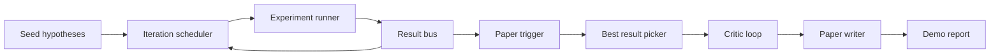
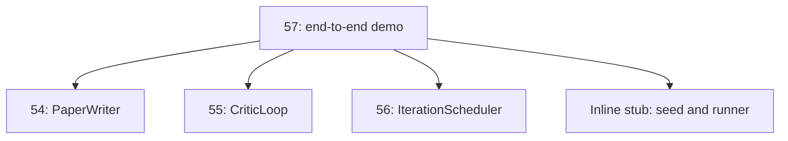
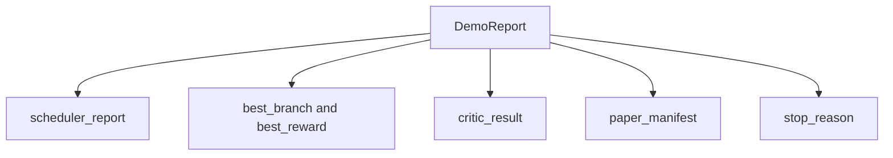

<!-- i18n:manual -->
# End-to-End Research Demo — сквозное демо исследовательского цикла

> Демо — это место, где все контракты, написанные раньше, обязаны сложиться друг с другом. Если хоть один протекает, именно демо это ловит.

**Type:** Build
**Languages:** Python
**Prerequisites:** Phase 19 lessons 50-53
**Time:** ~90 minutes

## Learning Objectives

- Соединить автоисследовательский цикл от начала до конца: посев гипотез, раннер экспериментов, планировщик, цикл критики, писатель статей.
- Сложить примитивы из четырёх предыдущих уроков Track D обычными импортами Python, без фреймворка.
- Прогнать цикл до самозавершения и выдать один отчёт демо, где перечислен выход каждой стадии.
- Держать демо детерминированным, чтобы тесты могли проверять финальную форму.
- Явно показывать режим отказа, когда контракт любой стадии ломается, чтобы следующая стадия не работала на битом входе.

```figure
ch-research-pipeline
```

> 🎒 **На пальцах.** Слово «сквозное» здесь означает: ни одного ручного шага между посевом гипотез и готовым PDF. Каждый предыдущий урок делал одну деталь и проверял её своими тестами; этот урок впервые проверяет, что детали стыкуются. Такие стыки ломаются чаще, чем сами детали.

## What composes here



Пять стадий. Посев — это список из трёх гипотез. Планировщик прогоняет по ним шесть экспериментов на трёх параллельных слотах. Шина сообщает об одном или нескольких триггерах статьи. Выбиралка отбирает единственный лучший результат. Цикл критики итерирует черновик, построенный из этого результата. Писатель статей выдаёт финальные LaTeX, BibTeX и манифест.

> 🎒 **На пальцах.** Посчитайте конвейер по числам: 3 гипотезы → 6 экспериментов → сколько-то триггеров → ровно 1 выбранный результат → 1 черновик → 1 статья. Воронка сужается до единицы на шаге выбиралки, и именно поэтому дальше по конвейеру всё уже однозначно.

## Why import, not copy

В каждом предыдущем уроке лежит `main.py` с публичными dataclass'ами и функциями. Демо импортирует их, подкручивая `sys.path` до родительской директории каждого урока. Это не обвязка фреймворком; это тот же импорт, которым уже пользуются тестовые файлы в предыдущих уроках.



Встроенная заглушка стоит вместо уроков с пятидесятого по пятьдесят третий: маленький генератор посевных гипотез и синхронная функция награды. Пользователь может заменить заглушку настоящими примитивами из тех уроков, поправив два импорта.

> 🎒 **На пальцах.** Копирование кода из урока в урок выглядит проще ровно один день. Потом вы правите баг в UCB в уроке 56, а демо продолжает крутить старую копию — и расхождение вы заметите через неделю. Импорт стоит трёх строк с `sys.path` и гарантирует, что исполняется ровно один экземпляр логики.

> 🎒 **На пальцах.** «Поправив два импорта» — это и есть тест на качество границ. Если бы заглушка была размазана по десяти местам демо, замена на настоящие примитивы стала бы рефакторингом, а не двумя строками.

## Determinism guarantees

Демо детерминировано по построению. Раннер экспериментов — засеянный numpy. Ревизор в цикле критики обходит фиксированные измерения в фиксированном порядке. Генератор прозы у писателя статей — тот самый мок из урока пятьдесят четыре. Выбиралка UCB в планировщике разрешает ничьи по порядку итерации, а не случайным выбором.

При одном и том же зерне демо выдаёт один и тот же отчёт. Тест проверяет это свойство, прогоняя демо дважды и сравнивая манифесты.

> 🎒 **На пальцах.** Ничья по порядку итерации, а не по `random.choice` — мелочь, которая решает всё. Если две ветки набрали ровно 0.7, случайный тай-брейк даст разный выбор в двух прогонах, и тест на детерминизм будет падать примерно в половине случаев. Такой «мигающий» тест хуже отсутствующего.

> 🎒 **На пальцах.** Обратите внимание на приём: детерминизм проверяется не глазами, а сравнением двух манифестов. Прогнали дважды, сравнили строки — совпало или нет, без «вроде похоже».

## The demo report shape



Каждое поле приходит дословно из вышестоящей стадии. Демо не преобразует ни один выход; оно их складывает. В этом и состоит проверка, которой демо является.

> 🎒 **На пальцах.** «Не преобразует» — это дисциплина, а не лень. Как только демо начинает подправлять чужие выходы под себя, оно перестаёт быть честным тестом стыков: любое несоответствие контрактов будет замазано прямо тут и всплывёт уже в проде.

## Failure mode handling

Каждая стадия либо срабатывает, либо кидает типизированную ошибку.

```text
Scheduler ........ returns SchedulerReport with stop_reason
                   in {queue_empty, max_experiments, deadline}
Best-result pick . raises NoTriggerError if no paper trigger fired
Critic loop ...... returns LoopResult with status converged or stopped
Paper writer ..... raises PaperValidationError on contract break
```

Отказ на любой стадии закорачивает демо типизированным исключением. Тесты фиксируют этот контракт: `test_no_triggers_raises_typed_error` и `test_best_picker_raises_when_no_triggers` проверяют, что выбиралка кидает `NoTriggerError` / `BestResultError`, когда ни одна ветка не дала триггер, и что писатель при этом вообще не вызывается.

> 🎒 **На пальцах.** Ключевое слово — «типизированная». Разница между `NoTriggerError` и голым `KeyError` в том, что первое сразу называет причину: ни одна ветка не дотянула до порога 0.7. Второе заставит вас лезть в стек-трейс и гадать, какой ключ и где отсутствовал.

> 🎒 **На пальцах.** Проверка «писатель не вызван» важнее, чем кажется. Стадия без входа не должна работать на заглушке или пустышке: лучше громко упасть на шестой секунде, чем через две минуты выдать статью ни о чём и записать её в манифест.

## The best-result picker

Планировщик выдаёт триггеры статьи по веткам. Выбиралка берёт ветку с наибольшей средней наградой среди всех триггеров. Ничьи разрешаются по алфавиту идентификатора ветки, чтобы демо оставалось детерминированным. Выбиралка — маленькая чистая функция; тест фиксирует её на заранее заданном отчёте планировщика.

> 🎒 **На пальцах.** «Чистая функция» значит: те же аргументы — тот же ответ, без обращений к времени, файлам или сети. Такую функцию можно проверять на замороженном отчёте планировщика, не запуская ни одного эксперимента, а тест отрабатывает за миллисекунды.

## Wiring the critic loop

Цикл критики из урока пятьдесят пять работает над объектом `MiniPaper`. Демо строит `MiniPaper` из выбранной ветки: кладёт в аннотацию идентификатор ветки, заводит две секции (Introduction и Results) и выставляет `originality_tag` по средней награде ветки (high при `>= 0.8`, medium при `>= 0.6`, low в остальных случаях).

Дальше ревизор итерирует черновик до сходимости. Выход уходит в писателя статей.

> 🎒 **На пальцах.** Тут прямо видно, как число превращается в ярлык: средняя награда 0.82 даёт `high`, 0.65 — `medium`, 0.4 — `low`. Границы взяты руками, и это нормально, пока они записаны в одном месте кода, а не размазаны по трём стадиям с разными значениями.

## Wiring the paper writer

Писатель статей из урока пятьдесят четыре работает над полной формой `Paper` с рисунками и библиографией. Демо повышает сошедшийся `MiniPaper` через `mini_to_full_paper`: прикладывает один рисунок для выбранной ветки и небольшую синтетическую библиографию, собранную из объединения ключей цитирования, предложенных критиком. Каждая ссылка, которую демо добавляет, попадает и в список библиографии, поэтому валидация проходит.

> 🎒 **На пальцах.** Правило «каждый добавленный cite попадает в библиографию» — ровно то, на чём спотыкается любой человек, пишущий LaTeX руками. Три `\cite` в тексте и две записи в `.bib` дают вопросительные знаки в PDF; здесь этого не случится, потому что оба списка строятся из одного множества ключей.

## How to read the code

`code/main.py` определяет `BestResultError`, `NoTriggerError`, `DemoReport`, `pick_best_branch`, `build_mini_paper`, `mini_to_full_paper` и `run_demo`. Импорты наверху один раз подкручивают `sys.path` и тянут `PaperWriter`, `CriticLoop` и `IterationScheduler` из их уроков.

`code/tests/test_e2e.py` покрывает: демо проходит от начала до конца и выдаёт отчёт со всеми пятью заполненными полями, детерминизм между двумя прогонами, `NoTriggerError`, когда ни одна ветка не перешла порог, `PaperValidationError`, когда ломается контракт писателя, наличие рисунка выбранной ветки в манифесте статьи и то, что причина остановки планировщика — одна из ожидаемых.

> 🎒 **На пальцах.** Заметьте пропорцию: семь публичных имён на весь файл и шесть тестов на них. Демо намеренно тонкое — вся тяжёлая логика осталась в уроках 54, 55 и 56, а здесь только склейка и проверки склейки.

## Going further

Три расширения, которые стоит подключить, как только демо позеленело. Первое — сохраняемое состояние: результат каждой стадии пишется в маленькое JSON-хранилище, чтобы перезапуск мог продолжить, не прогоняя заново дешёвые стадии. Второе — дашборд: события трассы от планировщика и цикла критики рисуются одной общей лентой времени. Третье — настоящие вызовы моделей: меняем мок-генератор прозы и детерминированного критика на модельных; обвязка при этом не меняется.

Работа демо — доказать, что композиция и есть архитектура. Пять уроков, четыре импорта, один отчёт. В следующий раз, когда вы добавите стадию, обвязка вырастет ровно на одну строку.

> 🎒 **На пальцах.** «Обвязка не меняется» при переходе на настоящие модели — это проверка качества границ, а не обещание. Она держится ровно потому, что критик и писатель принимают и возвращают dataclass'ы, а не строки от конкретного API.

> 🎒 **На пальцах.** Про сохраняемое состояние прикиньте цену: если планировщик отработал шесть экспериментов по несколько минут, а упало на писателе, перезапуск с нуля стоит вам этих минут во второй раз. JSON на диске стоит десяти строк кода.
