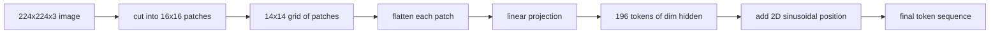

<!-- i18n:manual -->
# Vision Encoder Patches — патчи на входе vision-энкодера

> Модели зрения, которая читает пиксели, нужен токенизатор для пикселей. Патч-эмбеддинг и есть этот токенизатор. Режем картинку на сетку квадратов, вытягиваем каждый квадрат в вектор, прогоняем через один линейный слой и добавляем двумерный сигнал позиции, чтобы трансформер знал, где этот квадрат стоял в исходной картинке.

**Type:** Build
**Languages:** Python
**Prerequisites:** Phase 19 lessons 30-37 (Track B foundations)
**Time:** ~90 minutes

## Learning Objectives

- Токенизировать картинку в последовательность патч-эмбеддингов фиксированной длины.
- Реализовать патч-проекцию на `Conv2d`, совпадающую по математике с unfold-then-linear.
- Собрать детерминированный двумерный синусоидальный позиционный эмбеддинг, чтобы порядок токенов кодировал положение в пространстве.
- Проверить число патчей, форму эмбеддинга и эквивалентность `Conv2d` и unfold на синтетической фикстуре.

> 🎒 **На пальцах.** Всё это — один вход в модель: пиксельная сетка входит, список векторов выходит. Для картинки 224 на 224 при патче 16 список получается ровно из 197 элементов: 196 патчей плюс CLS-токен. Дальше по сети никакой «картинки» уже нет, есть только эта последовательность.

## The Problem

Трансформер ест последовательность векторов. Картинка — это трёхканальная сетка. Если читать каждый пиксель как токен, длина последовательности взрывается: RGB-картинка 224x224 — это 150 528 токенов, которые двенадцатислойный трансформер не потянет в attention. Если читать картинку как один гигантский плоский вектор, теряется локальность, а восстановить её слой attention уже не сможет. Задача входной части энкодера — сжать сетку пикселей до пары сотен токенов, каждый из которых суммирует квадратный участок.

Патч-эмбеддинг решает это одной линейной проекцией. Картинка 224x224, нарезанная на патчи 16x16, даёт сетку 14x14 из 196 патчей. Каждый патч вытягивается из `(3, 16, 16) = 768` значений пикселей в один вектор, а линейный слой отображает его в скрытую размерность модели. Трансформер видит 196 токенов размерности `hidden` (обычно 768) плюс CLS-токен. Такую последовательность остальная сеть уже способна жевать.

> 🎒 **На пальцах.** Забавное совпадение, которое стоит заметить: в патче 3 × 16 × 16 = 768 чисел, и скрытая размерность ViT-Base тоже 768. То есть проекция ничего не сжимает по числу компонент — она просто поворачивает вектор пикселей в пространство, удобное модели.

> 🎒 **На пальцах.** «Теряется локальность» звучит абстрактно, поэтому вот конкретика: в плоском векторе длиной 150 528 соседние по вертикали пиксели стоят на расстоянии 672 позиций друг от друга. Для сети это два никак не связанных числа, и ей пришлось бы выучивать геометрию картинки с нуля.

## The Concept



> 🎒 **На пальцах.** Цепочка на схеме читается слева направо как рецепт из шести шагов, и только два из них содержат обучаемые веса: проекция и (в других вариантах) позиции. Нарезка, вытягивание и сложение — это чистая перестановка чисел, там нечему учиться и нечему ломаться.

### Why patches, not pixels

Attention квадратичен по длине последовательности. Последовательность из 196 токенов стоит `196 * 196 = 38,416` оценок attention на голову на слой; последовательность из 150 528 токенов — `150,528 * 150,528 = 22.6 billion`. Патчи покупают сокращение вычислений attention в 590 000 раз, и одного участка 16x16 хватает по сигналу для высокоуровневых задач зрения. Плата — потеря мелких пространственных деталей внутри патча, и именно поэтому в мультимодальных стеках дальше по конвейеру часто держат вторую ветку высокого разрешения, когда нужна точная локализация.

> 🎒 **На пальцах.** Проверьте множитель сами: длина упала в 768 раз (150 528 / 196), а стоимость квадратична, значит 768² ≈ 590 000. Один прогон вместо шестисот тысяч — вот вся причина, по которой ViT вообще существует.

> 🎒 **На пальцах.** Патч 16x16 на картинке 224 — это примерно 7% ширины кадра. Лицо целиком в такой квадрат влезет, а вот отдельная буква мелкого текста — нет; она размажется внутри одного токена. Отсюда и вторая ветка высокого разрешения для OCR-подобных задач.

### Why a linear projection is enough

Каждый патч трактуется как независимый вектор. Проекция выучивает базис: детекторы границ, цветовые фильтры, простые текстуры. Один линейный слой маленький (`768 * 768 = 589,824` параметров для ViT-Base) и учится быстро. Более глубокие свёрточные стволы существуют (это «гибридный» ViT), но плоская линейная проекция — стандарт, и большинство современных открытых энкодеров идут ровно с такой формой.

> 🎒 **На пальцах.** 590 тысяч параметров — это меньше процента от восьмидесяти шести миллионов у всего ViT-Base. Вся «визуальная» специфика модели живёт в этом одном слое, а остальные 99% весов — обычный текстовый по духу трансформер. Поэтому энкодеры так легко пересаживают между задачами.

### The `Conv2d` trick

`Conv2d(in_channels=3, out_channels=hidden, kernel_size=patch_size, stride=patch_size)` без паддинга даёт тот же численный результат, что и unfold-then-linear, потому что каждая выходная позиция скалярно умножает пиксели патча на один фильтр. Свёртка и есть патч-проекция, и большинство продакшен-кодовых баз пишут её именно так: на GPU быстрее и на один reshape меньше.

> 🎒 **На пальцах.** Ключ здесь в том, что шаг равен размеру ядра: окна не перекрываются, и свёртка режет картинку как ножницы точно по разметке. При `kernel_size = stride = 16` из 224 пикселей получается ровно 14 непересекающихся окон, ни одного лишнего пикселя не остаётся.

### Position embeddings

Из проекции токены выходят без всякого порядка. Двумерный синусоидальный эмбеддинг даёт каждому токену фиксированный сигнал, кодирующий его позицию `(row, col)`. Половина размерности эмбеддинга кодирует номер строки синусами и косинусами на нескольких частотах; вторая половина кодирует номер столбца. Кодирование детерминированное, поэтому разрешение можно менять без переобучения, и оно чисто интерполируется на сетки, которых модель на обучении не видела.

| Component | Shape | Parameters |
|-----------|-------|------------|
| Патч-проекция (`Conv2d`) | `(hidden, 3, patch, patch)` | `3 * P * P * hidden + hidden` |
| Позиционный эмбеддинг (фиксированный) | `(num_patches, hidden)` | 0 (вычисляется, не обучается) |
| CLS-токен (обучаемый) | `(1, hidden)` | `hidden` |

Для ViT-Base/16 при разрешении 224: 590 592 параметра в проекции, 768 в CLS-токене и ноль на синусоидальные позиции. Следующий урок (59) ставит поверх этой входной части двенадцатислойный трансформер.

> 🎒 **На пальцах.** Проверьте 590 592 руками: `3 * 16 * 16 * 768 = 589 824` весов плюс 768 смещений. И обратите внимание на ноль в средней строке — синусоидальные позиции ничего не стоят по памяти весов, их просто считают формулой при каждом запуске.

> 🎒 **На пальцах.** Обучаемая таблица позиций была бы жёстко привязана к разрешению: 197 × 768 ≈ 151 тысяча чисел, годных только для 224. Синус такой привязки не имеет — подали 384 пикселя, посчитали ту же формулу на сетке 24 × 24, и модель работает без переобучения.

### Equivalence as a sanity check

У шага с патчами два написания: проекция через `Conv2d` и явный unfold-then-linear. При одних и тех же весах они обязаны давать один и тот же выход. Если не дают, значит математика unfold неверна, и остальной энкодер построен на песке. Тесты этого урока как раз гоняют эту эквивалентность.

```figure
ch-patch-tokenizer
```

> 🎒 **На пальцах.** Это классический приём «два независимых способа посчитать одно и то же». Медленный и очевидный unfold служит эталоном для быстрого `Conv2d`: сравнили выходы с точностью до float — и дальше можно спокойно пользоваться быстрым вариантом.

## Build It

`code/main.py` реализует:

- `PatchEmbed` — `nn.Module`, оборачивающий `Conv2d` для патч-проекции.
- `sinusoidal_2d(grid_h, grid_w, dim)` — функция без состояния, строящая двумерную таблицу позиций.
- `VisionFrontEnd`, который складывает патч-эмбеддинг, приписывание CLS и добавление позиций в один прямой проход.
- Хелпер `synthesize_image(seed)`, собирающий детерминированную фикстуру 224x224x3 из `numpy.random`.
- Демо, которое прогоняет одну фикстуру через входную часть и печатает форму выхода, норму CLS-токена и одну строку позиционного эмбеддинга.

Запустите его:

```bash
python3 code/main.py
```

Выход: фикстура 224x224 токенизируется в последовательность формы `(1, 197, 768)`. Первый токен — CLS, следующие 196 — патч-токены. Нормы позиционного эмбеддинга внутри строки одинаковы, и это фирменная подпись синусоиды.

> 🎒 **На пальцах.** Форма `(1, 197, 768)` читается по трём числам: одна картинка в батче, 197 токенов, 768 чисел на токен. Если увидели 196 вместо 197 — забыли приписать CLS; если 784 вместо 196 — случайно взяли патч 8 вместо 16.

## Use It

Та же самая входная часть с патчами встречается в каждой современной vision-language модели: CLIP ViT-L/14, SigLIP, DINOv2, семейство Qwen-VL и стек InternVL — все начинаются с патч-проекции `Conv2d` плюс сигнал позиции. Различия между семействами живут дальше по конвейеру (пулинг через CLS или без него, register-токены, разные размеры патча 14 против 16, динамическое разрешение через интерполяцию позиций). Входная часть из этого урока — подложка, на которой стоит каждая из этих моделей.

> 🎒 **На пальцах.** Разница между патчем 14 и 16 не косметическая: при 224 патч 16 даёт 14 × 14 = 196 токенов, а патч 14 — 16 × 16 = 256, то есть на 30% длиннее и примерно на 70% дороже по attention. Платят за это лучшей детальностью, что заметно на мелком тексте.

## Tests

`code/test_main.py` покрывает:

- число патчей совпадает с `(image_size / patch_size) ** 2`
- форма выхода совпадает с `(batch, num_patches + 1, hidden)`
- проекция `Conv2d` равна ручному unfold-then-linear на маленькой фикстуре
- таблица синусоидальных позиций детерминирована между вызовами
- CLS-токен размножается по батчу без протечек

Запустите их:

```bash
python3 -m unittest code/test_main.py
```

> 🎒 **На пальцах.** «Без протечек» означает вот что: CLS одинаков для всех картинок в батче на входе, но его выходное состояние обязано зависеть только от своей картинки. Проверяется просто — меняем вторую картинку в батче и убеждаемся, что выход для первой не сдвинулся.

## Exercises

1. Замените синусоидальные позиции на обучаемый `nn.Parameter` и сравните лосс первой эпохи на крошечной синтетической задаче классификации. Обучаемые позиции выигрывают при фиксированном разрешении; синусоидальные выигрывают, когда разрешение меняют после обучения.

2. Замените `Conv2d` на явный `nn.Unfold` плюс `nn.Linear` и убедитесь, что выходы совпадают в пределах точности float. Та же математика, два способа её записать.

3. Добавьте поддержку неквадратных патчей (например, 32x16 для широких входов) и проверьте, что таблица позиций справляется с неквадратными сетками.

4. Профилируйте шаг с патчами на размерах батча 1, 8, 64. Патч-проекция редко оказывается узким местом; дальше по конвейеру всё съедают слои attention.

5. Обучите входную часть как замороженный экстрактор признаков на синтетическом датасете из четырёх классов фигур (круги, квадраты, треугольники, звёзды). Выход CLS-токена должен разделять классы линейно.

> 🎒 **На пальцах.** Подсказка к третьему заданию: при патче 32x16 на картинке 224x224 сетка получается 7 × 14 = 98 патчей, и она неквадратная. Если таблица позиций где-то предполагает `grid_h == grid_w`, тут она и сломается — ровно за этим упражнение и придумано.

## Key Terms

| Term | What it means |
|------|---------------|
| Patch | Квадратный участок картинки, обычно 14x14 или 16x16 |
| Patch embedding | Линейная проекция одного вытянутого патча в скрытую размерность |
| Sequence length | Число токенов после токенизации патчами, обычно плюс CLS |
| Sinusoidal position | Фиксированный сигнал из синусов и косинусов, кодирующий двумерные координаты сетки |
| CLS token | Обучаемый вектор, приписанный в начало последовательности как голова пулинга |

> 🎒 **На пальцах.** Разложите по этой таблице одну строку кода из демо: форма `(1, 197, 768)` — это Sequence length 197, потому что Patch дал 196 штук, а CLS token добавил один. Sinusoidal position при этом не меняет ни одного размера, он только прибавляется к значениям.

## Further Reading

- An Image is Worth 16x16 Words (ViT, 2021) — оригинальная постановка патч-эмбеддинга.
- Attention Is All You Need (2017) — синусоидальная формула позиций, здесь адаптированная к двум измерениям.
- DINOv2 paper — register-токены, расширение, которое можно добавить шестым упражнением.
