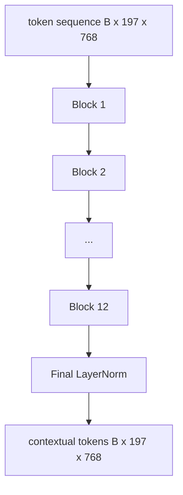
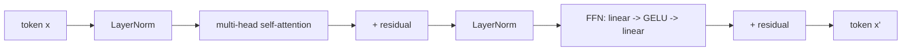

<!-- i18n:manual -->
# Энкодер Vision Transformer

> Одни патчи ещё ничего не видят. Двенадцатислойный pre-LN трансформер с 12 головами внимания превращает последовательность патч-токенов в последовательность контекстных токенов, а CLS-токен собирает признаки всей картинки в своём финальном скрытом состоянии. Этот урок — машинное отделение любой современной vision-language модели.

**Type:** Build
**Languages:** Python
**Prerequisites:** Phase 19 lessons 30-37 (Track B foundations)
**Time:** ~90 minutes

## Learning Objectives

- Реализовать pre-LN блок трансформера с multi-head self-attention и feed-forward подслоем.
- Сложить 12 блоков по 12 голов в энкодер ViT-Base.
- Подключить патч-фронтенд из урока 58 к энкодеру и прогнать прямой проход.
- Проверить, что CLS-токен действительно собирает информацию со всех патчей.

> 🎒 **На пальцах.** Весь урок — про одну сборку: 12 одинаковых блоков примерно по 7.1M параметров, итого около 85M плюс фронтенд. Внутрь заходят 197 токенов по 768 чисел, наружу выходят те же 197 токенов, но каждый уже «знает» про соседей.

## The Problem

Патч-эмбеддинг выдаёт последовательность из 197 токенов, и каждый вектор в ней ничего не знает про остальные патчи. Чтобы получилась картинка кошки, каждому патчу нужно понимать, где усы, где фон, а где глаз. Трансформер — это и есть механизм, который выстраивает такую осведомлённость, слой внимания за слоем внимания. Без него патч-фронтенд остаётся ловким токенизатором без всякого понимания.

> 🎒 **На пальцах.** Представьте 197 человек, каждый смотрит в свою щёлку размером 16x16 пикселей и не видит соседей. Слой внимания — это раунд, в котором все разом обмениваются увиденным. После 12 раундов каждый знает про всю картинку, хотя изначально видел 1/196 её часть.

Стандартный рецепт — двенадцать блоков в глубину, двенадцать голов в ширину, pre-LayerNorm, активация GELU и расширение feed-forward в 4 раза. Этот рецепт — хребет CLIP ViT-L, SigLIP, DINOv2, семейства Qwen-VL, InternVL и любого другого открытого визуального энкодера 2025-2026 годов. Рецепт настолько устойчив, что, читая любую из этих статей, можно смело предполагать именно такую форму блока, пока авторы явно не сказали обратного.

> 🎒 **На пальцах.** «12 блоков, 12 голов, расширение 4x» стоит запомнить как таблицу умножения: три числа задают почти всю архитектуру. Отсюда сразу считается ширина FFN: 4 × 768 = 3072, и размер головы: 768 / 12 = 64.

## The Concept





> 🎒 **На пальцах.** Две схемы читаются так: верхняя — это конвейер из 12 одинаковых цехов, нижняя — устройство одного цеха. Форма данных при этом не меняется нигде: `B x 197 x 768` вошло, `B x 197 x 768` вышло, и так двенадцать раз подряд.

### Pre-LN vs post-LN

В оригинальном трансформере LayerNorm стоял после residual-связи. Pre-LN (LayerNorm перед каждым подслоем) — вариант, который использует любая современная vision-language модель, потому что он обучается стабильно и без трюков с прогревом learning rate. Разница — одна строчка в прямом проходе, а поток градиента на глубине 12+ отличается как день и ночь.

> 🎒 **На пальцах.** Разница как между «сначала посчитать, потом округлить» и «сначала округлить, потом посчитать»: операции те же, а накопленная ошибка совсем другая. В pre-LN residual-магистраль идёт от входа до выхода нетронутой, поэтому градиент доезжает до первого из 12 блоков без затухания.

### Multi-head self-attention

Каждая голова проецирует вектор токена в собственную тройку `(query, key, value)` размерности `head_dim = hidden / num_heads`. При `hidden = 768` и `heads = 12` у каждой головы `dim = 64`. Все 12 голов работают параллельно, затем их выходы склеиваются обратно в размерность 768 и проходят через выходную проекцию. Смысл множества голов в том, что одна голова может выучить «смотреть на глаз кошки», а другая — «смотреть на градиент фона», и они друг другу не мешают.

> 🎒 **На пальцах.** Это как 12 экспертов, которым выдали по 64 числа из общих 768 и попросили смотреть каждого за своим. Потом их отчёты просто складывают в один вектор длиной 12 × 64 = 768 — ровно столько, сколько было на входе.

### Why the 4x feed-forward expansion

FFN идёт по маршруту `hidden -> 4 * hidden -> hidden`, а посередине GELU. Множитель 4 подобран эмпирически и держится и в языковых, и в визуальных трансформерах с 2017 года. Меньше (2x) — недообучение; больше (8x) — переобучение при фиксированном бюджете данных. Именно в MLP модель хранит большую часть выученных фактов, и лежат они как раз в этой широкой середине.

> 🎒 **На пальцах.** Расширение 4x — это как разложить вещи из чемодана на кровать, чтобы найти нужное, и сложить обратно: 768 → 3072 → 768. Из-за этой середины FFN весит 4.72M против 2.36M у всего внимания — то есть две трети блока.

| Component | Parameters at ViT-Base scale |
|-----------|------------------------------|
| проекция qkv на блок | `3 * 768 * 768 = 1.77M` |
| выходная проекция на блок | `768 * 768 = 590K` |
| FFN на блок (расширение 4x) | `2 * 768 * 4 * 768 = 4.72M` |
| LayerNorm на блок | `4 * 768 = 3K` |
| всего на блок | около 7.1M |
| 12 блоков | около 85M |
| плюс фронтенд | около 86M суммарно |

ViT-Base — энкодер на 86M параметров. По меркам 2026 года это мало (у SigLIP-So400M их 400M, у ViT из Qwen-VL — 675M), но архитектура идентична с точностью до ширины и глубины.

> 🎒 **На пальцах.** Сложите столбик сами: 1.77 + 0.59 + 4.72 ≈ 7.1M на блок, умножить на 12 ≈ 85M, плюс фронтенд ≈ 86M. Разница между ViT-Base и Qwen-VL ViT — не в идеях, а в том, что там те же слагаемые с числами побольше.

### Causal mask or not?

Vision-трансформеры устроены как энкодер и двунаправленны: токен `i` может смотреть на токен `j` для любой пары. Никакой маски. Cross-attention на стороне декодера в уроке 61 будет причинной маской пользоваться, а внутри визуального энкодера внимание полносвязное.

> 🎒 **На пальцах.** Картинка уже вся перед вами — прятать «будущие» патчи бессмысленно, левый верхний угол не идёт «раньше» правого нижнего. Поэтому матрица внимания здесь заполнена целиком, все 197 × 197 ≈ 38 800 клеток, а не половина, как у текста.

### What the CLS token learns

CLS-токен стартует как обучаемый параметр, собственного содержимого из патчей у него нет, и информацию он накапливает через внимание, блок за блоком. К финальному слою строка CLS — это векторное резюме всей картинки; downstream-головы проецируют этот единственный вектор в логиты классов, контрастные эмбеддинги или ключи cross-attention для текстового декодера.

> 🎒 **На пальцах.** CLS — как секретарь на совещании: своего доклада у него нет, он только слушает остальных 196 и пишет протокол. В конце вам отдают одну строку из 768 чисел вместо 197 строк — и дальше работают уже с ней.

```figure
ch-cls-funnel
```

## Build It

`code/main.py` реализует:

- `MultiHeadSelfAttention` — с проекциями `qkv` и выходной, математикой scaled-dot-product attention и проверками форм.
- `FeedForward` — MLP с GELU и расширением 4x.
- `Block` — pre-LN блок, который складывает подслои внимания и feed-forward с residual-связями.
- `ViT` — стопка из 12 блоков с финальным LayerNorm.
- `VisionEncoder` — соединяет `VisionFrontEnd` из урока 58 со стопкой `ViT` и отдаёт `forward()`, возвращающий контекстную последовательность и пулинговый вектор CLS.
- Демо, которое прогоняет синтезированную тестовую картинку 224x224 через весь энкодер и печатает форму входа, форму выхода, число параметров и норму CLS через слой.

> 🎒 **На пальцах.** Обратите внимание на порядок сборки: голова внимания → блок → стопка → энкодер. Каждый следующий класс всего лишь вызывает предыдущий в цикле, поэтому весь ViT-Base — это меньше сотни строк содержательного кода.

Запустите:

```bash
python3 code/main.py
```

Вывод: тестовая картинка кодируется в тензор `(1, 197, 768)`. Норма CLS понемногу растёт по мере наложения слоёв, а на финальном LayerNorm стабилизируется. Общее число параметров — около 86M.

> 🎒 **На пальцах.** Растущая норма CLS — это буквально видно на глаз: пустой вектор постепенно наполняется содержимым картинки. Финальный LayerNorm обрубает этот рост, приводя вектор к единому масштабу, чтобы следующему модулю было всё равно, на каком слое его взяли.

## Use It

Определённый здесь энкодер — с точностью до ширины и глубины та же самая стопка блоков, что стоит внутри любой открытой VLM в 2025-2026 годах. Различия живут вот в чём:

- **Width and depth.** У ViT-Large это `hidden=1024, depth=24, heads=16`; у SigLIP So400M — `hidden=1152, depth=27, heads=16`. Блок один и тот же.
- **Pooling head.** CLS-пулинг (этот урок) против среднего пулинга (SigLIP) против attention-пулинга (более поздние VLM).
- **Position handling.** Фиксированные синусоиды (урок 58), обучаемые одномерные, ALiBi или 2D-RoPE. Математика блока не меняется.
- **Register tokens.** DINOv2 приписывает спереди 4 дополнительных обучаемых токена. Одна строчка кода.

Эта стопка блоков — подложка. Следующие уроки (60-63) стоят прямо на ней.

> 🎒 **На пальцах.** Заметьте, что все четыре различия — это настройки по краям, а не другая архитектура. Переход от ViT-Base к ViT-Large — это ровно три числа: 768 → 1024, 12 → 24, 12 → 16, и модель вырастает с 86M до 300M.

## Tests

`code/test_main.py` покрывает:

- одиночный блок сохраняет форму и не зависит от размера батча на входе
- веса внимания суммируются в единицу по оси ключей (проверка здравости softmax)
- residual-пути подключены (нулевой вход всё равно даёт ненулевой выход через CLS-токен)
- прямой проход по стопке из 4 слоёв выдаёт правильную форму
- градиенты доходят от выхода CLS до проекции патчей

> 🎒 **На пальцах.** Самый показательный тест — предпоследний: подаём нули, а на выходе не нули, потому что CLS-токен сам по себе обучаемый параметр. Если бы residual-связь была отключена, этот тест мгновенно бы упал.

Запустите их:

```bash
python3 -m unittest code/test_main.py
```

## Exercises

1. Добавьте register-токены (4 обучаемых вектора, приписанных сразу после CLS) и запустите заново. Сравните гладкость карт внимания по энтропии softmax-распределения на последнем слое.

2. Замените pre-LN на post-LN и обучите одну эпоху на синтетическом классификаторе фигур. Посмотрите, какой вариант обучается стабильно без прогрева learning rate.

3. Реализуйте причинное маскирование как аргумент `attn_mask`, чтобы тот же блок можно было переиспользовать как блок декодера. Форма маски — `(seq, seq)`, нижнетреугольная.

4. Профилируйте прямой проход при размерах батча 1, 8 и 64 с помощью `torch.profiler`. По времени доминирует слой MLP, а не внимание.

5. Замените q-k-v проекции одной головы внимания на низкоранговый LoRA-адаптер, заморозьте остальное и проверьте, что градиент течёт только туда, куда вы ожидаете.

> 🎒 **На пальцах.** Задание 4 звучит контринтуитивно, но арифметика простая: у внимания при 197 токенах основная работа — матрица 197 × 197, а у FFN — умножение 197 × 768 на 768 × 3072. Второе просто больше по числу операций, поэтому «дорогой attention» становится дорогим только при длинных последовательностях.

## Key Terms

| Term | What it means |
|------|---------------|
| Pre-LN | LayerNorm применяется перед каждым подслоем, а не после него |
| Self-attention | Каждый токен смотрит на все остальные токены той же последовательности |
| Multi-head | Скрытая размерность делится между `H` независимыми головами внимания |
| FFN expansion | Feed-forward слой расширяется до `4 * hidden`, а потом сжимается обратно |
| CLS pooling | Взять финальное скрытое состояние первого токена как резюме картинки |

## Further Reading

- An Image is Worth 16x16 Words (ViT, 2021) — рецепт энкодера целиком.
- DINOv2 (2023) — register-токены и self-supervised цель претрейна.
- SigLIP (2023) — вариант со средним пулингом и сигмоидная контрастная потеря, которую использует урок 62.
