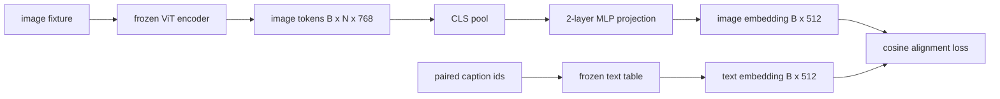

<!-- i18n:manual -->
# Слой-проектор для выравнивания модальностей

> Визуальный энкодер выдаёт токены картинки. Текстовый декодер потребляет токены текста. Живут они в разных векторных пространствах. Маленький двухслойный MLP проецирует токены картинки в пространство текстовых эмбеддингов, а косинусная потеря выравнивания против парной подписи стягивает два пространства к согласию. Этот проектор — самая маленькая деталь vision-language модели и при этом самая важная для переноса.

**Type:** Build
**Languages:** Python
**Prerequisites:** Phase 19 lessons 30-37 (Track B foundations)
**Time:** ~90 minutes

## Learning Objectives

- Построить двухслойную MLP-проекцию, которая отображает признаки картинки в пространство текстовых эмбеддингов.
- Собрать игрушечную таблицу текстовых эмбеддингов (без предобученного токенизатора и без настоящего корпуса).
- Посчитать косинусную потерю выравнивания между спроецированными токенами картинки и эмбеддингом парной подписи.
- Обучить одну только проекцию при замороженном визуальном энкодере и замороженной текстовой таблице.

> 🎒 **На пальцах.** Из всей конструкции обучается ровно один кусочек: примерно 1.3M параметров проектора против 86M замороженного энкодера. Это полтора процента модели — поэтому обучение занимает минуты, а не дни.

## The Problem

У вас есть визуальный энкодер (уроки 58-59), выдающий токены размерности `vision_hidden = 768`. И есть текстовый декодер, который вы хотите приделать сверху, с размерностью эмбеддингов `text_hidden = 512` (любое другое число ничем не хуже). Декодер ждёт токены текстовой формы. Токены картинки не текстовой формы: они живут в базисе, который энкодер выучил на чисто визуальном претрейне, и с векторами слов декодера никак не связаны.

> 🎒 **На пальцах.** Это как розетка на 768 контактов и вилка на 512 — оба устройства рабочие, но воткнуть одно в другое нельзя. Проектор и есть переходник: берёт вектор из 768 чисел и выдаёт вектор из 512, причём так, чтобы принимающей стороне он был осмысленным.

Двухслойная MLP-проекция (linear, GELU, linear) закрывает разрыв. Она достаточно мала (около `768 * 1024 + 1024 * 512 = 1.3M` параметров), чтобы обучиться за минуты на одной GPU, и это единственная деталь, которой вообще нужно учиться на этапе выравнивания. Визуальный энкодер остаётся замороженным. Таблица текстовых эмбеддингов остаётся замороженной. Двигается только проекция. Именно такой рецепт в 2023 году выкатила LLaVA, BLIP-2 переосмыслил его как Q-Former, и каждая открытая VLM с тех пор в том или ином виде его переняла.

> 🎒 **На пальцах.** Посчитайте параметры сами: 768 × 1024 = 786к плюс 1024 × 512 = 524к, вместе около 1.3M. Для сравнения, один блок энкодера из прошлого урока весит 7.1M — то есть весь мост между модальностями легче одного блока ViT в пять раз.

## The Concept



> 🎒 **На пальцах.** Читайте схему как две трубы, сходящиеся в одной точке: сверху картинка идёт через энкодер, пулинг и проектор, снизу подпись идёт через таблицу эмбеддингов. Встречаются они уже в одном пространстве размерности 512, где их и сравнивает потеря.

### Pooling before projection

Визуальный энкодер выдаёт 197 токенов. На текстовой стороне — один эмбеддинг уровня всей подписи. Чтобы их выровнять, нужен один вектор уровня картинки на каждый пример. Проще всего CLS-пулинг: взять первый токен энкодера и спроецировать его. Средний пулинг по всем 197 токенам — второй вариант, и именно его использует SigLIP. Оба сводят 197 векторов к одному.

> 🎒 **На пальцах.** Сжатие тут жёсткое: 197 × 768 ≈ 151 тысяча чисел превращается в 768, а потом в 512. Разница между двумя способами простая — CLS берёт готовый «протокол совещания», средний пулинг усредняет мнения всех 197 участников.

### Why two layers and not one

Одна линейная проекция умеет поворачивать и масштабировать, но не может исправить базис, если у двух пространств не совпадает кривизна. GELU между двумя линейными слоями даёт проекции один нелинейный изгиб, и эмпирически этого хватает, чтобы выровнять признаки в стиле CLIP с эмбеддингами языковой модели. Более глубокие проекции (в LLaVA-NeXT использовали GLU, в Qwen-VL — стопку слоёв внимания) — это расширения; двухслойный MLP остаётся каноническим бейзлайном, и именно он под капотом у проекционной головы Q-Former в BLIP-2.

> 🎒 **На пальцах.** Одним линейным слоем можно только повернуть и растянуть лист бумаги, а нелинейность позволяет его согнуть. Один изгиб на маршруте 768 → 1024 → 512 — минимальный уровень свободы, которого хватает на практике.

| Layer | Shape | Parameters |
|-------|-------|------------|
| fc1 | `(vision_hidden, projection_hidden)` | `768 * 1024 + 1024` |
| активация | GELU | 0 |
| fc2 | `(projection_hidden, text_hidden)` | `1024 * 512 + 512` |

Около 1.3M параметров на голову `768 -> 1024 -> 512`.

> 🎒 **На пальцах.** Заметьте строку с активацией: у GELU ровно ноль параметров, она ничего не запоминает, а только гнёт пространство. Вся ёмкость проектора лежит в двух матрицах, плюс 1024 и 512 чисел смещений.

### Cosine alignment loss

Выровнять не значит `image_emb == text_emb`. Выровнять значит, что `image_emb` смотрит в ту же сторону, что и `text_emb`, в общем пространстве. Косинусная потеря — это `1 - cos_sim(image, text)`, и она лежит в диапазоне от 0 (идеально выровнены) до 2 (противоположны). Обучение гонит её к нулю на каждой паре. Урок 62 обобщает это до контрастного батча (InfoNCE), где каждая картинка обязана быть ближе к своей подписи, чем к любой другой подписи в батче; в этом уроке берём попарную версию, чтобы динамика была наглядной.

> 🎒 **На пальцах.** Косинус смотрит только на направление, длина вектора ему безразлична: увеличьте эмбеддинг вдвое — потеря не изменится ни на йоту. Ноль означает «стрелки совпали», единица — «стрелки перпендикулярны», двойка — «стрелки смотрят строго в разные стороны».

### Frozen encoder is the trick

У визуального энкодера 86M параметров. У текстовой таблицы — ещё несколько миллионов. Обучать всё это на игрушечном корпусе бессмысленно с самого начала. Заморозка обоих означает, что меняются только 1.3M параметров проекции, и пары сотен шагов на синтетических парах хватает, чтобы потеря пошла вниз. Это в точности рабочая форма любой VLM на адаптерах: тяжёлые части стоят замороженными, лёгкий мост обучается.

> 🎒 **На пальцах.** Заморозка — это как чинить переходник, а не перепаивать оба устройства. Градиенты считаются только для 1.3M чисел вместо 90M с лишним, поэтому шаг обучения дешевеет примерно в семьдесят раз.

```figure
ch-projection-bridge
```

## Build It

`code/main.py` реализует:

- `MLPProjector(in_dim, hidden_dim, out_dim)` — двухслойный линейный MLP с активацией GELU.
- `MockTextEmbedding(vocab_size, dim)` — замороженная таблица эмбеддингов с детерминированной инициализацией от seed.
- `make_pair(seed, vocab_size)` — синтезирует один парный пример (картинка, подпись). Подписи — короткие последовательности id, а эмбеддинг подписи получается средним пулингом по эмбеддингам её токенов.
- `cosine_alignment_loss(image_emb, text_emb)` — попарная цель `1 - cos_sim`.
- Цикл обучения, который гоняет проекцию 200 шагов по 32 синтетическим парам (по кругу) при замороженных визуальном энкодере и текстовой таблице и печатает потерю каждые 25 шагов.

> 🎒 **На пальцах.** Обратите внимание на слово «детерминированная»: таблица эмбеддингов рождается из seed, поэтому у вас и у соседа числа совпадут до последнего знака. Никаких загрузок датасета — 32 пары генерируются на лету за доли секунды.

Запустите:

```bash
python3 code/main.py
```

Вывод: отчёты обучения показывают падение с начальной потери около 1.07 примерно до 0.80 за 200 шагов — то есть одна проекция действительно способна подтянуть токены картинки к текстовому пространству. Итоговая косинусная близость по каждой паре тоже печатается.

> 🎒 **На пальцах.** Переведите числа в косинусы: 1.07 означает cos ≈ -0.07, то есть на старте векторы почти перпендикулярны, как и положено случайной инициализации. 0.80 означает cos ≈ 0.20 — угол сократился, но до идеала далеко, потому что данные синтетические и выравнивать в них по-настоящему нечего.

## Use It

Тот же паттерн встречается в каждой открытой VLM:

- **LLaVA 1.5.** Двухслойная MLP-проекция с GELU из скрытой размерности CLIP-ViT-L в размерность эмбеддингов LLaMA. Замороженный визуальный энкодер, замороженная LLM, обучается только проекция (а на втором этапе размораживают и LLM).
- **BLIP-2.** Q-Former прогоняет 32 обучаемых query-токена через cross-attention к токенам картинки, а потом проецирует их в размерность эмбеддингов LLM. Проекционная голова в самом конце Q-Former — это аналог MLP из нашего урока.
- **MiniGPT-4.** Одна линейная проекция из выхода Q-Former в BLIP-2 в размерность эмбеддингов Vicuna.
- **Qwen-VL.** Cross-attention адаптер из нескольких слоёв, но финальная деталь — снова проекция в размерность эмбеддингов языковой модели.

Форма меняется, а роль одна и та же: сделать пулинг токенов картинки, спроецировать в размерность текстовых эмбеддингов, обучить в одиночку.

> 🎒 **На пальцах.** Сравните крайности этого списка: у MiniGPT-4 мост — вообще одна матрица, у Qwen-VL — несколько слоёв внимания. Разница в качестве заметно меньше, чем разница в сложности, поэтому начинать всегда стоит с двухслойного MLP.

## Tests

`code/test_main.py` покрывает:

- форма выхода проектора совпадает с настроенным `out_dim`
- у замороженной таблицы текстовых эмбеддингов ноль параметров с `requires_grad`
- косинусная потеря равна нулю на одинаковых векторах и двум на противонаправленных
- градиент проектора течёт после одного обратного прохода
- цикл обучения уменьшает потерю между шагом 0 и шагом 200

> 🎒 **На пальцах.** Второй тест ловит самую частую ошибку новичка: забыли выставить `requires_grad=False`, и оптимизатор тихо начал обучать 86M параметров энкодера вместо 1.3M проектора. Тест просто считает такие параметры и требует ровно ноль.

Запустите их:

```bash
python3 -m unittest code/test_main.py
```

## Exercises

1. Замените CLS-пулинг средним пулингом по 196 патч-токенам и сравните итоговую потерю после 200 шагов. На синтетических данных средний пулинг обычно обучается быстрее; на естественных картинках CLS эффективнее по числу примеров.

2. Добавьте в косинусную потерю обучаемую скалярную температуру (`cos / tau`) и посмотрите, что происходит, когда `tau` слишком мала (шум в градиенте) или слишком велика (потеря замирает высоко).

3. Замените двухслойный MLP одним линейным слоем и измерьте разрыв по потере. Нелинейность важнее на признаках естественных картинок и почти не важна на синтетических.

4. Добавьте небольшой L2-штраф на веса проектора и понаблюдайте, как он взаимодействует с косинусным выравниванием (косинус инвариантен к масштабу, поэтому штраф в основном ужимает неиспользуемые направления).

5. Сохраните веса проектора, потом загрузите их обратно и запустите инференс без обратного прохода через визуальный энкодер, чтобы убедиться: в продакшене нужен только проектор.

> 🎒 **На пальцах.** Задание 5 отлично объясняет, почему проекторы весят так мало на диске: 1.3M параметров во float32 — это около 5 мегабайт. Такой файл легко положить рядом с чужим замороженным энкодером и чужой замороженной LLM.

## Key Terms

| Term | What it means |
|------|---------------|
| Modality alignment | Сделать эмбеддинги картинки и текста сравнимыми в одном общем пространстве |
| Projection head | Маленький модуль, отображающий одно пространство в другое, обычно двухслойный MLP |
| Cosine similarity | Скалярное произведение, делённое на произведение L2-норм |
| Frozen encoder | У визуальной (или текстовой) модели все параметры с `requires_grad=False` |
| Mock corpus | Синтетические пары, чтобы обучение не зависело от скачивания датасета |

## Further Reading

- LLaVA paper — двухстадийное обучение (сначала проекция, потом разморозка языковой модели).
- BLIP-2 paper — Q-Former как обучаемая альтернатива обычной проекции.
- Qwen-VL technical report — cross-attention адаптеры как более глубокие проекционные головы.
