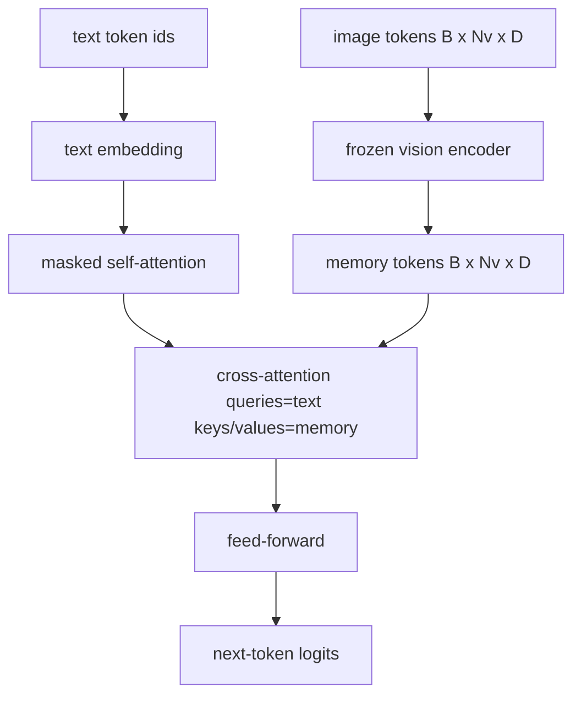
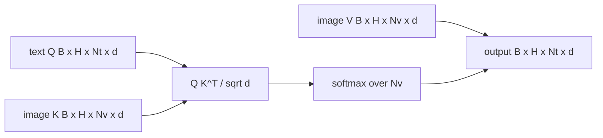

<!-- i18n:manual -->
# Слияние модальностей через cross-attention

> Слой-проектор выравнивает один вектор картинки с одним вектором подписи. Настоящему vision-language декодеру нужно, чтобы каждый текстовый токен смотрел на каждый патч-токен и мог заземлить любое слово в конкретной области. Cross-attention — это и есть механизм заземления. Текст спрашивает; ключи и значения со стороны картинки отвечают. В этом уроке мы строим блок cross-attention, причинное self-attention по тексту и те формы масок, при которых оба остаются законными.

**Type:** Build
**Languages:** Python
**Prerequisites:** Phase 19 lessons 30-37 (Track B foundations)
**Time:** ~90 minutes

## Learning Objectives

- Реализовать multi-head cross-attention, где поток запросов — текст, а поток ключей и значений — картинка.
- Собрать блок декодера: причинное self-attention + cross-attention + feed-forward.
- Не перепутать формы масок: причинная маска для self-attention, никакой маски для cross-attention.
- Прогнать прямой проход с батчем текстовых токенов и фиксированным пулом токенов картинки.

> 🎒 **На пальцах.** Держите в голове две буквы: Q приходит от текста, K и V приходят от картинки. Из этого сразу следует форма матрицы внимания — `Nt x Nv`, то есть 10 текстовых токенов на 197 патчей даёт табличку 10 × 197 = 1970 весов.

## The Problem

Склеить токены картинки и токены текста в одну последовательность — это один вариант слияния (ранняя фузия, путь Chameleon и Emu3). Cross-attention — второй вариант (поздняя фузия, путь, который ввёл Flamingo и который скопировал каждый декодер flamingo-образной формы). При поздней фузии текстовый декодер работает только на текстовых токенах и дотягивается до потока картинки через cross-attention на каждом слое.

> 🎒 **На пальцах.** Ранняя фузия — это положить фотографию прямо в текст письма; поздняя — оставить фотографию на столе и подглядывать на неё, пока пишешь. Во втором случае длина письма от размера фотографии не растёт: 10 текстовых токенов остаются десятью, сколько бы патчей ни было рядом.

У поздней фузии два преимущества. Во-первых, текстовый поток остаётся чистым, и модель сохраняет чисто текстовые способности. Во-вторых, поток картинки считается один раз на картинку и переиспользуется на каждом шаге декодирования, поэтому генерация дешёвая даже для длинных подписей. Цена — один дополнительный подслой внимания в каждом блоке.

> 🎒 **На пальцах.** Прикиньте экономию: ViT на 86M параметров отрабатывает один раз, а подпись из 30 слов — это 30 шагов декодирования. При ранней фузии эти 197 визуальных токенов тащились бы через self-attention на каждом из 30 шагов, при поздней — считаются однажды.

## The Concept





> 🎒 **На пальцах.** Нижняя схема — это буквально формула внимания, разложенная на стрелки: Q от текста и K от картинки встречаются в скалярных произведениях, softmax идёт по оси Nv, а V от картинки взвешивается получившимися числами. Выход снова имеет длину Nt — то есть ровно столько же токенов, сколько было у текста.

### Mask shapes

Двум разным вниманиям внутри блока декодера нужны разные маски:

| Attention | Query length | Key length | Mask | Why |
|-----------|--------------|------------|------|-----|
| Self-attention | `Nt` (текст) | `Nt` (текст) | Причинная: нижнетреугольная `(Nt, Nt)` | Текстовым токенам нельзя подглядывать вперёд при авторегрессии |
| Cross-attention | `Nt` (текст) | `Nv` (картинка) | Без маски | Картинка целиком видна каждой текстовой позиции |

В уроке есть функция проверки форм, чтобы ошибка «перепутал одно с другим» вылезала как `ValueError`, а не как тихо сломанная кривая обучения.

> 🎒 **На пальцах.** Разница видна прямо в числах: причинная маска на 10 токенов пропускает 55 из 100 клеток (нижний треугольник), а cross-attention пропускает все 10 × 197 = 1970. Первая матрица квадратная, вторая — прямоугольная, и если перепутать, размерности просто не сойдутся.

### Why no mask on cross-attention

Картинка полностью наблюдаема ещё до того, как сгенерирован хоть один текстовый токен. Токен `t` подписи имеет право смотреть на любой патч картинки; на патчах нет никакого временного порядка. Некоторые варианты Flamingo добавляют пример-специфичную схему маскирования, когда чередуют несколько картинок и текстовых сегментов, но для одной картинки плюс подписи cross-attention видит всё.

> 🎒 **На пальцах.** Запрет подглядывать вперёд имеет смысл только там, где есть «вперёд». У текста оно есть — иначе модель на обучении просто прочитает ответ. У патчей его нет: патч номер 5 не «раньше» патча номер 150, они пришли одновременно.

### Key/value caching

Ключи и значения картинки считаются один раз в начале декодирования и держатся в кеше. Каждый новый текстовый токен пользуется кешем без пересчёта. Именно это делает генерацию подписей быстрой на инференсе: тяжёлый ViT отрабатывает однажды, а cross-attention переиспользует его ключи и значения на каждом шаге. В уроке кеш вынесен наружу, и путь с попаданием в кеш покрыт тестом.

> 🎒 **На пальцах.** Кеш здесь — как заранее выписанный на бумажку список из 197 фактов о картинке: заглядывать в него можно сколько угодно, а составлять заново на каждое слово никто не станет. Для подписи из 30 слов это 30 прогонов ViT против одного.

### Block composition

Блок декодера выполняет: pre-LN -> self-attention -> residual -> pre-LN -> cross-attention -> residual -> pre-LN -> feed-forward -> residual. Три подслоя, у каждого свой LayerNorm. В статье Flamingo к cross-attention добавили обучаемый гейт, чтобы модель могла отказаться от пути картинки ценой устойчивости на обучении; в каноническом бейзлайне (он и используется здесь) гейта нет.

> 🎒 **На пальцах.** Это тот же блок из урока 59, в который вставили одну лишнюю деталь посередине: было два подслоя, стало три, было два LayerNorm, стало три. Всё остальное — та же схема «нормализовать, посчитать, прибавить обратно».

```python
class DecoderBlock:
  def forward(self, text_tokens, image_tokens, text_mask, cross_mask):
      text_tokens = text_tokens + self.self_attn(self.ln1(text_tokens),
                                                 mask=text_mask)
      text_tokens = text_tokens + self.cross_attn(self.ln2(text_tokens),
                                                  image_tokens,
                                                  mask=cross_mask)
      text_tokens = text_tokens + self.ffn(self.ln3(text_tokens))
      return text_tokens
```

> 🎒 **На пальцах.** Обратите внимание, что во всех трёх строках справа стоит `text_tokens +` — поток текста никогда не перезаписывается, к нему только прибавляют. Поэтому если убрать вклад cross-attention, блок честно выродится в обычный текстовый декодер.

```figure
ch-crossattn-fan
```

## Build It

`code/main.py` реализует:

- `CrossAttention(hidden, heads)` — multi-head cross-attention с раздельными проекциями `q` и `kv`.
- `CausalSelfAttention(hidden, heads)` — маскированное self-attention из стандартного декодера.
- `DecoderBlock` — складывает три подслоя с pre-LN и residual-связями.
- `VisionLanguageDecoder` — четырёхслойный декодер, которому подают выход игрушечного визуального энкодера и маленькую таблицу текстовых эмбеддингов.
- `causal_mask(length)` — возвращает нижнетреугольный булев тензор формы `(length, length)`.
- Демо, которое подаёт батч из двух текстовых последовательностей длины 10 при памяти картинки длины 197 и печатает форму выхода, форму маски self-attention и норму выхода cross-attention по каждой позиции.

> 🎒 **На пальцах.** Заметьте разделение проекций: у cross-attention `q` считается от текста, а `kv` — от картинки, и это не косметика. Именно поэтому ключи и значения можно посчитать заранее и положить в кеш, а запросы приходится считать на каждом шаге заново.

Запустите:

```bash
python3 code/main.py
```

Вывод: декодер выдаёт тензор логитов `(2, 10, text_vocab)`. Форма маски — `(10, 10)`. Проверка переиспользования KV-кеша подтверждает, что логиты на кешированном и некешированном путях совпадают.

> 🎒 **На пальцах.** Совпадение логитов до последнего бита — это и есть определение корректного кеша: он обязан ускорять и ничего не менять. Если бы числа разошлись, значит в кеш попало что-то, зависящее от текста, а туда должна попадать только картинка.

## Use It

Cross-attention встречается в двух продакшен-семействах:

- **Flamingo and IDEFICS.** Вставляют подслой cross-attention каждые K блоков языковой модели при замороженной LM. Vision-language адаптер — это блок cross-attention плюс его гейт.
- **BLIP-2.** Q-Former применяет cross-attention от фиксированного набора из 32 query-токенов к признакам картинки, а потом проецирует запросы в пространство эмбеддингов языковой модели.

Форма блока из этого урока ложится на оба случая напрямую. Дисциплина масок (причинная на self, никакой на cross) там точно такая же.

> 🎒 **На пальцах.** Разница между двумя семействами — в том, где стоит cross-attention. У Flamingo он внутри LM и срабатывает каждые K слоёв, у BLIP-2 — снаружи и один раз, ужимая картинку до 32 токенов. Первое дороже и мощнее, второе дешевле и проще.

## Tests

`code/test_main.py` покрывает:

- причинная маска нижнетреугольная и имеет ожидаемую булеву форму
- форма выхода cross-attention равна `(B, Nt, hidden)` независимо от длины ключей
- путь с KV-кешем совпадает с путём без кеша с точностью до float
- несовпадение форм текстового и визуального потоков поднимает понятный `ValueError`
- полный прямой проход декодера выдаёт правильные форму батча и длину последовательности

> 🎒 **На пальцах.** Второй тест проверяет ровно то свойство, ради которого затевалась поздняя фузия: подайте 197 патчей или 576 — выход всё равно `(B, 10, hidden)`. Длина текста задаёт форму выхода, длина картинки на неё не влияет.

Запустите их:

```bash
python3 -m unittest code/test_main.py
```

## Exercises

1. Добавьте обучаемый tanh-гейт на residual cross-attention (трюк Flamingo) и убедитесь, что обучение сходится, стартуя с почти нулевого гейта. Гейт начинается с 0; модель сперва восстанавливает чисто текстовое поведение и только потом подмешивает поток картинки.

2. Реализуйте перемешанное внимание, когда один и тот же декодер потребляет несколько картинок плюс несколько текстовых сегментов. Соберите пример-специфичную маску cross-attention, которая запрещает текстовому сегменту 2 смотреть на картинку 1.

3. Профилируйте слой cross-attention против слоя self-attention при `Nt=64, Nv=576` (сетка 24x24 на более высоком разрешении). Стоимость cross-attention равна `Nt * Nv` и доминирует на высоких разрешениях картинки.

4. Добавьте дропаут со стороны запросов на карту cross-attention и измерьте разнообразие подписей в демо (разброс сэмплов подписи растёт вместе с дропаутом в кросс-карте).

5. Замените слой cross-attention блоком внимания в стиле Q-Former, где фиксированный пул из 32 query-токенов смотрит на признаки картинки один раз за слой.

> 🎒 **На пальцах.** Задание 3 считается устно: 64 × 576 = 36 864 против 64 × 64 = 4096 у self-attention, то есть кросс дороже примерно в девять раз. Отсюда и вся мода на сжатие визуальных токенов — 576 патчей режут до 32 или 64, и слой сразу дешевеет на порядок.

## Key Terms

| Term | What it means |
|------|---------------|
| Late fusion | Текст и картинка живут отдельными потоками; cross-attention соединяет их в каждом блоке |
| Cross-attention | Q приходит из одного потока, K и V — из другого |
| Causal mask | Нижнетреугольная булева маска, запрещающая смотреть вперёд при авторегрессии |
| KV cache | Ключи и значения картинки, посчитанные один раз и переиспользуемые на каждом шаге декодирования |
| Memory tokens | Замороженные токены картинки, до которых дотягивается декодер |

## Further Reading

- Flamingo (2022) — каноничный дизайн поздней фузии с gated cross-attention.
- BLIP-2 (2023) — Q-Former, то есть блок cross-attention, переодетый в пул обучаемых запросов.
- IDEFICS (2023) — открытое воспроизведение рецепта Flamingo на открытых весах.
